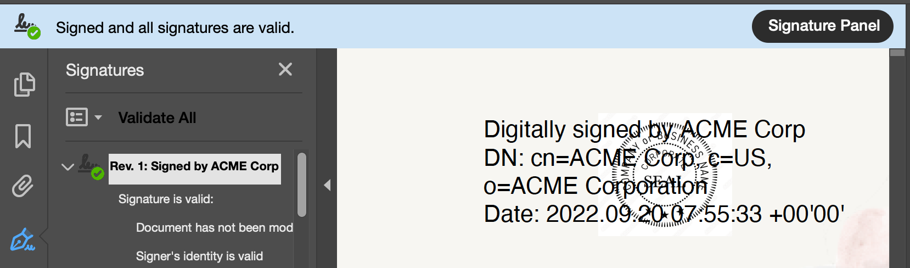

# Overview

## What is a PDF Electronic Seal?

A PDF Electronic Seal, powered by a digital signature, enables an organization to digitally sign the PDFs. E-signatures are legal, trusted, and enforceable around the world. The validation process performs two actions: 

* It authenticates the signing organization's identity via its digital certificate. 
* It verifies a document's integrity. 

## PDF Electronic Seal Components

A PDF Electronic Seal workflow involves the following:

* **PDF Document**: A PDF document as an input file. The maximum size of the PDF cannot exceed 10MB.
* **Sealing Parameters**: Parameters  specify the seal's format, visibility and appearance as well as the certificate credentials required to communicate with a Trust Service Provider. For details, see [sealing parameters](gettingstarted#parameters).
* **PDF Electronic Seal API**: The PDF Electronic Seal API enables sealing PDF documents programmatically with no user interaction. It uses the sealing parameters to authorize the client and apply a seal on the input PDF which is then bound to the specified legal entity.
* **Seal Image**: The API can accept an optional seal image as an input file which overrides the default Acrobat trefoil image. The maximum size of the seal image cannot exceed 2MB.
