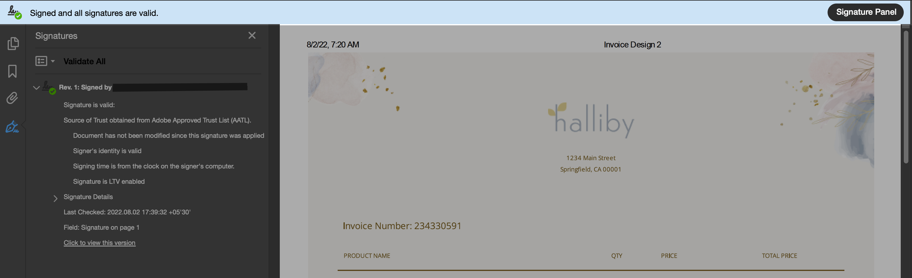
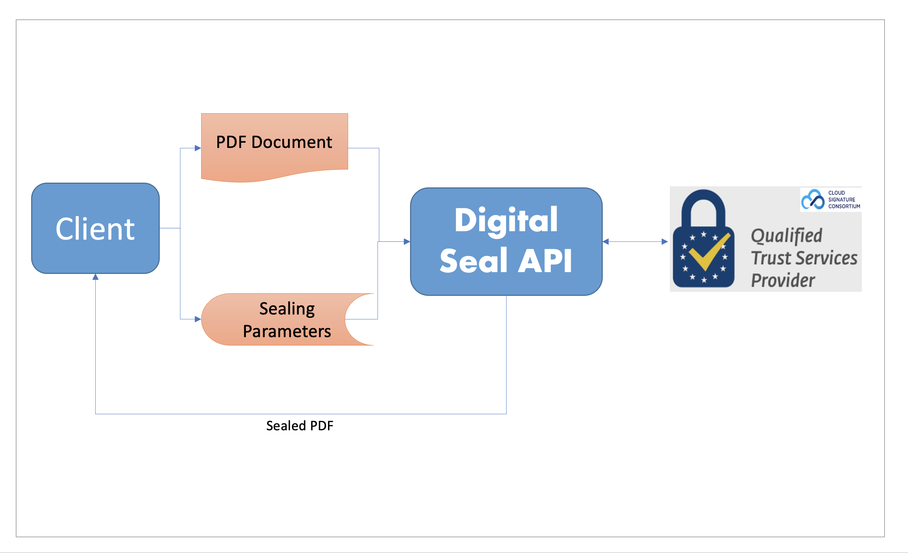

# Overview
## What is Digital Seal?
Digital Seal on a PDF means to digitally sign a PDF document. Digital Seal, alias Digital Signature is a specific type 
of signature that is backed by a digital certificate, providing proof of your identity. Digital signatures are recognized 
as being more secure because they’re cryptographically bound to the signed document and can be verified. 
When you use a digital certificate obtained from a trusted third party, the resulting digital signature is 
virtually impossible to spoof. It also provides powerful evidence of signer identity, that the signed document was not 
altered, and that the signatures are valid.

<!--- 
https://www.adobe.com/sign/digital-signatures.html
-->

## Digital Seal Flow

## Components of Digital Seal

**PDF Document**

Digital Seal API requires a PDF document as an input file on which a seal has to be applied.

**Sealing Parameters**

Digital Seal API requires a few input parameters for the creation of a seal. The parameters should specify the type, 
format, visibility and appearance of the seal. It should also have the certificate credentials required to communicate with Trust Service Providers. 

Refer [sealing parameters](/overview/digital-seal-api/quickstarts/#2-configure-sealing-parameters) for more details.

**Digital Seal API**

Digital Seal API enables the generation of digital seal on PDF documents with no user interaction. It uses the provided 
sealing parameters to authorize the client and apply seal on the input PDF document. The generated PDF document is said
to be bound to the specified legal entity.
 
To Get Started, visit [Quickstarts](./quickstarts.md)

**Signature Image**

Digital Seal API can accept the signature image as input file. This is an optional field.

**Logo Image**

Digital Seal API can accept the logo image as input file. This is an optional field that defaults to 'Acribat Trefoil'
unless overridden by this parameter.

## FAQ

Digital Signature vs Electronic Signature ?

Electronic Signature is a broad term referring to any electronic process that indicates acceptance of 
an agreement or a record. Typical e-signature solutions use common electronic authentication methods to verify signer 
identity, such as an email address, a corporate ID, or a phone PIN. If increased security is needed, multifactor 
authentication may be used. 
 
Digital Signature is one specific type of e-signature that use certificate-based digital IDs to authenticate signer 
identity and demonstrate proof of signing by binding each signature to the document with encryption. Validation occurs 
through trusted certificate authorities (CAs) or trust service providers (TSPs).

 

Use-cases of Digital Signature

1. Government 
The governments have started using the digital sign for their low cost and high security. The government offices 
are involved with almost everything from inducing new bills, tax returns, managing contracts, ID cards, and more. 
These are all sensitive documents and using a digital signature completely eliminates the involvement of a 3rd party. 
This makes the process smooth and reduces the chances of a leak.
 
2. Legal Offices 
The legal offices handle some of the most cases sensitive documents in a country. The implementation of digital 
signatures has reduced the cost of paper and labor significantly. The preservation of sensitive documents is also a factor here.
 
3. Healthcare 
The administrative process for healthcare and treatment has been thoroughly improved by digital signature. 
The process takes less time and the data security has improved for admission.
 
4. Military 
The military is one of the biggest and sensitive sectors of any country that has seen a lot of improvements due to 
the advent of digital signature. Mainly, compartmentalization of information and security has improved tenfold.
 
5. Manufacturing 
The manufacturing companies use digital signs to smooth up the process. This improves the product design, the number of 
production and sales get enhanced.
 
6. Finance 
Paperless banking, contracts and easy loan has become the pinnacle of the new-age banking process. This was possible 
due to digital signatures.
 
7. Cryptocurrencies 
The cryptocurrencies are complex in nature and the digital signatures are used for blockchain authentication. 
Digital sig is also used for the verification of cryptocurrency transaction data, this helps to show the ownership.

<!--- https://www.adobe.com/lt/sign/digital-signatures.html#:~:text=What's%20the%20difference%20between%20digital,specific%20type%20of%20e%2Dsignature. 
-->

