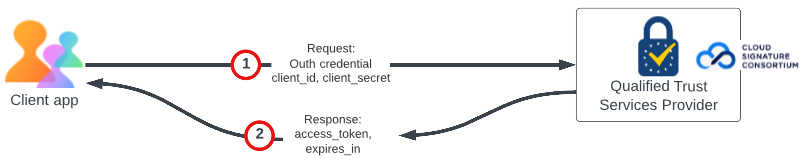

# Prerequisites
A client has to register itself to a Trusted Service Provider for getting digital certificates which provide an 
assurance that they are authorized to add a digital seal on a specific document.

## Prerequisites for Digital Seal API

### 1. Procure Certificate Credentials
* The Client has to make a purchase request for one or more certificates with any of the [supported Trust Service Providers](/overview/digital-seal-api/prerequisites/#supported-trusted-service-providers)
to
* Trust Service Provider will perform remote identity verification of the client representative who acts as the legal owner of the Seal certificate.
* After the identity verification, a client will create an account in their respective portal. A Certificate will be issued to the client which 
can be protected from unauthorised use by creating a static PIN.
* Now the client can generate OAuth 2.0 Client Credentials, required for the Cloud Signature Consortium API Authorization.

The Client should reserve Digital Id and PIN generated in this step for [configuring sealing paramaters](/overview/digital-seal-api/quickstarts/#1-configure-sealing-parameters)

### 2. Obtain your OAuth Token

The client will use OAuth 2.0 Client Credentials procured from [Trust Service provider](/overview/digital-seal-api/prerequisites/#1-procure-certificate-credentials). 
The generated client_id and client_secret are passed as the input parameters in the request body of Trust Service Provider's API endpoint. 
The access token generated in the response is further used in the [next steps](/overview/digital-seal-api/quickstarts/#2-configure-sealing-parameters)
to access with Cloud Signature Consortium APIs.

To know more about Cloud Signature Consortium APIs refer [Cloud Signature Consortium Standard](https://cloudsignatureconsortium.org/wp-content/uploads/2020/01/CSC_API_V1_1.0.4.0.pdf)

**Sample OAuth Request**
```javascript
curl --location --request POST 'https://<base-url>/<API-domain-name>/csc/v0/oauth2/token'
--header 'cache-control: no-cache'
--header 'content-type: application/json'
--data-raw '{
   "lang": "en-US",
   "client_id": "<YOUR_CLIENT_ID>",
   "client_secret": "<YOUR_CLIENT_SECRET>",
   "grant_type": "client_credentials"
}'
```

**Sample Response**
```json
{
   "access_token": "xxxx-xxx-xxx-xxxx-xxxxxxxx",
   "token_type": "Bearer",
   "expires_in": <TIME_IN_SECONDS>
}
```

## Supported Trusted Service Providers

Trust service providers are companies that offer a wide range of secure identity and transactions services, including 
certificate authority services by providing and preserving digital certificates to create and validate digital signatures 
and to authenticate their signatories.

Digital Seal supports digital certificates hosted by Qualified Trust Service Provider(QTSP) certified under the eIDAS 
regulation and supporting the open API standard from the Cloud Signature Consortium. Trusted Service Providers shall support 
the OAuth 2.0 Client Credential flow which restrict Digital Seal to support following list of providers <!-- https://helpx.adobe.com/acrobat/kb/approved-trust-list1.html -->

<br/>

* [Intesi Group](https://www.intesigroup.com/en/)
* [Entrust](https://www.entrust.com/pdf-signing-certificates/)
* [GlobalSign](https://www.globalsign.com/en/digital-signatures)
* [TrustPro](https://www.trustpro.eu/)