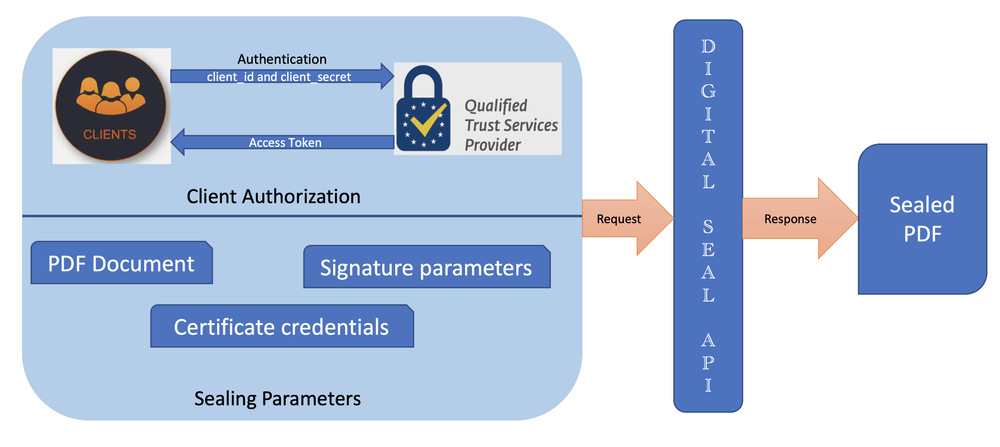

# Quickstarts

Before getting started with Digital Seal API, make sure all the [Prerequisites](prerequisites.md) are met. 

## Workflow



## How-to Guide

### 1. Configure Sealing Parameters

#### Signature Type <span style="color:red">*</span>

<details>
<summary>Click here</summary>

Specifies the type of digital signature being applied
 * Author signatures/ CERTIFY : first signature in the document often created by the document author, and there can be at most one in any given document.
 * Recipient signatures/ SIGN : Digital signatures which are signed with a certificate.
API currently supports SIGN signature type.

</details>

#### Signature Format <span style="color:red">*</span>

<details>
<summary>Click here</summary>

Specifies the format of the digital signature. API supports below formats
* PADES : This is the latest and improved format which is more strict, concrete and secure.
          For more details refer [ETSI TS 102 778-3](https://www.etsi.org/deliver/etsi_ts/102700_102799/10277803/01.02.01_60/ts_10277803v010201p.pdf)  
* PKCS#7 : PKCS #7 signature is comparatively more relaxed and it's possible to change more things in PDF without invalidating digital signatures.
           For more details refer [ISO 32000-1](https://opensource.adobe.com/dc-acrobat-sdk-docs/standards/pdfstandards/pdf/PDF32000_2008.pdf)

</details>

#### Trust Service Provider's (TSP) Credential Information <span style="color:red">*</span>  

<details>
<summary>Click here</summary>

Encapsulates the [certificate credential](/overview/digital-seal-api/prerequisites/#1-procure-certificate-credentials) to be used 
for signing and the associated authentication and authorization data.

* **TSP Name**<span style="color:red">*</span>
<br/>Specifies the name of the Trust Service Provider used to generate the certificate.

* **TSP Credential Id**<span style="color:red">*</span>
<br/>Specifies the Digital ID stored with the TSP provider that should be used for signing.

* **TSP Authorization Context**<span style="color:red">*</span>
<br/>Encapsulates the service authorization data required to communicate with the TSP and access CSC provider APIs.

  * **Access Token**<span style="color:red">*</span>
  <br/>Specifies the service access token used to authorize access to the CSC provider hosted APIs.
   
  * **Token Type**
  <br/>Specifies the type of service token which is Bearer.

* **TSP Credential Authorization Parameter**<span style="color:red">*</span>
<br/>Encapsulates the credentials authorization information required to authorize access to their signing keys.

   * **PIN**<span style="color:red">*</span>
   <br/>Specifies the PIN associated with credential id.

</details>

#### Signature Field Parameters <span style="color:red">*</span>

<details>
<summary>Click here</summary>

Encapsulates the parameters required to create a new unsigned signature field or sign an existing field.

* **Field Name**<span style="color:red">*</span>
<br/>Specified the field name for the signature field.
* **Visibility**
<br/>Specified whether the signature field is visible or not. Set to true to create a visible signature. Set to false to 
create an invisible (hidden) signature. The default value is true.
* **Page Number**<span style="color:red">*</span>
<br/>Specifies the number of the page to which the signature field should be attached.
* **Location**<span style="color:red">*</span>
<br/>Encapsulates the parameters related to the location of the signature field.

  * **Left**<span style="color:red">*</span>
  <br/>Specifies the left-most x-coordinate of the signature appearance's bounding box in default PDF user 
    space units.
  * **Bottom**<span style="color:red">*</span>
  <br/>Specifies the bottom-most y-coordinate of the signature appearance's bounding box in default PDF user 
    space units.
  * **Right**<span style="color:red">*</span>
  <br/>Specifies the right-most x-coordinate of the signature appearance's bounding box in default PDF user 
    space units.
  * **Top**<span style="color:red">*</span>
  <br/>Specifies the top-most y-coordinate of the signature appearance's bounding box in default PDF user 
    space units.

</details>

#### Signature Appearance Parameters

<details>
<summary>Click here</summary>

Encapsulates the parameters related to the appearance of the signature field

   * **Display Parameters**<span style="color:red">*</span>
   <br/>An enum set of display items: NAME, DATE, LOGO, DISTINGUISHED_NAME, LABELS. Specifies the information to display in the signature.
   <br/> 
   
   **NAME** - Specifies that the signer's name should be displayed in the signature appearance.This is a default value.<br/> 
   
   **DATE** - Specifies that the signing date/time should be displayed in the signature appearance. This option only controls whether the value of the 
   time/date in the signature dictionary is displayed or not. This value should not be mistaken for a signed timestamp 
   from a timestamp authority. <br/> 
   
   **DISTINGUISHED_NAME** - Specifies that the distinguished name information from the 
   signer's certificate should be displayed in the signature appearance. <br/>
   
   **LABELS** - Specifies that text labels should 
   be displayed in the signature appearance. This is a default value. <br/>
   
   **LOGO** - Specifies that the logo should be 
   displayed in the signature appearance. If a logo image was not supplied in the request body,  the default Acrobat trefoil image is used.  

</details>

**Example JSON**
```json
{
  "signatureType": "SIGN",
  "signatureFormat": "PADES",
  "cscCredentialInfo": {
    "authorizationContext": {
      "accessToken": "<ACCESS TOKEN>",
      "tokenType": "Bearer"
    },
    "credentialAuthParameters": {
      "pin": "<PIN>"
    },
    "providerName": "<PROVIDER_NAME>",
    "credentialId": "<CREDENTIAL_ID>"
  },
  "signatureFieldOptions": {
    "pageNumber": 1,
    "fieldName": "Signature",
    "visible": true,
    "location": {
      "top": 300,
      "bottom": 250,
      "left": 300,
      "right": 500
    }
  },
  "signatureAppearanceOptions": {
    "displayOptions": [
      "DATE",
      "LOGO",
      "DISTINGUISHED_NAME"
    ]
  }
}
```

### 2. Generate digitally signed PDF using Digital Seal API
Digital Seal API is invoked after interacting with third-party dependencies, configuring sealing parameters and collating 
required input data to form the request. The request-id generated in the response headers can be polled anytime 
to retrieve the status and asset Id of the output signed PDF. <br/>
Upload all the input assets to get the corresponding [Asset Ids](https://wiki.corp.adobe.com/pages/viewpage.action?pageId=2589901901#CustomTempstorage(forDCPlatformAPIs)-Upload/downloadassets). 
Given below are the request body parameters:

#### PDF Document<span style="color:red">*</span> 
Specifies asset ID generated after uploading input PDF document in which seal has to be applied

#### Logo Image
Specifies asset ID generated after uploading the logo/watermark/background image used as part of the 
signature field's signed appearance. The format of the asset should be among 
the below format.

1. application/pdf
2. image/jpeg
3. image/png

#### Signature Image
Specifies asset ID generated after uploading the signature image (i.e., drawn signature) used as part of 
the signature field's signed appearance. The format of the asset should be among 
the below format.

1. application/pdf
2. image/jpeg
3. image/png

#### Sealing Parameters<span style="color:red">*</span>
A collection of [parameters](/overview/digital-seal-api/quickstarts/#1-configure-sealing-parameters) 
that will be applied during seal creation

There are two ways to access Digital Seal API

**2.1 REST API**

You can use our cloud based REST API to generate seal on PDF documents.
<InlineAlert slots="text"/>

Before you begin with the REST API, refer [How To Get Started](https://documentcloud.adobe.com/document-services/index.html#how-to-get-started-) to learn more about generating the required credentials and invoking the APIs.

```javascript
curl --location --request POST 'https://pdf-services-dev.adobe.io/operation/digitalseal'
--header 'Authorization: Bearer {{Placeholder for token}}'
--header 'Accept: application/json, text/plain, */*'
--header 'x-api-key: {{Placeholder for client_id}}'
--header 'Content-Type: application/json'
--data-raw '{
    "documentassetID" : "<ASSET_ID>",
    "logoInassetID" : "<ASSET_ID>",
    "signatureInassetID" : "<ASSET_ID>",
    "sealingOptions" : {
        "signatureType": "SIGN",
        "signatureFormat": "PADES",
        "cscCredentialInfo": {
            "authorizationContext": {
                "accessToken": "<ACCESS TOKEN>",
                "tokenType": "Bearer"
            },
            "credentialAuthParameters": {
                "pin": "<PIN>"
            },
            "providerName": "<PROVIDER_NAME>",
            "credentialId": "<CREDENTIAL_ID>"
        },
        "signatureFieldOptions": {
            "pageNumber": 1,
            "fieldName": "Signature",
            "visible": true,
            "location": {
                "top": 300,
                "bottom": 250,
                "left": 300,
                "right": 500
            }
        },
        "signatureAppearanceOptions": {
            "displayOptions": [
            "DATE",
            "LOGO",
            "DISTINGUISHED_NAME"
            ]
        }
    }
}'
```

**2.2 PDF Services JAVA SDK**

Alternatively, you can use our offering through [PDF Services SDK](../pdf-services-api#sdk).

<InlineAlert slots="text"/>

To get started with PDF Services SDK, refer [Quickstarts](../pdf-services-api).

```javascript
public class DigitalSealSuccessTest {

    public void digitalSealSuccessTest(String id) throws Exception {
        TestCase testCase = testCases.getTestCaseById(id);
        if(Utils.shouldRunInSuite(testCase)) {
            testCase.printConfig();
            ExecutionContext executioncontext = Utils.getExecutionContext(testCase);
            //Get the input document to perform the sealing operation
            FileRef sourceFile = Utils.addDigitalSealSourceFileInfo(testCase);

            //Get the background logo for signature , if required.
            FileRef logoFile = Utils.addDigitalSealLogoFileInfo(testCase);
            //Get the drawn signature image, if required.
            FileRef signFile = Utils.addDigitalSealSignFileInfo(testCase);

            //Create SignatureDisplayOptions and add the required signature display items to it
            SignatureDisplayOptions signatureDisplayOptions = new SignatureDisplayOptions();
            signatureDisplayOptions.addDisplayItem(SignatureDisplayItem.DATE);
            signatureDisplayOptions.addDisplayItem(SignatureDisplayItem.LOGO);

            //Set the Signature Field Name to be created in input PDF document.
            String signFieldName = "Signature";
            //Set the page number in input document for applying signature.
            int signPageNumber = 1;
            //Set if signature should be visible or invisible.
            boolean signVisible = true;
            //Create SignatureLocation instance and set the coordinates for applying signature
            SignatureLocation signatureLocation = new SignatureLocation(150, 250, 350, 200);;
            //Create SignatureFieldOptions instance with required details.
            SignatureFieldOptions signatureFieldOptions = new SignatureFieldOptions.Builder(signatureLocation, signPageNumber)
                    .setFieldName(signFieldName)
                    .setVisible(signVisible)
                    .build();

            //Set the name of CSC Provider being used.
            String providerName = "<PROVIDER_NAME>";
            //Set the access token to be used to access CSC provider hosted APIs.
            String accessToken = "<ACCESS_TOKEN>";
            //Set the credential ID.
            String credentialID = "<CREDENTIAL_ID>";
            //Set the PIN generated while creating credentials.
            String credentialPin = "<PIN>";

            CSCCredentialOptions signatureCredentialOptions = SignatureCredentialOptions.cscCredentialOptions(providerName, credentialID, credentialPin, accessToken);

            //TODO: usage of signAuth is temporary and will be removed after service to service token support.
            String signAuth = "<AUTH>";
            SignatureOptions signatureOptions = new SignatureOptions(SignatureType.SIGN, SignatureFormat.PKCS7, signatureCredentialOptions,
                    signatureFieldOptions, signatureDisplayOptions, signAuth);

            //Build a DigitalSealOptions instance using the SignatureOptions instance
            DigitalSealOptions digitalSealOptions = new DigitalSealOptions(signatureOptions);

            //Build the DigitalSealOperation instance using the digitalSealOptions instance
            DigitalSealOperation digitalSealOperation = DigitalSealOperation.createNew(digitalSealOptions);

            //Set the input source file for digitalSealOpertaion instance
            digitalSealOperation.setInput(sourceFile);

            //Set the optional input logo image for digitalSealOpertaion instance
            digitalSealOperation.setLogoImage(logoFile);

            //Set the optiona input signature image for digitalSealOpertaion instance
            digitalSealOperation.setSignatureImage(signFile);

            //Execute the operation
            FileRef result = digitalSealOperation.execute(executioncontext);
        }
    }
}
```


