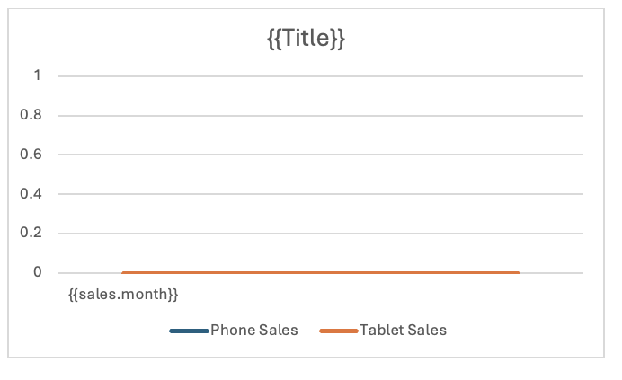
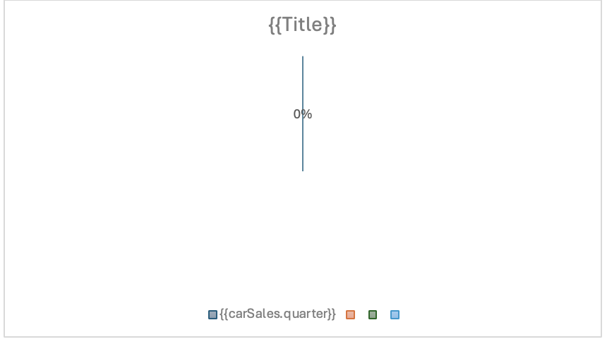

# Charts

To dynamically insert a chart in the document, add the chart as placeholder and edit the chart and excel data.

## How It Works

To insert a chart in the document, add the chart as a placeholder in the document template. The chart placeholder is transformed into a chart in the output document by providing the chart data in the input JSON data.
The following types of graphs are supported:

- Column
- Line
- Pie

Steps to add chart in the document:

- **Open your Word document** and place the cursor where you want the chart to appear.
- **Go to the “Insert” tab** on the Ribbon.
- **Click on “Chart”** in the Illustrations group.
- **Choose the type of chart** you want from the list (e.g. column, line, pie) and click “OK”.
- An **Excel spreadsheet** will open with sample data. Replace this data with your own.
- **Close the Excel** window once you’ve entered your data. The chart in Word will update automatically.


<InlineAlert slots="text"/>

Include only the chart data in the Excel sheet, omitting any additional text.

## Line Chart

**Steps to insert a line chart in the document:**

- Add the line chart as a placeholder in the document template.



- Edit the chart data in the Excel by right click on chart and select "Edit Data in Excel".


**JSON representation of the input data:**

```json
{
  "Title": "Sales Data",
  "sales": [
    {
      "month": "January",
      "phone": 1200,
      "tablet": 800
    },
    {
      "month": "February",
      "phone": 1100,
      "tablet": 750
    },
    {
      "month": "March",
      "phone": 1500,
      "tablet": 900
    },
    {
      "month": "April",
      "phone": 1300,
      "tablet": 850
    },
    {
      "month": "May",
      "phone": 1600,
      "tablet": 950
    },
    {
      "month": "June",
      "phone": 1400,
      "tablet": 900
    },
    {
      "month": "July",
      "phone": 1700,
      "tablet": 1000
    },
    {
      "month": "August",
      "phone": 1800,
      "tablet": 1100
    },
    {
      "month": "September",
      "phone": 1600,
      "tablet": 1050
    },
    {
      "month": "October",
      "phone": 1900,
      "tablet": 1150
    },
    {
      "month": "November",
      "phone": 2000,
      "tablet": 1200
    },
    {
      "month": "December",
      "phone": 2100,
      "tablet": 1250
    }
  ]
}
```

**Output chart in document after processing.**


## Column Chart


**Steps to insert a column chart in the document:**

- Add the column chart as a placeholder in the document template.



- Edit the chart data in the Excel by right click on chart and select "Edit Data in Excel".


**JSON representation of the input data:**

```json
{
  "Title": "Vehicle Sales Data",
  "sales": [
    {
      "month": "July",
      "EV": 700000,
      "ICE": 1500000
    },
    {
      "month": "August",
      "EV": 750000,
      "ICE": 1450000
    },
    {
      "month": "September",
      "EV": 800000,
      "ICE": 1400000
    },
    {
      "month": "October",
      "EV": 850000,
      "ICE": 1350000
    }
  ]
}

```

**Output chart in document after processing.**


## Pie Chart

**Steps to insert a pie chart in the document:**

- Add the pie chart as a placeholder in the document template.


- Edit the chart data in the Excel by right click on chart and select "Edit Data in Excel".


**JSON representation of the input data:**

```json
{
  "Title": "Car Sales by Quarters",
  "carSales": [
    {
      "quarter": "1st Qtr",
      "value": 1500
    },
    {
      "quarter": "2nd Qtr",
      "value": 2000
    },
    {
      "quarter": "3rd Qtr",
      "value": 1800
    },
    {
      "quarter": "4th Qtr",
      "value": 2200
    }
  ]
}
```

**Output chart in document after processing.**


