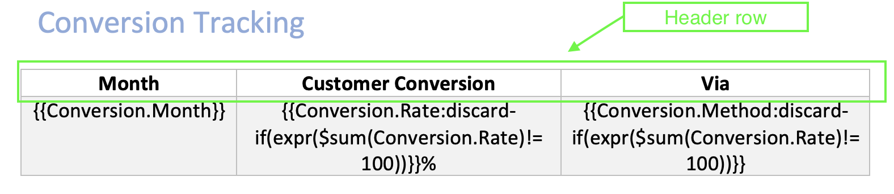
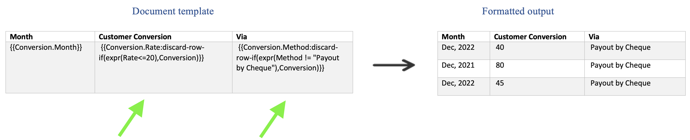

# Complex Table Constructs
Add additional properties to table tags to apply advanced functionalities on table.

## Dynamically expand table rows or columns
Specify the cell extension property inside the table cell to indicate whether to expand table rows vertically or columns horizontally.

JSON representation of the input data:

```json
{
  "subscriptions": [
    {
      "name": "Adobe Document API",
      "price": "99"
    },
    {
      "name": "Adobe Marketing API",
      "price": "199"
    },
    {
      "name": "Adobe Design API",
      "price": "299"
    }

  ]
}
```

- **Repeat table rows vertically** - *{{subscriptions.name:**cell-extension(vertical)**}}* tag lets the engine know that cells will be extended in vertical direction.


- **Repeat table columns horizontally** - *{{subscriptions.name:**cell-extension(horizontal)**}}* tag lets the engine know that cells will be extended in horizontal direction.


- **Repeat table columns horizontally with table markers** - To use horizontal extension with table markers, add 
*cell-extension(horizontal)* to a tag and place the table start and end marker at the beginning and end of the column 
instead of row.


<InlineAlert slots="text"/>

Default extension is vertical. If cell-extension construct is not provided, then table will be extended in vertical direction.
## Dynamic table columns
Discard a column or set of columns in a table from the final generated document as follows :

- [Discard column if empty](../document-generation-api/complextableconstructs.md#discard-column-if-empty).
- [Discard column if condition evaluates to true](../document-generation-api/complextableconstructs.md#discard-column-if-condition-evaluates-to-true).

### Discard column if empty
Column in a table can be discarded if every element of an array in the input json is empty or null.

**How to use** <br/>
Add discard-if-empty construct with boolean false/true along with the template tag to activate discard if empty feature for the corresponding column.

JSON representation of the input data:

*Json 1*

```json
{
  "Project": [
    {
      "Name": "ABC Infra",
      "Milestone": "First Milestone",
      "DateComplete": "24/06/2021",
      "Notes": ""
    },
    {
      "Name": "ABC Infra",
      "Milestone": "Second Milestone",
      "DateComplete": "24/06/2022",
      "Notes": ""
    },
    {
      "Name": "DEF Computer Labs",
      "Milestone": "First Milestone",
      "DateComplete": "12/12/2021",
      "Notes": ""
    },
    {
      "Name": "DEF Computer Labs",
      "Milestone": "Second Milestone",
      "DateComplete": "12/12/2021",
      "Notes": ""
    }
  ]
}
```

*Json2*

```json
{
  "Project": [
    {
      "Name": "ABC Infra",
      "Milestone": "First Milestone",
      "DateComplete": "24/06/2021"
    },
    {
      "Name": "ABC Infra",
      "Milestone": "Second Milestone",
      "DateComplete": "24/06/2022"
    },
    {
      "Name": "DEF Computer Labs",
      "Milestone": "First Milestone",
      "DateComplete": "12/12/2021"
    },
    {
      "Name": "DEF Computer Labs",
      "Milestone": "Second Milestone",
      "DateComplete": "12/12/2021"
    }
  ]
}
```


{{Project.Notes:**discard-if-empty(true)**}} tag lets the engine discard the particular column if every element of an array in the input json is either empty or null.

**Note**: The row above the authored row will be considered as a header row. Cell from the header row will be discarded along with discarded column.





**Using Discard if empty with table markers**

Discard if empty construct can also be used along with table markers


### Discard column if condition evaluates to true
Column in the table can be discarded If condition provided in the discard-if(expr(**condition**)) evaluates to true. Add discard-if(expr(**condition**)) construct along with the template tag to activate discard if feature for the corresponding column.

JSON representation of the input data:

```json
{
  "Conversion": [
    {
      "Month": "July, 2021",
      "Rate": 10,
      "Method": "Payout by Cheque"
    },
    {
      "Month": "September, 2021",
      "Rate": 30,
      "Method": "Payout by Cheque"
    },
    {
      "Month": "Dec, 2021",
      "Rate": 20,
      "Method": "Payout by Cheque"
    },
    {
      "Month": "April, 2022",
      "Rate": 20,
      "Method": "Payout by Cheque"
    },
    {
      "Month": "Dec, 2022",
      "Rate": 30,
      "Method": "Payout by Cheque"
    }
  ]
}
```


{{Conversion.Rate:**discard-if(expr($sum(Conversion.Rate)!= 100))**}} tag lets the engine discard the particular column if condition provided in the **expr** construct evaluates to true.

**Using Discard if with table markers**

Discard if construct can also be used with table markers


## Dynamic table rows
Discard a row or set of rows in a table from the final generated document.

### Discard row if condition evaluates to true
A row in the table can be discarded only when the condition in the discard-row-if(expr(**condition**),**context**) evaluates 
to true in the provided context. Add this construct along with the template tag to discard the row based on the provided condition.

For Example: {{TABLE_CONTEXT.PROPERTY:**discard-row-if(expr(PROPERTY = "TEST_VALUE"),TABLE_CONTEXT)**}}

JSON representation of the input data:
```json
{
  "Conversion": [
    {
      "Month": "July, 2021",
      "Rate": 10,
      "Method": "Payout by Cheque"
    },
    {
      "Month": "Dec, 2021",
      "Rate": 20,
      "Method": "Payout by Cheque"
    },
    {
      "Month": "Dec, 2022",
      "Rate": 40,
      "Method": "Payout by Cheque"
    },
    {
      "Month": "Dec, 2021",
      "Rate": 80,
      "Method": "Payout by Cheque"
    },
    {
      "Month": "April, 2022",
      "Rate": 100,
      "Method": "Payout by Cash"
    },
    {
      "Month": "Dec, 2022",
      "Rate": 45,
      "Method": "Payout by Cheque"
    }
  ]
}
```

In a row, if multiple “discard-row-if” are used, then the row will be discarded if any one of the conditions evaluates to true.

**Note**: The header row is also removed when all the rows are discarded thus removing the complete table.

**Using Discard row if with table markers**

Discard row if construct can also be used with table markers. With table markers, there is no need to mention the context 
inside discard row if.


## Conditions inside tables
An additional construct **eval** is introduced for conditionals inside tables, which is required while evaluating
conditions based on fields of the table currently being expanded. The expression inside **eval** is an array
of objects where each entry of object serves as context to evaluate the condition in the corresponding row of table.

JSON representation of the input data:

```json
{
  "company": [
    {
      "name": "ABC",
      "supportsX" : "TRUE"
    },
    {
      "name": "XYZ",
      "supportsX": "FALSE"
    }

  ]
}
```


In the above example, the array of objects on which the condition needs to be evaluated (*company*) is provided in
**eval**, and the expr contains the actual condition `supportsX="TRUE"`. The condition is evaluated based on each
entry of the array and applied to the corresponding row in the output table.

### Conditions inside tables with table markers
Conditions can be used inside tables with table markers. For conditions based on the fields of array currently being
expanded, conditions can be used as is. 


## Nested Tables
Table tags with markers can also be used inside another table. 

JSON representation of the input data:

```json
{
  "school": [
    {
      "name": "ABC Public School",
      "class": [
        {
          "name" : "XI",
          "strength": 65
        },
        {
          "name" : "XII",
          "strength": 40
        }
      ]
    },
    {
      "name": "DEF Public School",
      "class": [
        {
          "name" : "XI",
          "strength": 52
        },
        {
          "name" : "XII",
          "strength": 31
        }
      ]
    },
    {
      "name": "XYZ Public School",
      "class": [
        {
          "name" : "X",
          "strength": 45
        },
        {
          "name" : "XI",
          "strength": 38
        },
        {
          "name" : "XII",
          "strength": 82
        }
      ]
    }
  ]
}
```


Create both tables with their respective table markers. In the above example, the **school** tag acts as the array 
upon which the outer table is expanded. For each school, the inner table is expanded on its respective **class**, 
which is mentioned as the array tag in the inner table marker.
