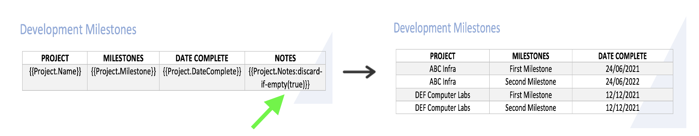
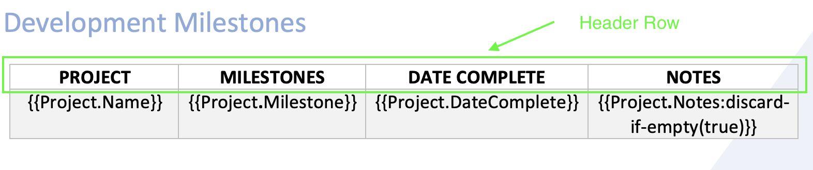
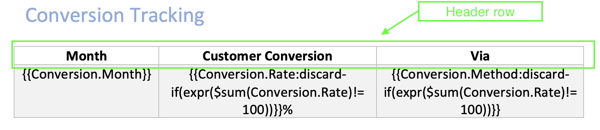
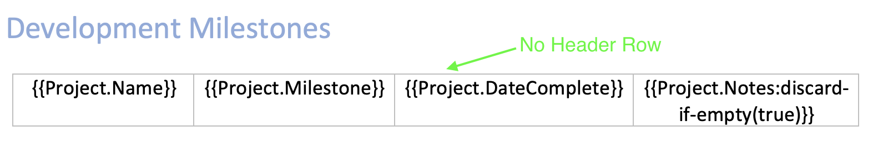
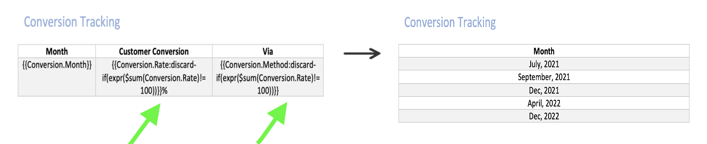

# Dynamic Table Constructs
Add dynamic behaviour to a table using [dynamic table columns constructs](../document-generation-api/dynamictableconstructs.md#dynamic-table-columns) to discard column or set of columns at runtime.

## Dynamic table columns
Discard a column or set of columns in a table from the final generated document as follows :

- [Discard column if empty](../document-generation-api/dynamictableconstructs.md#discard-column-if-empty).
- [Discard column if condition evaluates to true](../document-generation-api/dynamictableconstructs.md#discard-column-if-condition-evaluates-to-true).

### Discard column if empty
Column in a table can be discarded if every element of an array in the input json is empty or null.

**How to use** <br/>
Add discard-if-empty construct with boolean false/true along with the template tag to activate discard if empty feature for the corresponding column.

JSON representation of the input data:

*Json 1*

```json
{
  "Project": [
    {
      "Name": "ABC Infra",
      "Milestone": "First Milestone",
      "DateComplete": "24/06/2021",
      "Notes": ""
    },
    {
      "Name": "ABC Infra",
      "Milestone": "Second Milestone",
      "DateComplete": "24/06/2022",
      "Notes": ""
    },
    {
      "Name": "DEF Computer Labs",
      "Milestone": "First Milestone",
      "DateComplete": "12/12/2021",
      "Notes": ""
    },
    {
      "Name": "DEF Computer Labs",
      "Milestone": "Second Milestone",
      "DateComplete": "12/12/2021",
      "Notes": ""
    }
  ]
}
```

*Json2*

```json
{
  "Project": [
    {
      "Name": "ABC Infra",
      "Milestone": "First Milestone",
      "DateComplete": "24/06/2021"
    },
    {
      "Name": "ABC Infra",
      "Milestone": "Second Milestone",
      "DateComplete": "24/06/2022"
    },
    {
      "Name": "DEF Computer Labs",
      "Milestone": "First Milestone",
      "DateComplete": "12/12/2021"
    },
    {
      "Name": "DEF Computer Labs",
      "Milestone": "Second Milestone",
      "DateComplete": "12/12/2021"
    }
  ]
}
```


- {{Project.Notes:**discard_if_empty(true)**}} tag lets the engine discard the particular column if every element of an array in the input json is either empty or null.

**Note**: The row above the authored row will be considered as a header row. Cell from the header row will be discarded along with discarded column.







### Discard column if condition evaluates to true
Column in the table can be discarded If condition provided in the discard-if(expr(**condition**)) evaluates to true. Add discard-if(expr(**condition**)) construct along with the template tag to activate discard if feature for the corresponding column.

JSON representation of the input data:

```json
{
  "Conversion": [
    {
      "Month": "July, 2021",
      "Rate": 10,
      "Method": "Payout by Cheque"
    },
    {
      "Month": "September, 2021",
      "Rate": 30,
      "Method": "Payout by Cheque"
    },
    {
      "Month": "Dec, 2021",
      "Rate": 20,
      "Method": "Payout by Cheque"
    },
    {
      "Month": "April, 2022",
      "Rate": 20,
      "Method": "Payout by Cheque"
    },
    {
      "Month": "Dec, 2022",
      "Rate": 30,
      "Method": "Payout by Cheque"
    }
  ]
}
```



- {{Conversion.Rate:**discard-if(expr($sum(Conversion.Rate)!= 100))**}}% tag lets the engine discard the particular column if condition provided in the **expr** construct evaluates to true.

