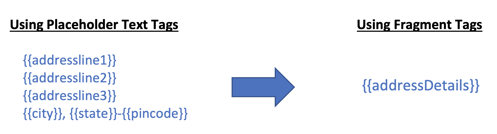
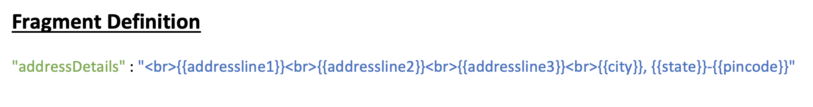
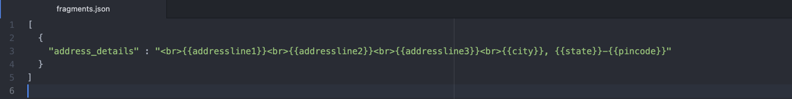
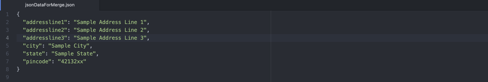
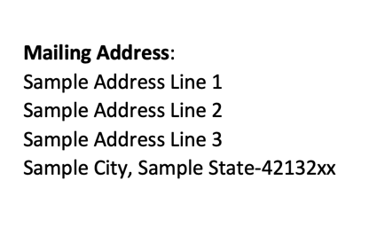

# Fragments

Fragments is a special type of text tag which is used to group one or multiple  text tags as well as other fragments together. One fragment tag definition can comprise below tags:

- Placeholder Text Tag 
- Fragment Tag

## Uses

Fragments allow user to write complex structure of text tag seperately thus saves complexity and eases maintainablity of editing and manipulating such complex structure in document templates.

####Example:

Here `addressDetails` is a fragment defined which comprises `addressline1`, `addressline2`, `addressline3`, `state`, `city` and `pincode`.

For the above example, the `jsonDataForMerge.json` and `fragments.json` would look like:

###Fragments JSON file

###Input JSON file

###Sample Input Document 
In the input document below, `address_details` is a fragment which will be resolved using `fragments.json` and `jsonDataForMerge.json` files.

###Sample Output Document 
Below is the final document generated:

