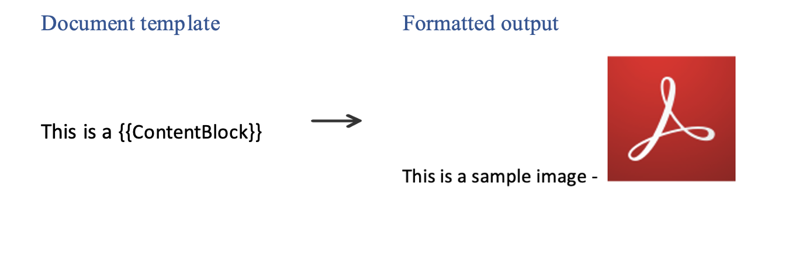

# Inline Images

Add inline images in the document through json data using the  tag.

## How It Works

You can provide the input image url by making use of html img tag in json. This is one such sample json.

```json
{
  "ContentBlock": "This is my chart:<br>"
}
```

Now you can use this tag in template and directly insert the image provided into the final document.



