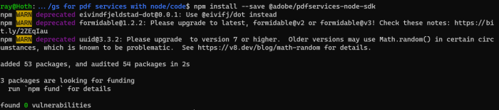
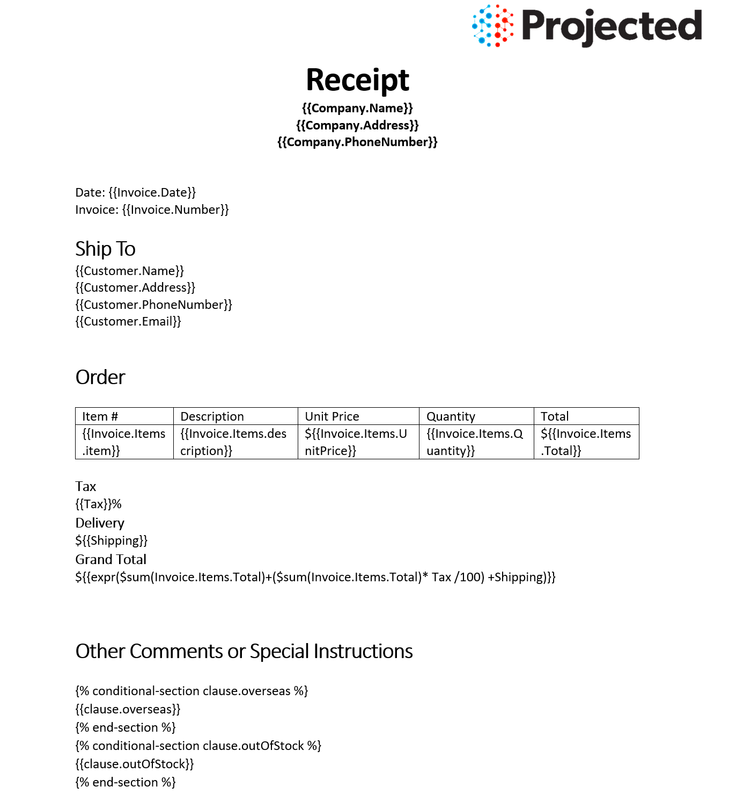
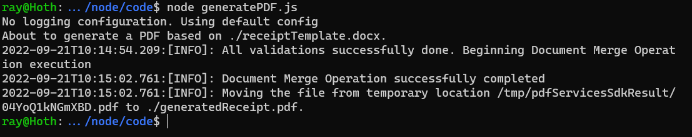

# Quickstart for Adobe Document Generation API (Node.js)

To get started using Adobe Document Generation API, let's walk through a simple scenario - using a Word document as a template for dynamic receipt generation in PDF. In this guide, we will walk you through the complete process for creating a program that will accomplish this task. 

## Prerequisites

To complete this guide, you will need:

* [Node.js](https://nodejs.org) - Node.js version 18.0 or higher is required. 
* An Adobe ID. If you do not have one, the credential setup will walk you through creating one.
* A way to edit code. No specific editor is required for this guide.

## Step One: Getting credentials

1) To begin, open your browser to <https://acrobatservices.adobe.com/dc-integration-creation-app-cdn/main.html?api=document-generation-api>. If you are not already logged in to Adobe.com, you will need to sign in or create a new user. Using a personal email account is recommend and not a federated ID.


2) After registering or logging in, you will then be asked to name your new credentials. Use the name, "New Project". 

3) Change the "Choose language" setting to "Node.js". 

4) Also note the checkbox by, "Create personalized code sample." This will include a large set of samples along with your credentials. These can be helpful for learning more later. 

5) Click the checkbox saying you agree to the developer terms and then click "Create credentials."


6) After your credentials are created, they are automatically downloaded:


## Step Two: Setting up the project

1) In your Downloads folder, find the ZIP file with your credentials: PDFServicesSDK-Node.jsSamples.zip. If you unzip that archive, you will find a folder of samples and the `pdfservices-api-credentials.json` file.


2) Take the `pdfservices-api-credentials.json` file and place it in a new directory. Remember that these credential files are important and should be stored safely.

3) At the command line, change to the directory you created, and initialize a new Node.js project with `npm init -y`


4) Install the Adobe PDF Services Node.js SDK by typing `npm install --save @adobe/pdfservices-node-sdk` at the command line.



At this point, we've installed the Node.js SDK for Adobe PDF Services API as a dependency for our project and have copied over our credentials files. 

Our application will take a Word document, `receiptTemplate.docx` (downloadable from [here](/receiptTemplate.docx)), and combine it with data in a JSON file, `receipt.json` (downloadable from [here](/receipt.json)), to be sent to the Acrobat Services API and generate a receipt PDF.

5) In your editor, open the directory where you previously copied the credentials. Create a new file, `generatePDF.js`

Now you're ready to begin coding.

## Step Three: Creating the application

1) Let's start by looking at the Word template. If you open the document in Microsoft Word, you'll notice multiple tokens throughout the document (called out by the use of `{{` and `}}`).



When the Document Generation API is used, these tokens are replaced with the JSON data sent to the API. These tokens support simple replacements, for example, `{{Customer.Name}}` will be replaced by a customer's name passed in JSON. You can also have dynamic tables. In the Word template, the table uses invoice items as a way to dynamically render whatever items were ordered. Conditions can also be used to hide or show content as you can see two conditions at the end of the document. Finally, basic math can be also be dynamically applied, as seen in the "Grand Total". 

2) Next, let's look at our sample data: 

```json
{
  "author": "Gary Lee",
  "Company": {
    "Name": "Projected",
    "Address": "19718 Mandrake Way",
    "PhoneNumber": "+1-100000098"
  },
  "Invoice": {
    "Date": "January 15, 2021",
    "Number": 123,
    "Items": [
      {
        "item": "Gloves",
        "description": "Microwave gloves",
        "UnitPrice": 5,
        "Quantity": 2,
        "Total": 10
      },
      {
        "item": "Bowls",
        "description": "Microwave bowls",
        "UnitPrice": 10,
        "Quantity": 2,
        "Total": 20
      }
    ]
  },
  "Customer": {
    "Name": "Collins Candy",
    "Address": "315 Dunning Way",
    "PhoneNumber": "+1-200000046",
    "Email": "cc@abcdef.co.dw"
  },
  "Tax": 5,
  "Shipping": 5,
  "clause": {
    "overseas": "The shipment might take 5-10 more than informed."
  },
  "paymentMethod": "Cash"
}
```

Notice how the tokens in the Word document match up with values in our JSON. While our example will use a hard coded set of data in a file, production applications can get their data from anywhere. Now let's get into our code.

3) We'll begin by including our required dependencies:

```js
const {
  ServicePrincipalCredentials,
  PDFServices,
  MimeType,
  DocumentMergeParams,
  OutputFormat,
  DocumentMergeJob,
  DocumentMergeResult,
  SDKError,
  ServiceUsageError,
  ServiceApiError
} = require("@adobe/pdfservices-node-sdk");
const fs = require("fs");
```

4) Set the environment variables `PDF_SERVICES_CLIENT_ID` and `PDF_SERVICES_CLIENT_SECRET` by running the following commands and replacing placeholders `YOUR CLIENT ID` and `YOUR CLIENT SECRET` with the credentials present in `pdfservices-api-credentials.json` file:
- **Windows:**
  - `set PDF_SERVICES_CLIENT_ID=<YOUR CLIENT ID>`
  - `set PDF_SERVICES_CLIENT_SECRET=<YOUR CLIENT SECRET>`

- **MacOS/Linux:**
  - `export PDF_SERVICES_CLIENT_ID=<YOUR CLIENT ID>`
  - `export PDF_SERVICES_CLIENT_SECRET=<YOUR CLIENT SECRET>`

5) Next, we setup the SDK to use our credentials.

```js
// Initial setup, create credentials instance
const credentials = new ServicePrincipalCredentials({
  clientId: process.env.PDF_SERVICES_CLIENT_ID,
  clientSecret: process.env.PDF_SERVICES_CLIENT_SECRET
});

// Creates a PDF Services instance
const pdfServices = new PDFServices({credentials});
```

6) Now, let's upload the asset and create JSON data for merge:

```js
// Creates an asset(s) from source file(s) and upload
readStream = fs.createReadStream("./receiptTemplate.docx");
const inputAsset = await pdfServices.upload({
  readStream,
  mimeType: MimeType.DOCX
});

// Setup input data for the document merge process
const jsonDataForMerge = JSON.parse(fs.readFileSync('./receipt.json', 'utf-8'));
```

7) Now, let's create the parameters and the job:

```js
// Create parameters for the job
const params = new DocumentMergeParams({
  jsonDataForMerge,
  outputFormat: OutputFormat.PDF
});

// Creates a new job instance
const job = new DocumentMergeJob({inputAsset, params});
```

This set of code defines what we're doing (a document merge operation, the SDK's way of describing Document Generation), points to our local JSON file and specifies the output is a PDF. It also points to the Word file used as a template.

8) The next code block submits the job and gets the job result:

```js
// Submit the job and get the job result
const pollingURL = await pdfServices.submit({job});
const pdfServicesResponse = await pdfServices.getJobResult({
    pollingURL,
    resultType: DocumentMergeResult
});

// Get content from the resulting asset(s)
const resultAsset = pdfServicesResponse.result.asset;
const streamAsset = await pdfServices.getContent({asset: resultAsset});
```

9) The next code block saves the result at the specified location:

```js
// Creates a write stream and copy stream asset's content to it
const outputFilePath = "./generatePDFOutput.pdf";
console.log(`Saving asset at ${outputFilePath}`);

const writeStream = fs.createWriteStream(outputFilePath);
streamAsset.readStream.pipe(writeStream);
```

This code runs the Document Generation process and then stores the resulting PDF document to the file system.



Here's the complete application (`documentmerge.js`):

```js
const {
  ServicePrincipalCredentials,
  PDFServices,
  MimeType,
  DocumentMergeParams,
  OutputFormat,
  DocumentMergeJob,
  DocumentMergeResult,
  SDKError,
  ServiceUsageError,
  ServiceApiError
} = require("@adobe/pdfservices-node-sdk");
const fs = require("fs");

(async () => {
  let readStream;
  try {
    // Initial setup, create credentials instance
    const credentials = new ServicePrincipalCredentials({
      clientId: process.env.PDF_SERVICES_CLIENT_ID,
      clientSecret: process.env.PDF_SERVICES_CLIENT_SECRET
    });

    // Creates a PDF Services instance
    const pdfServices = new PDFServices({credentials});

    // Creates an asset(s) from source file(s) and upload
    readStream = fs.createReadStream("./receiptTemplate.docx");
    const inputAsset = await pdfServices.upload({
      readStream,
      mimeType: MimeType.DOCX
    });

    // Setup input data for the document merge process
    const jsonDataForMerge = JSON.parse(fs.readFileSync('./receipt.json', 'utf-8'));

    // Create parameters for the job
    const params = new DocumentMergeParams({
      jsonDataForMerge,
      outputFormat: OutputFormat.PDF
    });

    // Creates a new job instance
    const job = new DocumentMergeJob({inputAsset, params});

    // Submit the job and get the job result
    const pollingURL = await pdfServices.submit({job});
    const pdfServicesResponse = await pdfServices.getJobResult({
      pollingURL,
      resultType: DocumentMergeResult
    });

    // Get content from the resulting asset(s)
    const resultAsset = pdfServicesResponse.result.asset;
    const streamAsset = await pdfServices.getContent({asset: resultAsset});

    // Creates a write stream and copy stream asset's content to it
    const outputFilePath = "./generatePDFOutput.pdf";
    console.log(`Saving asset at ${outputFilePath}`);

    const writeStream = fs.createWriteStream(outputFilePath);
    streamAsset.readStream.pipe(writeStream);
  } catch (err) {
    if (err instanceof SDKError || err instanceof ServiceUsageError || err instanceof ServiceApiError) {
      console.log("Exception encountered while executing operation", err);
    } else {
      console.log("Exception encountered while executing operation", err);
    }
  } finally {
    readStream?.destroy();
  }
})();
```

## Next Steps

Now that you've successfully performed your first operation, [review the documentation](https://developer.adobe.com/document-services/docs/overview/document-generation-api/) for many other examples and reach out on our [forums](https://community.adobe.com/t5/document-services-apis/ct-p/ct-Document-Cloud-SDK) with any questions. Also remember the samples you downloaded while creating your credentials also have many demos.
