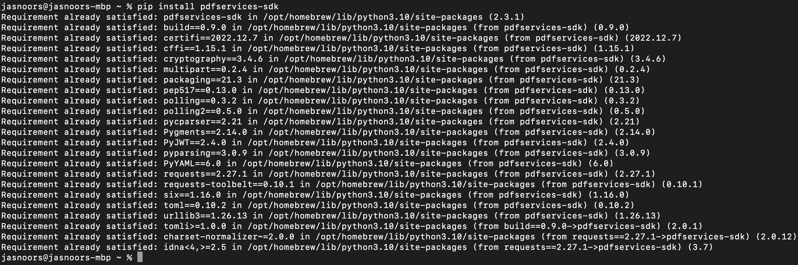
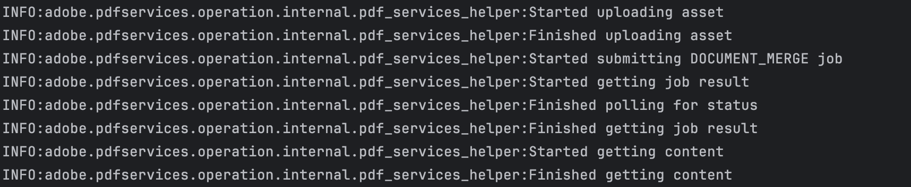

# Quickstart for Adobe Document Generation API (Python)

To get started using Adobe Document Generation API, let's walk through a simple scenario - using a Word document as a template for dynamic receipt generation in PDF. In this guide, we will walk you through the complete process for creating a program that will accomplish this task.

## Prerequisites

To complete this guide, you will need:

* [Python](https://www.python.org/downloads/) - Python 3.10 or higher is required.
* An Adobe ID. If you do not have one, the credential setup will walk you through creating one.
* A way to edit code. No specific editor is required for this guide.


## Step One: Getting credentials

1) To begin, open your browser to <https://acrobatservices.adobe.com/dc-integration-creation-app-cdn/main.html?api=pdf-services-api>. If you are not already logged in to Adobe.com, you will need to sign in or create a new user. Using a personal email account is recommend and not a federated ID.


2) After registering or logging in, you will then be asked to name your new credentials. Use the name, "New Project".

3) Change the "Choose language" setting to "Python".

4) Also note the checkbox by, "Create personalized code sample." This will include a large set of samples along with your credentials. These can be helpful for learning more later.

5) Click the checkbox saying you agree to the developer terms and then click "Create credentials."


6) After your credentials are created, they are automatically downloaded:


## Step Two: Setting up the project

1) In your Downloads folder, find the ZIP file with your credentials: PDFServicesSDK-PythonSamples.zip. If you unzip that archive, you will find a folder of samples and the `pdfservices-api-credentials.json` file.


2) Take the `pdfservices-api-credentials.json` file and place it in a new directory. Remember that these credential files are important and should be stored safely.

3) At the command line, change to the directory you created, and run the following command to install the Python SDK: `pip install pdfservices-sdk`.



At this point, we've installed the Python SDK for Adobe PDF Services API as a dependency for our project and have copied over our credentials files.

Our application will take a Word document, `receiptTemplate.docx` (downloadable from [here](/receiptTemplate.docx)), and combine it with data in a JSON file, `receipt.json` (downloadable from [here](/receipt.json)), to be sent to the Acrobat Services API and generate a receipt PDF.

4) In your editor, open the directory where you previously copied the credentials. Create a new file, `generate_pdf.py`.

Now you're ready to begin coding.

## Step Three: Creating the application

1) Let's start by looking at the Word template. If you open the document in Microsoft Word, you'll notice multiple tokens throughout the document (called out by the use of `{{` and `}}`).


2) Next, let's look at our sample data:

```json
{
  "author": "Gary Lee",
  "Company": {
    "Name": "Projected",
    "Address": "19718 Mandrake Way",
    "PhoneNumber": "+1-100000098"
  },
  "Invoice": {
    "Date": "January 15, 2021",
    "Number": 123,
    "Items": [
      {
        "item": "Gloves",
        "description": "Microwave gloves",
        "UnitPrice": 5,
        "Quantity": 2,
        "Total": 10
      },
      {
        "item": "Bowls",
        "description": "Microwave bowls",
        "UnitPrice": 10,
        "Quantity": 2,
        "Total": 20
      }
    ]
  },
  "Customer": {
    "Name": "Collins Candy",
    "Address": "315 Dunning Way",
    "PhoneNumber": "+1-200000046",
    "Email": "cc@abcdef.co.dw"
  },
  "Tax": 5,
  "Shipping": 5,
  "clause": {
    "overseas": "The shipment might take 5-10 more than informed."
  },
  "paymentMethod": "Cash"
}
```

Notice how the tokens in the Word document match up with values in our JSON. While our example will use a hard coded set of data in a file, production applications can get their data from anywhere. Now let's get into our code.

3) We'll begin by including our required dependencies:

```python
import logging
import os
from datetime import datetime

from adobe.pdfservices.operation.auth.service_principal_credentials import ServicePrincipalCredentials
from adobe.pdfservices.operation.exception.exceptions import ServiceApiException, ServiceUsageException, SdkException
from adobe.pdfservices.operation.io.cloud_asset import CloudAsset
from adobe.pdfservices.operation.io.stream_asset import StreamAsset
from adobe.pdfservices.operation.pdf_services import PDFServices
from adobe.pdfservices.operation.pdf_services_media_type import PDFServicesMediaType
from adobe.pdfservices.operation.pdfjobs.jobs.document_merge_job import DocumentMergeJob
from adobe.pdfservices.operation.pdfjobs.params.documentmerge.document_merge_params import DocumentMergeParams
from adobe.pdfservices.operation.pdfjobs.params.documentmerge.output_format import OutputFormat
from adobe.pdfservices.operation.pdfjobs.result.document_merge_result import DocumentMergePDFResult
```

4) Set the environment variables `PDF_SERVICES_CLIENT_ID` and `PDF_SERVICES_CLIENT_SECRET` by running the following commands and replacing placeholders `YOUR CLIENT ID` and `YOUR CLIENT SECRET` with the credentials present in `pdfservices-api-credentials.json` file:
- **Windows:**
    - `set PDF_SERVICES_CLIENT_ID=<YOUR CLIENT ID>`
    - `set PDF_SERVICES_CLIENT_SECRET=<YOUR CLIENT SECRET>`

- **MacOS/Linux:**
    - `export PDF_SERVICES_CLIENT_ID=<YOUR CLIENT ID>`
    - `export PDF_SERVICES_CLIENT_SECRET=<YOUR CLIENT SECRET>`

5) Next, we can create our credentials and use them:

```python
# Initial setup, create credentials instance
credentials = ServicePrincipalCredentials(
    client_id=os.getenv('PDF_SERVICES_CLIENT_ID'),
    client_secret=os.getenv('PDF_SERVICES_CLIENT_SECRET'))

# Creates a PDF Services instance
pdf_services = PDFServices(credentials=credentials)
```

6) Now, let's create an assets from source file and upload.

```python
file = open('./receiptTemplate.docx', 'rb')
input_stream = file.read()
file.close()

# Creates an asset(s) from source file(s) and upload
input_asset = pdf_services.upload(input_stream=input_stream,
                                  mime_type=PDFServicesMediaType.PDF)
```

7) Now, let's create the parameters and the job:

```python
# Setup input data for the document merge process
with open('./receipt.json', 'r') as file:
    content_string = file.read()
json_data_for_merge = json.loads(content_string)

# Create parameters for the job
document_merge_params = DocumentMergeParams(json_data_for_merge=json_data_for_merge,
                                            output_format=OutputFormat.PDF)
                            
# Creates a new job instance
document_merge_job = DocumentMergeJob(input_asset=input_asset,
                                      document_merge_params=document_merge_params)                                                                                        
```

This set of code defines what we're doing (a document merge operation, the SDK's way of describing Document Generation), points to our local JSON file and specifies the output is a PDF. It also points to the Word file used as a template.

8) The next code block submits the job and gets the job result:

```python
# Submit the job and gets the job result
location = pdf_services.submit(document_merge_job)
pdf_services_response = pdf_services.get_job_result(location, DocumentMergePDFResult)

# Get content from the resulting asset(s)
result_asset: CloudAsset = pdf_services_response.get_result().get_asset()
stream_asset: StreamAsset = pdf_services.get_content(result_asset)
```

9) The next code block saves the result at the specified location:

```python
output_file_path = 'output/MergeDocumentToPDF.pdf'
with open(output_file_path, "wb") as file:
    file.write(stream_asset.get_input_stream())
```



Here's the complete application (`src/documentmerge/merge_document_to_pdf.py`):

```python
import json
import logging
import os
from datetime import datetime

from adobe.pdfservices.operation.auth.service_principal_credentials import ServicePrincipalCredentials
from adobe.pdfservices.operation.exception.exceptions import ServiceApiException, ServiceUsageException, SdkException
from adobe.pdfservices.operation.io.cloud_asset import CloudAsset
from adobe.pdfservices.operation.io.stream_asset import StreamAsset
from adobe.pdfservices.operation.pdf_services import PDFServices
from adobe.pdfservices.operation.pdf_services_media_type import PDFServicesMediaType
from adobe.pdfservices.operation.pdfjobs.jobs.document_merge_job import DocumentMergeJob
from adobe.pdfservices.operation.pdfjobs.params.documentmerge.document_merge_params import DocumentMergeParams
from adobe.pdfservices.operation.pdfjobs.params.documentmerge.output_format import OutputFormat
from adobe.pdfservices.operation.pdfjobs.result.document_merge_result import DocumentMergePDFResult

# Initialize the logger
logging.basicConfig(level=logging.INFO)

# This sample illustrates how to merge the Word based document template with the input JSON data to generate
# the output document in the PDF format.
#
# Refer to README.md for instructions on how to run the samples.

class MergeDocumentToPDF:
    def __init__(self):
        try:
            file = open('./receiptTemplate.docx', 'rb')
            input_stream = file.read()
            file.close()

            # Initial setup, create credentials instance
            credentials = ServicePrincipalCredentials(
                client_id=os.getenv('PDF_SERVICES_CLIENT_ID'),
                client_secret=os.getenv('PDF_SERVICES_CLIENT_SECRET')
            )

            # Creates a PDF Services instance
            pdf_services = PDFServices(credentials=credentials)

            # Creates an asset(s) from source file(s) and upload
            input_asset = pdf_services.upload(input_stream=input_stream,
                                              mime_type=PDFServicesMediaType.DOCX)

            # Setup input data for the document merge process
            with open('./receipt.json', 'r') as file:
                content_string = file.read()
            json_data_for_merge = json.loads(content_string)

            # Create parameters for the job
            document_merge_params = DocumentMergeParams(json_data_for_merge=json_data_for_merge,
                                                        output_format=OutputFormat.PDF)

            # Creates a new job instance
            document_merge_job = DocumentMergeJob(input_asset=input_asset,
                                                  document_merge_params=document_merge_params)

            # Submit the job and gets the job result
            location = pdf_services.submit(document_merge_job)
            pdf_services_response = pdf_services.get_job_result(location, DocumentMergePDFResult)

            # Get content from the resulting asset(s)
            result_asset: CloudAsset = pdf_services_response.get_result().get_asset()
            stream_asset: StreamAsset = pdf_services.get_content(result_asset)

            # Creates an output stream and copy stream asset's content to it
            output_file_path = 'output/MergeDocumentToPDF.pdf'
            with open(output_file_path, "wb") as file:
                file.write(stream_asset.get_input_stream())

        except (ServiceApiException, ServiceUsageException, SdkException) as e:
            logging.exception(f'Exception encountered while executing operation: {e}')

if __name__ == "__main__":
    MergeDocumentToPDF()
```

## Next Steps

Now that you've successfully performed your first operation, [review the documentation](https://developer.adobe.com/document-services/docs/overview/pdf-services-api/) for many other examples and reach out on our [forums](https://community.adobe.com/t5/acrobat-services-api/ct-p/ct-Document-Cloud-SDK?page=1&sort=latest_replies&filter=all&lang=all&tabid=discussions&topics=label-accessibilityauto-tagapi) with any questions. Also remember the samples you downloaded while creating your credentials also have many demos.
