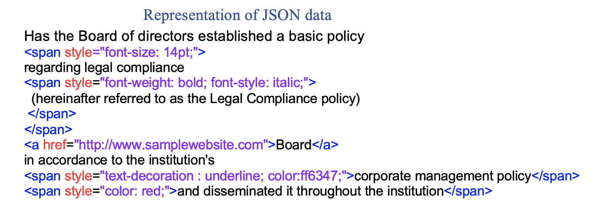
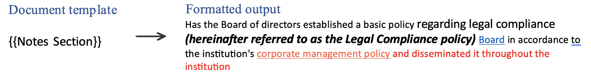
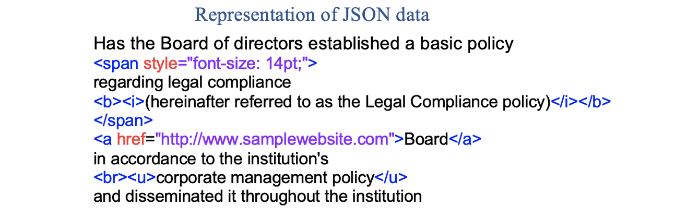
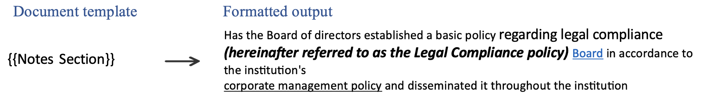

# Apply styling and formatting

Apply styling and formatting in the generated output document using the HTML based constructs.

- Add line breaks in the text.

- Set color and font size of a text.

- Set text as bold and italic.

- Underline text.

- Set height and width of an image.

- Create [Hyperlinks](../document-generation-api/hyperlink.md).

- Create [Inline Images](../document-generation-api/inlineimages.md).

- Create [Paragraphs](/overview/document-generation-api/stylingformattingtags/#how-to-create-paragraphs-in-document).

- Create [Lists](/overview/document-generation-api/templatetags/#insert-list-using-ul-and-ol-html-elements).

## How It Works

Basic styling for the text tags can be provided from the input json data.

JSON representation of the input data:

```json
{
    "LMS Certificate": {
        "Employee Name": "Sarah Rose",
        "Certification Program": "Certificate in Life and Thoughts of <span style=\"font-weight: bold \">Dr. BR Ambedkar </span> ",
        "Completion Date": "01/03/2021"
    }
}
```


## Styling and Formatting rules

Styling for the text tag can be provided using the json data through the HTML based constructs. The constructs follows the additional rules as listed below :

- HTML tags supported are <span\>, nested span, <br\> (new line), <b\> (bold), <strong\> (strong), <em\> (emphasis), <i\> (italic), <u\> (underline), <p\> (para).

- Either use Inline custom css inside the span tag to style the data or use basic styling tags such as <b\> (bold), <i\> (italic) and <u\> (underline).

- Styling precedence works as per the general convention of (local  - > global) scope for nested HTML span.

- Any HTML tags which are not supported will be ignored.

Formatting for image can be provided using the attributes of the img tag.

- The img tag supports the height and width attributes.

- Any other unsupported attributes inside the img tag will be ignored.

## Inline styling attributes supported

- font-size : Xpt or Ypx ;  X=dynamic positive integer 1–1638 pt, 1pt = 1/72 inch; Y=dynamic positive integer 1–2184 px, 1px = 1/96 inch ( point (pt) and pixels (px) are the only supported unit for font size.)

- font-weight : bold;

- font-style : italic;

- text-decoration : underline;

- color : ff6347;

JSON representation of the input data:

```json
{
  "Notes Section": "Has the Board of directors established a basic policy <span style=\"font-size: 14pt;\">regarding legal compliance<span style=\"font-weight: bold; font-style: italic;\"> (hereinafter referred to as the Legal Compliance policy) </span></span><a href=\"http://www.samplewebsite.com/\">Board</a> in accordance to the institution's <span style=\"text-decoration : underline; color:ff6347;\">corporate management policy</span> <span style=\"color: red;\">and disseminated it throughout the institution</span>"
}
```




## Tags Supported

- <span\>

- <a\> (anchor)

- <br\> (new line)

- <b\> (bold)

- <strong\> (strong)

- <em\> (emphasis)

- <i\> (italic)

- <u\> (underline)

-  (image)

- [<p\> (para)](/overview/document-generation-api/stylingformattingtags/#how-to-create-paragraphs-in-document)

- [<ol\> & <ul\> (ordered lists and unordered lists)](/overview/document-generation-api/templatetags/#insert-list-using-ul-and-ol-html-elements)

JSON representation of the input data:

```json
{
  "Notes Section": "Has the Board of directors established a basic policy <span style=\"font-size: 14pt;\">regarding legal compliance <b><i>(hereinafter referred to as the Legal Compliance policy) </i></b></span><a href=\"http://www.samplewebsite.com/\">Board</a> in accordance to the institution's <br><u>corporate management policy</u> and disseminated it throughout the institution"
}
```



 
#### How to create paragraphs in document?

Dynamically add new paragraphs in the document using `<p>` in the placeholder value.

JSON representation of the input data:

```json
{
    "Input_Data": "Here is the content before starting of paragraph.<p>This is first paragraph dynamically added.</p><p>This content belongs to second paragraph dynamically added.</p>"
}
```


<InlineAlert slots="text"/>

- `&nbsp` HTML entity is not supported in JSON for representing non-breaking space characters.


