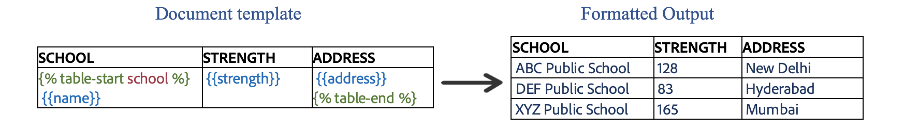
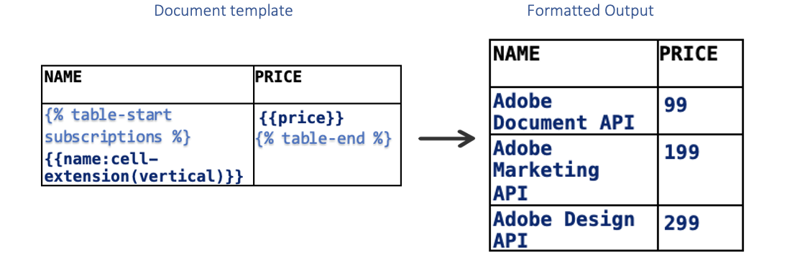
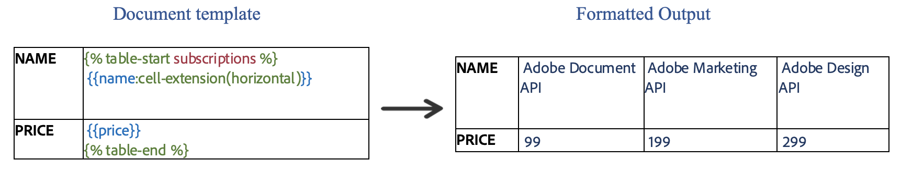
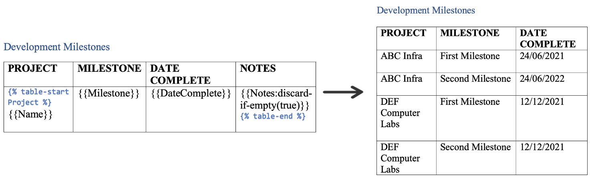
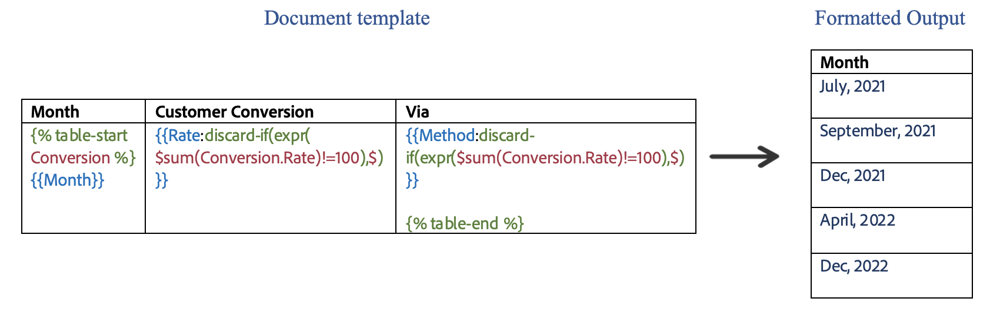
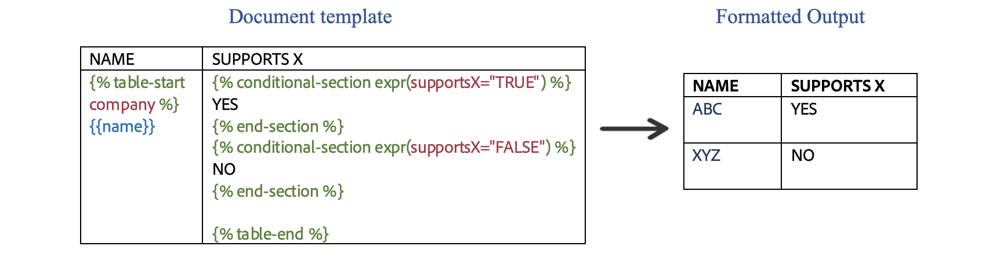
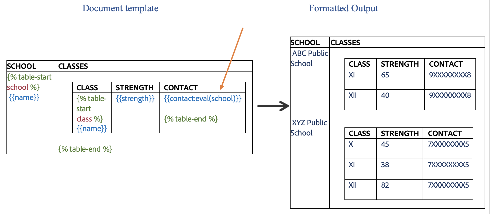

# Table Tag with markers
Use Table markers to insert table tags in a document

There are 2 new markers introduced for inserting tables in a document

- table start ``
- table end   ``

In the table row that needs to be dynamically expanded, place the table start marker in the first cell followed by table 
end marker in the last cell of the row. The content between these markers is then dynamically populated by iterating over 
the array of objects corresponding to the tag(ARRAY_TAG) mentioned in the table start marker.

JSON representation of the input data:

```json
{
  "school": [
    {
      "name": "ABC Public School",
      "strength": "128",
      "address": "New Delhi"
    },
    {
      "name": "DEF Public School",
      "strength": "83",
      "address": "Hyderabad"
    },
    {
      "name": "XYZ Public School",
      "strength": "165",
      "address": "Mumbai"
    }
  ]
}

```



In the above example, **school** serves as the ARRAY_TAG over whose data the table repeats. A new row is created for each 
school and data is populated accordingly.

## Complex Table Constructs with Table markers

All the complex constructs can also be used along with table markers

## Dynamically expand table rows or columns
Specify the cell extension property in at least one tag inside the table cell to indicate whether to expand table rows 
vertically or columns horizontally.

```json
{
  "subscriptions": [
    {
      "name": "Adobe Document API",
      "price": "99"
    },
    {
      "name": "Adobe Marketing API",
      "price": "199"
    },
    {
      "name": "Adobe Design API",
      "price": "299"
    }

  ]
}
```


- **Repeat table rows vertically with table markers** - To use vertical extension with table markers, add
  *cell-extension(vertical)* to a tag.





- **Repeat table columns horizontally with table markers** - To use horizontal extension with table markers, add
  *cell-extension(horizontal)* to a tag and place the table start and end markers at the beginning and end of the column
  instead of row.



## Dynamic table columns
Discard a column or set of columns in a table from the final generated document using table markers as follows:

### Discard column if empty
Column in a table can be discarded if every element of an array in the input json is empty or null.

**How to use** <br/>
Add discard-if-empty construct with boolean false/true along with the template tag to activate discard if empty feature for the corresponding column.

JSON representation of the input data:

```json
{
  "Project": [
    {
      "Name": "ABC Infra",
      "Milestone": "First Milestone",
      "DateComplete": "24/06/2021",
      "Notes": ""
    },
    {
      "Name": "ABC Infra",
      "Milestone": "Second Milestone",
      "DateComplete": "24/06/2022",
      "Notes": ""
    },
    {
      "Name": "DEF Computer Labs",
      "Milestone": "First Milestone",
      "DateComplete": "12/12/2021",
      "Notes": ""
    },
    {
      "Name": "DEF Computer Labs",
      "Milestone": "Second Milestone",
      "DateComplete": "12/12/2021",
      "Notes": ""
    }
  ]
}
```

### Usage



### Discard column if condition evaluates to true
Column in the table can be discarded If condition provided in the discard-if(expr(**condition**)) evaluates to true. Add discard-if(expr(**condition**)) construct along with the template tag to activate discard if feature for the corresponding column.

JSON representation of the input data:

```json
{
  "Conversion": [
    {
      "Month": "July, 2021",
      "Rate": 10,
      "Method": "Payout by Cheque"
    },
    {
      "Month": "September, 2021",
      "Rate": 30,
      "Method": "Payout by Cheque"
    },
    {
      "Month": "Dec, 2021",
      "Rate": 20,
      "Method": "Payout by Cheque"
    },
    {
      "Month": "April, 2022",
      "Rate": 20,
      "Method": "Payout by Cheque"
    },
    {
      "Month": "Dec, 2022",
      "Rate": 30,
      "Method": "Payout by Cheque"
    }
  ]
}
```

### Usage



## Dynamic table rows
Discard a row or set of rows in a table from the final generated document.

### Discard row if condition evaluates to true
A row in the table can be discarded only when the condition in the discard-row-if(expr(**condition**)) evaluates
to true in the provided context. Add this construct along with the template tag to discard the row based on the provided condition.

For Example: {{TABLE_CONTEXT.PROPERTY:**discard-row-if(expr(PROPERTY = "TEST_VALUE"))**}}

JSON representation of the input data:
```json
{
  "Conversion": [
    {
      "Month": "July, 2021",
      "Rate": 10,
      "Method": "Payout by Cheque"
    },
    {
      "Month": "Dec, 2021",
      "Rate": 20,
      "Method": "Payout by Cheque"
    },
    {
      "Month": "Dec, 2022",
      "Rate": 40,
      "Method": "Payout by Cheque"
    },
    {
      "Month": "Dec, 2021",
      "Rate": 80,
      "Method": "Payout by Cheque"
    },
    {
      "Month": "April, 2022",
      "Rate": 100,
      "Method": "Payout by Cash"
    },
    {
      "Month": "Dec, 2022",
      "Rate": 45,
      "Method": "Payout by Cheque"
    }
  ]
}
```

### Usage


## Conditions inside tables
Conditions can be used inside tables with table markers. If the condition is based on a field not in the current array 
being expanded, the context needs to be specified for the field.

JSON representation of the input data:

```json
{
  "company": [
    {
      "name": "ABC",
      "supportsX" : "TRUE"
    },
    {
      "name": "XYZ",
      "supportsX": "FALSE"
    }

  ]
}
```

### Usage



## Nested Tables
Table tags with markers can also be used inside another table.

JSON representation of the input data:

```json
{
  "school": [
    {
      "name": "ABC Public School",
      "class": [
        {
          "name" : "XI",
          "strength": 65
        },
        {
          "name" : "XII",
          "strength": 40
        }
      ]
    },
    {
      "name": "DEF Public School",
      "class": [
        {
          "name" : "XI",
          "strength": 52
        },
        {
          "name" : "XII",
          "strength": 31
        }
      ]
    },
    {
      "name": "XYZ Public School",
      "class": [
        {
          "name" : "X",
          "strength": 45
        },
        {
          "name" : "XI",
          "strength": 38
        },
        {
          "name" : "XII",
          "strength": 82
        }
      ]
    }
  ]
}
```



Create both tables with their respective table markers. In the above example, the **school** tag acts as the array
upon which the outer table is expanded. For each school, the inner table is expanded on its respective **class**,
which is mentioned as the array tag in the inner table marker.
