# Word Add-in

Document Generation Word Add-in provides the capability to author
templates to generate data-driven Word and PDF documents. It provides
the capability to add different tags and enable users to author
templates seamlessly. You can refer to the [Add-in Demo](#add-in-demo) for the explanation
on how to use the add-in.

<InlineAlert slots="text"/>

Adobe Document Generation Word Add-in is available
[here](https://appsource.microsoft.com/en-us/product/office/WA200002654).

## Add-In Demo

Document Generation add-in is developed in such a way that you don't
need to learn any code. The system does it all for you, as you'll see in
the video below:

<Media slots="video"/>

<https://images-tv.adobe.com/mpcv3/5158/38713027-f9e6-4020-ac97-7de5d873476f_1615914905.854x480at800_h264.mp4#t=1>

## How to install

You can get the Document Generation [Word
Add-in](https://appsource.microsoft.com/en-us/product/office/WA200002654)
from the Microsoft Office store. This add-in can be installed in both
the web-based and desktop launched MS Word application. Access to the
store is slightly different for each environment. Detailed instructions
for both are described below.

<InlineAlert slots="text"/>

If you are an Enterprise User, organizational Office 365 Admins or
user with admin rights can centrally
[install the add-in at the tenant level](#installing-at-the-tenant-level), and control access
at the user level if desired.

**Installing the add-in for the web-based client**

-   Log in to your 365 Office account and open the word application.
-   Navigate to the **Insert** tab, and click the **Add-ins** icon in
    the insert section. Office Add-ins pop-up page will open up.

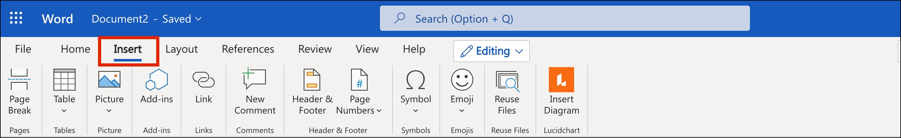

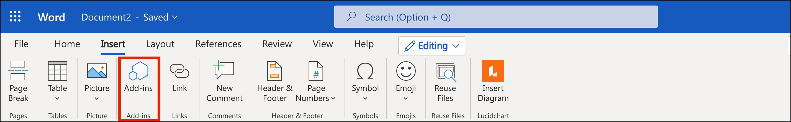
 

*   Check for the **Adobe Document Generation** add-in in the **MY
    ADDINS** tab on Add-ins pop-up page.
*   Navigate to the **STORE** tab in the Office Add-ins pop-up, if the
    add-in is not enabled/installed.
    
<InlineAlert slots="text"/>

If you face an issue, as illustrated below, while accessing your
Office Add-ins store then you can contact your organizational
Office 365 Admins to get
[Add-in installed at the tenant level](#installing-at-the-tenant-level).

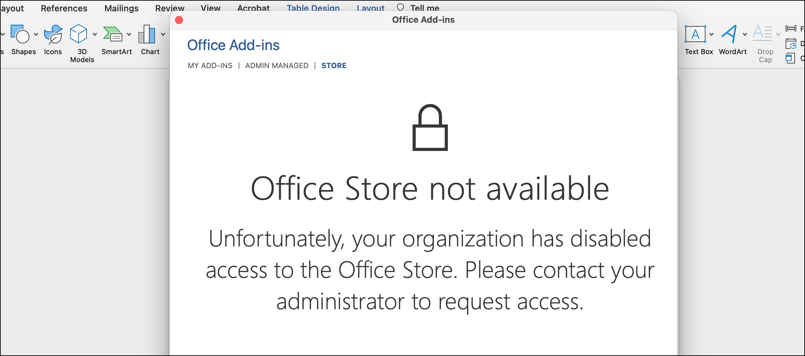
 

- Otherwise, In the top left search box, search for **Adobe Document Generation** and click on add button.

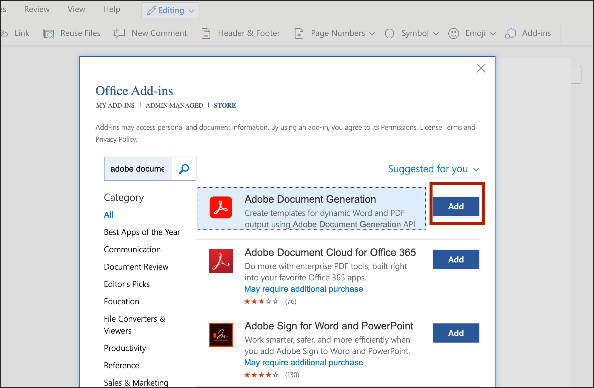
 

*   After enabling/installing the add-in, you will find a new Adobe
    Document Generation add-in on the Home tab.

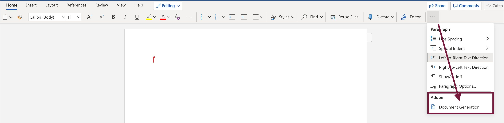
 

**Installing the add-in for the desktop client**

-   Open your desktop Office application.
-   Navigate to the **Insert** tab, and click the **Get Add-ins**
    option.

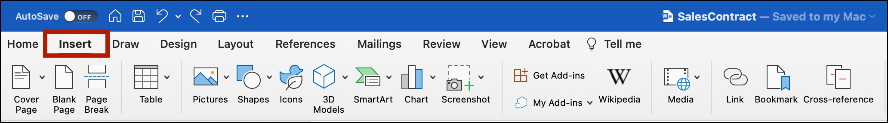

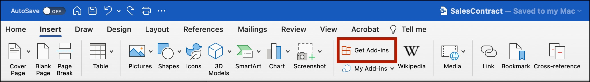
 

*   Check for the **Adobe Document Generation** add-in in the **MY
    ADDINS** tab on Add-ins pop-up page.
*   Navigate to **STORE** tab in the Office Add-ins popup, if add-in is
    not already enabled/installed.
    
<InlineAlert slots="text"/>

If you face an issue, as illustrated below, while accessing your
Office Add-ins store then you can contact your organizational
Office 365 Admins to get
[Add-in installed at the tenant level](#installing-at-the-tenant-level).

 

-   Otherwise, In the top left search box, search for **Adobe Document Generation** and click on **add** button to install.

    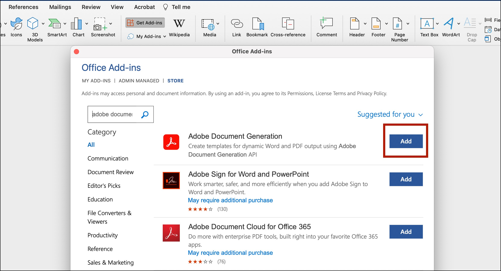
     

*   After enabling/installing the add-in, you will find a new Adobe
    Document Generation add-in on the Home tab.

 

<InlineAlert slots="text"/>

Please refer to the official [Microsoft Add-In Installation
Guide](https://support.microsoft.com/en-us/office/view-manage-and-install-add-ins-in-office-programs-16278816-1948-4028-91e5-76dca5380f8d)
for detailed steps on Add-In installation.

## Installing at the Tenant level

Installing at the tenant level allows the admin to expose the add-in by
default, saving the users the installation steps, and ensuring that all
users have access without issue.

<InlineAlert slots="text"/>

The below process enables the add-in at the tenant level for the whole
user base. [Check here if you would like more granular control over
the
deployment.](https://docs.microsoft.com/en-gb/microsoft-365/admin/manage/manage-deployment-of-add-ins?redirectSourcePath=%252fen-us%252farticle%252fdeploy-office-add-ins-in-the-office-365-admin-center-737e8c86-be63-44d7-bf02-492fa7cd9c3f&view=o365-worldwide)  
[Determine if Centralized Deployment of add-ins works for your
organization.](https://docs.microsoft.com/en-gb/microsoft-365/admin/manage/centralized-deployment-of-add-ins?view=o365-worldwide)

**The enablement is quick and easy, taking only about 5 minutes**:

-   Log in as the Tenant admin, and navigate to the admin center from
    the app launcher.
-   In the admin center, go to the Settings \> Add-ins page. If you
    don't see the Add-in Page, go to the Settings \> Integrated apps.
-   On the top of the Integrated apps page, click the Add-ins link.

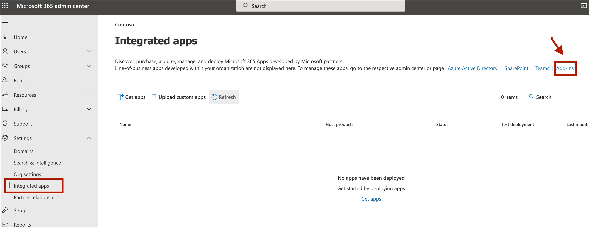
 

-   Select Deploy Add-in at the top of the page, and then select Next.
-   Select the option to add an add-in from the Office Store. In the top
    left search box, search for **Adobe Document Generation** and click
    on add button.

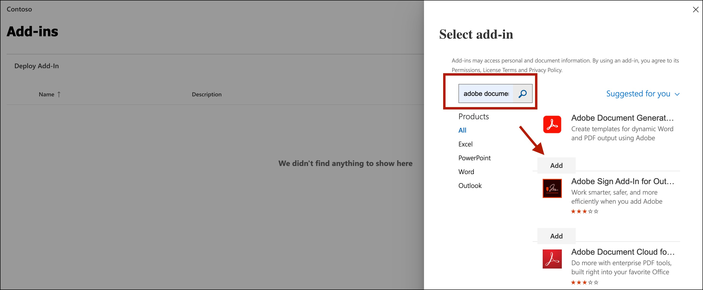
 

-   Assign Users
    -   Everyone - Applies the deployment method to all users in the
        Tenant.
    -   Specific users/groups - Applies the deployment method to only
        the selected users or groups.
    -   Just me - Applies the deployment method to just the user (admin)
        doing the configuration

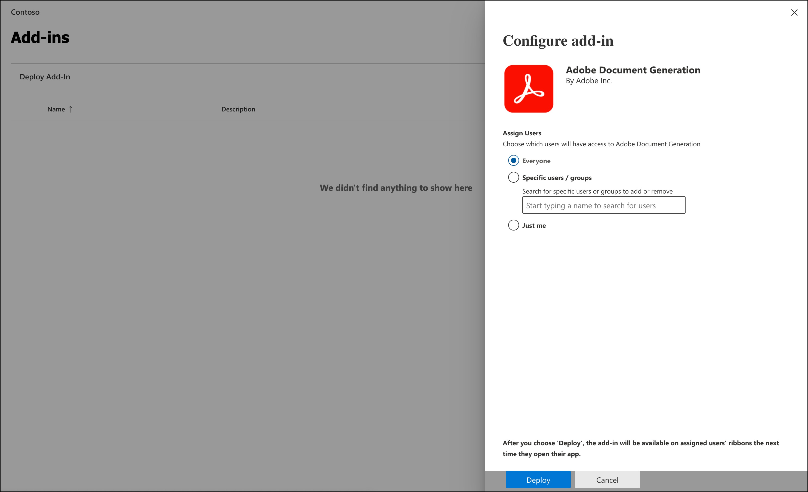
 

-   Click Deploy after assigning users.

<InlineAlert slots="text"/>

Users might need to relaunch Office to view the add-in icon on the app
ribbon.
