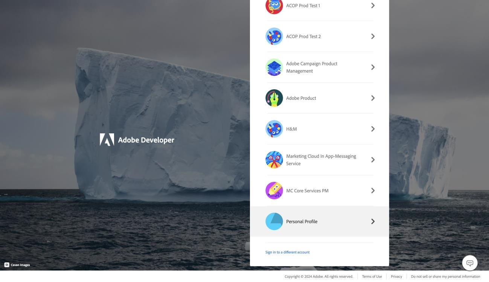

# Frequently Asked Questions (FAQ)

## 1. How can I get access to Adobe PDF Services API Free Tier if I am using company or school account?

Invoking PDF Services API requires an Adobe-provided credential. To get one, [click here](https://acrobatservices.adobe.com/dc-integration-creation-app-cdn/main.html?api=pdf-services-api), and complete the workflow.

#### Step 1:

**Sign out** if you receive the message, “You don’t have access to PDF Services API”.

#### Step 2:

**Click on** "Get Credentials" button.

#### Step 3:

**Click on** "Create an account", and **Sign up** using same email.

#### Step 4:

**Select** "Personal Account" under account types.

#### Step 5:

**Select**  "Personal Profile" to sign in.

Now you should be able to create credentials to get access to the Adobe PDF Services API Free Tier! 