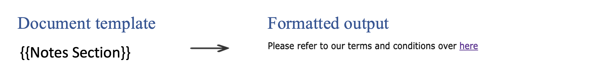

# Hyperlink

Add hyperlink in the document through json data using anchor `<a>` tag.
 
## How It Works

JSON representation of the input data:

```json
{
  "Notes Section": "Please refer to our terms and conditions over <a href=\"https://www.adobe.com/legal/terms.html\">here</a>"
}
```



