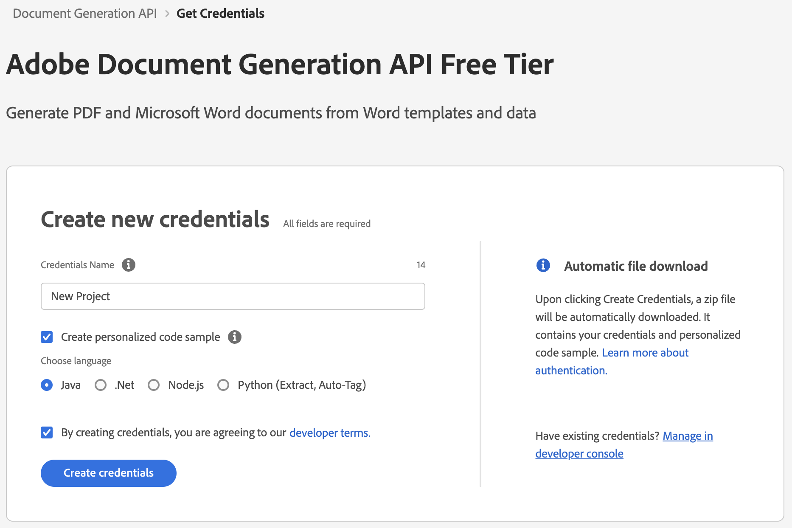
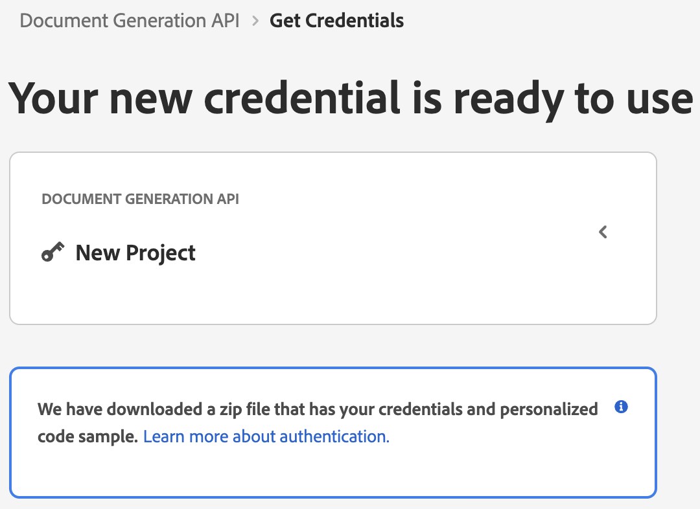
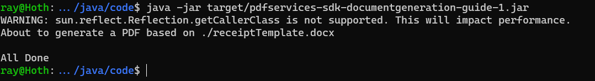

# Quickstart for Adobe Document Generation API (Java)

To get started using Adobe Document Generation API, let's walk through a simple scenario - using a Word document as a template for dynamic receipt generation in PDF. In this guide, we will walk you through the complete process for creating a program that will accomplish this task. 

## Prerequisites

To complete this guide, you will need:

* [Java](http://www.oracle.com/technetwork/java/javase/downloads/index.html) - Java 8 or higher is required. 
* [Maven](https://maven.apache.org/install.html)
* An Adobe ID. If you do not have one, the credential setup will walk you through creating one.
* A way to edit code. No specific editor is required for this guide.

## Step One: Getting credentials

1) To begin, open your browser to <https://acrobatservices.adobe.com/dc-integration-creation-app-cdn/main.html?api=document-generation-api>. If you are not already logged in to Adobe.com, you will need to sign in or create a new user. Using a personal email account is recommend and not a federated ID.


2) After registering or logging in, you will then be asked to name your new credentials. Use the name, "New Project". 

3) Change the "Choose language" setting to "Java". 

4) Also note the checkbox by, "Create personalized code sample." This will include a large set of samples along with your credentials. These can be helpful for learning more later. 

5) Click the checkbox saying you agree to the developer terms and then click "Create credentials."



6) After your credentials are created, they are automatically downloaded:



## Step Two: Setting up the project

1) In your Downloads folder, find the ZIP file with your credentials: PDFServicesSDK-JavaSamples.zip. If you unzip that archive, you will find a folder of samples and the `pdfservices-api-credentials.json` file.


2) Take the `pdfservices-api-credentials.json` file and place it in a new directory.

3) In this directory, create a new file named `pom.xml` and copy the following contents:

```xml
<?xml version="1.0" encoding="UTF-8"?>

<project xmlns="http://maven.apache.org/POM/4.0.0"
         xmlns:xsi="http://www.w3.org/2001/XMLSchema-instance"
         xsi:schemaLocation="http://maven.apache.org/POM/4.0.0 http://maven.apache.org/xsd/maven-4.0.0.xsd">
  <modelVersion>4.0.0</modelVersion>

  <groupId>com.adobe.documentservices</groupId>
  <artifactId>pdfservices-sdk-documentgeneration-guide</artifactId>
  <version>1</version>

  <name>PDF Services Java SDK Samples</name>

  <properties>
    <project.build.sourceEncoding>UTF-8</project.build.sourceEncoding>
    <maven.compiler.source>1.8</maven.compiler.source>
    <maven.compiler.target>1.8</maven.compiler.target>
    <pdfservices.sdk.version>3.5.1</pdfservices.sdk.version>
  </properties>

  <dependencies>

    <dependency>
      <groupId>com.adobe.documentservices</groupId>
      <artifactId>pdfservices-sdk</artifactId>
      <version>${pdfservices.sdk.version}</version>
    </dependency>

    <!--		log4j2 dependency to showcase the use of log4j2 with slf4j API-->
    <!-- https://mvnrepository.com/artifact/org.slf4j/slf4j-log4j12 -->
    <dependency>
      <groupId>org.apache.logging.log4j</groupId>
      <artifactId>log4j-slf4j-impl</artifactId>
      <version>2.17.1</version>
    </dependency>
  </dependencies>

  <build>
    <plugins>
      <plugin>
        <groupId>org.apache.maven.plugins</groupId>
        <artifactId>maven-compiler-plugin</artifactId>
        <version>3.8.0</version>
        <configuration>
          <source>${maven.compiler.source}</source>
          <target>${maven.compiler.target}</target>
        </configuration>
      </plugin>
      <plugin>
        <groupId>org.apache.maven.plugins</groupId>
        <artifactId>maven-shade-plugin</artifactId>
        <version>3.2.4</version>
        <configuration>
          <filters>
            <filter>
              <artifact>*:*</artifact>
              <excludes>
                <exclude>META-INF/*.SF</exclude>
                <exclude>META-INF/*.DSA</exclude>
                <exclude>META-INF/*.RSA</exclude>
              </excludes>
            </filter>
          </filters>
        </configuration>
        <executions>
          <execution>
            <phase>package</phase>
            <goals>
              <goal>shade</goal>
            </goals>
          </execution>
        </executions>
      </plugin>
      <plugin>
        <groupId>org.apache.maven.plugins</groupId>
        <artifactId>maven-jar-plugin</artifactId>
        <version>3.0.2</version>
        <configuration>
          <archive>
            <manifest>
              <addClasspath>true</addClasspath>
              <classpathPrefix>lib/</classpathPrefix>
              <mainClass>GeneratePDF</mainClass>
            </manifest>
          </archive>
        </configuration>
      </plugin>
      <plugin>
        <groupId>org.codehaus.mojo</groupId>
        <artifactId>exec-maven-plugin</artifactId>
        <version>1.5.0</version>
        <executions>
          <execution>
            <goals>
              <goal>java</goal>
            </goals>
          </execution>
        </executions>
      </plugin>
    </plugins>
  </build>
</project>
```

This file will define what dependencies we need and how the application will be built. 

Our application will take a Word document, `receiptTemplate.docx` (downloadable from [here](/receiptTemplate.docx)), and combine it with data in a JSON file, `receipt.json` (downloadable from [here](/receipt.json)), to be sent to the Acrobat Services API and generate a receipt PDF.

4) In your editor, open the directory where you previously copied the credentials, and create a new directory, `src/main/java`. In that directory, create `GeneratePDF.java`. 

Now you're ready to begin coding.

## Step Three: Creating the application

1) Let's start by looking at the Word template. If you open the document in Microsoft Word, you'll notice multiple tokens throughout the document (called out by the use of `{{` and `}}`).


When the Document Generation API is used, these tokens are replaced with the JSON data sent to the API. These tokens support simple replacements, for example, `{{Customer.Name}}` will be replaced by a customer's name passed in JSON. You can also have dynamic tables. In the Word template, the table uses invoice items as a way to dynamically render whatever items were ordered. Conditions can also be used to hide or show content as you can see two conditions at the end of the document. Finally, basic math can be also be dynamically applied, as seen in the "Grand Total". 

2) Next, let's look at our sample data: 

```json
{
  "author": "Gary Lee",
  "Company": {
    "Name": "Projected",
    "Address": "19718 Mandrake Way",
    "PhoneNumber": "+1-100000098"
  },
  "Invoice": {
    "Date": "January 15, 2021",
    "Number": 123,
    "Items": [
      {
        "item": "Gloves",
        "description": "Microwave gloves",
        "UnitPrice": 5,
        "Quantity": 2,
        "Total": 10
      },
      {
        "item": "Bowls",
        "description": "Microwave bowls",
        "UnitPrice": 10,
        "Quantity": 2,
        "Total": 20
      }
    ]
  },
  "Customer": {
    "Name": "Collins Candy",
    "Address": "315 Dunning Way",
    "PhoneNumber": "+1-200000046",
    "Email": "cc@abcdef.co.dw"
  },
  "Tax": 5,
  "Shipping": 5,
  "clause": {
    "overseas": "The shipment might take 5-10 more than informed."
  },
  "paymentMethod": "Cash"
}
```

Notice how the tokens in the Word document match up with values in our JSON. While our example will use a hard coded set of data in a file, production applications can get their data from anywhere. Now let's get into our code.

3) We'll begin by including our required dependencies:

```javascript
import com.adobe.pdfservices.operation.ExecutionContext;
import com.adobe.pdfservices.operation.auth.Credentials;
import com.adobe.pdfservices.operation.exception.SdkException;
import com.adobe.pdfservices.operation.exception.ServiceApiException;
import com.adobe.pdfservices.operation.exception.ServiceUsageException;
import com.adobe.pdfservices.operation.io.FileRef;

import com.adobe.pdfservices.operation.pdfops.DocumentMergeOperation;
import com.adobe.pdfservices.operation.pdfops.options.documentmerge.DocumentMergeOptions;
import com.adobe.pdfservices.operation.pdfops.options.documentmerge.OutputFormat;

import org.slf4j.LoggerFactory;

import java.io.IOException;
import java.nio.file.Files;
import java.nio.file.Path;
import java.nio.file.Paths;

import org.json.JSONObject;
```

4) Now let's define our main class:

```javascript
public class GeneratePDF {

    private static final org.slf4j.Logger LOGGER = LoggerFactory.getLogger(GeneratePDF.class);

    public static void main(String[] args) {

	}

}
```

5) Inside our class, we'll begin by defining our input Word, JSON and output filenames. If the output file already exists, it will be deleted:

```javascript
String input_file = "./receiptTemplate.docx";

String output_file = "./generatedReceipt.pdf";
Files.deleteIfExists(Paths.get(output_file));

Path jsonPath = Paths.get("./receipt.json");

String json = new String(Files.readAllBytes(jsonPath));
JSONObject jsonDataForMerge = new JSONObject(json);
```

These lines are hard coded but in a real application would typically be dynamic.

6) Set the environment variables `PDF_SERVICES_CLIENT_ID` and `PDF_SERVICES_CLIENT_SECRET` by running the following commands and replacing placeholders `YOUR CLIENT ID` and `YOUR CLIENT SECRET` with the credentials present in `pdfservices-api-credentials.json` file:
- **Windows:**
  - `set PDF_SERVICES_CLIENT_ID=<YOUR CLIENT ID>`
  - `set PDF_SERVICES_CLIENT_SECRET=<YOUR CLIENT SECRET>`

- **MacOS/Linux:**
  - `export PDF_SERVICES_CLIENT_ID=<YOUR CLIENT ID>`
  - `export PDF_SERVICES_CLIENT_SECRET=<YOUR CLIENT SECRET>`


7) Next, we can create our credentials and use them:

```javascript
// Initial setup, create credentials instance.
Credentials credentials = Credentials.servicePrincipalCredentialsBuilder()
    .withClientId(System.getenv("PDF_SERVICES_CLIENT_ID"))
    .withClientSecret(System.getenv("PDF_SERVICES_CLIENT_SECRET"))
    .build();

// Create an ExecutionContext using credentials.
ExecutionContext executionContext = ExecutionContext.create(credentials);
```

8) Now, let's create the operation:

```javascript
DocumentMergeOptions documentMergeOptions = new DocumentMergeOptions(jsonDataForMerge, OutputFormat.PDF);

DocumentMergeOperation documentMergeOperation = DocumentMergeOperation.createNew(documentMergeOptions);

// Provide an input FileRef for the operation
FileRef source = FileRef.createFromLocalFile(input_file);
documentMergeOperation.setInput(source);
```

This set of code defines what we're doing (a document merge operation, the SDK's way of describing Document Generation), points to our local JSON file and specifies the output is a PDF. It also points to the Word file used as a template.

9) The next code block executes the operation:

```javascript
// Execute the operation
FileRef result = documentMergeOperation.execute(executionContext);

// Save the result at the specified location
result.saveAs(output_file);
```

This code runs the Document Generation process and then stores the result PDF document to the file system. 



Here's the complete application (`src/main/java/GeneratePDF.java`):

```javascript
import com.adobe.pdfservices.operation.ExecutionContext;
import com.adobe.pdfservices.operation.auth.Credentials;
import com.adobe.pdfservices.operation.exception.SdkException;
import com.adobe.pdfservices.operation.exception.ServiceApiException;
import com.adobe.pdfservices.operation.exception.ServiceUsageException;
import com.adobe.pdfservices.operation.io.FileRef;

import com.adobe.pdfservices.operation.pdfops.DocumentMergeOperation;
import com.adobe.pdfservices.operation.pdfops.options.documentmerge.DocumentMergeOptions;
import com.adobe.pdfservices.operation.pdfops.options.documentmerge.OutputFormat;

import org.slf4j.LoggerFactory;

import java.io.IOException;
import java.nio.file.Files;
import java.nio.file.Path;
import java.nio.file.Paths;

import org.json.JSONObject;

public class GeneratePDF {

    private static final org.slf4j.Logger LOGGER = LoggerFactory.getLogger(GeneratePDF.class);

    public static void main(String[] args) {

        try {

            String input_file = "./receiptTemplate.docx";

            String output_file = "./generatedReceipt.pdf";
            Files.deleteIfExists(Paths.get(output_file));

            Path jsonPath = Paths.get("./receipt.json");

            String json = new String(Files.readAllBytes(jsonPath));
            JSONObject jsonDataForMerge = new JSONObject(json);

      		System.out.println("About to generate a PDF based on " + input_file + "\n");

            // Initial setup, create credentials instance.
            Credentials credentials = Credentials.servicePrincipalCredentialsBuilder()
                .withClientId(System.getenv("PDF_SERVICES_CLIENT_ID"))
                .withClientSecret(System.getenv("PDF_SERVICES_CLIENT_SECRET"))
                .build();

            // Create an ExecutionContext using credentials.
            ExecutionContext executionContext = ExecutionContext.create(credentials);

            DocumentMergeOptions documentMergeOptions = new DocumentMergeOptions(jsonDataForMerge, OutputFormat.PDF);
 
            DocumentMergeOperation documentMergeOperation = DocumentMergeOperation.createNew(documentMergeOptions);
 
            // Provide an input FileRef for the operation
            FileRef source = FileRef.createFromLocalFile(input_file);
            documentMergeOperation.setInput(source);

            // Execute the operation
            FileRef result = documentMergeOperation.execute(executionContext);

            // Save the result at the specified location
            result.saveAs(output_file);
            
            System.out.println("All Done");
            
        } catch (ServiceApiException | IOException | SdkException | ServiceUsageException e) {
            LOGGER.error("Exception encountered while executing operation", e);
        }
    }
}
```

## Next Steps

Now that you've successfully performed your first operation, [review the documentation](https://developer.adobe.com/document-services/docs/overview/document-generation-api/) for many other examples and reach out on our [forums](https://community.adobe.com/t5/document-services-apis/ct-p/ct-Document-Cloud-SDK) with any questions. Also remember the samples you downloaded while creating your credentials also have many demos.

