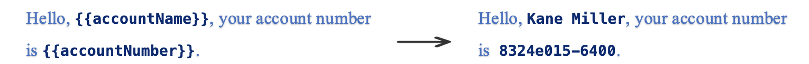
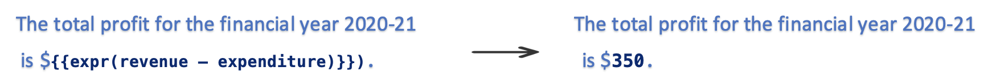

# Template Tags

**This section describes all the template tags that can be used to author
a document template.** During the [Document Generation
Process](../document-generation-api/index.md#document-generation-process) , the Document
Generation API replaces the template tags in the document template with
the input data to generate the output document.

<InlineAlert slots="text"/>

All the tags are [JSONata compliant](https://docs.jsonata.org/overview.html).

## Placeholder Variables

A placeholder(text tags) gets replaced by the actual input data.

**How to insert Placeholder Variables**

<Media slots="video"/>

<https://images-tv.adobe.com/mpcv3/5158/aa393134-7cf7-4ebb-bfd0-1ced95237d20_1615916599.854x480at800_h264.mp4#t=3>


<InlineAlert slots="text"/>

A placeholder variable can only be applied to an input field of type
string, number or boolean. <br/> Formatting applied to the placeholder
variable in the document template will be retained in the output
document.<br/>
For more simplified styling and formatting for the placeholder tag from the input json data, please refer [styling and formatting](../document-generation-api/stylingformattingtags.md) section:

JSON representation of the input data:

```json
{
  "accountName": "Kane Miller",
  "accountNumber": "8324e015-6400",
  "address" : {
    "street": "123 ABC Street",
    "state": "LA",
    "zip": "9XXXX"
  }
}
```

**Usage**

Placeholder variables get replaced with the actual input data.




**Default Value**

A default value can be specified for the placeholder variable. In case,
the specified variable is not present in the input data, the placeholder
gets replaced with the default value.


**Optional**

Setting placeholder variable as optional will replace the placeholder
with an empty string in case the specified variable is not present in
the input data.


## Images

To dynamically insert an image in the document, add any image as
placeholder and edit the alt text as per the defined format:

**How to insert Images**

<Media slots="video"/>

<https://images-tv.adobe.com/mpcv3/5158/43cb78ad-e98d-4deb-bdca-cf32edd0df95_1615916490.854x480at800_h264.mp4#t=3>


```json
{
  "location-path": "logo",
  "image-props": {
    "alt-text": "This is an alt-text for the image placeholder"
  }
}
```

The properties defined in the format specifies the *location-path* and
the *alt-text*.

The *location-path* specifies the location of image in
the input data.

Alternative text for the image can be provided using the *alt-text*
property as defined in the format.

<InlineAlert slots="text"/>

The height and width of the placeholder image is retained in the
output document. <br/> Supported image formats are JPEG, PNG, GIF, BMP, TIFF
and SVG.

JSON representation of the input data:

Image data can be provided either in the form of the base64 encoded string or in the form of publicly accessible URLs.

```json
{
  "logo": "data:image/png;base64,iVBORw0KGgoAAAANSUhEUgAAADIAAAAyCAIAAACRXR/mAAAACXBIWXMAAA7EAAAOxAGVKw4bAAAKM0lEQVRYhZVZa4xdVRX+1j7nvmY6fcy0tOC00FKgECgtFLVNBIVoCJBogj9ImviABBDEP0b9gYb6QzEoCgoqGPlBEwiJkqhVoDQmllIeVQiWVJp2lLSh03ZaaWk7M/fec9bnj/04+5x7Z8CTk8w9++yz17fXWvtbj5GDQ3PmUggAaiAADCAi8Jd9J1BEg+4VoCRgADB6SVLdD6FA/biCboLAzsj9iH2lAgBUSSMphlQRUcDQzRYRK4806L0Ih5WkfQRiQJDwSLeOEwyS6kfs1/YRNBSmdjX7sRFDwLidOKROLV48ABG4UYF4SMqgqn6AxO2iUJJ4JdnNCEAT1Jaqmyl2owZQCAAhRDw+rwrjJFmRHggAmGAg9dYsARKAQrJXSfYTUhiZOPWAKIS1oJMjfkegeMdRkcJiQvstAYkUHOwF8Q5HoZJU9SgrSqIHaLEqkSrtVkBxcyv44gNAbz1EfwBogIJYPcFkwR6oKLWiJH9WTErQehn8oQv4nBS6TcfnMAJdhmLdjwALp0aPyTyg0lvvnUbBlLQrOL1ASoCCMJRdKR53m6CbEc58ST3BZB8GyE5NKcg9zRhlzFj09nPGdWPG+VZwvUgrvbpBcfKFkRVmAmTtmCpIf+JVqkqRgo88iB4DQjNMt9moI62xRzcVNB8KyI3SPRc3QQrcHcGkPckCCsI07bSzoSG9/vps4cL8zBk1ogIVKIQUpahfwX6Vg9Y4pChEPaBgMQoUYgC3UPAVtSfLcgzKiEn7yqJkt6sjI/V778XatUObN2P9Jzk5rbOjgVGIQiiwWqwAskc6zUHCMYcHJhCNTnz5EkcGBNju1G+4Mf/n7sknnqi1mvMfffTouqtSkkYc9RdOEfjW+WU4Ct4RDQIPkIaWfH0IUkBBu93+t39l58uiRd297yRAd/fu5pq1cu6yrNO2ClAYbylvLECdehgUSQpg7G9nEMA4HHYouNSsd2RW55cZwHnzUhEdGdEsD1Ds1q2lcu8AfgWJAdHtxG04pVgFWA1WuGn2yyiQnTkt84dzIF1xPgDtZoCAhAh9mIILVrGxpCCR6GwTAhGSNlSLYgZPmu0igfzQeDL6sRxoXrE2zzIeP840iaEA8DnNbGiCPpSWThl4Az1M3u8qCFZQq3X2/Gvg8svZqDevuqr977HuxNEkTQiXGwYvBvqiCdkAwmGkgwXRiMc+mo7sEkStlo/tb2ne+PwXGsMjx55/QdsdMzAYC6hAqeqm+EEAlmQpLt9ysKQnLY7AhKV8mmo3n2XTf//HWQ/+BMCZl14iLNNCeqKBQkQi4ojRFFt1G081pGof4vESPosXklrtzI4do2ctVvLMyzvgMyKWbeSglHy/Dxp6DKkKlMwxo8/HATHO1t1AltVWrmjMnXvqzTemdr9da7b6aqUEJThcD5rg2yk8Vczu7az+FptfdMkFN39R0hStAbNkSTYxIY0mQnTyvFO4WaHvSGi0ujWrUdKz34w3xZQe4Yg+73Z1YHD4lltIjj/88wV3393Nc6UqmFPV02cU4EEiJ3JCy1u1Lp4JFUZhjMrMccbfeUTBCuQuR2C30x74zDWDK84/+eorE4/9Wk+fmvelL3enpoqAAVEgB9RDKTmADxgZxKKhih2x2vpId061t72omgELv/oVABObNyfA0V88Mnj1pxpXrM0mp1RMTuT2jJezv6CYnB6Nx0CX0EL+NtCa0ye1K/lB30un2snK89e8vVsnp95ctYrHjjHXdOXKs+/73nvf/k4+Pu7dq8gcDIBaHWnq/C0uxF3E8tkpUNVtNDcCIXB1hk+B2tRlt92a1hsHH/9N58iRWr3OPJ/cv+/Qgz8950f3jz/wQDI01Fy6jIMtNpqAyPR0dvjwyVdfy06eqDWbPlrY1Nynpr6skL8ODAz+XyxvUXY6snBk7Z49SbP1+gUXZIcONUaXNi5Z1bzwQhkaGrho1dx16yZefPHU1q3GmCzLRCQdGGhcdtmim24af+K3Rx57PG3U7a5D8Q3AJhSw2pr9qlAoAYF08nz0zjubwyOHt24d2LBhaO0amqQ7Pj61f1973/5D+/Y1Lrpo8R13MEkmtmwRHxmmn302bTYv/eWvpt999/3nnjfNhhdi6Atjm+OnGZhLP14BbFMgLhkB6vR0RjaWnzd6zzfybvf0W2+JSY4++WR7bIxZbgBJ06TVbO/de+D7m86+6675n/vsiW3bTu3c2T52XID66CiA+rnLc0DEwJFaXCiBhLzQag1a568wqudiPy6cnsyIoSuvnPPpa8659bb5l1yy/4c/GLv3uzXApInUaohbAQCzrNvNBi6+ePiGG2pLluSQBatXD29Yf+SF5/fe+bX8xEnYFMhDsY0WBQEjz7Vac2Zy+fCN5t12Z3D16kUbN2ZTU+2JiUsffmjqwMFX11yeTE5KrVZiI3ck3MnTTjtTTVut+rKlZnCoc2xi+sCBJEmkXvPpkYMSu01aqbpiNwIAEZ2e1nr9nG99s3He8qNPP318x8sf37YtSdI993w9++CUtJp+s8Yv6hojLuTU6wZQ1an9Y8xzAEm9LsYU/To7OXS5ABApwXwm3gI4NZ0sXrx8032ndu06+OMHO8CFmzaddd11Y488cuzPf6k3m/RNmyLaMtidoaUDEanVWEtdZdoPSlAVSflTqzXYDxYFzHM0myvuv//wM898sH07gZEbb/zEli0TO1/ede21Sa5I08gjIxB+gBJp0Zo2hlIRFxayuXweZyChqCfyTmfJxo0nXnv9v9u3E5i7fv26P/7h5N533rj5ZrQ7aLVCZiCwTcCSi7juXQVHVI+WoGgJqwnxIY4SNtTbIJ8Mz5cFC5befvvVO3e+v2vXK9de1z18xLQGlDb9tQmFUErlnq2kM19MR3VzdCttmd8zh/L7ZnMQMctH21VlLR29+655GzYMLV/x3lNP/eehn5l2J2m1vBvFFuuTsbGIVW4OCBHk5Ty40uGhQH7XbM5B0furhGdmWdbtpvPmZadPa56naYpababkugIi4BYRjTo/QUoFCoDQkUoJZrEDViQmiUkSnZw0SWJqNdgkxS8qkY+zqG96PNqhK9VCRdKsoYos2sGpzs5b9tMkKQQGGoAQpAj7Ka+PPlDokSpBZNyyCwlFqsQMdaLvmoloX8khT+8ph+zLqIggaOyIEKHfHGaquNzGNhBApDapnVEqChNY8rAwKtGz2mauhg4p9XajPQGAGE+nBZukdmpoZ/V35ngZKainaHV4TRQuUtYHYxw2VvpNVOpvB8sWwTGzxSt6Xy0pJhJf6oyHnQUXcfKkhANRdx6eSIvPBSTSDKKEImoMRBpTP7WkuKL1TYr7LjiH73sXTl6hJXi/iHDYA2TCNPevKPYwlsPnPLqQHRYFjH2OaGEGEBV9BCg0/iAXlGM9OFUKJQR/Ot0Qft/uPzuR7EJ7vQhiED36QMAhKLFfRYshsQksXzDbLIL7IvClUXwaADUUm+lELFI+NPZ1DIDk/wAgP2EeAXgCoAAAAABJRU5ErkJggg=="
}
```
<p style="text-align:center;">OR</p>

```json
{
  "logo": "https://documentcloud.adobe.com/dc-docgen-app/assets/dc_icon.png"
}
```
<InlineAlert slots="text"/>

Only https image urls with an image size of less than 20 MB are allowed.

Add the image placeholder.


Add the alt text to the image as per the specified format.


The image placeholder will be replaced by the image data in
the output document.


## Tables

Rows of a table can be dynamically populated by repeating over an array
of objects from the input data.

**How to insert Tables**

<Media slots="video"/>

<https://images-tv.adobe.com/mpcv3/5158/d58772af-7a62-49fa-a098-12b11a27fb71_1615917048.854x480at800_h264.mp4#t=3>


<InlineAlert slots="text"/>

Formatting applied to the table in the document template will be
retained in the output document.

JSON representation of the input data:

```json
{
  "subscriptions": [
    {
      "name": "Adobe Document API",
      "price": "99",
      "quantity": "1",
      "amount": "99"
    },
    {
      "name": "Adobe Marketing API",
      "price": "199",
      "quantity": "2",
      "amount": "398"
    }
  ]
}
```

**Usage**

Create a table with requisite column headers. Add a row to the table and
place the template tags referring to the properties of the objects in
the array inside the row under the required column headings.

The template tag should indicate the name of the array followed by the
property name of the objects in the array. *{{subscriptions.name}}*
illustrates one such template tag where *subscriptions* refer to the
array of objects while name refers to the property of one such object in
the array.


Table rows are dynamically populated in the output document by repeating
over the specified array of objects.


### Dynamically expand table rows or columns

Specify the cell extension property inside the table cell to indicate whether to expand table rows vertically or columns horizontally.

JSON representation of the input data:

```json
{
  "subscriptions": [
    {
      "name": "Adobe Document API",
      "price": "99"
    },
    {
      "name": "Adobe Marketing API",
      "price": "199"
    },
    {
      "name": "Adobe Design API",
      "price": "299"
    }

  ]
}
```

- *Repeat table rows vertically*
    - {{subscriptions.name:**cell-extension(vertical)**}} tag lets the engine know that cells will be extended in vertical direction.


<InlineAlert slots="text"/>

Default extension is vertical. If cell-extension construct is not provided, then table will be extended in vertical direction.

<br/>

- *Repeat table columns horizontally*
    - {{subscriptions.name:**cell-extension(horizontal)**}} tag lets the engine know that cells will be extended in horizontal direction.


## Lists

Dynamically generate numbered or bullet lists by repeating over a list.

**How to insert Lists**

<Media slots="video"/>

<https://images-tv.adobe.com/mpcv3/5158/d58772af-7a62-49fa-a098-12b11a27fb71_1615917048.854x480at800_h264.mp4#t=3>


JSON representation of the input data:

```json
{
  "products": [
    {
      "productName": "Adobe Photoshop"
    },
    {
      "productName": "Adobe Premiere Pro"
    },
    {
      "productName": "Adobe InDesign"
    }
  ]
}
```


**Numbered Lists**

Dynamically generate a numbered list by placing it inside a repeating
section.


**Bullet Lists**

Dynamically generate a bullet list by placing it inside a repeating
section.


**Simple Lists**

JSON representation of the input data in case of simple lists:

```json
{
  "products": ["Adobe Photoshop", "Adobe Premiere Pro", "Adobe InDesign"]
}
```

Dynamically generate a numbered or bullet list by placing it inside a repeating section.


<InlineAlert slots="text"/>

Only JSON keys should be placed inside a repeating section. 


## Conditionals

Show or hide content in the document based on the conditions.

**How to insert Conditional Tags**

<Media slots="video"/>

<https://images-tv.adobe.com/mpcv3/5158/671b4819-2e8c-44a1-8667-e9dfd2556133_1615916356.854x480at800_h264.mp4#t=3>


<InlineAlert slots="text"/>

The condition must be wrapped inside *expr()*. <br/> Supported
conditional operators are =, !=, >=, >, <=, <.

JSON representation of the input data:

```json
{
  "state": "CA"
}
```


**Conditional Sections**

Show or hide paragraphs based on conditions.


**Conditional Phrases**

Show or hide text inside a paragraph based on conditions.


## Numerical Calculations

Performing numerical calculations on the input data.

**How to insert Numerical Calculations**

<Media slots="video"/>

<https://images-tv.adobe.com/mpcv3/5158/e5e5e7c6-a63c-45cf-8a17-b60291068626_1615916868.854x480at800_h264.mp4#t=3>


All calculations supported are [JSONata compliant](https://docs.jsonata.org/overview.html).

<InlineAlert slots="text"/>

All the calculations must be wrapped inside *expr()*.

JSON representation of the input data:

```json
{
  "revenue": "1000",
  "expenditure": "650",
  "subscriptions": [
    {
      "description": "Adobe Photoshop",
      "licenses": "1"
    },
    {
      "description": "Adobe Premiere Pro",
      "licenses": "2"
    },
    {
      "description": "Adobe InDesign",
      "licenses": "1"
    }
  ]
}
```


**Arithmetic**

Performs simple arithmetic operations.



<InlineAlert slots="text"/>

Supported arithmetic operations are +, -, \*, /, % . <br/> An
arithmetic numerical calculation can only be applied to input fields
that corresponds to a number.


**Aggregation**

Performs aggregations on a list of elements.


<InlineAlert slots="text"/>

Here is the list of [supported aggregation functions](https://docs.jsonata.org/aggregation-functions) <br/> An
aggregate numerical calculation can only be applied to a list of
numbers.

## Adobe Sign 

Adobe Sign text tags can be placed anywhere within the contents of the document template.

These tags are converted into Adobe Sign form fields when the final document is sent for a signature using Adobe Sign.

<InlineAlert slots="text"/>

Please visit [Adobe Sign Text Tag Guide](https://helpx.adobe.com/in/sign/using/text-tag.html) to learn about different Adobe Sign text tags.

