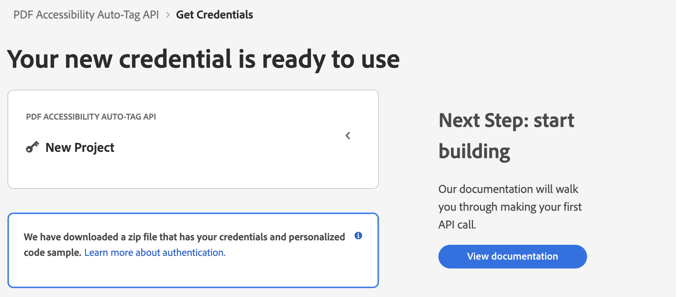

# Quickstart for PDF Accessibility Auto-Tag API (.NET)

To get started using Adobe PDF Accessibility Auto-Tag API, let's walk through a simple scenario - taking an input PDF document and running PDF Accessibility Auto-Tag API against it. Once the PDF has been tagged, we'll provide the document with tags and optionally, a report file. In this guide, we will walk you through the complete process for creating a program that will accomplish this task.

## Prerequisites

To complete this guide, you will need:

* [.NET: version 6.0 or above](https://dotnet.microsoft.com/en-us/download)
* [.Net SDK](https://dotnet.microsoft.com/en-us/download/dotnet/6.0)
* A build tool: Either Visual Studio or .NET Core CLI.
* An Adobe ID. If you do not have one, the credential setup will walk you through creating one.
* A way to edit code. No specific editor is required for this guide.
  
## Step One: Getting credentials

1) To begin, open your browser to <https://acrobatservices.adobe.com/dc-integration-creation-app-cdn/main.html?api=pdf-accessibility-auto-tag-api>. If you are not already logged in to Adobe.com, you will need to sign in or create a new user. Using a personal email account is recommend and not a federated ID.


2) After registering or logging in, you will then be asked to name your new credentials. Use the name, "New Project". 

3) Change the "Choose language" setting to ".Net". 

4) Also note the checkbox by, "Create personalized code sample." This will include a large set of samples along with your credentials. These can be helpful for learning more later. 

5) Click the checkbox saying you agree to the developer terms and then click "Create credentials."


6) After your credentials are created, they are automatically  downloaded:



## Step Two: Setting up the project

1) In your Downloads folder, find the ZIP file with your credentials: PDFServicesSDK-.NetSamples.zip. If you unzip that archive, you will find a folder of samples and the `pdfservices-api-credentials.json` file.


2) Take the `pdfservices-api-credentials.json` file and place it in a new directory.

3) In your new directory, create a new file, `AutotagPDF.csproj`. This file will declare our requirements as well as help define the application we're creating.

```xml
<Project Sdk="Microsoft.NET.Sdk">

    <PropertyGroup>
        <OutputType>Exe</OutputType>
        <TargetFramework>netcoreapp3.1</TargetFramework>
    </PropertyGroup>

    <ItemGroup>
        <PackageReference Include="log4net" Version="2.0.12" />
        <PackageReference Include="Adobe.PDFServicesSDK" Version="3.4.0" />
    </ItemGroup>

    <ItemGroup>
        <None Update="Adobe Accessibility Auto-Tag API Sample.pdf">
            <CopyToOutputDirectory>Always</CopyToOutputDirectory>
        </None>
        <None Update="log4net.config">
            <CopyToOutputDirectory>Always</CopyToOutputDirectory>
        </None>
    </ItemGroup>

</Project>
```

Our application will take a PDF, `Adobe Accesibility Auto-Tag API Sample.pdf` (downloadable from <a href="../../../../overview/pdf/Adobe_Accessibility_Auto_Tag_API_Sample.pdf" target="_blank">here</a>) and tag its contents. The results will be saved in a given directory `/output/AutotagPDF`.

4) In your editor, open the directory where you previously copied the credentials and created the `csproj` file. Create a new file, `Program.cs`. 

Now you're ready to begin coding.

## Step Three: Creating the application

1) We'll begin by including our required dependencies:

```javascript
using System;
using System.IO;
using log4net;
using log4net.Config;
using System.Reflection;
using Adobe.PDFServicesSDK;
using log4net.Repository;
using Adobe.PDFServicesSDK.auth;
using Adobe.PDFServicesSDK.io;
using Adobe.PDFServicesSDK.exception;
using Adobe.PDFServicesSDK.io.autotag;
using Adobe.PDFServicesSDK.pdfops;
```

2) Now let's define our main class and `Main` method:

```javascript
namespace AutotagPDF
{
    class Program
    {
        private static readonly ILog log = LogManager.GetLogger(typeof(Program));
        static void Main()
        {
		}
	}
}
```

3) Now let's define our input and output:

```javascript
String inputPDF = "./Adobe Accessibility Auto-Tag API Sample.pdf";

String outputPath = "./output/AutotagPDF/";
if(File.Exists(Directory.GetCurrentDirectory() + output))
{
	File.Delete(Directory.GetCurrentDirectory() + output);
}
String taggedPDF = outputPath + inputPDF +"-tagged-pdf.pdf";
String taggingReport = outputPath + inputPDF + "-tagging-report.xlsx";
```

This defines what our output directory will be and optionally deletes it if it already exists. Then we define what PDF will be tagged. (You can download the source we used <a href="../../../../overview/pdf/Adobe_Accessibility_Auto_Tag_API_Sample.pdf" target="_blank">here</a>.) In a real application, these values would be typically be dynamic.

4) Set the environment variables `PDF_SERVICES_CLIENT_ID` and `PDF_SERVICES_CLIENT_SECRET` by running the following commands and replacing placeholders `YOUR CLIENT ID` and `YOUR CLIENT SECRET` with the credentials present in `pdfservices-api-credentials.json` file:
- **Windows:**
  - `set PDF_SERVICES_CLIENT_ID=<YOUR CLIENT ID>`
  - `set PDF_SERVICES_CLIENT_SECRET=<YOUR CLIENT SECRET>`

- **MacOS/Linux:**
  - `export PDF_SERVICES_CLIENT_ID=<YOUR CLIENT ID>`
  - `export PDF_SERVICES_CLIENT_SECRET=<YOUR CLIENT SECRET>`

5) Next, we setup the SDK to use our credentials.

```javascript
// Initial setup, create credentials instance.
Credentials credentials = Credentials.ServicePrincipalCredentialsBuilder()
        .WithClientId(Environment.GetEnvironmentVariable("PDF_SERVICES_CLIENT_ID"))
        .WithClientSecret(Environment.GetEnvironmentVariable("PDF_SERVICES_CLIENT_SECRET"))
        .Build();

// Create an ExecutionContext using credentials and create a new operation instance.
ExecutionContext executionContext = ExecutionContext.Create(credentials);
```

This code both points to the credentials downloaded previously as well as sets up an execution context object that will be used later.

6) Now, let's create the operation:

```javascript
AutotagPDFOperation autotagPDFOperation = AutotagPDFOperation.CreateNew();

// Provide an input FileRef for the operation.
FileRef sourceFileRef = FileRef.CreateFromLocalFile(inputPDF);
autotagPDFOperation.SetInputFile(sourceFileRef);

// Build AutotagPDF options and set them into the operation.
AutotagPDFOptions autotagPDFOptions = AutotagPDFOptions.AutotagPDFOptionsBuilder()
    .ShiftHeadings()
    .GenerateReport()
    .Build();
```

This set of code defines what we're doing (an Auto-Tag operation), points to our local file and specifies the input is a PDF, and then defines options for the Auto-Tag call. PDF Accessibility Auto-Tag API has a few different options, but in this example, we're simply asking for a basic tagging operation, which returns the tagged PDF document and an XLSX report of the document.

7) The next code block executes the operation:

```javascript
// Execute the operation.
FileRef result = autotagPDFOperation.Execute(executionContext);

// Save the result to the specified location.
result.GetTaggedPDF().SaveAs(Directory.GetCurrentDirectory() + taggedPDF);
result.GetReport().SaveAs(Directory.GetCurrentDirectory() + taggingReport);
```

This code runs the Auto-Tagging process and then stores the result files in the provided output directory.


Here's the complete application (`Program.cs`):

```javascript
using System;
using System.IO;
using log4net;
using log4net.Config;
using System.Reflection;
using Adobe.PDFServicesSDK;
using log4net.Repository;
using Adobe.PDFServicesSDK.auth;
using Adobe.PDFServicesSDK.io;
using Adobe.PDFServicesSDK.exception;
using Adobe.PDFServicesSDK.io.autotag;
using Adobe.PDFServicesSDK.pdfops;

namespace AutotagPDF
{
    class Program
    {
        private static readonly ILog log = LogManager.GetLogger(typeof(Program));
        static void Main()
        {
            // Configure the logging.
            ConfigureLogging();
            try
            {

                String inputPDF = "./Adobe Accessibility Auto-Tag API Sample.pdf";

                String outputPath = "./output/AutotagPDF/";
                if(File.Exists(Directory.GetCurrentDirectory() + output))
                {
                    File.Delete(Directory.GetCurrentDirectory() + output);
                }
                String taggedPDF = outputPath + inputPDF +"-tagged-pdf.pdf";
                String taggingReport = outputPath + inputPDF + "-tagging-report.xlsx";

                // Initial setup, create credentials instance.
                Credentials credentials = Credentials.ServicePrincipalCredentialsBuilder()
                    .WithClientId(Environment.GetEnvironmentVariable("PDF_SERVICES_CLIENT_ID"))
                    .WithClientSecret(Environment.GetEnvironmentVariable("PDF_SERVICES_CLIENT_SECRET"))
                    .Build();

                // Create an ExecutionContext using credentials and create a new operation instance.
                ExecutionContext executionContext = ExecutionContext.Create(credentials);
                AutotagPDFOperation autotagPDFOperation = AutotagPDFOperation.CreateNew();

                // Provide an input FileRef for the operation.
                FileRef sourceFileRef = FileRef.CreateFromLocalFile(input);
                autotagPDFOperation.SetInputFile(sourceFileRef);

                // Build AutotagPDF options and set them into the operation.
                AutotagPDFOptions autotagPDFOptions = AutotagPDFOptions.AutotagPDFOptionsBuilder()
                    .ShiftHeadings()
                    .GenerateReport()
                    .Build();

                // Execute the operation.
                AutotagPDFOutput result = autotagPDFOperation.Execute(executionContext);

                // Save the result to the specified location.
                result.GetTaggedPDF().SaveAs(Directory.GetCurrentDirectory() + taggedPDF);
                result.GetReport().SaveAs(Directory.GetCurrentDirectory() + taggingReport);

        		Console.Write("Successfully tagged information in PDF.");
            }
            catch (ServiceUsageException ex)
            {
                log.Error("Exception encountered while executing operation", ex);
            }
            catch (ServiceApiException ex)
            {
                log.Error("Exception encountered while executing operation", ex);
            }
            catch (SDKException ex)
            {
                log.Error("Exception encountered while executing operation", ex);
            }
            catch (IOException ex)
            {
                log.Error("Exception encountered while executing operation", ex);
            }
            catch (Exception ex)
            {
                log.Error("Exception encountered while executing operation", ex);
            }
        }

        static void ConfigureLogging()
        {
            ILoggerRepository logRepository = LogManager.GetRepository(Assembly.GetEntryAssembly());
            XmlConfigurator.Configure(logRepository, new FileInfo("log4net.config"));
        }
    }
}
```

## Next Steps

Now that you've successfully performed your first operation, [review the documentation](https://developer.adobe.com/document-services/docs/overview/pdf-services-api/) for many other examples and reach out on our [forums](https://community.adobe.com/t5/document-services-apis/ct-p/ct-Document-Cloud-SDK) with any questions. Also remember the samples you downloaded while creating your credentials also have many demos.
