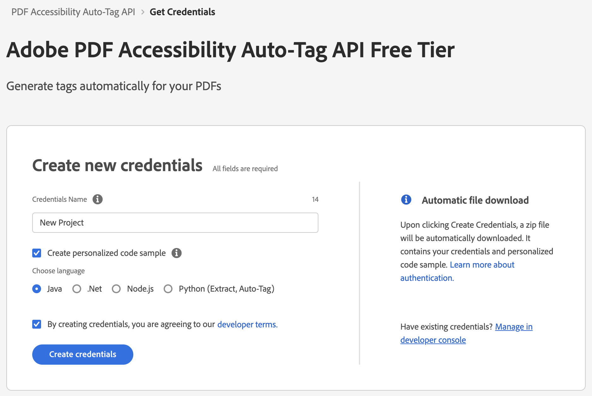
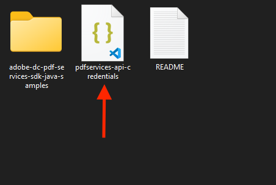
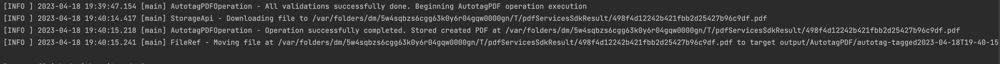

# Quickstart for PDF Accessibility Auto-Tag API (Java)

To get started using Adobe PDF Accessibility Auto-Tag API, let's walk through a simple scenario - taking an input PDF document and running PDF Accessibility Auto-Tag API against it. Once the PDF has been tagged, we'll provide the document with tags and optionally, a report file. In this guide, we will walk you through the complete process for creating a program that will accomplish this task.

## Prerequisites

To complete this guide, you will need:

* [Java](http://www.oracle.com/technetwork/java/javase/downloads/index.html) - Java 8 or higher is required. 
* [Maven](https://maven.apache.org/install.html)
* An Adobe ID. If you do not have one, the credential setup will walk you through creating one.
* A way to edit code. No specific editor is required for this guide.

## Step One: Getting credentials

1) To begin, open your browser to <https://acrobatservices.adobe.com/dc-integration-creation-app-cdn/main.html?api=pdf-accessibility-auto-tag-api>. If you are not already logged in to Adobe.com, you will need to sign in or create a new user. Using a personal email account is recommend and not a federated ID.


2) After registering or logging in, you will then be asked to name your new credentials. Use the name, "New Project". 

3) Change the "Choose language" setting to "Java". 

4) Also note the checkbox by, "Create personalized code sample." This will include a large set of samples along with your credentials. These can be helpful for learning more later. 

5) Click the checkbox saying you agree to the developer terms and then click "Create credentials."



6) After your credentials are created, they are automatically  downloaded:


## Step Two: Setting up the project

1) In your Downloads folder, find the ZIP file with your credentials: PDFServicesSDK-JavaSamples.zip. If you unzip that archive, you will find a folder of samples and the `pdfservices-api-credentials.json` file.



2) Take `pdfservices-api-credentials.json` file and place it in a new directory.

3) In this directory, create a new file named `pom.xml` and copy the following contents:

```xml
<?xml version="1.0" encoding="UTF-8"?>

<project xmlns="http://maven.apache.org/POM/4.0.0"
         xmlns:xsi="http://www.w3.org/2001/XMLSchema-instance"
         xsi:schemaLocation="http://maven.apache.org/POM/4.0.0 http://maven.apache.org/xsd/maven-4.0.0.xsd">
  <modelVersion>4.0.0</modelVersion>

  <groupId>com.adobe.documentservices</groupId>
  <artifactId>pdfservices-sdk-autotag-guide</artifactId>
  <version>1</version>

  <name>PDF Services Java SDK Samples</name>

  <properties>
    <project.build.sourceEncoding>UTF-8</project.build.sourceEncoding>
    <maven.compiler.source>1.8</maven.compiler.source>
    <maven.compiler.target>1.8</maven.compiler.target>
    <pdfservices.sdk.version>3.5.1</pdfservices.sdk.version>
  </properties>

  <dependencies>

    <dependency>
      <groupId>com.adobe.documentservices</groupId>
      <artifactId>pdfservices-sdk</artifactId>
      <version>${pdfservices.sdk.version}</version>
    </dependency>

    <!--		log4j2 dependency to showcase the use of log4j2 with slf4j API-->
    <!-- https://mvnrepository.com/artifact/org.slf4j/slf4j-log4j12 -->
    <dependency>
      <groupId>org.apache.logging.log4j</groupId>
      <artifactId>log4j-slf4j-impl</artifactId>
      <version>2.17.1</version>
    </dependency>
  </dependencies>

  <build>
    <plugins>
      <plugin>
        <groupId>org.apache.maven.plugins</groupId>
        <artifactId>maven-compiler-plugin</artifactId>
        <version>3.8.0</version>
        <configuration>
          <source>${maven.compiler.source}</source>
          <target>${maven.compiler.target}</target>
        </configuration>
      </plugin>
      <plugin>
        <groupId>org.apache.maven.plugins</groupId>
        <artifactId>maven-shade-plugin</artifactId>
        <version>3.2.4</version>
        <configuration>
          <filters>
            <filter>
              <artifact>*:*</artifact>
              <excludes>
                <exclude>META-INF/*.SF</exclude>
                <exclude>META-INF/*.DSA</exclude>
                <exclude>META-INF/*.RSA</exclude>
              </excludes>
            </filter>
          </filters>
        </configuration>
        <executions>
          <execution>
            <phase>package</phase>
            <goals>
              <goal>shade</goal>
            </goals>
          </execution>
        </executions>
      </plugin>
      <plugin>
        <groupId>org.apache.maven.plugins</groupId>
        <artifactId>maven-jar-plugin</artifactId>
        <version>3.0.2</version>
        <configuration>
          <archive>
            <manifest>
              <addClasspath>true</addClasspath>
              <classpathPrefix>lib/</classpathPrefix>
              <mainClass>ExtractTextInfoFromPDF</mainClass>
            </manifest>
          </archive>
        </configuration>
      </plugin>
      <plugin>
        <groupId>org.codehaus.mojo</groupId>
        <artifactId>exec-maven-plugin</artifactId>
        <version>1.5.0</version>
        <executions>
          <execution>
            <goals>
              <goal>java</goal>
            </goals>
          </execution>
        </executions>
      </plugin>
    </plugins>
  </build>
</project>
```

This file will define what dependencies we need and how the application will be built. 

Our application will take a PDF, `Adobe Accesibility Auto-Tag API Sample.pdf` (downloadable from <a href="../../../../overview/pdf/Adobe_Accessibility_Auto_Tag_API_Sample.pdf" target="_blank">here</a>) and tag its contents. The results will be saved in a given directory `/output/AutotagPDF`.

4) In your editor, open the directory where you previously copied the credentials, and create a new directory, `src/main/java`. In that directory, create `AutotagPDF.java`. 

Now you're ready to begin coding.

## Step Three: Creating the application

1) We'll begin by including our required dependencies:

```javascript
import com.adobe.pdfservices.operation.ExecutionContext;
import com.adobe.pdfservices.operation.auth.Credentials;
import com.adobe.pdfservices.operation.exception.SdkException;
import com.adobe.pdfservices.operation.exception.ServiceApiException;
import com.adobe.pdfservices.operation.exception.ServiceUsageException;
import com.adobe.pdfservices.operation.io.FileRef;
import com.adobe.pdfservices.operation.io.autotag.AutotagPDFOutput;
import com.adobe.pdfservices.operation.pdfops.AutotagPDFOperation;
import com.adobe.pdfservices.operation.pdfops.options.autotag.AutotagPDFOptions;
import org.slf4j.Logger;
import org.slf4j.LoggerFactory;

import java.io.IOException;
import java.time.LocalDateTime;
import java.time.format.DateTimeFormatter;
```

2) Now let's define our main class:

```javascript
public class AutotagPDF {

    private static final org.slf4j.Logger LOGGER = LoggerFactory.getLogger(ExtractTextInfoFromPDF.class);

    public static void main(String[] args) {

	}
}
```

3) Now let's define our input and output:

```javascript
String inputFile = "./Adobe Extract API Sample.pdf";

String outputPath = "./output/AutotagPDF/";
Files.deleteIfExists(Paths.get(outputPath));

String taggedPDF = outputPath + inputPDF +"-tagged-pdf.pdf";
String taggingReport = outputPath + inputPDF +"-tagging-report.xlsx";

```

This defines what our output directory will be and optionally deletes it if it already exists. Then we define what PDF will be tagged. (You can download the source we used <a href="../../../../overview/pdf/Adobe_Accessibility_Auto_Tag_API_Sample.pdf" target="_blank">here</a>.) In a real application, these values would be typically be dynamic.

4) Set the environment variables `PDF_SERVICES_CLIENT_ID` and `PDF_SERVICES_CLIENT_SECRET` by running the following commands and replacing placeholders `YOUR CLIENT ID` and `YOUR CLIENT SECRET` with the credentials present in `pdfservices-api-credentials.json` file:
- **Windows:**
  - `set PDF_SERVICES_CLIENT_ID=<YOUR CLIENT ID>`
  - `set PDF_SERVICES_CLIENT_SECRET=<YOUR CLIENT SECRET>`

- **MacOS/Linux:**
  - `export PDF_SERVICES_CLIENT_ID=<YOUR CLIENT ID>`
  - `export PDF_SERVICES_CLIENT_SECRET=<YOUR CLIENT SECRET>`

5) Next, we can create our credentials and use them:

```javascript
// Initial setup, create credentials instance.
Credentials credentials = Credentials.servicePrincipalCredentialsBuilder()
    .withClientId(System.getenv("PDF_SERVICES_CLIENT_ID"))
    .withClientSecret(System.getenv("PDF_SERVICES_CLIENT_SECRET"))
    .build();

// Create an ExecutionContext using credentials.
ExecutionContext executionContext = ExecutionContext.create(credentials);
```

6) Now, let's create the operation:

```javascript
AutotagPDFOperation autotagPDFOperation = AutotagPDFOperation.createNew();

// Build AutotagPDFOptions options and set them into the operation
AutotagPDFOptions autotagPDFOptions = AutotagPDFOptions.autotagPDFOptionsBuilder()
        .shiftHeadings()
        .generateReport()
        .build();
autotagPDFOperation.setOptions(autotagPDFOptions);
```

This set of code defines what we're doing (an Extract operation), points to our local file and specifies the input is a PDF, and then defines options for the Extract call. PDF Extract API has a few different options, but in this example, we're simply asking for the most basic of extractions, the textual content of the document. 

7) The next code block executes the operation:

```javascript
// Execute the operation
AutotagPDFOutput result = autotagPDFOperation.execute(executionContext);

// Save the tagged PDF output at the specified location
autotagPDFOutput.getTaggedPDF().saveAs(taggedPDF);

// Save the tagging report output at the specified location
autotagPDFOutput.getReport().saveAs(taggingReport);
```



Here's the complete application (`src/java/main/ExtractTextInfoFromPDF.java`):

```javascript
import com.adobe.pdfservices.operation.ExecutionContext;
import com.adobe.pdfservices.operation.auth.Credentials;
import com.adobe.pdfservices.operation.exception.SdkException;
import com.adobe.pdfservices.operation.exception.ServiceApiException;
import com.adobe.pdfservices.operation.exception.ServiceUsageException;
import com.adobe.pdfservices.operation.io.FileRef;
import com.adobe.pdfservices.operation.io.autotag.AutotagPDFOutput;
import com.adobe.pdfservices.operation.pdfops.AutotagPDFOperation;
import com.adobe.pdfservices.operation.pdfops.options.autotag.AutotagPDFOptions;
import org.slf4j.Logger;
import org.slf4j.LoggerFactory;

import java.io.IOException;
import java.time.LocalDateTime;
import java.time.format.DateTimeFormatter;

public class AutotagPDF {

    private static final org.slf4j.Logger LOGGER = LoggerFactory.getLogger(AutotagPDF.class);

    public static void main(String[] args) {

        try {

            String inputFile = "./Adobe Extract API Sample.pdf";

            String outputPath = "./output/AutotagPDF/";
            Files.deleteIfExists(Paths.get(outputPath));

            String taggedPDF = outputPath + inputPDF +"-tagged-pdf.pdf";
            String taggingReport = outputPath + inputPDF +"-tagging-report.xlsx";
            
            // Initial setup, create credentials instance.
            Credentials credentials = Credentials.servicePrincipalCredentialsBuilder()
                .withClientId(System.getenv("PDF_SERVICES_CLIENT_ID"))
                .withClientSecret(System.getenv("PDF_SERVICES_CLIENT_SECRET"))
                .build();

            // Create an ExecutionContext using credentials.
            ExecutionContext executionContext = ExecutionContext.create(credentials);

            AutotagPDFOperation autotagPDFOperation = AutotagPDFOperation.createNew();

            // Build AutotagPDFOptions options and set them into the operation
            AutotagPDFOptions autotagPDFOptions = AutotagPDFOptions.autotagPDFOptionsBuilder()
                    .shiftHeadings()
                    .generateReport()
                    .build();
            
            autotagPDFOperation.setOptions(autotagPDFOptions);

            // Execute the operation
            AutotagPDFOutput result = autotagPDFOperation.execute(executionContext);

            // Save the tagged PDF output at the specified location
            autotagPDFOutput.getTaggedPDF().saveAs(taggedPDF);

            // Save the tagging report output at the specified location
            autotagPDFOutput.getReport().saveAs(taggingReport);
            
            LOGGER.info("Successfully tagged information in PDF.");

        } catch (ServiceApiException | IOException | SdkException | ServiceUsageException e) {
            LOGGER.error("Exception encountered while executing operation", e);
        }
    }
}
```

## Next Steps

Now that you've successfully performed your first operation, [review the documentation](https://developer.adobe.com/document-services/docs/overview/pdf-services-api/) for many other examples and reach out on our [forums](https://community.adobe.com/t5/document-services-apis/ct-p/ct-Document-Cloud-SDK) with any questions. Also remember the samples you downloaded while creating your credentials also have many demos.
