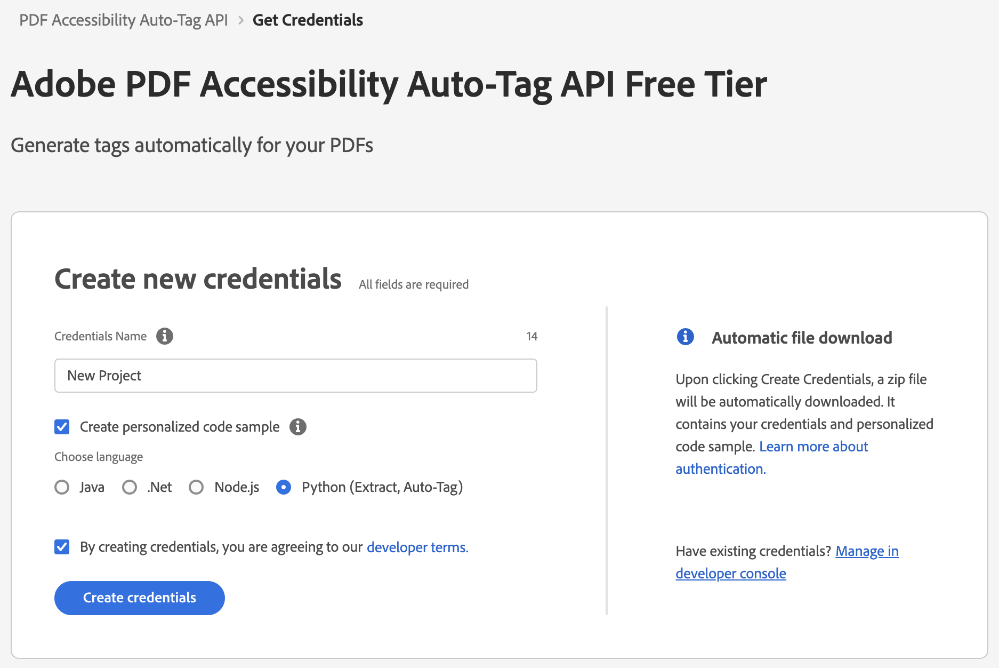
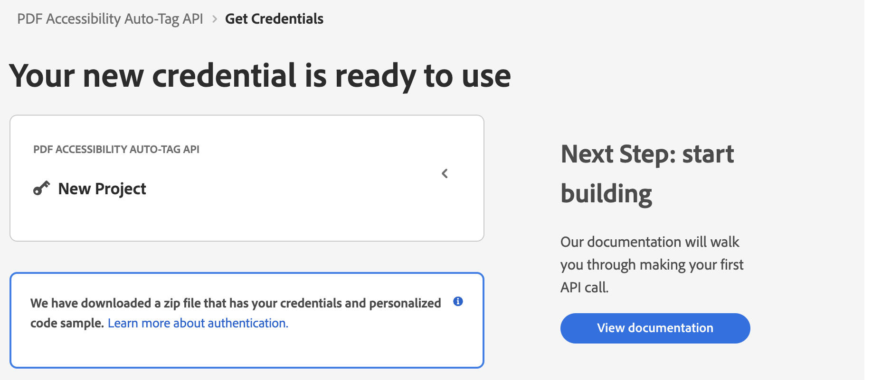
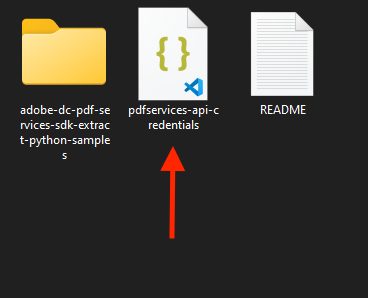
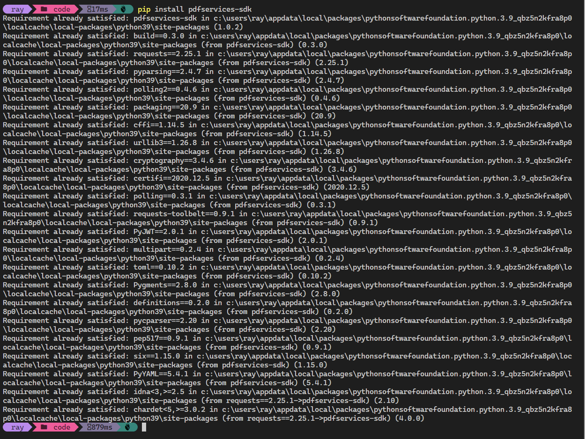

# Getting Started with PDF Accessibility Auto-Tag API (Python)

To get started using Adobe PDF Accessibility Auto-Tag API, let's walk through a simple scenario - taking an input PDF document and running PDF Accessibility Auto-Tag API against it. Once the PDF has been tagged, we'll provide the document with tags and optionally, a report file. In this guide, we will walk you through the complete process for creating a program that will accomplish this task. 

## Prerequisites

To complete this guide, you will need:

* [Python](https://www.python.org/downloads/) - Python 3.6 or higher is required.
* An Adobe ID. If you do not have one, the credential setup will walk you through creating one.
* A way to edit code. No specific editor is required for this guide.


## Step One: Getting credentials

1) To begin, open your browser to <https://acrobatservices.adobe.com/dc-integration-creation-app-cdn/main.html?api=pdf-accessibility-auto-tag-api>. If you are not already logged in to Adobe.com, you will need to sign in or create a new user. Using a personal email account is recommend and not a federated ID.


2) After registering or logging in, you will then be asked to name your new credentials. Use the name, "New Project". 

3) Change the "Choose language" setting to "Python". 

4) Also note the checkbox by, "Create personalized code sample." This will include a large set of samples along with your credentials. These can be helpful for learning more later. 

5) Click the checkbox saying you agree to the developer terms and then click "Create credentials."



6) After your credentials are created, they are automatically downloaded:



## Step Two: Setting up the project

1) In your Downloads folder, find the ZIP file with your credentials: PDFServicesSDK-Python (Extract, Auto-tag)Samples.zip. If you unzip that archive, you will find a folder of samples and the `pdfservices-api-credentials.json` file.



2) Take the `pdfservices-api-credentials.json` file and place it in a new directory.

3) At the command line, change to the directory you created, and run the following command to install the Python SDK: `pip install pdfservices-sdk`.



At this point, we've installed the Python SDK for Adobe PDF Services API as a dependency for our project and have copied over our credentials files.

Our application will take a PDF, `Adobe Accesibility Auto-Tag API Sample.pdf` (downloadable from <a href="../../../../overview/pdf/Adobe_Accessibility_Auto_Tag_API_Sample.pdf" target="_blank">here</a>) and tag its contents. The results will be saved in a given directory `/output/AutotagPDF`. 

4) In your editor, open the directory where you previously copied the credentials. Create a new file, `autotag.py`.

Now you're ready to begin coding.

## Step Three: Creating the application

1) We'll begin by including our required dependencies:

```python
from adobe.pdfservices.operation.auth.credentials import Credentials
from adobe.pdfservices.operation.exception.exceptions import ServiceApiException, ServiceUsageException, SdkException
from adobe.pdfservices.operation.execution_context import ExecutionContext
from adobe.pdfservices.operation.io.file_ref import FileRef
from adobe.pdfservices.operation.pdfops.autotag_pdf_operation import AutotagPDFOperation
from adobe.pdfservices.operation.internal.api.dto.request.autotagpdf.autotag_pdf_output import AutotagPDFOutput

import os.path
from pathlib import Path
```

The first set of imports bring in the Adobe PDF Accessibility Auto-Tag SDK while the second set will be used by our code later on.

2) Now let's define our input and output:

```python
input_pdf = "./Adobe Accessibility Auto-Tag API Sample.pdf"

output_path = "./output/AutotagPDF/"

Path(output_path).mkdir(parents=True, exist_ok=True)
tagged_pdf_path = f'{output_path}{input_pdf}-tagged.pdf'
report_path = f'{output_path}{input_pdf}-report.xlsx'
```

This defines what our output directory will be and optionally deletes it if it already exists. Then we define what PDF will be tagged. (You can download the source we used <a href="../../../../overview/pdf/Adobe_Accessibility_Auto_Tag_API_Sample.pdf" target="_blank">here</a>.) In a real application, these values would be typically be dynamic. 

3) Next, we setup the SDK to use our credentials.

```python
# Initial setup, create credentials instance.
credentials = Credentials.service_principal_credentials_builder()
        .with_client_id(os.getenv('PDF_SERVICES_CLIENT_ID'))
        .with_client_secret(os.getenv('PDF_SERVICES_CLIENT_SECRET'))
        .build();

# Create an ExecutionContext using credentials and create a new operation instance.
execution_context = ExecutionContext.create(credentials)
```

This code both points to the credentials downloaded previously as well as sets up an execution context object that will be used later.

4) Now, let's create the operation:

```python
autotag_pdf_operation = AutotagPDFOperation.create_new()

# Set operation input from a source file.
source = FileRef.create_from_local_file(input_pdf)
autotag_pdf_operation.set_input(source)

# Build AutotagPDF options and set them into the operation
autotag_pdf_options: AutotagPDFOptions = AutotagPDFOptions.builder() \
    .with_generate_report() \
    .build()
autotag_pdf_operation.set_options(autotag_pdf_options)
```

This set of code defines what we're doing (an Auto-Tag operation), points to our local file and specifies the input is a PDF, and then defines options for the Auto-Tag call. PDF Accessibility Auto-Tag API has a few different options, but in this example, we're simply asking for a basic tagging operation, which returns the tagged PDF document and an XLSX report of the document. 

5) The next code block executes the operation:

```python
# Execute the operation.
autotag_pdf_output: AutotagPDFOutput = autotag_pdf_operation.execute(execution_context)

# Save the result to the specified location.
autotag_pdf_output.get_tagged_pdf().save_as(tagged_pdf_path)
autotag_pdf_output.get_report().save_as(report_path)
```

This code runs the Auto-Tagging process and then stores the result files in the provided output directory. 


Here's the complete application (`autotag.py`):

```python
from adobe.pdfservices.operation.auth.credentials import Credentials
from adobe.pdfservices.operation.exception.exceptions import ServiceApiException, ServiceUsageException, SdkException
from adobe.pdfservices.operation.execution_context import ExecutionContext
from adobe.pdfservices.operation.io.file_ref import FileRef
from adobe.pdfservices.operation.pdfops.autotag_pdf_operation import AutotagPDFOperation
from adobe.pdfservices.operation.internal.api.dto.request.autotagpdf.autotag_pdf_output import AutotagPDFOutput

import logging
import os.path
from pathlib import Path

input_pdf = "./Adobe Accessibility Auto-Tag API Sample.pdf"

output_path = "./output/AutotagPDF/"

Path(output_path).mkdir(parents=True, exist_ok=True)
tagged_pdf_path = f'{output_path}{input_pdf}-tagged.pdf'
report_path = f'{output_path}{input_pdf}-report.xlsx'

try:

	# Initial setup, create credentials instance.
    credentials = Credentials.service_principal_credentials_builder()
        .with_client_id(os.getenv('PDF_SERVICES_CLIENT_ID'))
        .with_client_secret(os.getenv('PDF_SERVICES_CLIENT_SECRET'))
        .build();

	# Create an ExecutionContext using credentials and create a new operation instance.
	execution_context = ExecutionContext.create(credentials)
	autotag_pdf_operation = AutotagPDFOperation.create_new()

	# Set operation input from a source file.
	source = FileRef.create_from_local_file(input_pdf)
    autotag_pdf_operation.set_input(source)

	# Build AutotagPDF options and set them into the operation
    autotag_pdf_options: AutotagPDFOptions = AutotagPDFOptions.builder() \
    .with_generate_report() \
    .build()
    autotag_pdf_operation.set_options(autotag_pdf_options)

	# Execute the operation.
	autotag_pdf_output: AutotagPDFOutput = autotag_pdf_operation.execute(execution_context)

	# Save the result to the specified location.
    autotag_pdf_output.get_tagged_pdf().save_as(tagged_pdf_path)
    autotag_pdf_output.get_report().save_as(report_path)

	print("Successfully tagged information in PDF.")
    
except (ServiceApiException, ServiceUsageException, SdkException) as e:
	logging.exception(f"Exception encountered while executing operation : {e}")
```

## Next Steps

Now that you've successfully performed your first operation, [review the documentation](https://developer.adobe.com/document-services/docs/overview/pdf-services-api/) for many other examples and reach out on our [forums](https://community.adobe.com/t5/acrobat-services-api/ct-p/ct-Document-Cloud-SDK?page=1&sort=latest_replies&filter=all&lang=all&tabid=discussions&topics=label-accessibilityauto-tagapi) with any questions. Also remember the samples you downloaded while creating your credentials also have many demos.
