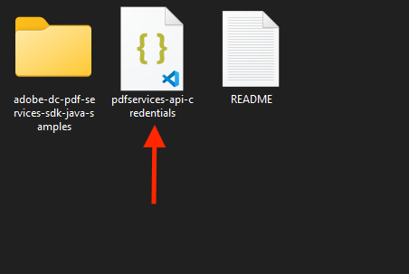

# Quickstart for Adobe PDF Electronic Seal API (Java)

To get started using Adobe PDF Electronic Seal API, let's walk through a simple scenario - Applying an electronic seal on an invoice PDF document. In this guide, we will walk you through the complete process for creating a program that will accomplish this task.

## Prerequisites

To complete this guide, you will need:

* [Java](http://www.oracle.com/technetwork/java/javase/downloads/index.html) - Java 8 or higher is required. 
* [Maven](https://maven.apache.org/install.html)
* An Adobe ID. If you do not have one, the credential setup will walk you through creating one.
* A way to edit code. No specific editor is required for this guide.

## Step One: Getting credentials

1) To begin, open your browser to <https://acrobatservices.adobe.com/dc-integration-creation-app-cdn/main.html?api=pdf-services-api>. If you are not already logged in to Adobe.com, you will need to sign in or create a new user. Using a personal email account is recommended and not a federated ID.


2) After registering or logging in, you will then be asked to name your new credentials. Use the name, "New Project". 

3) Change the "Choose language" setting to "Java". 

4) Also note the checkbox by, "Create personalized code sample." This will include a large set of samples along with your credentials. These can be helpful for learning more later. 

5) Click the checkbox saying you agree to the developer terms and then click "Create credentials."


6) After your credentials are created, they are automatically downloaded:


## Step Two: Setting up the project

1) In your Downloads folder, find the ZIP file with your credentials: PDFServicesSDK-JavaSamples.zip. If you unzip that archive, you will find a folder of samples and the `pdfservices-api-credentials.json` file.



2) Take the `pdfservices-api-credentials.json` and place it in a new directory.

3) In this directory, create a new file named `pom.xml` and copy the following contents:

```xml
<?xml version="1.0" encoding="UTF-8"?>

<project xmlns="http://maven.apache.org/POM/4.0.0"
         xmlns:xsi="http://www.w3.org/2001/XMLSchema-instance"
         xsi:schemaLocation="http://maven.apache.org/POM/4.0.0 http://maven.apache.org/xsd/maven-4.0.0.xsd">
  <modelVersion>4.0.0</modelVersion>

  <groupId>com.adobe.documentservices</groupId>
  <artifactId>pdfservices-sdk-electronicseal-guide</artifactId>
  <version>1</version>

  <name>PDF Services Java SDK Samples</name>

  <properties>
    <project.build.sourceEncoding>UTF-8</project.build.sourceEncoding>
    <maven.compiler.source>1.8</maven.compiler.source>
    <maven.compiler.target>1.8</maven.compiler.target>
    <pdfservices.sdk.version>3.5.1</pdfservices.sdk.version>
  </properties>

  <dependencies>

    <dependency>
      <groupId>com.adobe.documentservices</groupId>
      <artifactId>pdfservices-sdk</artifactId>
      <version>${pdfservices.sdk.version}</version>
    </dependency>

    <!--		log4j2 dependency to showcase the use of log4j2 with slf4j API-->
    <!-- https://mvnrepository.com/artifact/org.slf4j/slf4j-log4j12 -->
    <dependency>
      <groupId>org.apache.logging.log4j</groupId>
      <artifactId>log4j-slf4j-impl</artifactId>
      <version>2.17.1</version>
    </dependency>
  </dependencies>

  <build>
    <plugins>
      <plugin>
        <groupId>org.apache.maven.plugins</groupId>
        <artifactId>maven-compiler-plugin</artifactId>
        <version>3.8.0</version>
        <configuration>
          <source>${maven.compiler.source}</source>
          <target>${maven.compiler.target}</target>
        </configuration>
      </plugin>
      <plugin>
        <groupId>org.apache.maven.plugins</groupId>
        <artifactId>maven-shade-plugin</artifactId>
        <version>3.2.4</version>
        <configuration>
          <filters>
            <filter>
              <artifact>*:*</artifact>
              <excludes>
                <exclude>META-INF/*.SF</exclude>
                <exclude>META-INF/*.DSA</exclude>
                <exclude>META-INF/*.RSA</exclude>
              </excludes>
            </filter>
          </filters>
        </configuration>
        <executions>
          <execution>
            <phase>package</phase>
            <goals>
              <goal>shade</goal>
            </goals>
          </execution>
        </executions>
      </plugin>
      <plugin>
        <groupId>org.apache.maven.plugins</groupId>
        <artifactId>maven-jar-plugin</artifactId>
        <version>3.0.2</version>
        <configuration>
          <archive>
            <manifest>
              <addClasspath>true</addClasspath>
              <classpathPrefix>lib/</classpathPrefix>
              <mainClass>ElectronicSeal</mainClass>
            </manifest>
          </archive>
        </configuration>
      </plugin>
      <plugin>
        <groupId>org.codehaus.mojo</groupId>
        <artifactId>exec-maven-plugin</artifactId>
        <version>1.5.0</version>
        <executions>
          <execution>
            <goals>
              <goal>java</goal>
            </goals>
          </execution>
        </executions>
      </plugin>
    </plugins>
  </build>
</project>
```

This file will define what dependencies we need and how the application will be built. 

Our application will take an Invoice PDF document, `sampleInvoice.pdf` (downloadable from <a href="./sampleInvoice.pdf" target="_blank">here</a>), and will use the sealing options with default appearance options to apply electronic seal over the PDF document by invoking Acrobat Services API and generate an electronically sealed PDF.

4) In your editor, open the directory where you previously copied the credentials, and create a new directory, `src/main/java`. In that directory, create `ElectronicSeal.java`. 

Now you're ready to begin coding.

## Step Three: Creating the application

1) We will begin by including the required dependencies:

```javascript
import com.adobe.pdfservices.operation.ExecutionContext;
import com.adobe.pdfservices.operation.auth.Credentials;
import com.adobe.pdfservices.operation.exception.SdkException;
import com.adobe.pdfservices.operation.exception.ServiceApiException;
import com.adobe.pdfservices.operation.exception.ServiceUsageException;
import com.adobe.pdfservices.operation.io.FileRef;
import com.adobe.pdfservices.operation.pdfops.PDFElectronicSealOperation;
import com.adobe.pdfservices.operation.pdfops.options.electronicseal.FieldLocation;
import com.adobe.pdfservices.operation.pdfops.options.electronicseal.FieldOptions;
import com.adobe.pdfservices.operation.pdfops.options.electronicseal.CSCAuthContext;
import com.adobe.pdfservices.operation.pdfops.options.electronicseal.CertificateCredentials;
import com.adobe.pdfservices.operation.pdfops.options.electronicseal.SealOptions;
import com.adobe.pdfservices.operation.pdfops.options.electronicseal.SignatureFormat;
import com.adobe.pdfservices.operation.pdfops.options.electronicseal.AppearanceOptions;
import com.adobe.pdfservices.operation.pdfops.options.electronicseal.AppearanceItem;
import org.slf4j.Logger;
import org.slf4j.LoggerFactory;
import java.io.IOException;
```


2) Now let's define our main class:

```javascript
public class ElectronicSeal {

    // Initialize the logger.
    private static final Logger LOGGER = LoggerFactory.getLogger(ElectronicSeal.class);

    public static void main(String[] args) {

    }
}
```
3) Set the environment variables `PDF_SERVICES_CLIENT_ID` and `PDF_SERVICES_CLIENT_SECRET` by running the following commands and replacing placeholders `YOUR CLIENT ID` and `YOUR CLIENT SECRET` with the credentials present in `pdfservices-api-credentials.json` file:
- **Windows:**
  - `set PDF_SERVICES_CLIENT_ID=<YOUR CLIENT ID>`
  - `set PDF_SERVICES_CLIENT_SECRET=<YOUR CLIENT SECRET>`

- **MacOS/Linux:**
  - `export PDF_SERVICES_CLIENT_ID=<YOUR CLIENT ID>`
  - `export PDF_SERVICES_CLIENT_SECRET=<YOUR CLIENT SECRET>`


4) Let's create credentials for pdf services and use them:
```javascript
// Initial setup, create credentials instance.
Credentials credentials = Credentials.servicePrincipalCredentialsBuilder()
    .withClientId(System.getenv("PDF_SERVICES_CLIENT_ID"))
    .withClientSecret(System.getenv("PDF_SERVICES_CLIENT_SECRET"))
    .build();

// Create an ExecutionContext using credentials.
ExecutionContext executionContext = ExecutionContext.create(credentials);
```

5) Now, let's define our input fields:

```javascript
//Get the input document to perform the sealing operation
FileRef sourceFile = FileRef.createFromLocalFile("./sampleInvoice.pdf");

//Get the background seal image for signature , if required.
FileRef sealImageFile = FileRef.createFromLocalFile("./sampleSealImage.png");
```
6) Now, we will define the document level permission:

```javascript
// Set the document level permission to be applied for output document
DocumentLevelPermission documentLevelPermission = DocumentLevelPermission.FORM_FILLING;
```

7) Now, we will define seal field options:

```javascript
//Create AppearanceOptions and add the required signature display items to it
AppearanceOptions appearanceOptions = new AppearanceOptions();
appearanceOptions.addItem(AppearanceItem.NAME);
appearanceOptions.addItem(AppearanceItem.LABELS);
appearanceOptions.addItem(AppearanceItem.DATE);
appearanceOptions.addItem(AppearanceItem.SEAL_IMAGE);
appearanceOptions.addItem(AppearanceItem.DISTINGUISHED_NAME);

//Set the Seal Field Name to be created in input PDF document.
String sealFieldName = "Signature1";

//Set the page number in input document for applying seal.
Integer sealPageNumber = 1;

//Set if seal should be visible or invisible.
Boolean sealVisible = true;

//Create FieldLocation instance and set the coordinates for applying signature
FieldLocation fieldLocation = new FieldLocation(150, 250, 350, 200);

//Create FieldOptions instance with required details.
FieldOptions fieldOptions = new FieldOptions.Builder(sealFieldName)
    .setFieldLocation(fieldLocation)
    .setPageNumber(sealPageNumber)
    .setVisible(sealVisible)
    .build();
```


8) Next, we create a CSC Certificate Credentials instance:

```javascript
//Set the name of TSP Provider being used.
String providerName = "<PROVIDER_NAME>";

//Set the access token to be used to access TSP provider hosted APIs.
String accessToken = "<ACCESS_TOKEN>";

//Set the credential ID.
String credentialID = "<CREDENTIAL_ID>";

//Set the PIN generated while creating credentials.
String pin = "<PIN>";

//Create CSCAuthContext instance using access token and token type.
CSCAuthContext cscAuthContext = new CSCAuthContext(accessToken, "Bearer");

//Create CertificateCredentials instance with required certificate details.
CertificateCredentials certificateCredentials = CertificateCredentials.cscCredentialBuilder()
    .withProviderName(providerName)
    .withCredentialID(credentialID)
    .withPin(pin)
    .withCSCAuthContext(cscAuthContext)
    .build();

```

9) Now, let's create the seal options with certificate credentials and field options:

```javascript
//Create SealOptions instance with all the sealing parameters.
SealOptions sealOptions = new SealOptions.Builder(certificateCredentials, fieldOptions)
        .withDocumentLevelPermission(documentLevelPermission)
        .withAppearanceOptions(appearanceOptions).build();
```
10) Now, let's create the operation:

```javascript
//Create the PDFElectronicSealOperation instance using the SealOptions instance
PDFElectronicSealOperation pdfElectronicSealOperation = PDFElectronicSealOperation.createNew(sealOptions);

//Set the input source file for PDFElectronicSealOperation instance
pdfElectronicSealOperation.setInput(sourceFile);

//Set the optional input seal image for PDFElectronicSealOperation instance
pdfElectronicSealOperation.setSealImage(sealImageFile);
```
This code creates a seal operation using seal options, input source file and input seal image.

11) Let's execute this seal operation:

```javascript
//Execute the operation
FileRef result = pdfElectronicSealOperation.execute(executionContext);

//Save the output at specified location
result.saveAs("output/sealedOutput.pdf");
```

Here's the complete application (`src/main/java/ElectronicSeal.java`):

```javascript
import com.adobe.pdfservices.operation.ExecutionContext;
import com.adobe.pdfservices.operation.auth.Credentials;
import com.adobe.pdfservices.operation.exception.SdkException;
import com.adobe.pdfservices.operation.exception.ServiceApiException;
import com.adobe.pdfservices.operation.exception.ServiceUsageException;
import com.adobe.pdfservices.operation.io.FileRef;
import com.adobe.pdfservices.operation.pdfops.PDFElectronicSealOperation;
import com.adobe.pdfservices.operation.pdfops.options.electronicseal.FieldLocation;
import com.adobe.pdfservices.operation.pdfops.options.electronicseal.FieldOptions;
import com.adobe.pdfservices.operation.pdfops.options.electronicseal.CSCAuthContext;
import com.adobe.pdfservices.operation.pdfops.options.electronicseal.CertificateCredentials;
import com.adobe.pdfservices.operation.pdfops.options.electronicseal.SealOptions;
import com.adobe.pdfservices.operation.pdfops.options.electronicseal.SignatureFormat;
import com.adobe.pdfservices.operation.pdfops.options.electronicseal.AppearanceOptions;
import com.adobe.pdfservices.operation.pdfops.options.electronicseal.AppearanceItem;
import org.slf4j.Logger;
import org.slf4j.LoggerFactory;
import java.io.IOException;

/**
 * This sample ElectronicSeal illustrates how to apply electronic seal over the PDF document using custom appearance options.
 *
 * <p>
 * To know more about PDF Electronic Seal, please see the <a href="https://developer.adobe.com/document-services/docs/overview/pdf-electronic-seal-api/" target="_blank">documentation</a>.
 * <p>
 * Refer to README.md for instructions on how to run the samples.
 */
public class ElectronicSeal {

    // Initialize the logger.
    private static final Logger LOGGER = LoggerFactory.getLogger(ElectronicSeal.class);

    public static void main(String[] args) {
        try {
            // Initial setup, create credentials instance.
            Credentials credentials = Credentials.servicePrincipalCredentialsBuilder()
                .withClientId(System.getenv("PDF_SERVICES_CLIENT_ID"))
                .withClientSecret(System.getenv("PDF_SERVICES_CLIENT_SECRET"))
                .build();
        
            // Create an ExecutionContext using credentials.
            ExecutionContext executionContext = ExecutionContext.create(credentials);
        
            //Get the input document to perform the sealing operation
            FileRef sourceFile = FileRef.createFromLocalFile("./sampleInvoice.pdf");
        
            //Get the background seal image for signature , if required.
            FileRef sealImageFile = FileRef.createFromLocalFile("./sampleSealImage.png");

            // Set the document level permission to be applied for output document
            DocumentLevelPermission documentLevelPermission = DocumentLevelPermission.FORM_FILLING;
        
            //Create AppearanceOptions and add the required signature display items to it
            AppearanceOptions appearanceOptions = new AppearanceOptions();
            appearanceOptions.addItem(AppearanceItem.NAME);
            appearanceOptions.addItem(AppearanceItem.LABELS);
            appearanceOptions.addItem(AppearanceItem.DATE);
            appearanceOptions.addItem(AppearanceItem.SEAL_IMAGE);
            appearanceOptions.addItem(AppearanceItem.DISTINGUISHED_NAME);
        
            //Set the Seal Field Name to be created in input PDF document.
            String sealFieldName = "signature1";
        
            //Set the page number in input document for applying seal.
            Integer sealPageNumber = 1;
        
            //Set if seal should be visible or invisible.
            Boolean sealVisible = true;
        
            //Create FieldLocation instance and set the coordinates for applying signature
            FieldLocation fieldLocation = new FieldLocation(150, 250, 350, 200);
        
            //Create FieldOptions instance with required details.
            FieldOptions fieldOptions = new FieldOptions.Builder(sealFieldName)
                .setFieldLocation(fieldLocation)
                .setPageNumber(sealPageNumber)
                .setVisible(sealVisible)
                .build();
        
            //Set the name of TSP Provider being used.
            String providerName = "<PROVIDER_NAME>";
        
            //Set the access token to be used to access TSP provider hosted APIs.
            String accessToken = "<ACCESS_TOKEN>";
        
            //Set the credential ID.
            String credentialID = "<CREDENTIAL_ID>";
        
            //Set the PIN generated while creating credentials.
            String pin = "<PIN>";
        
            //Create CSCAuthContext instance using access token and token type.
            CSCAuthContext cscAuthContext = new CSCAuthContext(accessToken, "Bearer");
        
            //Create CertificateCredentials instance with required certificate details.
            CertificateCredentials certificateCredentials = CertificateCredentials.cscCredentialBuilder()
                .withProviderName(providerName)
                .withCredentialID(credentialID)
                .withPin(pin)
                .withCSCAuthContext(cscAuthContext)
                .build();
        
            //Create SealOptions instance with all the sealing parameters.
            SealOptions sealOptions = new SealOptions.Builder(certificateCredentials, fieldOptions)
                    .withDocumentLevelPermission(documentLevelPermission)
                    .withAppearanceOptions(appearanceOptions).build();
        
            //Create the PDFElectronicSealOperation instance using the SealOptions instance
            PDFElectronicSealOperation pdfElectronicSealOperation = PDFElectronicSealOperation.createNew(sealOptions);
        
            //Set the input source file for PDFElectronicSealOperation instance
            pdfElectronicSealOperation.setInput(sourceFile);
        
            //Set the optional input seal image for PDFElectronicSealOperation instance
            pdfElectronicSealOperation.setSealImage(sealImageFile);
        
            //Execute the operation
            FileRef result = pdfElectronicSealOperation.execute(executionContext);

            //Save the output at specified location
            result.saveAs("output/sealedOutput.pdf");


        } catch (ServiceApiException | IOException | SdkException | ServiceUsageException ex) {
            LOGGER.error("Exception encountered while executing operation", ex);
        }
    }
}
```

## Next Steps

Now that you've successfully performed your first operation, [review the documentation](https://developer.adobe.com/document-services/docs/overview/pdf-services-api/) for many other examples and reach out on our [forums](https://community.adobe.com/t5/document-services-apis/ct-p/ct-Document-Cloud-SDK) with any questions. Also remember the samples you downloaded while creating your credentials also have many demos.
