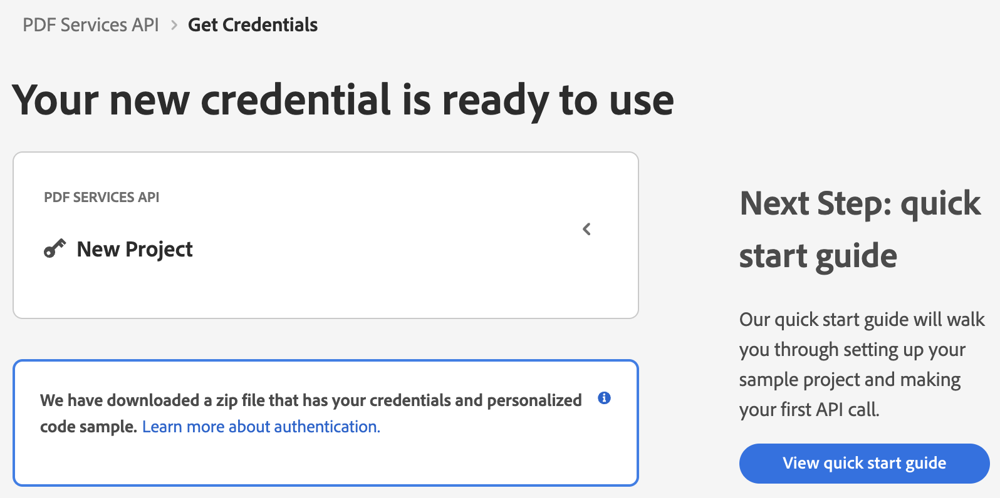
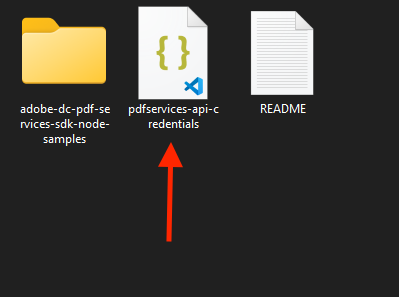
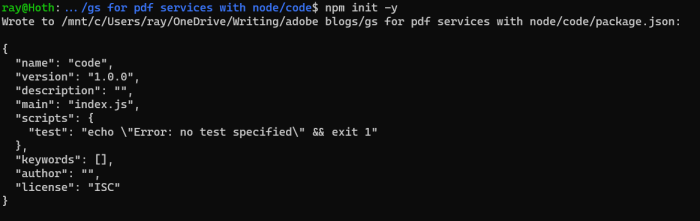

# Quickstart for Adobe PDF Electronic Seal API (Node.js)

To get started using Adobe PDF Electronic Seal API, let's walk through a simple scenario - Applying an electronic seal on an invoice PDF document. In this guide, we will walk you through the complete process for creating a program that will accomplish this task.

## Prerequisites

To complete this guide, you will need:

* [Node.js](https://nodejs.org) - Node.js version 14.0 or higher is required. 
* An Adobe ID. If you do not have one, the credential setup will walk you through creating one.
* A way to edit code. No specific editor is required for this guide.

## Step One: Getting credentials

1) To begin, open your browser to <https://acrobatservices.adobe.com/dc-integration-creation-app-cdn/main.html?api=pdf-services-api>. If you are not already logged in to Adobe.com, you will need to sign in or create a new user. Using a personal email account is recommended and not a federated ID.


2) After registering or logging in, you will then be asked to name your new credentials. Use the name, "New Project". 

3) Change the "Choose language" setting to "Node.js". 

4) Also note the checkbox by, "Create personalized code sample." This will include a large set of samples along with your credentials. These can be helpful for learning more later. 

5) Click the checkbox saying you agree to the developer terms and then click "Create credentials."


6) After your credentials are created, they are automatically downloaded:



## Step Two: Setting up the project

1) In your Downloads folder, find the ZIP file with your credentials: PDFServicesSDK-Node.jsSamples.zip. If you unzip that archive, you will find a folder of samples and the `pdfservices-api-credentials.json` file.



2) Take the `pdfservices-api-credentials.json` and place it in a new directory. Remember that these credential files are important and should be stored safely.

3) At the command line, change to the directory you created, and initialize a new Node.js project with `npm init -y`



4) Install the Adobe PDF Services Node.js SDK by typing `npm install --save @adobe/pdfservices-node-sdk` at the command line.

5) Install a package to help us work with ZIP files. Type `npm install --save adm-zip`.

At this point, we've installed the Node.js SDK for Adobe PDF Services API as a dependency for our project and have copied over our credentials files. 

Our application will take an Invoice PDF document, `sampleInvoice.pdf` (downloadable from <a href="./sampleInvoice.pdf" target="_blank">here</a>), and will use the sealing options with default appearance options to apply electronic seal over the PDF document by invoking Acrobat Services API and generate an electronically sealed PDF.

6) In your editor, open the directory where you previously copied the credentials. Create a new file, `electronic-seal.js`.

Now you're ready to begin coding.

## Step Three: Creating the application

1) We'll begin by including our required dependencies:

```javascript
const PDFServicesSdk = require('@adobe/pdfservices-node-sdk');
```

This line includes the Adobe PDF Services Node.js SDK


2) Set the environment variables `PDF_SERVICES_CLIENT_ID` and `PDF_SERVICES_CLIENT_SECRET` by running the following commands and replacing placeholders `YOUR CLIENT ID` and `YOUR CLIENT SECRET` with the credentials present in `pdfservices-api-credentials.json` file:
- **Windows:**
  - `set PDF_SERVICES_CLIENT_ID=<YOUR CLIENT ID>`
  - `set PDF_SERVICES_CLIENT_SECRET=<YOUR CLIENT SECRET>`

- **MacOS/Linux:**
  - `export PDF_SERVICES_CLIENT_ID=<YOUR CLIENT ID>`
  - `export PDF_SERVICES_CLIENT_SECRET=<YOUR CLIENT SECRET>`


3) Next, we setup the SDK to use our credentials.

```javascript
    // Initial setup, create credentials instance.
const credentials =  PDFServicesSdk.Credentials
    .servicePrincipalCredentialsBuilder()
    .withClientId(process.env.PDF_SERVICES_CLIENT_ID)
    .withClientSecret(process.env.PDF_SERVICES_CLIENT_SECRET)
    .build();

// Create an ExecutionContext using credentials
const executionContext = PDFServicesSdk.ExecutionContext.create(credentials);
```

This code both points to the credentials downloaded previously and sets up an execution context object that will be used later.

4) Let's define the electronic seal and options object to be used later:

```javascript
const pdfElectronicSeal = PDFServicesSdk.PDFElectronicSeal,
    options = pdfElectronicSeal.options;

```

5) Now, let's define our input fields:

```javascript
//Get the input document to perform the sealing operation
const sourceFile = PDFServicesSdk.FileRef.createFromLocalFile('./sampleInvoice.pdf'),

//Get the background seal image for signature , if required.
sealImageFile = PDFServicesSdk.FileRef.createFromLocalFile('./sampleSealImage.png');

```

6) Now, we will define seal field options:

```javascript
//Create AppearanceOptions and add the required signature appearance items
appearanceOptions = new options.AppearanceOptions();
appearanceOptions.addItem(options.AppearanceOptions.AppearanceItem.DATE);
appearanceOptions.addItem(options.AppearanceOptions.AppearanceItem.SEAL_IMAGE);
appearanceOptions.addItem(options.AppearanceOptions.AppearanceItem.NAME);
appearanceOptions.addItem(options.AppearanceOptions.AppearanceItem.LABELS);
appearanceOptions.addItem(options.AppearanceOptions.AppearanceItem.DISTINGUISHED_NAME);

// Set the Seal Field Name to be created in input PDF document.
sealFieldName = "Signature1";

// Set the page number in input document for applying seal.
sealPageNumber = 1;

// Set if seal should be visible or invisible.
sealVisible = true;

//Create FieldLocation instance and set the coordinates for applying signature
fieldLocation = new options.FieldLocation(150,250,350,200);

//Create FieldOptions instance with required details.
fieldOptions = new options.FieldOptions.Builder(sealFieldName)
    .setFieldLocation(fieldLocation)
    .setPageNumber(sealPageNumber)
    .setVisible(sealVisible)
    .build();
```

7) Next, we create a CSC Certificate Credentials instance:

```javascript
//Set the name of TSP Provider being used.
providerName = "<PROVIDER_NAME>";

//Set the access token to be used to access TSP provider hosted APIs.
accessToken = "<ACCESS_TOKEN>";

//Set the credential ID.
credentialID = "<CREDENTIAL_ID>";

//Set the PIN generated while creating credentials.
pin = "<PIN>";

//Create CSCAuthContext instance using access token and token type.
cscAuthContext = new options.CSCAuthContext(accessToken, "Bearer");

//Create CertificateCredentials instance with required certificate details.
certificateCredentials = options.CertificateCredentials.cscCredentialBuilder()
    .withProviderName(providerName)
    .withCredentialID(credentialID)
    .withPin(pin)
    .withCSCAuthContext(cscAuthContext)
    .build();

```

8) Now, let's create the seal options with certificate credentials and field options:

```javascript
    //Create SealOptions instance with sealing parameters.
sealOptions = new options.SealOptions.Builder(certificateCredentials, fieldOptions)
    .withAppearanceOptions(appearanceOptions)
    .build()
```


9) Now, let's create the operation:

```javascript
//Create the PDFElectronicSealOperation instance using the SealOptions instance
const pdfElectronicSealOperation = pdfElectronicSeal.Operation.createNew(sealOptions);

//Set the input source file for PDFElectronicSealOperation instance
pdfElectronicSealOperation.setInput(sourceFile);

//Set the optional input seal image for PDFElectronicSealOperation instance
pdfElectronicSealOperation.setSealImage(sealImageFile);

```
This code creates a seal operation using sealOptions, input source file and input seal image.

10) Let's execute this seal operation:

```javascript
// Execute the operation and Save the result to the specified location.
pdfElectronicSealOperation.execute(executionContext)
    .then(result => result.saveAsFile("output/sealedOutput.pdf"))
    .catch(err => {
        if(err instanceof PDFServicesSdk.Error.ServiceApiError
            || err instanceof PDFServicesSdk.Error.ServiceUsageError) {
            console.log('Exception encountered while executing operation', err);
        } else {
            console.log('Exception encountered while executing operation', err);
        }
    });
```

Here's the complete application (`electronic-seal.js`):

```javascript
/*
 * Copyright 2023 Adobe
 * All Rights Reserved.
 *
 * NOTICE: Adobe permits you to use, modify, and distribute this file in
 * accordance with the terms of the Adobe license agreement accompanying
 * it. If you have received this file from a source other than Adobe,
 * then your use, modification, or distribution of it requires the prior
 * written permission of Adobe.
 */

const PDFServicesSdk = require('@adobe/pdfservices-node-sdk');

/**
 * This sample illustrates how to apply electronic seal over the PDF document using custom appearance options.
 *
 * <p>
 * To know more about PDF Electronic Seal, please see the <<a href="https://www.adobe.com/go/dc_eseal_overview_doc" target="_blank">documentation</a>.
 * <p>
 * Refer to README.md for instructions on how to run the samples.
 */
try {
    // Initial setup, create credentials instance.
    const credentials =  PDFServicesSdk.Credentials
        .servicePrincipalCredentialsBuilder()
        .withClientId(process.env.PDF_SERVICES_CLIENT_ID)
        .withClientSecret(process.env.PDF_SERVICES_CLIENT_SECRET)
        .build();

    // Create an ExecutionContext using credentials
    const executionContext = PDFServicesSdk.ExecutionContext.create(credentials);

    const pdfElectronicSeal = PDFServicesSdk.PDFElectronicSeal,
        options = pdfElectronicSeal.options;

    //Get the input document to perform the sealing operation
    const sourceFile = PDFServicesSdk.FileRef.createFromLocalFile('./sampleInvoice.pdf'),

        //Get the background seal image for signature , if required.
        sealImageFile = PDFServicesSdk.FileRef.createFromLocalFile('./sampleSealImage.png');

    //Create AppearanceOptions and add the required signature appearance items
    appearanceOptions = new options.AppearanceOptions();
    appearanceOptions.addItem(options.AppearanceOptions.AppearanceItem.DATE);
    appearanceOptions.addItem(options.AppearanceOptions.AppearanceItem.SEAL_IMAGE);
    appearanceOptions.addItem(options.AppearanceOptions.AppearanceItem.NAME);
    appearanceOptions.addItem(options.AppearanceOptions.AppearanceItem.LABELS);
    appearanceOptions.addItem(options.AppearanceOptions.AppearanceItem.DISTINGUISHED_NAME);

    // Set the Seal Field Name to be created in input PDF document.
    sealFieldName = "Signature1";

    // Set the page number in input document for applying seal.
    sealPageNumber = 1;

    // Set if seal should be visible or invisible.
    sealVisible = true;

    //Create FieldLocation instance and set the coordinates for applying signature
    fieldLocation = new options.FieldLocation(150,250,350,200);

    //Create FieldOptions instance with required details.
    fieldOptions = new options.FieldOptions.Builder(sealFieldName)
        .setFieldLocation(fieldLocation)
        .setPageNumber(sealPageNumber)
        .setVisible(sealVisible)
        .build();

    //Set the name of TSP Provider being used.
    providerName = "<PROVIDER_NAME>";

    //Set the access token to be used to access TSP provider hosted APIs.
    accessToken = "<ACCESS_TOKEN>";

    //Set the credential ID.
    credentialID = "<CREDENTIAL_ID>";

    //Set the PIN generated while creating credentials.
    pin = "<PIN>";

    //Create CSCAuthContext instance using access token and token type.
    cscAuthContext = new options.CSCAuthContext(accessToken, "Bearer");

    //Create CertificateCredentials instance with required certificate details.
    certificateCredentials = options.CertificateCredentials.cscCredentialBuilder()
        .withProviderName(providerName)
        .withCredentialID(credentialID)
        .withPin(pin)
        .withCSCAuthContext(cscAuthContext)
        .build();

    //Create SealOptions instance with sealing parameters.
    sealOptions = new options.SealOptions.Builder(certificateCredentials, fieldOptions)
        .withAppearanceOptions(appearanceOptions)
        .build()

    //Create the PDFElectronicSealOperation instance using the SealOptions instance
    const pdfElectronicSealOperation = pdfElectronicSeal.Operation.createNew(sealOptions);

    //Set the input source file for PDFElectronicSealOperation instance
    pdfElectronicSealOperation.setInput(sourceFile);

    //Set the optional input seal image for PDFElectronicSealOperation instance
    pdfElectronicSealOperation.setSealImage(sealImageFile);

    // Execute the operation and Save the result to the specified location.
    pdfElectronicSealOperation.execute(executionContext)
        .then(result => result.saveAsFile("output/sealedOutput.pdf"))
        .catch(err => {
            if(err instanceof PDFServicesSdk.Error.ServiceApiError
                || err instanceof PDFServicesSdk.Error.ServiceUsageError) {
                console.log('Exception encountered while executing operation', err);
            } else {
                console.log('Exception encountered while executing operation', err);
            }
        });

} catch (err) {
    console.log('Exception encountered while executing operation', err);
}

```

## Next Steps

Now that you've successfully performed your first operation, [review the documentation](https://developer.adobe.com/document-services/docs/overview/pdf-services-api/) for many other examples and reach out on our [forums](https://community.adobe.com/t5/document-services-apis/ct-p/ct-Document-Cloud-SDK) with any questions. Also remember the samples you downloaded while creating your credentials also have many demos.
