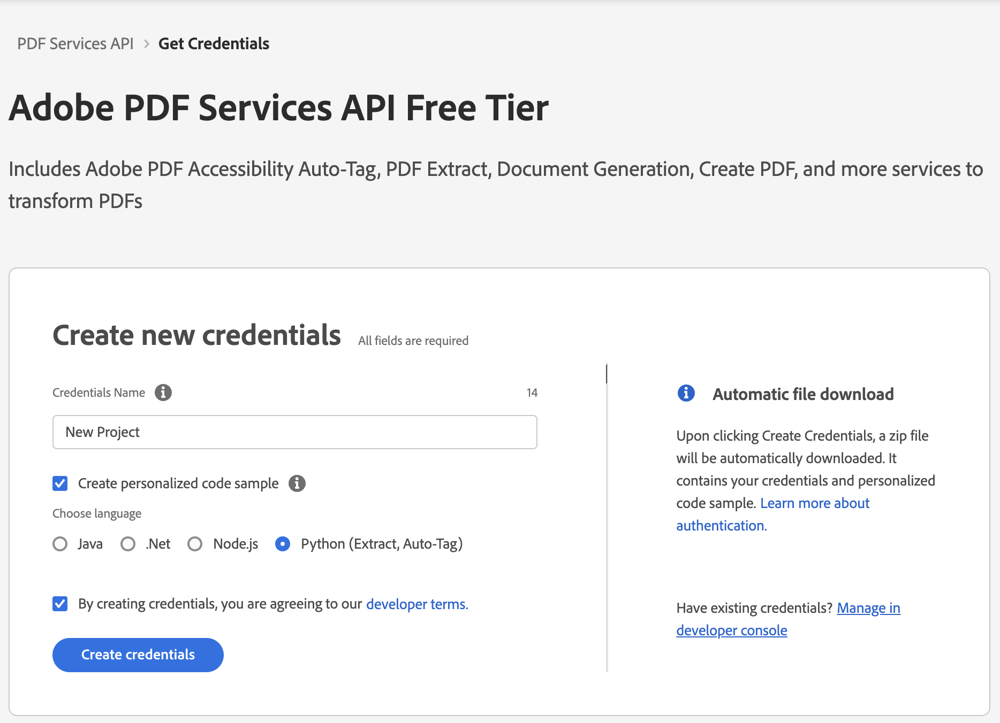
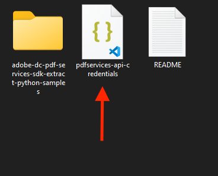
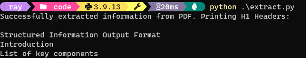

# Getting Started with PDF Extract API (Python)

To get started using Adobe PDF Extract API, let's walk through a simple scenario - taking an input PDF document and running PDF Extract API against it. Once the PDF has been extracted, we'll parse the results and report on any major headers in the document. In this guide, we will walk you through the complete process for creating a program that will accomplish this task. 

## Prerequisites

To complete this guide, you will need:

* [Python](https://www.python.org/downloads/) - Python 3.6 or higher is required.
* An Adobe ID. If you do not have one, the credential setup will walk you through creating one.
* A way to edit code. No specific editor is required for this guide.


## Step One: Getting credentials

1) To begin, open your browser to <https://acrobatservices.adobe.com/dc-integration-creation-app-cdn/main.html?api=pdf-extract-api>. If you are not already logged in to Adobe.com, you will need to sign in or create a new user. Using a personal email account is recommend and not a federated ID.


2) After registering or logging in, you will then be asked to name your new credentials. Use the name, "New Project". 

3) Change the "Choose language" setting to "Python". 

4) Also note the checkbox by, "Create personalized code sample." This will include a large set of samples along with your credentials. These can be helpful for learning more later. 

5) Click the checkbox saying you agree to the developer terms and then click "Create credentials."



6) After your credentials are created, they are automatically  downloaded:


## Step Two: Setting up the project

1) In your Downloads folder, find the ZIP file with your credentials: PDFServicesSDK-Python (Extract)Samples.zip. If you unzip that archive, you will find a README file, a folder of samples and the `pdfservices-api-credentials.json` file.



2) Take the `pdfservices-api-credentials.json` file and place it in a new directory.

3) At the command line, change to the directory you created, and run the following command to install the Python SDK: `pip install pdfservices-sdk`.


At this point, we've installed the Python SDK for Adobe PDF Services API as a dependency for our project and have copied over our credentials files.

Our application will take a PDF, `Adobe Extract API Sample.pdf` (downloadable from [here](/Adobe%20Extract%20API%20Sample.pdf) and extract it's contents. The results will be saved as a ZIP file, `ExtractTextInfoFromPDF.zip`. We will then parse the results from the ZIP and print out the text of any `H1` headers found in the PDF.

4) In your editor, open the directory where you previously copied the credentials. Create a new file, `extract.py`.

Now you're ready to begin coding.

## Step Three: Creating the application

1) We'll begin by including our required dependencies:

```python
from adobe.pdfservices.operation.auth.credentials import Credentials
from adobe.pdfservices.operation.exception.exceptions import ServiceApiException, ServiceUsageException, SdkException
from adobe.pdfservices.operation.execution_context import ExecutionContext
from adobe.pdfservices.operation.io.file_ref import FileRef
from adobe.pdfservices.operation.pdfops.extract_pdf_operation import ExtractPDFOperation
from adobe.pdfservices.operation.pdfops.options.extractpdf.extract_pdf_options import ExtractPDFOptions
from adobe.pdfservices.operation.pdfops.options.extractpdf.extract_element_type import ExtractElementType

import os.path
import zipfile
import json
```

The first set of imports bring in the Adobe PDF Extract SDK while the second set will be used by our code later on.

2) Now let's define our input and output:

```python
zip_file = "./ExtractTextInfoFromPDF.zip"

if os.path.isfile(zip_file):
	os.remove(zip_file)

input_pdf = "./Adobe Extract API Sample.pdf"
```

This defines what our output ZIP will be and optionally deletes it if it already exists. Then we define what PDF will be extracted. (You can download the source we used [here](/Adobe%20Extract%20API%20Sample.pdf).) In a real application, these values would be typically be dynamic. 

3) Next, we setup the SDK to use our credentials.

```python
#Initial setup, create credentials instance.
credentials = Credentials.service_principal_credentials_builder()
    .with_client_id(os.getenv('PDF_SERVICES_CLIENT_ID'))
    .with_client_secret(os.getenv('PDF_SERVICES_CLIENT_SECRET'))
    .build();

#Create an ExecutionContext using credentials and create a new operation instance.
execution_context = ExecutionContext.create(credentials)
```

This code both points to the credentials downloaded previously as well as sets up an execution context object that will be used later.

4) Now, let's create the operation:

```python
extract_pdf_operation = ExtractPDFOperation.create_new()

#Set operation input from a source file.
source = FileRef.create_from_local_file(input_pdf)
extract_pdf_operation.set_input(source)

#Build ExtractPDF options and set them into the operation
extract_pdf_options: ExtractPDFOptions = ExtractPDFOptions.builder() \
	.with_element_to_extract(ExtractElementType.TEXT) \
	.build()
extract_pdf_operation.set_options(extract_pdf_options)
```

This set of code defines what we're doing (an Extract operation), points to our local file and specifies the input is a PDF, and then defines options for the Extract call. PDF Extract API has a few different options, but in this example, we're simply asking for the most basic of extractions, the textual content of the document. 

5) The next code block executes the operation:

```python
#Execute the operation.
result: FileRef = extract_pdf_operation.execute(execution_context)

#Save the result to the specified location.
result.save_as(zip_file)
```

This code runs the Extraction process and then stores the result zip to the file system. 

6) In this block, we read in the ZIP file, extract the JSON result file, and parse it:

```python
archive = zipfile.ZipFile(zip_file, 'r')
jsonentry = archive.open('structuredData.json')
jsondata = jsonentry.read()
data = json.loads(jsondata)
```

7) Finally we can loop over the result and print out any found element that is an `H1`:

```python
for element in data["elements"]:
	if(element["Path"].endswith("/H1")):
		print(element["Text"])
```



Here's the complete application (`extract.py`):

```python
from adobe.pdfservices.operation.auth.credentials import Credentials
from adobe.pdfservices.operation.exception.exceptions import ServiceApiException, ServiceUsageException, SdkException
from adobe.pdfservices.operation.execution_context import ExecutionContext
from adobe.pdfservices.operation.io.file_ref import FileRef
from adobe.pdfservices.operation.pdfops.extract_pdf_operation import ExtractPDFOperation
from adobe.pdfservices.operation.pdfops.options.extractpdf.extract_pdf_options import ExtractPDFOptions
from adobe.pdfservices.operation.pdfops.options.extractpdf.extract_element_type import ExtractElementType

import os.path
import zipfile
import json

zip_file = "./ExtractTextInfoFromPDF.zip"

if os.path.isfile(zip_file):
	os.remove(zip_file)

input_pdf = "./Adobe Extract API Sample.pdf"

try:

	#Initial setup, create credentials instance.
    credentials = Credentials.service_principal_credentials_builder()
        .with_client_id(os.getenv('PDF_SERVICES_CLIENT_ID'))
        .with_client_secret(os.getenv('PDF_SERVICES_CLIENT_SECRET'))
        .build();

	#Create an ExecutionContext using credentials and create a new operation instance.
	execution_context = ExecutionContext.create(credentials)
	extract_pdf_operation = ExtractPDFOperation.create_new()

	#Set operation input from a source file.
	source = FileRef.create_from_local_file(input_pdf)
	extract_pdf_operation.set_input(source)

	#Build ExtractPDF options and set them into the operation
	extract_pdf_options: ExtractPDFOptions = ExtractPDFOptions.builder() \
		.with_element_to_extract(ExtractElementType.TEXT) \
		.build()
	extract_pdf_operation.set_options(extract_pdf_options)

	#Execute the operation.
	result: FileRef = extract_pdf_operation.execute(execution_context)

	#Save the result to the specified location.
	result.save_as(zip_file)

	print("Successfully extracted information from PDF. Printing H1 Headers:\n");

	archive = zipfile.ZipFile(zip_file, 'r')
	jsonentry = archive.open('structuredData.json')
	jsondata = jsonentry.read()
	data = json.loads(jsondata)
	for element in data["elements"]:
		if(element["Path"].endswith("/H1")):
			print(element["Text"])

except (ServiceApiException, ServiceUsageException, SdkException):
	logging.exception("Exception encountered while executing operation")
```

## Next Steps

Now that you've successfully performed your first operation, [review the documentation](https://developer.adobe.com/document-services/docs/overview/pdf-services-api/) for many other examples and reach out on our [forums](https://community.adobe.com/t5/document-services-apis/ct-p/ct-Document-Cloud-SDK?page=1&sort=latest_replies&filter=all&lang=all&tabid=discussions&topics=label-documentgenerationapi) with any questions. Also remember the samples you downloaded while creating your credentials also have many demos.
