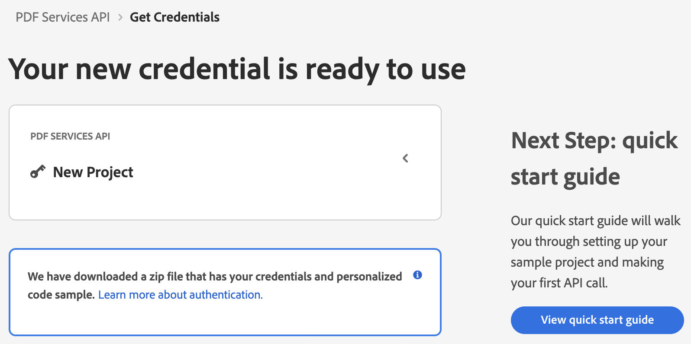

# Quickstart for Adobe PDF Services API (.NET)

To get started using Adobe PDF Services API, let's walk through a simple scenario - taking an input PDF document and exporting it to Microsoft Word. In this guide, we will walk you through the complete process for creating a program that will accomplish this task. 

## Prerequisites

To complete this guide, you will need:

* [.NET: version 6.0 or above](https://dotnet.microsoft.com/en-us/download)
* [.Net SDK](https://dotnet.microsoft.com/en-us/download/dotnet/6.0)
* A build tool: Either Visual Studio or .NET Core CLI.
* An Adobe ID. If you do not have one, the credential setup will walk you through creating one.
* A way to edit code. No specific editor is required for this guide.
  
## Step One: Getting credentials

1) To begin, open your browser to <https://acrobatservices.adobe.com/dc-integration-creation-app-cdn/main.html?api=pdf-services-api>. If you are not already logged in to Adobe.com, you will need to sign in or create a new user. Using a personal email account is recommend and not a federated ID.


2) After registering or logging in, you will then be asked to name your new credentials. Use the name, "New Project". 

3) Change the "Choose language" setting to ".Net". 

4) Also note the checkbox by, "Create personalized code sample." This will include a large set of samples along with your credentials. These can be helpful for learning more later. 

5) Click the checkbox saying you agree to the developer terms and then click "Create credentials."


6) After your credentials are created, they are automatically  downloaded:



## Step Two: Setting up the project

1) In your Downloads folder, find the ZIP file with your credentials: PDFServicesSDK-.NetSamples.zip. If you unzip that archive, you will find a folder of samples and the `pdfservices-api-credentials.json` file.


2) Take the `pdfservices-api-credentials.json` file and place it in a new directory.

3) In your new directory, create a new file, `ExportPDFToWord.csproj`. This file will declare our requirements as well as help define the application we're creating.

```xml
<Project Sdk="Microsoft.NET.Sdk">

    <PropertyGroup>
        <OutputType>Exe</OutputType>
        <TargetFramework>netcoreapp3.1</TargetFramework>
    </PropertyGroup>

    <ItemGroup>
        <PackageReference Include="log4net" Version="2.0.12" />
        <PackageReference Include="Adobe.PDFServicesSDK" Version="3.4.0" />
    </ItemGroup>

    <ItemGroup>
        <None Update="extractPDFInput.pdf">
            <CopyToOutputDirectory>Always</CopyToOutputDirectory>
        </None>
        <None Update="log4net.config">
            <CopyToOutputDirectory>Always</CopyToOutputDirectory>
        </None>
    </ItemGroup>

</Project>
```

Our application will take a PDF, `Bodea Brochure.pdf` (downloadable from <a href="https://documentcloud.adobe.com/view-sdk-demo/PDFs/Bodea Brochure.pdf">here</a>) and convert it to a Microsoft Word document, `Bodea Brochure.docx`.

4) In your editor, open the directory where you previously copied the credentials and created the `csproj` file. Create a new file, `Program.cs`. 

Now you're ready to begin coding.

## Step Three: Creating the application

1) We'll begin by including our required dependencies:

```javascript
using System.IO;
using System;
using System.Collections.Generic;
using log4net.Repository;
using log4net.Config;
using log4net;
using System.Reflection;
using Adobe.PDFServicesSDK;
using Adobe.PDFServicesSDK.auth;
using Adobe.PDFServicesSDK.pdfops;
using Adobe.PDFServicesSDK.options.exportpdf;
using Adobe.PDFServicesSDK.io;
using Adobe.PDFServicesSDK.exception;
```

2) Now let's define our main class and `Main` method:

```javascript
namespace ExportPDFToWord
{
    class Program
    {
        private static readonly ILog log = LogManager.GetLogger(typeof(Program));
        static void Main()
        {
		}
	}
}
```

3) Inside our class, we'll begin by defining our input PDF and output filenames. If the output file already exists, it will be deleted:

```javascript
String input = "./Bodea Brochure.pdf";

String output = "./Bodea Brochure.docx";
if(File.Exists(Directory.GetCurrentDirectory() + output))
{
	File.Delete(Directory.GetCurrentDirectory() + output);
}

Console.Write("Exporting "+ input + " to " + output + "\n");
```

4) Set the environment variables `CLIENT_ID` and `CLIET_SECRET` by running the following commands and replacing placeholders `YOUR CLIENT ID` and `YOUR CLIENT SECRET` with the credentials present in `pdfservices-api-credentials.json` file:
- **Windows:**
    - `set PDF_SERVICES_CLIENT_ID=<YOUR CLIENT ID>`
    - `set PDF_SERVICES_CLIENT_SECRET=<YOUR CLIENT SECRET>`

- **MacOS/Linux:**
    - `export PDF_SERVICES_CLIENT_ID=<YOUR CLIENT ID>`
    - `export PDF_SERVICES_CLIENT_SECRET=<YOUR CLIENT SECRET>`

5) Next, we setup the SDK to use our credentials.

```javascript
// Initial setup, create credentials instance.
Credentials credentials = Credentials.ServicePrincipalCredentialsBuilder()
        .WithClientId(Environment.GetEnvironmentVariable("PDF_SERVICES_CLIENT_ID"))
        .WithClientSecret(Environment.GetEnvironmentVariable("PDF_SERVICES_CLIENT_SECRET"))
        .Build();

// Create an ExecutionContext using credentials and create a new operation instance.
ExecutionContext executionContext = ExecutionContext.Create(credentials);
```

This code both points to the credentials downloaded previously as well as sets up an execution context object that will be used later.

6) Now, let's create the operation:

```javascript
ExportPDFOperation exportPdfOperation = ExportPDFOperation.CreateNew(ExportPDFTargetFormat.DOCX);

// Provide an input FileRef for the operation.
FileRef sourceFileRef = FileRef.CreateFromLocalFile(input);
exportPdfOperation.SetInput(sourceFileRef);
```

This set of code defines what we're doing (an Export operation), points to our local file and specifies the input is a PDF, and then defines options for the Export call. In this example, the only option is the export format, DOCX.

6) The next code block executes the operation:

```javascript
// Execute the operation.
FileRef result = exportPdfOperation.Execute(executionContext);

// Save the result to the specified location.
result.SaveAs(Directory.GetCurrentDirectory() + output);
```

This code runs the Extraction process and then stores the result Word document to the file system. 


Here's the complete application (`Program.cs`):

```javascript
using System.IO;
using System;
using System.Collections.Generic;
using log4net.Repository;
using log4net.Config;
using log4net;
using System.Reflection;
using Adobe.PDFServicesSDK;
using Adobe.PDFServicesSDK.auth;
using Adobe.PDFServicesSDK.pdfops;
using Adobe.PDFServicesSDK.options.exportpdf;
using Adobe.PDFServicesSDK.io;
using Adobe.PDFServicesSDK.exception;

namespace ExportPDFToWord
{
    class Program
    {
        private static readonly ILog log = LogManager.GetLogger(typeof(Program));
        static void Main()
        {
            // Configure the logging.
            ConfigureLogging();
            try
            {

                String input = "./Bodea Brochure.pdf";

                String output = "./Bodea Brochure.docx";
                if(File.Exists(Directory.GetCurrentDirectory() + output))
                {
                    File.Delete(Directory.GetCurrentDirectory() + output);
                }

        		Console.Write("Exporting "+ input + " to " + output + "\n");

                // Initial setup, create credentials instance.
                Credentials credentials = Credentials.ServicePrincipalCredentialsBuilder()
                    .WithClientId(Environment.GetEnvironmentVariable("PDF_SERVICES_CLIENT_ID"))
                    .WithClientSecret(Environment.GetEnvironmentVariable("PDF_SERVICES_CLIENT_SECRET"))
                    .Build();

                // Create an ExecutionContext using credentials and create a new operation instance.
                ExecutionContext executionContext = ExecutionContext.Create(credentials);
                ExportPDFOperation exportPdfOperation = ExportPDFOperation.CreateNew(ExportPDFTargetFormat.DOCX);

                // Provide an input FileRef for the operation.
                FileRef sourceFileRef = FileRef.CreateFromLocalFile(input);
                exportPdfOperation.SetInput(sourceFileRef);
                

                // Execute the operation.
                FileRef result = exportPdfOperation.Execute(executionContext);

                // Save the result to the specified location.
                result.SaveAs(Directory.GetCurrentDirectory() + output);

        		Console.Write("All Done");
                
            }
            catch (ServiceUsageException ex)
            {
                log.Error("Exception encountered while executing operation", ex);
            }
            catch (ServiceApiException ex)
            {
                log.Error("Exception encountered while executing operation", ex);
            }
            catch (SDKException ex)
            {
                log.Error("Exception encountered while executing operation", ex);
            }
            catch (IOException ex)
            {
                log.Error("Exception encountered while executing operation", ex);
            }
            catch (Exception ex)
            {
                log.Error("Exception encountered while executing operation", ex);
            }
        }

        static void ConfigureLogging()
        {
            ILoggerRepository logRepository = LogManager.GetRepository(Assembly.GetEntryAssembly());
            XmlConfigurator.Configure(logRepository, new FileInfo("log4net.config"));
        }
    }
}
```

## Next Steps

Now that you've successfully performed your first operation, [review the documentation](https://developer.adobe.com/document-services/docs/overview/pdf-services-api/) for many other examples and reach out on our [forums](https://community.adobe.com/t5/document-services-apis/ct-p/ct-Document-Cloud-SDK) with any questions. Also remember the samples you downloaded while creating your credentials also have many demos.
