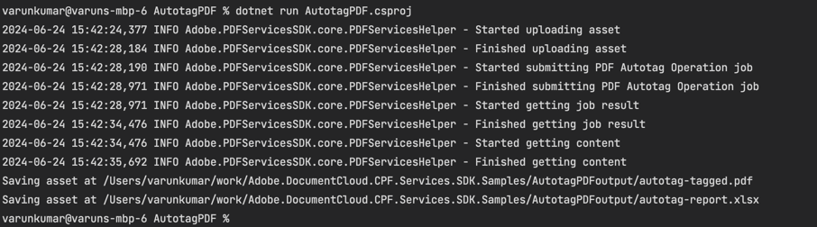

# Quickstart for PDF Accessibility Auto-Tag API (.NET)

To get started using Adobe PDF Accessibility Auto-Tag API, let's walk through a simple scenario - taking an input PDF document and running PDF Accessibility Auto-Tag API against it. Once the PDF has been tagged, we'll provide the document with tags and optionally, a report file. In this guide, we will walk you through the complete process for creating a program that will accomplish this task.

## Prerequisites

To complete this guide, you will need:

* [.NET: version 8.0 or above](https://dotnet.microsoft.com/en-us/download)
* [.Net SDK](https://dotnet.microsoft.com/en-us/download/dotnet/8.0)
* A build tool: Either Visual Studio or .NET Core CLI.
* An Adobe ID. If you do not have one, the credential setup will walk you through creating one.
* A way to edit code. No specific editor is required for this guide.
  
## Step One: Getting credentials

1) To begin, open your browser to <https://acrobatservices.adobe.com/dc-integration-creation-app-cdn/main.html?api=pdf-accessibility-auto-tag-api>. If you are not already logged in to Adobe.com, you will need to sign in or create a new user. Using a personal email account is recommend and not a federated ID.


2) After registering or logging in, you will then be asked to name your new credentials. Use the name, "New Project". 

3) Change the "Choose language" setting to ".Net". 

4) Also note the checkbox by, "Create personalized code sample." This will include a large set of samples along with your credentials. These can be helpful for learning more later. 

5) Click the checkbox saying you agree to the developer terms and then click "Create credentials."


6) After your credentials are created, they are automatically  downloaded:


## Step Two: Setting up the project

1) In your Downloads folder, find the ZIP file with your credentials: PDFServicesSDK-.NetSamples.zip. If you unzip that archive, you will find a folder of samples and the `pdfservices-api-credentials.json` file.


2) Take the `pdfservices-api-credentials.json` file and place it in a new directory.

3) In your new directory, create a new file, `AutotagPDF.csproj`. This file will declare our requirements as well as help define the application we're creating.

```xml
<Project Sdk="Microsoft.NET.Sdk">

    <PropertyGroup>
        <OutputType>Exe</OutputType>
        <TargetFramework>net8.0</TargetFramework>
    </PropertyGroup>

    <ItemGroup>
        <PackageReference Include="log4net" Version="2.0.17" />
        <PackageReference Include="Adobe.PDFServicesSDK" Version="4.0.0" />
    </ItemGroup>

    <ItemGroup>
        <None Update="Adobe Accesibility Auto-Tag API Sample.pdf">
            <CopyToOutputDirectory>Always</CopyToOutputDirectory>
        </None>
        <None Update="log4net.config">
            <CopyToOutputDirectory>Always</CopyToOutputDirectory>
        </None>
    </ItemGroup>

</Project>
```
This file will define what dependencies we need and how the application will be built.

Our application will take a PDF, `Adobe Accesibility Auto-Tag API Sample.pdf` (downloadable from <a href="../../../../overview/pdf/Adobe_Accessibility_Auto_Tag_API_Sample.pdf" target="_blank">here</a>) and tag its contents. The results will be saved in a given directory `/output`.

4) In your editor, open the directory where you previously copied the credentials and created the `csproj` file. Create a new file, `Program.cs`. 

Now you're ready to begin coding.

## Step Three: Creating the application

1) We'll begin by including our required dependencies:

```javascript
using System;
using System.IO;
using System.Reflection;
using Adobe.PDFServicesSDK;
using Adobe.PDFServicesSDK.auth;
using Adobe.PDFServicesSDK.exception;
using Adobe.PDFServicesSDK.io;
using Adobe.PDFServicesSDK.pdfjobs.jobs;
using Adobe.PDFServicesSDK.pdfjobs.results;
using log4net;
using log4net.Config;
using log4net.Repository;
```

2) Now let's define our main class and `Main` method:

```javascript
namespace AutotagPDF
{
    class Program
    {
        private static readonly ILog log = LogManager.GetLogger(typeof(Program));
        static void Main()
        {
            
        }
    }
}
```

3) Set the environment variables `PDF_SERVICES_CLIENT_ID` and `PDF_SERVICES_CLIENT_SECRET` by running the following commands and replacing placeholders `YOUR CLIENT ID` and `YOUR CLIENT SECRET` with the credentials present in `pdfservices-api-credentials.json` file:
- **Windows:**
  - `set PDF_SERVICES_CLIENT_ID=<YOUR CLIENT ID>`
  - `set PDF_SERVICES_CLIENT_SECRET=<YOUR CLIENT SECRET>`

- **MacOS/Linux:**
  - `export PDF_SERVICES_CLIENT_ID=<YOUR CLIENT ID>`
  - `export PDF_SERVICES_CLIENT_SECRET=<YOUR CLIENT SECRET>`

4) Next, we can create our credentials and PDFServices instance:

```javascript
// Initial setup, create credentials instance
ICredentials credentials = new ServicePrincipalCredentials(
        Environment.GetEnvironmentVariable("PDF_SERVICES_CLIENT_ID"),
        Environment.GetEnvironmentVariable("PDF_SERVICES_CLIENT_SECRET"));

// Creates a PDF Services instance
PDFServices pdfServices = new PDFServices(credentials);
```

5) Now, let's upload the asset:

```javascript
IAsset asset = pdfServices.Upload(inputStream, PDFServicesMediaType.PDF.GetMIMETypeValue());
```

We define input stream for the PDF that will be tagged. (You can download the source we used <a href="../../../../overview/pdf/Adobe_Accessibility_Auto_Tag_API_Sample.pdf" target="_blank">here</a>.) In a real application, these values would be typically be dynamic.
Then we upload the content of input stream and specify the input media type as PDF.

6) Now, let's create the job and parameters:

```javascript
// Create parameters for the job
AutotagPDFParams autotagPDFParams = AutotagPDFParams.AutotagPDFParamsBuilder().GenerateReport().Build();

// Creates a new job instance
AutotagPDFJob autotagPDFJob = new AutotagPDFJob(asset).SetParams(autotagPDFParams);
```

This set of code defines what we're doing (an Auto-Tag operation),
it defines parameters for the Auto-Tag job. PDF Accessibility Auto-Tag API has a few different options, but in this example, we're simply asking for a basic tagging operation, which returns the tagged PDF document and an XLSX report of the document.


7) The next code block submits the job and gets the job result:

```javascript
// Submits the job and gets the job result
String location = pdfServices.Submit(autotagPDFJob);
PDFServicesResponse<AutotagPDFResult> pdfServicesResponse =
        pdfServices.GetJobResult<AutotagPDFResult>(location, typeof(AutotagPDFResult));

// Get content from the resulting asset(s)
IAsset resultAsset = pdfServicesResponse.Result.TaggedPDF;
IAsset resultAssetReport = pdfServicesResponse.Result.Report;
StreamAsset streamAsset = pdfServices.GetContent(resultAsset);
StreamAsset streamAssetReport = pdfServices.GetContent(resultAssetReport)
```

8) The next code block saves the result at the specified location:

```javascript
// Creating output streams and copying stream asset's content to it
Stream outputStream = File.OpenWrite(Directory.GetCurrentDirectory() + "output/autotag-tagged.pdf");
Stream outputStreamReport =
        File.OpenWrite(Directory.GetCurrentDirectory() + "output/autotag-report.xlsx");
streamAsset.Stream.CopyTo(outputStream);
streamAssetReport.Stream.CopyTo(outputStreamReport);
outputStream.Close();
outputStreamReport.Close();
```

This code runs the Auto-Tagging process and then stores the result files in the provided output directory.



Here's the complete application (`Program.cs`):

```javascript
using System;
using System.IO;
using System.Reflection;
using Adobe.PDFServicesSDK;
using Adobe.PDFServicesSDK.auth;
using Adobe.PDFServicesSDK.exception;
using Adobe.PDFServicesSDK.io;
using Adobe.PDFServicesSDK.pdfjobs.jobs;
using Adobe.PDFServicesSDK.pdfjobs.parameters.autotag;
using Adobe.PDFServicesSDK.pdfjobs.results;
using log4net;
using log4net.Config;
using log4net.Repository;

namespace AutotagPDF
{
    class Program
    {
        private static readonly ILog log = LogManager.GetLogger(typeof(Program));
        
        static void Main()
        {
            // Configure the logging
            ConfigureLogging();
            try
            {
                // Initial setup, create credentials instance
                ICredentials credentials = new ServicePrincipalCredentials(
                    Environment.GetEnvironmentVariable("PDF_SERVICES_CLIENT_ID"),
                    Environment.GetEnvironmentVariable("PDF_SERVICES_CLIENT_SECRET"));

                // Creates a PDF Services instance
                PDFServices pdfServices = new PDFServices(credentials);

                // Creates an asset(s) from source file(s) and upload
                using Stream inputStream = File.OpenRead(@"Adobe Accesibility Auto-Tag API Sample.pdf");
                IAsset asset = pdfServices.Upload(inputStream, PDFServicesMediaType.PDF.GetMIMETypeValue());

                // Create parameters for the job
                AutotagPDFParams autotagPDFParams = AutotagPDFParams.AutotagPDFParamsBuilder().GenerateReport().Build();

                // Creates a new job instance
                AutotagPDFJob autotagPDFJob = new AutotagPDFJob(asset).SetParams(autotagPDFParams);

                // Submits the job and gets the job result
                String location = pdfServices.Submit(autotagPDFJob);
                PDFServicesResponse<AutotagPDFResult> pdfServicesResponse =
                    pdfServices.GetJobResult<AutotagPDFResult>(location, typeof(AutotagPDFResult));

                // Get content from the resulting asset(s)
                IAsset resultAsset = pdfServicesResponse.Result.TaggedPDF;
                IAsset resultAssetReport = pdfServicesResponse.Result.Report;
                StreamAsset streamAsset = pdfServices.GetContent(resultAsset);
                StreamAsset streamAssetReport = pdfServices.GetContent(resultAssetReport);

                // Creating output streams and copying stream asset's content to it
                String outputFilePath = "/output/autotag-tagged.pdf";
                new FileInfo(Directory.GetCurrentDirectory() + outputFilePath).Directory.Create();
                Stream outputStream = File.OpenWrite(Directory.GetCurrentDirectory() + outputFilePath);

                String outputFilePathReport = "/output/autotag-report.xlsx";
                new FileInfo(Directory.GetCurrentDirectory() + outputFilePath).Directory.Create();
                Stream outputStreamReport =
                    File.OpenWrite(Directory.GetCurrentDirectory() + outputFilePathReport);
                streamAsset.Stream.CopyTo(outputStream);
                streamAssetReport.Stream.CopyTo(outputStreamReport);
                outputStream.Close();
                outputStreamReport.Close();
                
                Console.WriteLine("Saving asset at " + Directory.GetCurrentDirectory() + outputFilePath);
                Console.WriteLine("Saving asset at " + Directory.GetCurrentDirectory() + outputFilePathReport);
            }
            catch (ServiceUsageException ex)
            {
                log.Error("Exception encountered while executing operation", ex);
            }
            catch (ServiceApiException ex)
            {
                log.Error("Exception encountered while executing operation", ex);
            }
            catch (SDKException ex)
            {
                log.Error("Exception encountered while executing operation", ex);
            }
            catch (IOException ex)
            {
                log.Error("Exception encountered while executing operation", ex);
            }
            catch (Exception ex)
            {
                log.Error("Exception encountered while executing operation", ex);
            }
        }

        static void ConfigureLogging()
        {
            ILoggerRepository logRepository = LogManager.GetRepository(Assembly.GetEntryAssembly());
            XmlConfigurator.Configure(logRepository, new FileInfo("log4net.config"));
        }
    }
}
```

## Next Steps

Now that you've successfully performed your first operation, [review the documentation](https://developer.adobe.com/document-services/docs/overview/pdf-services-api/) for many other examples and reach out on our [forums](https://community.adobe.com/t5/document-services-apis/ct-p/ct-Document-Cloud-SDK) with any questions. Also remember the samples you downloaded while creating your credentials also have many demos.
