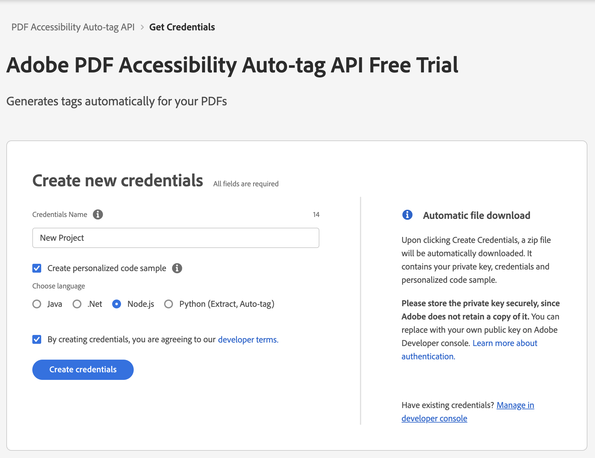
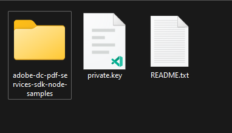
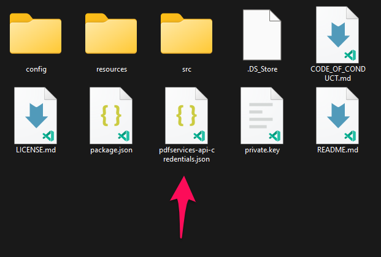
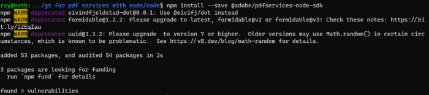
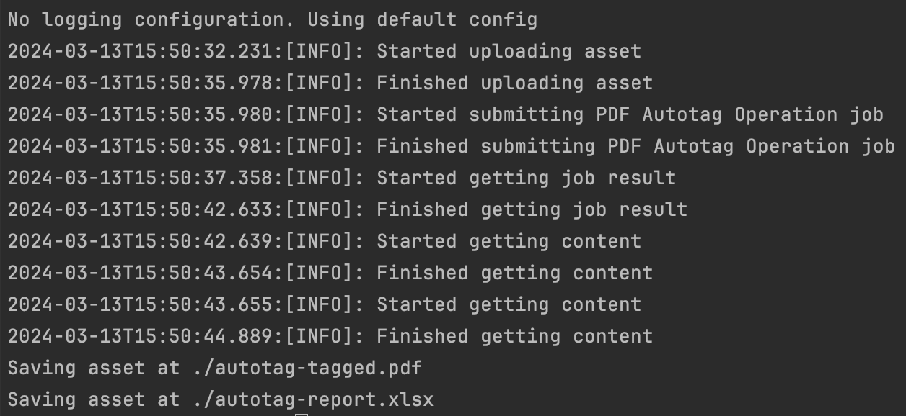

# Quickstart for PDF Accessibility Auto-Tag API (Node.js)

To get started using Adobe PDF Accessibility Auto-Tag API, let's walk through a simple scenario - taking an input PDF document and running PDF Accessibility Auto-Tag API against it. Once the PDF has been tagged, we'll provide the document with tags and optionally, a report file. In this guide, we will walk you through the complete process for creating a program that will accomplish this task.

## Prerequisites

To complete this guide, you will need:

* [Node.js](https://nodejs.org) - Node.js version 10.13.0 or higher is required. 
* An Adobe ID. If you do not have one, the credential setup will walk you through creating one.
* A way to edit code. No specific editor is required for this guide.

## Step One: Getting credentials

1) To begin, open your browser to <https://acrobatservices.adobe.com/dc-integration-creation-app-cdn/main.html?api=pdf-accessibility-auto-tag-api>. If you are not already logged in to Adobe.com, you will need to sign in or create a new user. Using a personal email account is recommend and not a federated ID.


2) After registering or logging in, you will then be asked to name your new credentials. Use the name, "New Project". 

3) Change the "Choose language" setting to "Node.js". 

4) Also note the checkbox by, "Create personalized code sample." This will include a large set of samples along with your credentials. These can be helpful for learning more later. 

5) Click the checkbox saying you agree to the developer terms and then click "Create credentials."



6) After your credentials are created, they are automatically downloaded:


## Step Two: Setting up the project

1) In your Downloads folder, find the ZIP file with your credentials: PDFServicesSDK-Node.jsSamples.zip. If you unzip that archive, you will find a README file, your private key, and a folder of samples:



2) We need two things from this download. The `private.key` file (as shown in the screenshot above, and the `pdfservices-api-credentials.json` file found in the samples directory:



<InlineAlert slots="text" />

Note that that private key is *also* found in this directory so feel free to copy them both from here.

3) Take these two files and place them in a new directory. Remember that these credential files are important and should be stored safely.

4) At the command line, change to the directory you created, and initialize a new Node.js project with `npm init -y`


5) Install the Adobe PDF Services Node.js SDK by typing `npm install --save @adobe/pdfservices-node-sdk` at the command line.



6) Install a package to help us work with ZIP files. Type `npm install --save adm-zip`.

At this point, we've installed the Node.js SDK for Adobe PDF Services API as a dependency for our project and have copied over our credentials files. 

Our application will take a PDF, `Adobe Accesibility Auto-Tag API Sample.pdf` (downloadable from [here](/Adobe_Accessibility_Auto_Tag_API_Sample.pdf)) and tag its contents. The results will be saved in a given directory `/output/AutotagPDF`.

7) In your editor, open the directory where you previously copied the credentials. Create a new file, `autotag-pdf.js`.

Now you're ready to begin coding.

## Step Three: Creating the application

1) We'll begin by including our required dependencies:

```js
const PDFServicesSdk = require('@adobe/pdfservices-node-sdk');
```

The first line includes the Adobe PDF Services Node.js SDK. The second third include Node's `filesystem` package as well as the package that will work with the ZIP file returned from the API. 

2) Now let's define our input and output:

```js
const INPUT_PDF = './Adobe Accessibility Auto-Tag API Sample.pdf';
const OUTPUT_PATH = './output/AutotagPDF/';

//Remove if the output already exists.
if(fs.existsSync(OUTPUT_PATH)) fs.unlinkSync(OUTPUT_PATH);

const TAGGED_PDF = OUTPUT_PATH + INPUT_PDF + "-tagged-pdf.pdf";
const TAGGING_REPORT = OUTPUT_PATH + INPUT_PDF + "-tagging-report.xlsx";
```

This defines what our output directory will be and optionally deletes it if it already exists. Then we define what PDF will be tagged. (You can download the source we used [here](/Adobe%20Accessibility%20Auto%20Tag%20API%20Sample.pdf).) In a real application, these values would be typically be dynamic.

3) Next, we setup the SDK to use our credentials.

```js
const credentials = PDFServicesSdk.Credentials
		.serviceAccountCredentialsBuilder()
		.fromFile('pdfservices-api-credentials.json')
		.build();

// Create an ExecutionContext using credentials
const executionContext = PDFServicesSdk.ExecutionContext.create(credentials);
```

This code both points to the credentials downloaded previously as well as sets up an execution context object that will be used later.

4) Now, let's create the operation:

```js
// Create a new operation instance.
const autotagPDFOperation = PDFServicesSdk.AutotagPDF.Operation.createNew(),
	input = PDFServicesSdk.FileRef.createFromLocalFile(INPUT_PDF);

// Build autotagPDF options
const autotagPDFOptions = new PDFServicesSdk.AutotagPDF.options.AutotagPDFOptions.Builder()
    .shiftHeadings()
    .generateReport()
    .build();
autotagPDFOperation.setInput(input);
autotagPDFOperation.setOptions(options);
```

This set of code defines what we're doing (an Auto-Tag operation), points to our local file and specifies the input is a PDF, and then defines options for the Auto-Tag call. PDF Accessibility Auto-Tag API has a few different options, but in this example, we're simply asking for a basic tagging operation, which returns the tagged PDF document and an XLSX report of the document.

5) The next code block executes the operation:

```js
// Execute the operation
autotagPDFOperation.execute(executionContext)
	.then(result => {
        result.taggedPDF.saveAsFile(TAGGED_PDF);
        result.report.saveAsFile(TAGGING_REPORT);
    })
	.then(() => {
		console.log('Successfully tagged information in PDF.');
	})
	.catch(err => console.log(err));
```



Here's the complete application (`autotag-pdf.js`):

```js
const PDFServicesSdk = require('@adobe/pdfservices-node-sdk');

const INPUT_PDF = './Adobe Accessibility Auto-Tag API Sample.pdf';
const OUTPUT_PATH = './output/AutotagPDF/';

//Remove if the output already exists.
if(fs.existsSync(OUTPUT_PATH)) fs.unlinkSync(OUTPUT_PATH);

const TAGGED_PDF = OUTPUT_PATH + INPUT_PDF + "-tagged-pdf.pdf";
const TAGGING_REPORT = OUTPUT_PATH + INPUT_PDF + "-tagging-report.xlsx";

const credentials = PDFServicesSdk.Credentials
		.serviceAccountCredentialsBuilder()
		.fromFile('pdfservices-api-credentials.json')
		.build();

// Create an ExecutionContext using credentials
const executionContext = PDFServicesSdk.ExecutionContext.create(credentials);

// Create a new operation instance.
const autotagPDFOperation = PDFServicesSdk.AutotagPDF.Operation.createNew(),
    input = PDFServicesSdk.FileRef.createFromLocalFile(INPUT_PDF);

// Build autotagPDF options
const autotagPDFOptions = new PDFServicesSdk.AutotagPDF.options.AutotagPDFOptions.Builder()
    .shiftHeadings()
    .generateReport()
    .build();
autotagPDFOperation.setInput(input);
autotagPDFOperation.setOptions(options);

// Execute the operation
autotagPDFOperation.execute(executionContext)
    .then(result => {
        result.taggedPDF.saveAsFile(TAGGED_PDF);
        result.report.saveAsFile(TAGGING_REPORT);
    })
    .then(() => {
        console.log('Successfully tagged information in PDF.');
    })
    .catch(err => console.log(err));
```

## Next Steps

Now that you've successfully performed your first operation, [review the documentation](https://developer.adobe.com/document-services/docs/overview/pdf-services-api/) for many other examples and reach out on our [forums](https://community.adobe.com/t5/document-services-apis/ct-p/ct-Document-Cloud-SDK) with any questions. Also remember the samples you downloaded while creating your credentials also have many demos.
