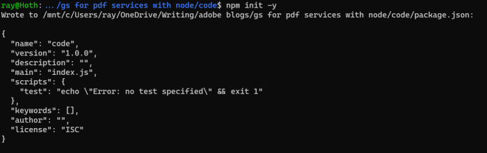

# Quickstart for PDF Accessibility Auto-Tag API (Node.js)

To get started using Adobe PDF Accessibility Auto-Tag API, let's walk through a simple scenario - taking an input PDF document and running PDF Accessibility Auto-Tag API against it. Once the PDF has been tagged, we'll provide the document with tags and optionally, a report file. In this guide, we will walk you through the complete process for creating a program that will accomplish this task.

## Prerequisites

To complete this guide, you will need:

* [Node.js](https://nodejs.org) - Node.js version 18.0 or higher is required. 
* An Adobe ID. If you do not have one, the credential setup will walk you through creating one.
* A way to edit code. No specific editor is required for this guide.

## Step One: Getting credentials

1) To begin, open your browser to <https://acrobatservices.adobe.com/dc-integration-creation-app-cdn/main.html?api=pdf-accessibility-auto-tag-api>. If you are not already logged in to Adobe.com, you will need to sign in or create a new user. Using a personal email account is recommend and not a federated ID.


2) After registering or logging in, you will then be asked to name your new credentials. Use the name, "New Project". 

3) Change the "Choose language" setting to "Node.js". 

4) Also note the checkbox by, "Create personalized code sample." This will include a large set of samples along with your credentials. These can be helpful for learning more later. 

5) Click the checkbox saying you agree to the developer terms and then click "Create credentials."


6) After your credentials are created, they are automatically downloaded:


## Step Two: Setting up the project

1) In your Downloads folder, find the ZIP file with your credentials: PDFServicesSDK-Node.jsSamples.zip. If you unzip that archive, you will find a folder of samples and the `pdfservices-api-credentials.json` file.


2) Take the `pdfservices-api-credentials.json` and place it in a new directory. Remember that these credential files are important and should be stored safely.

3) At the command line, change to the directory you created, and initialize a new Node.js project with `npm init -y`



4) Install the Adobe PDF Services Node.js SDK by typing `npm install --save @adobe/pdfservices-node-sdk` at the command line.


5) Install a package to help us work with ZIP files. Type `npm install --save adm-zip`.

At this point, we've installed the Node.js SDK for Adobe PDF Services API as a dependency for our project and have copied over our credentials files. 

Our application will take a PDF, `Adobe Accesibility Auto-Tag API Sample.pdf` (downloadable from <a href="../../../../overview/pdf/Adobe_Accessibility_Auto_Tag_API_Sample.pdf" target="_blank">here</a>)) and tag its contents. The results will be saved in a given directory `/output`.

6) In your editor, open the directory where you previously copied the credentials. Create a new file, `autotag-pdf.js`.

Now you're ready to begin coding.

## Step Three: Creating the application

1) We'll begin by including our required dependencies:

```js
const {
  ServicePrincipalCredentials,
  PDFServices,
  MimeType,
  AutotagPDFParams,
  AutotagPDFJob,
  AutotagPDFResult,
} = require("@adobe/pdfservices-node-sdk");
const fs = require("fs");
```

2) Set the environment variables `PDF_SERVICES_CLIENT_ID` and `PDF_SERVICES_CLIENT_SECRET` by running the following commands and replacing placeholders `YOUR CLIENT ID` and `YOUR CLIENT SECRET` with the credentials present in `pdfservices-api-credentials.json` file:
- **Windows:**
    - `set PDF_SERVICES_CLIENT_ID=<YOUR CLIENT ID>`
    - `set PDF_SERVICES_CLIENT_SECRET=<YOUR CLIENT SECRET>`

- **MacOS/Linux:**
    - `export PDF_SERVICES_CLIENT_ID=<YOUR CLIENT ID>`
    - `export PDF_SERVICES_CLIENT_SECRET=<YOUR CLIENT SECRET>`

3) Next, we can create our credentials and use them:

```js
// Initial setup, create credentials instance
const credentials = new ServicePrincipalCredentials({
  clientId: process.env.PDF_SERVICES_CLIENT_ID,
  clientSecret: process.env.PDF_SERVICES_CLIENT_SECRET
});

// Creates a PDF Services instance
const pdfServices = new PDFServices({credentials});
```

4) Now, let's upload the asset:

```js
const inputAsset = await pdfServices.upload({
  readStream,
  mimeType: MimeType.PDF
});
```

5) Now, let's create the parameters and the job:

```js
// Create parameters for the job
const params = new AutotagPDFParams({
  generateReport: true,
  shiftHeadings: true
});

// Creates a new job instance
const job = new AutotagPDFJob({inputAsset, params});
```

This set of code defines what we're doing (an Auto-Tag operation),
it defines parameters for the Auto-Tag job. PDF Accessibility Auto-Tag API has a few different options, but in this example, we're simply asking for a basic tagging operation, which returns the tagged PDF document and an XLSX report of the document.

6) The next code block submits the job and gets the job result:

```js
// Submit the job and get the job result
const pollingURL = await pdfServices.submit({job});
const pdfServicesResponse = await pdfServices.getJobResult({
  pollingURL,
  resultType: AutotagPDFResult
});

// Get content from the resulting asset(s)
const resultAsset = pdfServicesResponse.result.taggedPDF;
const resultAssetReport = pdfServicesResponse.result.report;
const streamAsset = await pdfServices.getContent({asset: resultAsset});
const streamAssetReport = await pdfServices.getContent({asset: resultAssetReport});
```

7) The next code block saves the result at the specified location:

```js
// Creates an output stream and copy stream asset's content to it
const outputFilePath = "./autotag-tagged.pdf";
const outputFilePathReport = "./autotag-report.xlsx";
console.log(`Saving asset at ${outputFilePath}`);
console.log(`Saving asset at ${outputFilePathReport}`);

let writeStream = fs.createWriteStream(outputFilePath);
streamAsset.readStream.pipe(writeStream);
writeStream = fs.createWriteStream(outputFilePathReport);
streamAssetReport.readStream.pipe(writeStream);
```


Here's the complete application (`autotag-pdf.js`):

```js
const {
  ServicePrincipalCredentials,
  PDFServices,
  MimeType,
  AutotagPDFParams,
  AutotagPDFJob,
  AutotagPDFResult,
} = require("@adobe/pdfservices-node-sdk");
const fs = require("fs");

(async () => {
  let readStream;
  try {
    // Initial setup, create credentials instance
    const credentials = new ServicePrincipalCredentials({
      clientId: process.env.PDF_SERVICES_CLIENT_ID,
      clientSecret: process.env.PDF_SERVICES_CLIENT_SECRET
    });

    // Creates a PDF Services instance
    const pdfServices = new PDFServices({credentials});

    // Creates an asset(s) from source file(s) and upload
    readStream = fs.createReadStream("./Adobe_Accessibility_Auto_Tag_API_Sample.pdf");
    const inputAsset = await pdfServices.upload({
      readStream,
      mimeType: MimeType.PDF
    });

    // Create parameters for the job
    const params = new AutotagPDFParams({
      generateReport: true,
      shiftHeadings: true
    });

    // Creates a new job instance
    const job = new AutotagPDFJob({inputAsset, params});

    // Submit the job and get the job result
    const pollingURL = await pdfServices.submit({job});
    const pdfServicesResponse = await pdfServices.getJobResult({
      pollingURL,
      resultType: AutotagPDFResult
    });

    // Get content from the resulting asset(s)
    const resultAsset = pdfServicesResponse.result.taggedPDF;
    const resultAssetReport = pdfServicesResponse.result.report;
    const streamAsset = await pdfServices.getContent({asset: resultAsset});
    const streamAssetReport = await pdfServices.getContent({asset: resultAssetReport});

    // Creates an output stream and copy stream asset's content to it
    const outputFilePath = "./autotag-tagged.pdf";
    const outputFilePathReport = "./autotag-report.xlsx";
    console.log(`Saving asset at ${outputFilePath}`);
    console.log(`Saving asset at ${outputFilePathReport}`);

    let writeStream = fs.createWriteStream(outputFilePath);
    streamAsset.readStream.pipe(writeStream);
    writeStream = fs.createWriteStream(outputFilePathReport);
    streamAssetReport.readStream.pipe(writeStream);
  } catch (err) {
    console.log("Exception encountered while executing operation", err);
  } finally {
    readStream?.destroy();
  }
})();
```

## Next Steps

Now that you've successfully performed your first operation, [review the documentation](https://developer.adobe.com/document-services/docs/overview/pdf-services-api/) for many other examples and reach out on our [forums](https://community.adobe.com/t5/document-services-apis/ct-p/ct-Document-Cloud-SDK) with any questions. Also remember the samples you downloaded while creating your credentials also have many demos.
