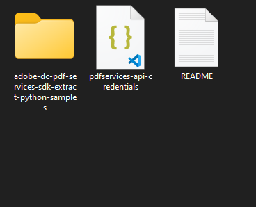
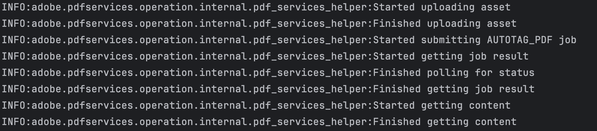

# Quickstart for PDF Accessibility Auto-Tag API (Python)

To get started using Adobe PDF Accessibility Auto-Tag API, let's walk through a simple scenario - taking an input PDF document and running PDF Accessibility Auto-Tag API against it. Once the PDF has been tagged, we'll provide the document with tags and optionally, a report file. In this guide, we will walk you through the complete process for creating a program that will accomplish this task. 

## Prerequisites

To complete this guide, you will need:

* [Python](https://www.python.org/downloads/) - Python 3.10 or higher is required.
* An Adobe ID. If you do not have one, the credential setup will walk you through creating one.
* A way to edit code. No specific editor is required for this guide.


## Step One: Getting credentials

1) To begin, open your browser to <https://acrobatservices.adobe.com/dc-integration-creation-app-cdn/main.html?api=pdf-accessibility-auto-tag-api>. If you are not already logged in to Adobe.com, you will need to sign in or create a new user. Using a personal email account is recommend and not a federated ID.


2) After registering or logging in, you will then be asked to name your new credentials. Use the name, "New Project". 

3) Change the "Choose language" setting to "Python". 

4) Also note the checkbox by, "Create personalized code sample." This will include a large set of samples along with your credentials. These can be helpful for learning more later. 

5) Click the checkbox saying you agree to the developer terms and then click "Create credentials."


6) After your credentials are created, they are automatically downloaded:


## Step Two: Setting up the project

1) In your Downloads folder, find the ZIP file with your credentials: PDFServicesSDK-Python Samples.zip. If you unzip that archive, you will find a folder of samples and the `pdfservices-api-credentials.json` file.



2) Take the `pdfservices-api-credentials.json` file and place it in a new directory. Remember that these credential files are important and should be stored safely.

3) At the command line, change to the directory you created, and run the following command to install the Python SDK: `pip install pdfservices-sdk`.


At this point, we've installed the Python SDK for Adobe PDF Services API as a dependency for our project and have copied over our credentials files.

Our application will take a PDF, `Adobe Accesibility Auto-Tag API Sample.pdf` (downloadable from <a href="../../../../overview/pdf/Adobe_Accessibility_Auto_Tag_API_Sample.pdf" target="_blank">here</a>) and tag its contents. The results will be saved in a given directory `/output`. 

4) In your editor, open the directory where you previously copied the credentials. Create a new file, `autotag.py`.

Now you're ready to begin coding.

## Step Three: Creating the application

1) We'll begin by including our required dependencies:

```python
import logging
import os
from datetime import datetime

from adobe.pdfservices.operation.auth.service_principal_credentials import ServicePrincipalCredentials
from adobe.pdfservices.operation.exception.exceptions import ServiceApiException, ServiceUsageException, SdkException
from adobe.pdfservices.operation.io.cloud_asset import CloudAsset
from adobe.pdfservices.operation.io.stream_asset import StreamAsset
from adobe.pdfservices.operation.pdf_services import PDFServices
from adobe.pdfservices.operation.pdf_services_media_type import PDFServicesMediaType
from adobe.pdfservices.operation.pdfjobs.jobs.autotag_pdf_job import AutotagPDFJob
from adobe.pdfservices.operation.pdfjobs.result.autotag_pdf_result import AutotagPDFResult
```

The first set of imports bring in the Adobe PDF Accessibility Auto-Tag SDK while the second set will be used by our code later on.

2) Set the environment variables `PDF_SERVICES_CLIENT_ID` and `PDF_SERVICES_CLIENT_SECRET` by running the following commands and replacing placeholders `YOUR CLIENT ID` and `YOUR CLIENT SECRET` with the credentials present in `pdfservices-api-credentials.json` file:
- **Windows:**
    - `set PDF_SERVICES_CLIENT_ID=<YOUR CLIENT ID>`
    - `set PDF_SERVICES_CLIENT_SECRET=<YOUR CLIENT SECRET>`

- **MacOS/Linux:**
    - `export PDF_SERVICES_CLIENT_ID=<YOUR CLIENT ID>`
    - `export PDF_SERVICES_CLIENT_SECRET=<YOUR CLIENT SECRET>`

3) Next, we can create our credentials and use them:

```python
# Initial setup, create credentials instance
credentials = ServicePrincipalCredentials(
    client_id=os.getenv('PDF_SERVICES_CLIENT_ID'),
    client_secret=os.getenv('PDF_SERVICES_CLIENT_SECRET'))

# Creates a PDF Services instance
pdf_services = PDFServices(credentials=credentials)
```

This defines what our output directory will be and optionally deletes it if it already exists. Then we define what PDF will be tagged. (You can download the source we used <a href="../../../../overview/pdf/Adobe_Accessibility_Auto_Tag_API_Sample.pdf" target="_blank">here</a>.) In a real application, these values would be typically be dynamic. 

4) Now, let's create an asset from source file and upload.

```python
file = open('./autotagPDFInput.pdf', 'rb')
input_stream = file.read()
file.close()

# Creates an asset(s) from source file(s) and upload
input_asset = pdf_services.upload(input_stream=input_stream,
                                  mime_type=PDFServicesMediaType.PDF)
```

5) The next code block creates, submits and gets the job result:

```python
# Creates a new job instance
autotag_pdf_job = AutotagPDFJob(input_asset)


# Submit the job and gets the job result
location = pdf_services.submit(electronic_seal_job)
pdf_services_response = pdf_services.get_job_result(location, ESealPDFResult)

# Get content from the resulting asset(s)
result_asset: CloudAsset = pdf_services_response.get_result().get_asset()
stream_asset: StreamAsset = pdf_services.get_content(result_asset)
```

6) The next code block saves the result at the specified location:

```python
output_file_path = 'output/tagged-pdf.pdf'
with open(output_file_path, "wb") as file:
    file.write(stream_asset.get_input_stream())
```



Here's the complete application (`autotag.py`):

```python
import logging
import os
from datetime import datetime

from adobe.pdfservices.operation.auth.service_principal_credentials import ServicePrincipalCredentials
from adobe.pdfservices.operation.exception.exceptions import ServiceApiException, ServiceUsageException, SdkException
from adobe.pdfservices.operation.io.cloud_asset import CloudAsset
from adobe.pdfservices.operation.io.stream_asset import StreamAsset
from adobe.pdfservices.operation.pdf_services import PDFServices
from adobe.pdfservices.operation.pdf_services_media_type import PDFServicesMediaType
from adobe.pdfservices.operation.pdfjobs.jobs.autotag_pdf_job import AutotagPDFJob
from adobe.pdfservices.operation.pdfjobs.result.autotag_pdf_result import AutotagPDFResult

# Initialize the logger
logging.basicConfig(level=logging.INFO)

# This sample illustrates how to generate a tagged PDF.
#
# Refer to README.md for instructions on how to run the samples.

class AutoTagPDF:
    def __init__(self):
        try:
            file = open('./autotagPDFInput.pdf', 'rb')
            input_stream = file.read()
            file.close()

            # Initial setup, create credentials instance
            credentials = ServicePrincipalCredentials(
                client_id=os.getenv('PDF_SERVICES_CLIENT_ID'),
                client_secret=os.getenv('PDF_SERVICES_CLIENT_SECRET')
            )

            # Creates a PDF Services instance
            pdf_services = PDFServices(credentials=credentials)

            # Creates an asset(s) from source file(s) and upload
            input_asset = pdf_services.upload(input_stream=input_stream,
                                              mime_type=PDFServicesMediaType.PDF)

            # Creates a new job instance
            autotag_pdf_job = AutotagPDFJob(input_asset)

            # Submit the job and gets the job result
            location = pdf_services.submit(autotag_pdf_job)
            pdf_services_response = pdf_services.get_job_result(location, AutotagPDFResult)

            # Get content from the resulting asset(s)
            result_asset: CloudAsset = pdf_services_response.get_result().get_tagged_pdf()
            stream_asset: StreamAsset = pdf_services.get_content(result_asset)

            # Creates an output stream and copy stream asset's content to it
            output_file_path = 'output/tagged-pdf.pdf'
            with open(output_file_path, "wb") as file:
                file.write(stream_asset.get_input_stream())

        except (ServiceApiException, ServiceUsageException, SdkException) as e:
            logging.exception(f'Exception encountered while executing operation: {e}')


if __name__ == "__main__":
    AutoTagPDF()

```

## Next Steps

Now that you've successfully performed your first operation, [review the documentation](https://developer.adobe.com/document-services/docs/overview/pdf-services-api/) for many other examples and reach out on our [forums](https://community.adobe.com/t5/acrobat-services-api/ct-p/ct-Document-Cloud-SDK?page=1&sort=latest_replies&filter=all&lang=all&tabid=discussions&topics=label-accessibilityauto-tagapi) with any questions. Also remember the samples you downloaded while creating your credentials also have many demos.
