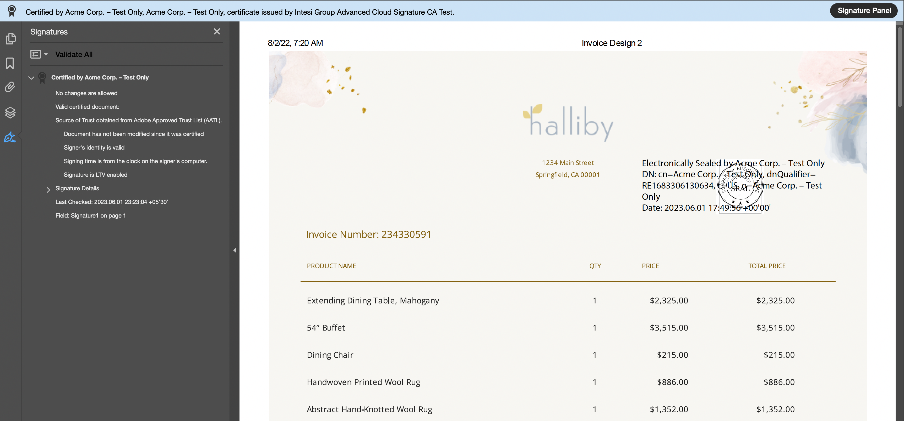

# Overview

## What is a PDF Electronic Seal API ?

An Electronic Seal in PDF is the equivalent of an organization rubber stamp on a paper, but it’s much more secure. It is supported by a digital certificate issued in the name of an organization. Electronic Seal i.e. eSeal is in accordance with the global standards set by [Cloud Signature Consortium (CSC)](https://cloudsignatureconsortium.org/) and offer the utmost level of assurance of identity while handling digital documents.

PDF Electronic Seal API is a cloud based solution to apply the eSeal on the pdf documents using the digital certificates issued to Organizations to demonstrate the integrity and authenticity of official documents such as invoices, statements, agreements etc. These digital certificates are issued by a CSC compliant Trust Service Provider (TSP).

Below are the benefits of applying an eSeal to a document.
* **Integrity**: Trust that the document has not been altered at any point in the workflow.
* **Authenticity**: Trust that the document's author is the expected person and not someone else.
* **Non-Repudiation**: Trust that the issuing party cannot disown their authorship.
* **Long Term Validation**: Trust that the integrity, authenticity and non-repudiation can be verified over the long term, even after the expiry of digital certificate used.

eSeal can be represented by solely an image, a text block (comprising name of entity, date and time of the seal etc.), or a combination of both image and text. Below is the sample representation of eSeal applied on a PDF document.

## PDF Electronic Seal API Components

A PDF Electronic Seal API workflow involves the following:

* **PDF Document**: A PDF document as an input file for eSeal operation. The maximum size of the PDF cannot exceed 100MB.
* **Sealing Parameters**: Parameters  specifying the seal's format, visibility and appearance along with the digital certificate credentials information. For details, see [sealing parameters](gettingstarted#api-parameters-sealoptionsbb).
* **Seal Image**: The API accepts an **optional** seal image as a background image for seal appearance which overrides the default seal image. The maximum size of the seal image cannot exceed 2MB. Supported image formats for seal image are JPEG and PNG only.

## Supported Trust Service Providers

Trust Service Providers ("TSPs") are companies that offer a wide range of identity and transaction services, including certificate authority services such as providing and preserving digital certificates for creating and validating electronic seals as well as authenticating the organizations that applied the electronic seals.

The PDF Electronic Seal API supports digital certificates hosted by Qualified Trust Service Providers ("QTSPs") recognized under the eIDAS regulation and who support the open API standard from the Cloud Signature Consortium (CSC). These TSPs must support explicit authorization (based on a static PIN only), and the OAuth 2.0 client credential authorization flow.
Seal API currently supports the following TSPs : <!-- REFERENCES https://helpx.adobe.com/acrobat/kb/approved-trust-list1.html -->
 

* [Intesi Group](https://www.intesigroup.com/en/)
* [Entrust](https://www.entrust.com/pdf-signing-certificates/)
* [GlobalSign](https://www.globalsign.com/en/digital-signatures)
* [TrustPro](https://www.trustpro.eu/)
