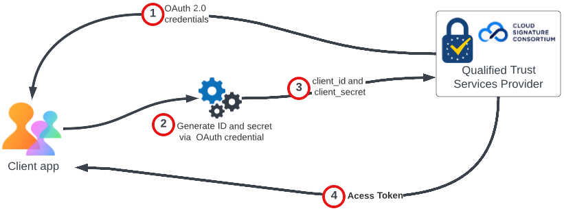

# Prerequisites

## PDF Electronic Seal API Prerequisites

### 1. Procure Certificate Credentials

1. A client must register with a trusted service provider and obtain the digital certificate which authorizes and validates electronically sealed documents. A certificate may be purchased from any of the [supported Trust Service Providers.](/overview/pdf-electronic-seal-api/prerequisites/#supported-trusted-service-providers)
2. The trust service provider (TSP) performs remote identity verification of the client representative who acts as the legal owner of the seal certificate.
3. After identity verification, a client creates an account in the TSP's portal. The TSP issues a certificate to the client and delivers a `client_id` and `client_secret`. These are typically protected from unauthorized use by a static PIN, but 3rd party TSPs may provide different user experiences. 
4. The client then generates OAuth 2.0 Client Credentials (required for the Cloud Signature Consortium API authorization). ??? How? Link? The diagram says the TSP provides it. . . .  ???

The client should securely store the credential details and PIN for later use.

### 2. Obtain your OAuth Token

The client uses the TSP-provided OAuth 2.0 client credentials to generate a `client_id` and `client_secret`. These are passed as input parameters in the request body of TSP's API endpoint. The TSPs response includes an access token used [as one of the parameters](/overview/pdf-electronic-seal-api/quickstarts/#2-configure-sealing-parameters)
to access with Cloud Signature Consortium APIs ??? ** I think the client access the CSC-compliant PDF Electronic Seal APIs. Right?????

??? The meeting notes aren't clear wrt to the ID and secret. The 3rd bullet above is in conflict with the paragraph above. Does the TSP actually provide an id and secret? ?????

To learn more about Cloud Signature Consortium APIs, refer to [Cloud Signature Consortium Standard](https://cloudsignatureconsortium.org/wp-content/uploads/2020/01/CSC_API_V1_1.0.4.0.pdf)



**Sample OAuth Request**

```javascript
curl --location --request POST 'https://<base-url>/<API-domain-name>/csc/v0/oauth2/token'
--header 'cache-control: no-cache'
--header 'content-type: application/json'
--data-raw '{
   "lang": "en-US",
   "client_id": "<YOUR_CLIENT_ID>",
   "client_secret": "<YOUR_CLIENT_SECRET>",
   "grant_type": "client_credentials"
}'
```

**Sample Response**

```json
{
   "access_token": "xxxx-xxx-xxx-xxxx-xxxxxxxx",
   "token_type": "Bearer",
   "expires_in": <TIME_IN_SECONDS>
}
```

## Supported Trusted Service Providers

Trust service providers (TSPs) are companies that offer a wide range of secure identity and transactions services, including certificate authority services such as providing and preserving digital certificates for creating and validating digital signatures as well as authenticating their signatories.

The electronic seal API supports digital certificates hosted by Qualified Trust Service Providers(QTSP) certified under the eIDAS regulation and supporting the open API standard from the Cloud Signature Consortium. Because these TSPs must support the OAuth 2.0 client credential flow, the Electronic Seal APIs limits support  to the following providers: <!-- REFERENCES https://helpx.adobe.com/acrobat/kb/approved-trust-list1.html -->

* [Intesi Group](https://www.intesigroup.com/en/)
* [Entrust](https://www.entrust.com/pdf-signing-certificates/)
* [GlobalSign](https://www.globalsign.com/en/digital-signatures)
* [TrustPro](https://www.trustpro.eu/)