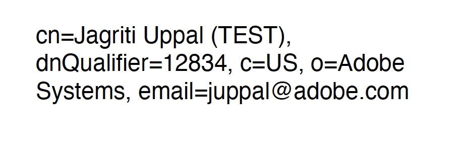

# Quickstarts

Before getting started with [PDF Electronic Seal API](/overview/pdf-electronic-seal-api/#what-is-pdf-electronic-seal), verify the [prerequisites](prerequisites.md). 

The client has to call the PDF Electronic Seal API with the appropriate parameters to get the digitally signed PDF.


## Parameters

### Signature Format (*Required*)

Specifies a supported digital signature format:

* PADES : This is the latest and improved signature format which is strict, concrete, and secure. For details, see [ETSI TS 102 778-3](https://www.etsi.org/deliver/etsi_ts/102700_102799/10277803/01.02.01_60/ts_10277803v010201p.pdf)  
* PKCS#7 : This signature format is less stringent than PADES since it permits more PDF changes without invalidating the digital signature. For details, see [ISO 32000-1](https://opensource.adobe.com/dc-acrobat-sdk-docs/standards/pdfstandards/pdf/PDF32000_2008.pdf)

### TSP Credential Information (*Required*)  

TSP parameters encapsulate the signer's [certificate credential](/overview/pdf-electronic-seal-api/prerequisites/#step-1-procure-certificate-credentials) as well as the associated authentication and authorization data.

* **TSP Name**  (*Required*): Specifies the name of the Trust Service Provider used to generate the certificate.
* **TSP Credential Id**  (*Required*): Specifies the digital ID stored with the TSP provider that should be used for sealing.
* **TSP Authorization Context**  (*Required*): Encapsulates the service authorization data required to communicate with the TSP and access CSC provider APIs.

  * **Access Token**  (*Required*): Specifies the service access token used to authorize access to the CSC provider hosted APIs.
  * **Token Type**: Specifies the type of service token which is Bearer.

* **TSP Credential Authorization Parameter**  (*Required*): Encapsulates the credential's authorization information required to authorize access to their signing keys.
    
    * **PIN**  (*Required*): Specifies the PIN associated with credential ID.

### Seal Field Parameters   (*Required*)

The seal field parameters are required to create a new unsigned signature field or sign an existing field.

* **Field Name**  (*Required*): The signature field's name. This must be a non-empty string. If signature field with this field name already exist, that field will be used. 
If it does not exist, a signature field with this field name will be created.
* **Visibility**: Specifies whether the signature field is visible. The default value of `true` creates a visible signature.
* **Page Number**: Specifies the page number to which the signature field should be attached. Page numbers are 1-based. The page number is only **required** if the signature field does not already exist in the pdf document. If this is specified along with the signature field then it overrides the page on which signature field is present in the document.
* **Location**: Specifies the coordinates of the signature appearance's bounding box in default PDF user space units. The location is only **required** if the signature field does not already exist in the pdf document. If this is specified along with the signature field then it overrides the existing signature bounding box.

  * **Left**: The left x-coordinate
  * **Bottom**: The bottom y-coordinate
  * **Right**: The right x-coordinate
  * **Top**: The top y-coordinate

The **Location** and **Page Number** fields are **optional** if the signature field is already added in the input PDF document. To add the signature field explicitly, see [how to place a signature field in a PDF](https://www.adobe.com/sign/hub/how-to/add-a-signature-block-to-pdf).
  
### Seal Appearance Parameters

Specifies signature field appearance parameters. These are an enum set of display items: NAME, DATE, DISTINGUISHED_NAME, LABELS and SEAL_IMAGE. Specifies the information to display in the signature. NAME and LABELS are the default values.

* **NAME**: Specifies that the signer's name should be displayed in the signature appearance.
   
* **DATE**: Specifies that the signing date/time should be displayed in the signature appearance. This option only controls whether the value of the 
   time/date in the signature dictionary is displayed or not. This value should not be mistaken for a signed timestamp from a timestamp authority.
   
* **DISTINGUISHED_NAME**: Specifies that the distinguished name information from the signer's certificate should be displayed in the signature appearance.
   
* **LABELS**: Specifies that text labels should be displayed in the signature appearance.
   
* **SEAL_IMAGE**: Specifies that the seal image should be displayed in the signature appearance.
    
   If the seal image is not present in the request body, the default Acrobat trefoil image is used.
   
   
**Example JSON**

```json
{
  "signatureFormat": "PADES",
  "cscCredentialOptions": {
    "authorizationContext": {
      "accessToken": "<ACCESS TOKEN>",
      "tokenType": "Bearer"
    },
    "credentialAuthParameters": {
      "pin": "<PIN>"
    },
    "providerName": "<PROVIDER_NAME>",
    "credentialId": "<CREDENTIAL_ID>"
  },
  "sealFieldOptions": {
    "pageNumber": 1,
    "fieldName": "Signature",
    "visible": true,
    "location": {
      "top": 300,
      "bottom": 250,
      "left": 300,
      "right": 500
    }
  },
  "sealAppearanceOptions": {
    "displayOptions": [
      "DATE",
      "DISTINGUISHED_NAME",
      "SEAL_IMAGE"
    ]
  }
}
```


## Workflows

There are two ways to access PDF Electronic Seal API: via the REST API or with the PDF Services SDKs. 

### REST API

Clients using the REST API must perform the following: 

1. [Generate asset IDs for all the input documents](https://developer.adobe.com/document-services/docs/apis/#tag/Assets).
1. Call the `/asset` API with `mediaType` in the request specifying the document upload type. For example, `application/pdf`. The API responds with an asset ID and upload URI. 
1. Request to upload the input document to the upload URI.
1. Invoke PDF Electronic Seal API (/pdf-services/operation/electronicseal) by providing the asset IDs generated in step 1 and other required sealing parameters. In the response, the client receives the job URI in the location header. [Details](https://developer.adobe.com/document-services/docs/apis/#operation/pdfoperations.electronicseal).
1. Use the job URI to poll the status of the submitted job (Electronic Seal operation). The response includes a job status: *In progress*, *Failed* or *Done*. If the status is done, the seal API returns an asset ID and download URI. **This download URI is valid for 24 hours.**.
1. Download the digitally signed pdf using download URI from above step.


### PDF Services SDKs

Clients can also access the PDF Electronic Seal API via PDF Services SDKs. For additional details, see [Quickstarts](https://developer.adobe.com/document-services/docs/overview/pdf-services-api/).

Clients using the PDF Services SDKs must perform the following: 

1. Save the input document and seal image on the local machine. File paths must be absolute.
1. Save the `pdfservices-api-credentials.json` file created after [generating credentials](https://developer.adobe.com/document-services/docs/overview/pdf-services-api/#authentication)
1. Make a call to the PDF Electronic Seal operation that includes the following: 
    * The file path to an input PDF (from the local machine). 
    * [Required parameters](/overview/pdf-electronic-seal-api/quickstarts/#parameters)
    * Specify an optional file path to a logo/watermark/background image used as part of the signature field's signed appearance. Supported formats include: 
        * application/pdf
        * image/jpeg
        * image/png
1. The digitally signed pdf file obtained  will be saved to specified output file path.

Use the samples below to generate a PDF with an electronic seal.

Please refer the [API usage guide](../pdf-services-api/howtos/api-usage.md) to understand how to use our APIs.

<CodeBlock slots="heading, code" repeat="2" languages="Java, Rest API" /> 

##### Java

```javascript
// Get the samples from https://www.adobe.com/go/pdftoolsapi_java_samples
// Run the sample:
// mvn -f pom.xml exec:java -Dexec.mainClass=com.adobe.pdfservices.operation.samples.electronicseal.ESealWithCustomAppearanceOptions

package com.adobe.pdfservices.operation.samples.electronicseal;

public class ESealWithCustomAppearanceOptions {

    // Initialize the logger.
    private static final Logger LOGGER = LoggerFactory.getLogger(ESealWithCustomAppearanceOptions.class);

    public static void main(String[] args) {
        try {

            // Initial setup, create credentials instance.
            Credentials credentials = Credentials.serviceAccountCredentialsBuilder()
                    .fromFile("pdfservices-api-credentials.json")
                    .build();

            // Create an ExecutionContext using credentials.
            ExecutionContext executionContext = ExecutionContext.create(credentials);

            //Get the input document to perform the sealing operation
            FileRef sourceFile = FileRef.createFromLocalFile("<SOURCE_DOCUMENT_FILE_PATH>");

            //Get the background seal image for signature , if required.
            FileRef sealImageFile = FileRef.createFromLocalFile("<SEAL_IMAGE_FILE_PATH>");

            //Create SealAppearanceOptions and add the required signature appearance items
            SealAppearanceOptions sealAppearanceOptions = new SealAppearanceOptions();
            sealAppearanceOptions.addAppearanceItem(SealAppearanceItem.NAME);
            sealAppearanceOptions.addAppearanceItem(SealAppearanceItem.LABELS);
            sealAppearanceOptions.addAppearanceItem(SealAppearanceItem.DATE);
            sealAppearanceOptions.addAppearanceItem(SealAppearanceItem.SEAL_IMAGE);
            sealAppearanceOptions.addAppearanceItem(SealAppearanceItem.DISTINGUISHED_NAME);

            //Set the Seal Field Name to be created in input PDF document.
            String sealFieldName = "<SEAL_FIELD_NAME>";

            //Set the page number in input document for applying seal.
            Integer sealPageNumber = 1;

            //Set if seal should be visible or invisible.
            Boolean sealVisible = true;

            //Create SealFieldLocationOptions instance and set the coordinates for applying signature
            SealFieldLocationOptions sealFieldLocationOptions = new SealFieldLocationOptions(150, 250, 350, 200);

            //Create SealFieldOptions instance with required details.
            SealFieldOptions sealFieldOptions = new SealFieldOptions.Builder(sealFieldName)
                    .setSealFieldLocationOptions(sealFieldLocationOptions)
                    .setPageNumber(sealPageNumber)
                    .setVisible(sealVisible)
                    .build();

            //Set the name of TSP Provider being used.
            String providerName = "<PROVIDER_NAME>";

            //Set the access token to be used to access TSP provider hosted APIs.
            String accessToken = "<ACCESS TOKEN>";

            //Set the credential ID.
            String credentialID = "<CREDENTIAL_ID>";

            //Set the PIN generated while creating credentials.
            String credentialPin = "<PIN>";

            //Create SealCredentialOptions instance with required certificate details.
            SealCredentialOptions sealCredentialOptions = new  CSCCredentialOptions.Builder(providerName, credentialID, credentialPin, accessToken).setTokenType("Bearer").build();

            //Create SealingOptions instance with all the sealing parameters.
            SealOptions sealOptions = new SealOptions.Builder(SignatureFormat.PKCS7, sealCredentialOptions,
                    sealFieldOptions).setSealAppearanceOptions(sealAppearanceOptions).build();

            //Create a PDFElectronicSealOptions instance using the SealOptions instance
            PDFElectronicSealOptions pdfElectronicSealOptions = new PDFElectronicSealOptions(sealOptions);

            //Create the PDFElectronicSealOperation instance using the PDFElectronicSealOptions instance
            PDFElectronicSealOperation pdfElectronicSealOperation = PDFElectronicSealOperation.createNew(pdfElectronicSealOptions);

            //Set the input source file for PDFElectronicSealOperation instance
            pdfElectronicSealOperation.setInputDocument(sourceFile);

            //Set the optional input seal image for PDFElectronicSealOperation instance
            pdfElectronicSealOperation.setSealImage(sealImageFile);

            //Execute the operation
            FileRef result = pdfElectronicSealOperation.execute(executionContext);

            //Save the output at specified location
            result.saveAs("output/sealedOutputWithAllAppearanceOptions.pdf");


        } catch (ServiceApiException | IOException | SdkException | ServiceUsageException ex) {
            LOGGER.error("Exception encountered while executing operation", ex);
        }
    }
}

```

##### REST API

```javascript
curl --location --request POST 'https://pdf-services.adobe.io/operation/electronicseal' \
--header 'x-api-key: {{Placeholder for client_id}}' \
--header 'Content-Type: application/json' \
--header 'Authorization: Bearer {{Placeholder for token}}' \
--data-raw '{
    "inputDocumentAssetID": "urn:aaid:AS:UE1:23c30ee0-2c4d-46d6-87f2-087832fca718",
    "sealImageAssetID": "urn:aaid:AS:UE1:23c30ee0-2e4d-46d6-87f2-087832fca718",
    "sealOptions": {
        "signatureFormat": "PKCS7",
        "cscCredentialOptions": {
            "credentialId": "[ADOBE]_xxxx_xx:35",
            "providerName": "intxxxxxst",
            "authorizationContext": {
                "tokenType": "bearer",
                "accessToken": "b7338a1f-xxxx-xxxx-xxxx-1eec91c47c12"
            },
            "credentialAuthParameters": {
                "pin": "12xxxx65"
            }
        },
        "sealFieldOptions": {
            "location": {
                "top": 300,
                "left": 50,
                "right": 250,
                "bottom": 100
            },
            "fieldName": "mytestfield",
            "pageNumber": 1
        },
        "sealAppearanceOptions": {
            "displayOptions": [
                "NAME",
                "DATE",
                "DISTINGUISHED_NAME",
                "LABELS",
                "SEAL_IMAGE"
            ]
        }
    }
}'
```


