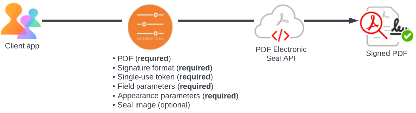

# Quickstarts

Before getting started with [PDF Electronic Seal API](/overview/pdf-electronic-seal-api/#what-is-pdf-electronic-seal), verify the [prerequisites](prerequisites.md). 

Whether using the REST API or the PDF Services SDK, using the PDF Electronic Seal API involves simply calling the API with the appropriate parameters. 



## Parameters

### Signature Format (*Required*)

Specifies a supported digital signature format:

* PADES : This is the latest and improved format which is strict, concrete, and secure. For details, see [ETSI TS 102 778-3](https://www.etsi.org/deliver/etsi_ts/102700_102799/10277803/01.02.01_60/ts_10277803v010201p.pdf)  
* PKCS#7 : PKCS #7 signature is less stringent than PADES since it permits more PDF changes without invalidating the digital signature. For details, see [ISO 32000-1](https://opensource.adobe.com/dc-acrobat-sdk-docs/standards/pdfstandards/pdf/PDF32000_2008.pdf)

### TSP Credential Information (*Required*)  

TSP parameters encapsulate the signer's [certificate credential](/overview/pdf-electronic-seal-api/prerequisites/#1-procure-certificate-credentials) as well as the associated authentication and authorization data.

* **TSP Name**  (*Required*): Specifies the name of the Trust Service Provider used to generate the certificate.
* **TSP Credential Id**  (*Required*): Specifies the digital ID stored with the TSP provider that should be used for signing.
* **TSP Authorization Context**  (*Required*): Encapsulates the service authorization data required to communicate with the TSP and access CSC provider APIs.

  * **Access Token**  (*Required*): Specifies the service access token used to authorize access to the CSC provider hosted APIs.
  * **Token Type**: Specifies the type of service token which is Bearer.

* **TSP Credential Authorization Parameter**  (*Required*): Encapsulates the credential's authorization information required to authorize access to their signing keys.
* **PIN**  (*Required*): Specifies the PIN associated with credential ID.

### Seal Field Parameters   (*Required*)

The seal field parameters are required to create a new unsigned signature field or sign an existing field.

* **Field Name**  (*Required*): The signature field's name.
* **Visibility**: Specifies whether the signature field is visible. The default value of `true` creates a visible signature
* **Page Number**  (*Required*): Specifies the number of the pages to which the signature field should be attached.
* **Location**  (*Required*): Specifies the coordinates of the signature appearance's bounding box in default PDF user space units.

  * **Left**  (*Required*): The left x-coordinate
  * **Bottom**  (*Required*): The bottom y-coordinate
  * **Right**  (*Required*): The right x-coordinate
  * **Top**  (*Required*)The top y-coordinate

### Seal Appearance Parameters

Specifies signature field appearance parameters. These are an enum set of display items: NAME, DATE, LOGO, DISTINGUISHED_NAME, LABELS. Specifies the information to display in the signature.

* **NAME**: Specifies that the signer's name should be displayed in the signature appearance.This is a default value.
   
* **DATE**: Specifies that the signing date/time should be displayed in the signature appearance. This option only controls whether the value of the 
   time/date in the signature dictionary is displayed or not. This value should not be mistaken for a signed timestamp from a timestamp authority.
   
* **DISTINGUISHED_NAME**: Specifies that the distinguished name information from the signer's certificate should be displayed in the signature appearance.
   
* **LABELS**: Specifies that text labels should be displayed in the signature appearance. This is a default value.
   
* **SEAL_IMAGE**: Specifies that the seal image should be displayed in the signature appearance. If a seal image, not supplied in the request body, the default Acrobat trefoil image is used.
    

## Workflows

There are two ways to access PDF Electronic Seal API: via the REST API or with the PDF Services SDKs. 

### REST API

Clients using the REST API must perform the following: 

1. [Generate asset IDs for all the input documents](https://developer-stage.adobe.com/document-services/docs/apis/#tag/Assets).
1. Call the `/asset` API with `mediaType` in the request specifying the document upload type. For example, `application/pdf`. The API responds with an asset ID and upload URI. 
1. Request to upload the input document to the upload URI.
1. Invoke PDF Electronic Seal API (/pdf-services/operation/electronicseal) by providing the asset IDs generated in step 1 and other required sealing parameters. In the response, the client receives the job URI in the location header. [Details](https://developer-stage.adobe.com/document-services/docs/apis/#operation/pdfoperations.electronicseal).
1. Use the job URI to poll the status of the submitted job (Electronic Seal operation). The response includes a job status: *In progress* *Failed*, *Done*. If the status is done, the seal API returns an asset ID and download URI. **This URL is only valid for 24 hours**.
1. Download the digitally signed pdf.


**Example JSON**

```json
{
  "signatureFormat": "PADES",
  "cscCredentialOptions": {
    "authorizationContext": {
      "accessToken": "<ACCESS TOKEN>",
      "tokenType": "Bearer"
    },
    "credentialAuthParameters": {
      "pin": "<PIN>"
    },
    "providerName": "<PROVIDER_NAME>",
    "credentialId": "<CREDENTIAL_ID>"
  },
  "sealFieldOptions": {
    "pageNumber": 1,
    "fieldName": "Signature",
    "visible": true,
    "location": {
      "top": 300,
      "bottom": 250,
      "left": 300,
      "right": 500
    }
  },
  "sealAppearanceOptions": {
    "displayOptions": [
      "DATE",
      "LOGO",
      "DISTINGUISHED_NAME",
      "SEAL_IMAGE"
    ]
  }
}
```

### PDF Services]

Clients can also access the PDF Electronic Seal API via one of the PDF Services SDKs (JAVA, NodeJS, DotNet). For additional details, see [Quickstarts](https://developer-stage.adobe.com/document-services/docs/overview/pdf-services-api/).

Clients using the PDF Services SDKs must perform the following: 

1. Save the input document and seal image on the local machine. File paths must be absolute.
1. Save the `pdfservices-api-credentials.json` file created after [generating credentials](https://developer.adobe.com/document-services/docs/overview/pdf-services-api/#authentication)
1. Make a call to the PDF Service that includes the following: 

* The file path to an input PDF (from the local machine). 
* Required parameters
* Specify an optional file path to a logo/watermark/background image used as part of the signature field's signed appearance. Supported formats include: 

  * application/pdf
  * image/jpeg
  * image/png

1. The the API responds with an output URL to the signed PDF, save the signed PDF. **This URL is only valid for 24 hours**.

Use the samples below to generate a PDF with an electronic seal.

<CodeBlock slots="heading, code" repeat="4" languages="Java, .NET, Node JS, Rest API" /> 

##### Java

```javascript
// Get the samples from https://www.adobe.com/go/pdftoolsapi_java_samples
// Run the sample:
// mvn -f pom.xml exec:java -Dexec.mainClass=com.adobe.pdfservices.operation.samples.electronicseal.ESealWithCustomAppearanceOptions

package com.adobe.pdfservices.operation.samples.electronicseal;

public class ESealWithCustomAppearanceOptions {

    // Initialize the logger.
    private static final Logger LOGGER = LoggerFactory.getLogger(ESealWithCustomAppearanceOptions.class);

    public static void main(String[] args) {
        try {

            // Initial setup, create credentials instance.
            Credentials credentials = Credentials.serviceAccountCredentialsBuilder()
                    .fromFile("pdfservices-api-credentials.json")
                    .build();

            // Create an ExecutionContext using credentials.
            ExecutionContext executionContext = ExecutionContext.create(credentials);

            //Get the input document to perform the sealing operation
            FileRef sourceFile = FileRef.createFromLocalFile("src/main/resources/Invoice.pdf");

            //Get the background seal image for signature , if required.
            FileRef sealImageFile = FileRef.createFromLocalFile("src/main/resources/sealImage.jpeg");

            //Create SealAppearanceOptions and add the required signature appearance items
            SealAppearanceOptions sealAppearanceOptions = new SealAppearanceOptions();
            sealAppearanceOptions.addAppearanceItem(SealAppearanceItem.NAME);
            sealAppearanceOptions.addAppearanceItem(SealAppearanceItem.LABELS);
            sealAppearanceOptions.addAppearanceItem(SealAppearanceItem.DATE);
            sealAppearanceOptions.addAppearanceItem(SealAppearanceItem.SEAL_IMAGE);
            sealAppearanceOptions.addAppearanceItem(SealAppearanceItem.DISTINGUISHED_NAME);

            //Set the Seal Field Name to be created in input PDF document.
            String signFieldName = "<SEAL_FIELD_NAME>";

            //Set the page number in input document for applying seal.
            Integer signPageNumber = 1;

            //Set if seal should be visible or invisible.
            Boolean sealVisible = true;

            //Create SealFieldLocationOptions instance and set the coordinates for applying signature
            SealFieldLocationOptions signatureLocation = new SealFieldLocationOptions(150, 250, 350, 200);

            //Create SealFieldOptions instance with required details.
            SealFieldOptions sealFieldOptions = new SealFieldOptions.Builder(signatureLocation, signPageNumber, signFieldName)
                    .setVisible(sealVisible)
                    .build();

            //Set the name of TSP Provider being used.
            String providerName = "<PROVIDER_NAME>";

            //Set the access token to be used to access TSP provider hosted APIs.
            String accessToken = "<ACCESS TOKEN>";

            //Set the credential ID.
            String credentialID = "<CREDENTIAL_ID>";

            //Set the PIN generated while creating credentials.
            String credentialPin = "<PIN>";

            //Create SealCredentialOptions instance with required certificate details.
            SealCredentialOptions sealCredentialOptions = new  CSCCredentialOptions.Builder(providerName, credentialID, credentialPin, accessToken).setTokenType("Bearer").build();

            //Create SealingOptions instance with all the sealing parameters.
            SealOptions sealOptions = new SealOptions.Builder(SignatureFormat.PKCS7, sealCredentialOptions,
                    sealFieldOptions).setSealAppearanceOptions(sealAppearanceOptions).build();

            //Create a PDFElectronicSealOptions instance using the SealOptions instance
            PDFElectronicSealOptions pdfElectronicSealOptions = new PDFElectronicSealOptions(sealOptions);

            //Create the PDFElectronicSealOperation instance using the PDFElectronicSealOptions instance
            PDFElectronicSealOperation pdfElectronicSealOperation = PDFElectronicSealOperation.createNew(pdfElectronicSealOptions);

            //Set the input source file for PDFElectronicSealOperation instance
            pdfElectronicSealOperation.setInputDocument(sourceFile);

            //Set the optional input seal image for PDFElectronicSealOperation instance
            pdfElectronicSealOperation.setSealImage(sealImageFile);

            //Execute the operation
            FileRef result = pdfElectronicSealOperation.execute(executionContext);

            //Save the output at specified location
            result.saveAs("output/sealedOutputWithAllAppearanceOptions.pdf");


        } catch (ServiceApiException | IOException | SdkException | ServiceUsageException ex) {
            LOGGER.error("Exception encountered while executing operation", ex);
        }
    }
}

```

##### Node JS

```javascript
// Get the samples from http://www.adobe.com/go/pdftoolsapi_node_sample
// Run the sample:
// node src/electronicseal/eseal-with-custom-appearance-options.js

const PDFServicesSdk = require('@adobe/pdfservices-node-sdk');

try {

    // Initial setup, create credentials instance.
    const credentials =  PDFServicesSdk.Credentials
        .serviceAccountCredentialsBuilder()
        .fromFile("pdfservices-api-credentials.json")
        .build();

    // Create an ExecutionContext using credentials
    const executionContext = PDFServicesSdk.ExecutionContext.create(credentials);

    const electronicSeal = PDFServicesSdk.PDFElectronicSeal,
        Options = electronicSeal.options;

    //Get the input document to perform the sealing operation
    const inputDoc = PDFServicesSdk.FileRef.createFromLocalFile('resources/Invoice.pdf'),

        //Get the background seal image for signature , if required.
        sealImage = PDFServicesSdk.FileRef.createFromLocalFile('resources/sealImage.jpeg');

    //Create SealAppearanceOptions and add the required signature appearance items
    sealAppearanceOptions = new Options.SealAppearanceOptions();
    sealAppearanceOptions.addAppearanceItem(Options.SealAppearanceOptions.SealAppearanceItem.NAME);
    sealAppearanceOptions.addAppearanceItem(Options.SealAppearanceOptions.SealAppearanceItem.LABELS);
    sealAppearanceOptions.addAppearanceItem(Options.SealAppearanceOptions.SealAppearanceItem.DATE);
    sealAppearanceOptions.addAppearanceItem(Options.SealAppearanceOptions.SealAppearanceItem.SEAL_IMAGE);
    sealAppearanceOptions.addAppearanceItem(Options.SealAppearanceOptions.SealAppearanceItem.DISTINGUISHED_NAME);

    // Set the Seal Field Name to be created in input PDF document.
    signFieldName = "SealField";

    // Set the page number in input document for applying seal.
    signPageNumber = 1;

    // Set if seal should be visible or invisible.
    sealVisible = true;

    // Create a Seal Field Options
    sealFieldLocationOptions = new Options.SealFieldLocationOptions(150,250,350,200);
    sealFieldOptions = new Options.SealFieldOptions.Builder(signFieldName, signPageNumber, sealFieldLocationOptions)
        .setVisible(sealVisible)
        .build();

    //Set the name of TSP Provider being used.
    providerName = "<PROVIDER_NAME>";

    //Set the access token to be used to access TSP provider hosted APIs.
    accessToken = "<ACCESS TOKEN>";

    //Set the credential ID.
    credentialID = "<CREDENTIAL_ID>";

    //Set the PIN generated while creating credentials.
    credentialPin = "<PIN>";

    //Create SealCredentialOptions instance with required certificate details.
    sealCredentialOptions = new Options.CSCCredentialOptions.Builder(providerName, credentialID, credentialPin, accessToken)
        .setTokenType("Bearer")
        .build();

    //Create SealingOptions instance with all the sealing parameters.
    sealOptions = new Options.SealOptions.Builder(Options.SealOptions.SignatureFormat.PKCS7, sealCredentialOptions, sealFieldOptions)
        .build()

    //Create a PDFElectronicSealOptions instance using the SealOptions instance
    pdfElectronicSealOptions = new Options.PDFElectronicSealOptions(sealOptions);

    // Create a new operation instance using the options instance
    const electronicSealOperation = electronicSeal.Operation.createNew(pdfElectronicSealOptions);

    // Set Operation Input Parameters
    electronicSealOperation.setInputDocument(inputDoc);
    electronicSealOperation.setSealImage(sealImage);

    // Execute the operation and Save the result to the specified location.
    electronicSealOperation.execute(executionContext);

} catch (err) {
    console.log('Exception encountered while executing operation', err);
}

```

##### .NET

```javascript
// Get the samples from https://www.adobe.com/go/pdftoolsapi_net_samples
// Run the sample:
// cd ESealWithCustomAppearanceOptions/
// dotnet run ESealWithCustomAppearanceOptions.csproj

namespace ESealWithCustomAppearanceOptions
{
    public class Program
    {
        private static readonly ILog log = LogManager.GetLogger(typeof(Program));

        static void Main(string[] args)
        {
            //Configure the logging
            ConfigureLogging();

            try
            {
                // Initial setup, create credentials instance.
                Credentials credentials = Credentials.ServiceAccountCredentialsBuilder()
                                .FromFile("C:/git/a/Adobe.DocumentCloud.CPF.Services.SDK.Samples/ESealWithCustomAppearanceOptions/pdfservices-api-credentials.json")
                                .Build();


                //Create an ExecutionContext using credentials and create a new operation instance.
                ExecutionContext executionContext = ExecutionContext.Create(credentials);

                //Get the input document to perform the sealing operation
                FileRef sourceFile = FileRef.CreateFromLocalFile("C:/git/a/Adobe.DocumentCloud.CPF.Services.SDK.Samples/ESealWithCustomAppearanceOptions/combineFilesInput1.pdf");

                //Get the background seal image for signature , if required.
                FileRef sealImageFile = FileRef.CreateFromLocalFile("C:/git/a/Adobe.DocumentCloud.CPF.Services.SDK.Samples/ESealWithCustomAppearanceOptions/combineFilesInput1.pdf");

                //Create SealAppearanceOptions and add the required signature appearance items
                SealAppearanceOptions sealAppearanceOptions = new SealAppearanceOptions();
                sealAppearanceOptions.AddAppearanceItem(SealAppearanceItem.NAME);
                sealAppearanceOptions.AddAppearanceItem(SealAppearanceItem.LABELS);
                sealAppearanceOptions.AddAppearanceItem(SealAppearanceItem.DATE);
                sealAppearanceOptions.AddAppearanceItem(SealAppearanceItem.SEAL_IMAGE);
                sealAppearanceOptions.AddAppearanceItem(SealAppearanceItem.DISTINGUISHED_NAME);

                //Set the Seal Field Name to be created in input PDF document.
                string signFieldName = "<SEAL_FIELD_NAME>";

                //Set the page number in input document for applying seal.
                int signPageNumber = 1;

                //Set if seal should be visible or invisible.
                bool sealVisible = true;

                //Create SealFieldLocationOptions instance and set the coordinates for applying signature
                SealFieldLocationOptions signatureLocation = new SealFieldLocationOptions(150, 250, 350, 200);

                //Create SealFieldOptions instance with required details.
                SealFieldOptions sealFieldOptions = new SealFieldOptions.Builder(signatureLocation, signPageNumber, signFieldName)
                        .SetVisible(sealVisible)
                        .Build();

                //Set the name of TSP Provider being used.
                string providerName = "<PROVIDER_NAME>";

                //Set the access token to be used to access TSP provider hosted APIs.
                string accessToken = "<ACCESS TOKEN>";

                //Set the credential ID.
                string credentialID = "<CREDENTIAL_ID>";

                //Set the PIN generated while creating credentials.
                string credentialPin = "<PIN>";

                //Create SealCredentialOptions instance with required certificate details.
                SealCredentialOptions sealCredentialOptions = new CSCCredentialOptions.Builder(providerName, credentialID, credentialPin, accessToken).SetTokenType("Bearer").Build();

                //Create SealingOptions instance with all the sealing parameters.
                SealOptions sealOptions = new SealOptions.Builder(SignatureFormat.PKCS7, sealCredentialOptions,
                        sealFieldOptions).SetSealAppearanceOptions(sealAppearanceOptions).Build();

                //Create a PDFElectronicSealOptions instance using the SealOptions instance
                PDFElectronicSealOptions pdfElectronicSealOptions = new PDFElectronicSealOptions(sealOptions);

                //Create the PDFElectronicSealOperation instance using the PDFElectronicSealOptions instance
                PDFElectronicSealOperation pdfElectronicSealOperation = PDFElectronicSealOperation.CreateNew(pdfElectronicSealOptions);

                //Set the input source file for PDFElectronicSealOperation instance
                pdfElectronicSealOperation.SetInputDocument(sourceFile);

                //Set the optional input seal image for PDFElectronicSealOperation instance
                pdfElectronicSealOperation.SetSealImage(sealImageFile);

                //Execute the operation
                FileRef result = pdfElectronicSealOperation.Execute(executionContext);

                //Save the output at specified location
                result.SaveAs("output/sealedOutputWithAllAppearanceOptions.pdf");

            }
            catch (ServiceUsageException ex)
            {
                log.Error("Exception encountered while executing operation", ex);
            }
            catch (ServiceApiException ex)
            {
                log.Error("Exception encountered while executing operation", ex);
            }
            catch (SDKException ex)
            {
                log.Error("Exception encountered while executing operation", ex);
            }
            catch (IOException ex)
            {
                log.Error("Exception encountered while executing operation", ex);
            }
            catch (Exception ex)
            {
                log.Error("Exception encountered while executing operation", ex);
            }

        }

        static void ConfigureLogging()
        {
            ILoggerRepository logRepository = LogManager.GetRepository(Assembly.GetEntryAssembly());
            XmlConfigurator.Configure(logRepository, new FileInfo("log4net.config"));
        }
    }
}

```

##### REST API

```javascript
curl --location --request POST 'https://pdf-services-dev.adobe.io/operation/electronicseal'
--header 'Authorization: Bearer {{Placeholder for token}}'
--header 'Accept: application/json, text/plain, */*'
--header 'x-api-key: {{Placeholder for client_id}}'
--header 'Content-Type: application/json'
--data-raw '{
    "documentassetID" : "<ASSET_ID>",
    "logoInassetID" : "<ASSET_ID>",
    "signatureInassetID" : "<ASSET_ID>",
    "sealingOptions" : {
        "signatureType": "SIGN",
        "signatureFormat": "PADES",
        "cscCredentialInfo": {
            "authorizationContext": {
                "accessToken": "<ACCESS TOKEN>",
                "tokenType": "Bearer"
            },
            "credentialAuthParameters": {
                "pin": "<PIN>"
            },
            "providerName": "<PROVIDER_NAME>",
            "credentialId": "<CREDENTIAL_ID>"
        },
        "signatureFieldOptions": {
            "pageNumber": 1,
            "fieldName": "Signature",
            "visible": true,
            "location": {
                "top": 300,
                "bottom": 250,
                "left": 300,
                "right": 500
            }
        },
        "signatureAppearanceOptions": {
            "displayOptions": [
            "DATE",
            "LOGO",
            "DISTINGUISHED_NAME"
            ]
        }
    }
}'
```


