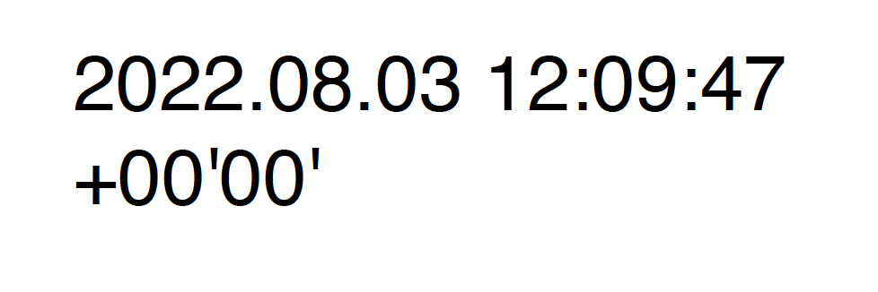

# Quickstarts

Before getting started with [PDF Electronic Seal API](/overview/pdf-electronic-seal-api/#what-is-pdf-electronic-seal), make sure all the [Prerequisites](prerequisites.md) are met. 

## Workflow


## How-to Guide

### 1. Configure Sealing Parameters.

#### Signature Format <span style="color:red">*</span>

<details>
<summary>Click here</summary>

Specifies the format of the digital signature. API supports below formats
* PADES : This is the latest and improved format which is more strict, concrete and secure.
          For more details refer to, [ETSI TS 102 778-3](https://www.etsi.org/deliver/etsi_ts/102700_102799/10277803/01.02.01_60/ts_10277803v010201p.pdf)  
* PKCS#7 : PKCS #7 signature is comparatively more relaxed and it's possible to change more things in PDF without invalidating digital signatures.
           For more details refer to, [ISO 32000-1](https://opensource.adobe.com/dc-acrobat-sdk-docs/standards/pdfstandards/pdf/PDF32000_2008.pdf)

</details>

#### Trust Service Provider's (TSP) Credential Information <span style="color:red">*</span>  

<details>
<summary>Click here</summary>

Encapsulates the [certificate credential](/overview/pdf-electronic-seal-api/prerequisites/#1-procure-certificate-credentials) to be used 
for signing, and the associated authentication and authorization data.

* **TSP Name**<span style="color:red">*</span>
<br/>Specifies the name of the Trust Service Provider used to generate the certificate.

* **TSP Credential Id**<span style="color:red">*</span>
<br/>Specifies the Digital ID stored with the TSP provider that should be used for signing.

* **TSP Authorization Context**<span style="color:red">*</span>
<br/>Encapsulates the service authorization data required to communicate with the TSP and access CSC provider APIs.

  * **Access Token**<span style="color:red">*</span>
  <br/>Specifies the service access token used to authorize access to the CSC provider hosted APIs.
   
  * **Token Type**
  <br/>Specifies the type of service token which is Bearer.

* **TSP Credential Authorization Parameter**<span style="color:red">*</span>
<br/>Encapsulates the credential's authorization information required to authorize access to their signing keys.

   * **PIN**<span style="color:red">*</span>
   <br/>Specifies the PIN associated with credential id.

</details>

#### Seal Field Parameters <span style="color:red">*</span>

<details>
<summary>Click here</summary>

Encapsulates the parameters required to create a new unsigned signature field or sign an existing field.

* **Field Name**<span style="color:red">*</span>
<br/>Specified the field name for the signature field.
* **Visibility**
<br/>Specified whether the signature field is visible or not. Set to true to create a visible signature. Set to false to 
create an invisible (hidden) signature. The default value is true.
* **Page Number**<span style="color:red">*</span>
<br/>Specifies the number of the page to which the signature field should be attached.
* **Location**<span style="color:red">*</span>
<br/>Encapsulates the parameters related to the location of the signature field.

  * **Left**<span style="color:red">*</span>
  <br/>Specifies the left-most x-coordinate of the signature appearance's bounding box in default PDF user 
    space units.
  * **Bottom**<span style="color:red">*</span>
  <br/>Specifies the bottom-most y-coordinate of the signature appearance's bounding box in default PDF user 
    space units.
  * **Right**<span style="color:red">*</span>
  <br/>Specifies the right-most x-coordinate of the signature appearance's bounding box in default PDF user 
    space units.
  * **Top**<span style="color:red">*</span>
  <br/>Specifies the top-most y-coordinate of the signature appearance's bounding box in default PDF user 
    space units.

</details>

#### Seal Appearance Parameters

<details>
<summary>Click here</summary>

Encapsulates the parameters related to the appearance of the signature field

   * **Display Parameters**<span style="color:red">*</span>
   <br/>An enum set of display items: NAME, DATE, LOGO, DISTINGUISHED_NAME, LABELS. Specifies the information to display in the signature.
   <br/> 
   
   **NAME** - Specifies that the signer's name should be displayed in the signature appearance.This is a default value.<br/> 
   
   
   **DATE** - Specifies that the signing date/time should be displayed in the signature appearance. This option only controls whether the value of the 
   time/date in the signature dictionary is displayed or not. This value should not be mistaken for a signed timestamp 
   from a timestamp authority. <br/> 
   
   
   **DISTINGUISHED_NAME** - Specifies that the distinguished name information from the 
   signer's certificate should be displayed in the signature appearance. <br/>
   
   
   **LABELS** - Specifies that text labels should 
   be displayed in the signature appearance. This is a default value. <br/>
   
   
   **SEAL_IMAGE** - Specifies that the seal image should be 
   displayed in the signature appearance. If a seal image, not supplied in the request body, the default Acrobat trefoil image is used. <br/>
    

</details>

**Example JSON**
```json
{
  "signatureFormat": "PADES",
  "cscCredentialOptions": {
    "authorizationContext": {
      "accessToken": "<ACCESS TOKEN>",
      "tokenType": "Bearer"
    },
    "credentialAuthParameters": {
      "pin": "<PIN>"
    },
    "providerName": "<PROVIDER_NAME>",
    "credentialId": "<CREDENTIAL_ID>"
  },
  "sealFieldOptions": {
    "pageNumber": 1,
    "fieldName": "Signature",
    "visible": true,
    "location": {
      "top": 300,
      "bottom": 250,
      "left": 300,
      "right": 500
    }
  },
  "sealAppearanceOptions": {
    "displayOptions": [
      "DATE",
      "LOGO",
      "DISTINGUISHED_NAME",
      "SEAL_IMAGE"
    ]
  }
}
```

### 2. Generate digitally signed PDF using PDF Electronic Seal API
PDF Electronic Seal API is invoked after interacting with third-party dependencies, configuring sealing parameters and collating 
required input data to form the request. The request-id generated in the response headers can be polled anytime 
to retrieve the status and asset ID of the output signed PDF. <br/>

There are two ways to access PDF Electronic Seal API:

#### **2.1 REST API**
You can use our cloud based [REST API](../../../apis/#tag/electronicseal) to generate seal on PDF documents.

<InlineAlert slots="text"/>

Before you begin with the REST API, refer to [How To Get Started](https://documentcloud.adobe.com/document-services/index.html#how-to-get-started-) to learn more about generating the required credentials and invoking the APIs.

**INPUT DOCUMENTS** <br/>

**PDF Document**<span style="color:red">*</span> <br/>
Specifies asset ID generated after uploading input PDF document on which seal has to be applied.<br/>
For uploading the document, refer to [Asset Upload](https://wiki.corp.adobe.com/pages/viewpage.action?pageId=2589901901#CustomTempstorage(forDCPlatformAPIs)-Upload/downloadassets).

**Seal Image** <br/>
Specifies asset ID generated after uploading the logo/watermark/background image used as part of the 
signature field's signed appearance. The format of the asset should be among 
the below format.
1. application/pdf
2. image/jpeg
3. image/png

For uploading the document, refer to [Asset Upload](https://wiki.corp.adobe.com/pages/viewpage.action?pageId=2589901901#CustomTempstorage(forDCPlatformAPIs)-Upload/downloadassets).

#### **2.2 PDF Services JAVA SDK**
Alternatively, you can use our offering through [PDF Services SDK](../pdf-services-api#sdk).

<InlineAlert slots="text"/>

To get started with PDF Services SDK, refer to [Quickstarts](../pdf-services-api).

**INPUT DOCUMENTS** <br/>

**PDF Document**<span style="color:red">*</span> <br/>
Specifies the file path for input PDF document on which seal has to be applied.

**Seal Image** <br/>
Specifies the file path for the logo/watermark/background image used as part of the 
signature field's signed appearance. Below are the supported file formats:

1. application/pdf
2. image/jpeg
3. image/png

<br/>

#### Generate PDF with Electronic Seal

The sample below generates the output PDF document with Electronic Seal.

<CodeBlock slots="heading, code" repeat="4" languages="Java, .NET, Node JS, Rest API" /> 

##### Java

```javascript
// Get the samples from https://www.adobe.com/go/pdftoolsapi_java_samples
// Run the sample:
// mvn -f pom.xml exec:java -Dexec.mainClass=com.adobe.pdfservices.operation.samples.electronicseal.ESealWithCustomAppearanceOptions

package com.adobe.pdfservices.operation.samples.electronicseal;

public class ESealWithCustomAppearanceOptions {

    // Initialize the logger.
    private static final Logger LOGGER = LoggerFactory.getLogger(ESealWithCustomAppearanceOptions.class);

    public static void main(String[] args) {
        try {

            // Initial setup, create credentials instance.
            Credentials credentials = Credentials.serviceAccountCredentialsBuilder()
                    .fromFile("pdfservices-api-credentials.json")
                    .build();

            // Create an ExecutionContext using credentials.
            ExecutionContext executionContext = ExecutionContext.create(credentials);

            //Get the input document to perform the sealing operation
            FileRef sourceFile = FileRef.createFromLocalFile("src/main/resources/Invoice.pdf");

            //Get the background seal image for signature , if required.
            FileRef sealImageFile = FileRef.createFromLocalFile("src/main/resources/sealImage.jpeg");

            //Create SealAppearanceOptions and add the required signature appearance items
            SealAppearanceOptions sealAppearanceOptions = new SealAppearanceOptions();
            sealAppearanceOptions.addAppearanceItem(SealAppearanceItem.NAME);
            sealAppearanceOptions.addAppearanceItem(SealAppearanceItem.LABELS);
            sealAppearanceOptions.addAppearanceItem(SealAppearanceItem.DATE);
            sealAppearanceOptions.addAppearanceItem(SealAppearanceItem.SEAL_IMAGE);
            sealAppearanceOptions.addAppearanceItem(SealAppearanceItem.DISTINGUISHED_NAME);

            //Set the Seal Field Name to be created in input PDF document.
            String signFieldName = "<SEAL_FIELD_NAME>";

            //Set the page number in input document for applying seal.
            Integer signPageNumber = 1;

            //Set if seal should be visible or invisible.
            Boolean sealVisible = true;

            //Create SealFieldLocationOptions instance and set the coordinates for applying signature
            SealFieldLocationOptions signatureLocation = new SealFieldLocationOptions(150, 250, 350, 200);

            //Create SealFieldOptions instance with required details.
            SealFieldOptions sealFieldOptions = new SealFieldOptions.Builder(signatureLocation, signPageNumber, signFieldName)
                    .setVisible(sealVisible)
                    .build();

            //Set the name of TSP Provider being used.
            String providerName = "<PROVIDER_NAME>";

            //Set the access token to be used to access TSP provider hosted APIs.
            String accessToken = "<ACCESS TOKEN>";

            //Set the credential ID.
            String credentialID = "<CREDENTIAL_ID>";

            //Set the PIN generated while creating credentials.
            String credentialPin = "<PIN>";

            //Create SealCredentialOptions instance with required certificate details.
            SealCredentialOptions sealCredentialOptions = new  CSCCredentialOptions.Builder(providerName, credentialID, credentialPin, accessToken).setTokenType("Bearer").build();

            //Create SealingOptions instance with all the sealing parameters.
            SealOptions sealOptions = new SealOptions.Builder(SignatureFormat.PKCS7, sealCredentialOptions,
                    sealFieldOptions).setSealAppearanceOptions(sealAppearanceOptions).build();

            //Create a PDFElectronicSealOptions instance using the SealOptions instance
            PDFElectronicSealOptions pdfElectronicSealOptions = new PDFElectronicSealOptions(sealOptions);

            //Create the PDFElectronicSealOperation instance using the PDFElectronicSealOptions instance
            PDFElectronicSealOperation pdfElectronicSealOperation = PDFElectronicSealOperation.createNew(pdfElectronicSealOptions);

            //Set the input source file for PDFElectronicSealOperation instance
            pdfElectronicSealOperation.setInputDocument(sourceFile);

            //Set the optional input seal image for PDFElectronicSealOperation instance
            pdfElectronicSealOperation.setSealImage(sealImageFile);

            //Execute the operation
            FileRef result = pdfElectronicSealOperation.execute(executionContext);

            //Save the output at specified location
            result.saveAs("output/sealedOutputWithAllAppearanceOptions.pdf");


        } catch (ServiceApiException | IOException | SdkException | ServiceUsageException ex) {
            LOGGER.error("Exception encountered while executing operation", ex);
        }
    }
}

```

##### Node JS

```javascript
// Get the samples from http://www.adobe.com/go/pdftoolsapi_node_sample
// Run the sample:
// node src/electronicseal/eseal-with-custom-appearance-options.js

const PDFServicesSdk = require('@adobe/pdfservices-node-sdk');

try {

    // Initial setup, create credentials instance.
    const credentials =  PDFServicesSdk.Credentials
        .serviceAccountCredentialsBuilder()
        .fromFile("pdfservices-api-credentials.json")
        .build();

    // Create an ExecutionContext using credentials
    const executionContext = PDFServicesSdk.ExecutionContext.create(credentials);

    const electronicSeal = PDFServicesSdk.PDFElectronicSeal,
        Options = electronicSeal.options;

    //Get the input document to perform the sealing operation
    const inputDoc = PDFServicesSdk.FileRef.createFromLocalFile('resources/Invoice.pdf'),

        //Get the background seal image for signature , if required.
        sealImage = PDFServicesSdk.FileRef.createFromLocalFile('resources/sealImage.jpeg');

    //Create SealAppearanceOptions and add the required signature appearance items
    sealAppearanceOptions = new Options.SealAppearanceOptions();
    sealAppearanceOptions.addAppearanceItem(Options.SealAppearanceOptions.SealAppearanceItem.NAME);
    sealAppearanceOptions.addAppearanceItem(Options.SealAppearanceOptions.SealAppearanceItem.LABELS);
    sealAppearanceOptions.addAppearanceItem(Options.SealAppearanceOptions.SealAppearanceItem.DATE);
    sealAppearanceOptions.addAppearanceItem(Options.SealAppearanceOptions.SealAppearanceItem.SEAL_IMAGE);
    sealAppearanceOptions.addAppearanceItem(Options.SealAppearanceOptions.SealAppearanceItem.DISTINGUISHED_NAME);

    // Set the Seal Field Name to be created in input PDF document.
    signFieldName = "SealField";

    // Set the page number in input document for applying seal.
    signPageNumber = 1;

    // Set if seal should be visible or invisible.
    sealVisible = true;

    // Create a Seal Field Options
    sealFieldLocationOptions = new Options.SealFieldLocationOptions(150,250,350,200);
    sealFieldOptions = new Options.SealFieldOptions.Builder(signFieldName, signPageNumber, sealFieldLocationOptions)
        .setVisible(sealVisible)
        .build();

    //Set the name of TSP Provider being used.
    providerName = "<PROVIDER_NAME>";

    //Set the access token to be used to access TSP provider hosted APIs.
    accessToken = "<ACCESS TOKEN>";

    //Set the credential ID.
    credentialID = "<CREDENTIAL_ID>";

    //Set the PIN generated while creating credentials.
    credentialPin = "<PIN>";

    //Create SealCredentialOptions instance with required certificate details.
    sealCredentialOptions = new Options.CSCCredentialOptions.Builder(providerName, credentialID, credentialPin, accessToken)
        .setTokenType("Bearer")
        .build();

    //Create SealingOptions instance with all the sealing parameters.
    sealOptions = new Options.SealOptions.Builder(Options.SealOptions.SignatureFormat.PKCS7, sealCredentialOptions, sealFieldOptions)
        .build()

    //Create a PDFElectronicSealOptions instance using the SealOptions instance
    pdfElectronicSealOptions = new Options.PDFElectronicSealOptions(sealOptions);

    // Create a new operation instance using the options instance
    const electronicSealOperation = electronicSeal.Operation.createNew(pdfElectronicSealOptions);

    // Set Operation Input Parameters
    electronicSealOperation.setInputDocument(inputDoc);
    electronicSealOperation.setSealImage(sealImage);

    // Execute the operation and Save the result to the specified location.
    electronicSealOperation.execute(executionContext);

} catch (err) {
    console.log('Exception encountered while executing operation', err);
}

```

##### .NET

```javascript
// Get the samples from https://www.adobe.com/go/pdftoolsapi_net_samples
// Run the sample:
// cd ESealWithCustomAppearanceOptions/
// dotnet run ESealWithCustomAppearanceOptions.csproj

namespace ESealWithCustomAppearanceOptions
{
    public class Program
    {
        private static readonly ILog log = LogManager.GetLogger(typeof(Program));

        static void Main(string[] args)
        {
            //Configure the logging
            ConfigureLogging();

            try
            {
                // Initial setup, create credentials instance.
                Credentials credentials = Credentials.ServiceAccountCredentialsBuilder()
                                .FromFile("C:/git/a/Adobe.DocumentCloud.CPF.Services.SDK.Samples/ESealWithCustomAppearanceOptions/pdfservices-api-credentials.json")
                                .Build();


                //Create an ExecutionContext using credentials and create a new operation instance.
                ExecutionContext executionContext = ExecutionContext.Create(credentials);

                //Get the input document to perform the sealing operation
                FileRef sourceFile = FileRef.CreateFromLocalFile("C:/git/a/Adobe.DocumentCloud.CPF.Services.SDK.Samples/ESealWithCustomAppearanceOptions/combineFilesInput1.pdf");

                //Get the background seal image for signature , if required.
                FileRef sealImageFile = FileRef.CreateFromLocalFile("C:/git/a/Adobe.DocumentCloud.CPF.Services.SDK.Samples/ESealWithCustomAppearanceOptions/combineFilesInput1.pdf");

                //Create SealAppearanceOptions and add the required signature appearance items
                SealAppearanceOptions sealAppearanceOptions = new SealAppearanceOptions();
                sealAppearanceOptions.AddAppearanceItem(SealAppearanceItem.NAME);
                sealAppearanceOptions.AddAppearanceItem(SealAppearanceItem.LABELS);
                sealAppearanceOptions.AddAppearanceItem(SealAppearanceItem.DATE);
                sealAppearanceOptions.AddAppearanceItem(SealAppearanceItem.SEAL_IMAGE);
                sealAppearanceOptions.AddAppearanceItem(SealAppearanceItem.DISTINGUISHED_NAME);

                //Set the Seal Field Name to be created in input PDF document.
                string signFieldName = "<SEAL_FIELD_NAME>";

                //Set the page number in input document for applying seal.
                int signPageNumber = 1;

                //Set if seal should be visible or invisible.
                bool sealVisible = true;

                //Create SealFieldLocationOptions instance and set the coordinates for applying signature
                SealFieldLocationOptions signatureLocation = new SealFieldLocationOptions(150, 250, 350, 200);

                //Create SealFieldOptions instance with required details.
                SealFieldOptions sealFieldOptions = new SealFieldOptions.Builder(signatureLocation, signPageNumber, signFieldName)
                        .SetVisible(sealVisible)
                        .Build();

                //Set the name of TSP Provider being used.
                string providerName = "<PROVIDER_NAME>";

                //Set the access token to be used to access TSP provider hosted APIs.
                string accessToken = "<ACCESS TOKEN>";

                //Set the credential ID.
                string credentialID = "<CREDENTIAL_ID>";

                //Set the PIN generated while creating credentials.
                string credentialPin = "<PIN>";

                //Create SealCredentialOptions instance with required certificate details.
                SealCredentialOptions sealCredentialOptions = new CSCCredentialOptions.Builder(providerName, credentialID, credentialPin, accessToken).SetTokenType("Bearer").Build();

                //Create SealingOptions instance with all the sealing parameters.
                SealOptions sealOptions = new SealOptions.Builder(SignatureFormat.PKCS7, sealCredentialOptions,
                        sealFieldOptions).SetSealAppearanceOptions(sealAppearanceOptions).Build();

                //Create a PDFElectronicSealOptions instance using the SealOptions instance
                PDFElectronicSealOptions pdfElectronicSealOptions = new PDFElectronicSealOptions(sealOptions);

                //Create the PDFElectronicSealOperation instance using the PDFElectronicSealOptions instance
                PDFElectronicSealOperation pdfElectronicSealOperation = PDFElectronicSealOperation.CreateNew(pdfElectronicSealOptions);

                //Set the input source file for PDFElectronicSealOperation instance
                pdfElectronicSealOperation.SetInputDocument(sourceFile);

                //Set the optional input seal image for PDFElectronicSealOperation instance
                pdfElectronicSealOperation.SetSealImage(sealImageFile);

                //Execute the operation
                FileRef result = pdfElectronicSealOperation.Execute(executionContext);

                //Save the output at specified location
                result.SaveAs("output/sealedOutputWithAllAppearanceOptions.pdf");

            }
            catch (ServiceUsageException ex)
            {
                log.Error("Exception encountered while executing operation", ex);
            }
            catch (ServiceApiException ex)
            {
                log.Error("Exception encountered while executing operation", ex);
            }
            catch (SDKException ex)
            {
                log.Error("Exception encountered while executing operation", ex);
            }
            catch (IOException ex)
            {
                log.Error("Exception encountered while executing operation", ex);
            }
            catch (Exception ex)
            {
                log.Error("Exception encountered while executing operation", ex);
            }

        }

        static void ConfigureLogging()
        {
            ILoggerRepository logRepository = LogManager.GetRepository(Assembly.GetEntryAssembly());
            XmlConfigurator.Configure(logRepository, new FileInfo("log4net.config"));
        }
    }
}

```

##### REST API

```javascript
curl --location --request POST 'https://pdf-services.adobe.io/operation/electronicseal' \
--header 'x-api-key: {{Placeholder for client_id}}' \
--header 'Content-Type: application/json' \
--header 'Authorization: Bearer {{Placeholder for token}}' \
--data-raw '{
    "inputDocumentAssetID": "ce8fe9da-99f2-4d01-999e-42b9ce22ec5f",
    "sealImageAssetID": "ab400ed7-a097-402b-a93f-8b47cfd3b519",
    "sealOptions": {
        "signatureFormat": "PKCS7",
        "cscCredentialOptions": {
            "credentialId": "[ADOBE]_xxxx_xx:35",
            "providerName": "intxxxxxst",
            "authorizationContext": {
                "tokenType": "bearer",
                "accessToken": "b7338a1f-xxxx-xxxx-xxxx-1eec91c47c12"
            },
            "credentialAuthParameters": {
                "pin": "12xxxx65"
            }
        },
        "sealFieldOptions": {
            "location": {
                "top": 300,
                "left": 50,
                "right": 250,
                "bottom": 100
            },
            "fieldName": "mytestfield",
            "pageNumber": 1
        },
        "sealAppearanceOptions": {
            "displayOptions": [
                "NAME",
                "DATE",
                "DISTINGUISHED_NAME",
                "LABELS",
                "SEAL_IMAGE"
            ]
        }
    }
}'
```


