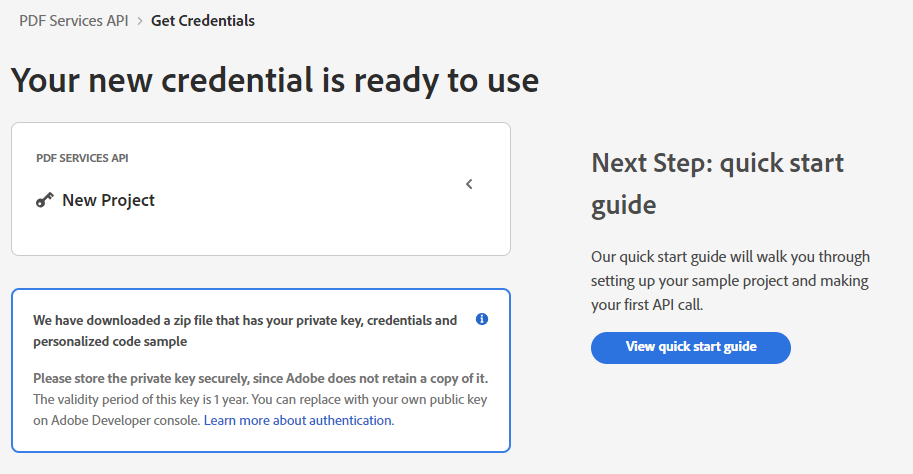
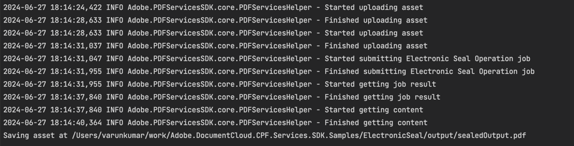

# Quickstart for Adobe PDF Electronic Seal API (.NET)

To get started using PDF Electronic Seal API, let's walk through a simple scenario - Applying an electronic seal on an invoice PDF document of an organization. In this guide, we will walk you through the complete process for creating a program that will accomplish this task. 

## Prerequisites

To complete this guide, you will need:

* [.NET Core: version 2.1 or above](https://dotnet.microsoft.com/en-us/download)
* [.Net SDK](https://dotnet.microsoft.com/en-us/download/dotnet/6.0)
* A build tool: Either Visual Studio or .NET Core CLI.
* An Adobe ID. If you do not have one, the credential setup will walk you through creating one.
* A way to edit code. No specific editor is required for this guide.
  
## Step One: Getting credentials

1) To begin, open your browser to <https://documentservices.adobe.com/dc-integration-creation-app-cdn/main.html?api=document-generation-api>. If you are not already logged in to Adobe.com, you will need to sign in or create a new user. Using a personal email account is recommend and not a federated ID.


2) After registering or logging in, you will then be asked to name your new credentials. Use the name, "New Project". 

3) Change the "Choose language" setting to ".Net". 

4) Also note the checkbox by, "Create personalized code sample." This will include a large set of samples along with your credentials. These can be helpful for learning more later. 

5) Click the checkbox saying you agree to the developer terms and then click "Create credentials."


6) After your credentials are created, they are automatically downloaded:



## Step Two: Setting up the project

1) In your Downloads folder, find the ZIP file with your credentials: PDFServicesSDK-.NetSamples.zip. If you unzip that archive, you will find a README file, your private key, and a folder of samples:


2) We need two things from this download. The `private.key` file (as shown in the screenshot above, and the `pdfservices-api-credentials.json` file. You can find this in the `adobe-DC.PDFServicesSDK.NET.Samples` folder, inside any of the sample subdirectories, so for example, the `CombinePDF` folder.


<InlineAlert slots="text" />

Note that that private key is *also* found in this directory so feel free to copy them both from here.

3) Take these two files and place them in a new directory.

4) In your new directory, create a new file, `ElectronicSeal.csproj`. This file will declare our requirements as well as help define the application we're creating.

```xml
<Project Sdk="Microsoft.NET.Sdk">

    <PropertyGroup>
        <OutputType>Exe</OutputType>
        <TargetFramework>netcoreapp3.1</TargetFramework>
        <RootNamespace>ElectronicSealSample</RootNamespace>
    </PropertyGroup>

    <ItemGroup>
        <PackageReference Include="log4net" Version="2.0.12" />
        <PackageReference Include="Adobe.PDFServicesSDK" Version="3.0.0" />
    </ItemGroup>

    <ItemGroup>
        <None Update="pdfservices-api-credentials.json">
            <CopyToOutputDirectory>Always</CopyToOutputDirectory>
        </None>
        <None Update="private.key">
            <CopyToOutputDirectory>Always</CopyToOutputDirectory>
        </None>
        <None Update="log4net.config">
            <CopyToOutputDirectory>Always</CopyToOutputDirectory>
        </None>
        <None Update="HallibyInvoice.pdf">
            <CopyToOutputDirectory>Always</CopyToOutputDirectory>
        </None>
        <None Update="sampleSealImage.png">
            <CopyToOutputDirectory>Always</CopyToOutputDirectory>
        </None>
    </ItemGroup>

</Project>
```

Our application will take an Invoice PDF document, `HallibyInvoice.pdf` (downloadable from [here](./HallibyInvoice.pdf)), and will use the sealing options with default appearance options to apply electronic seal over the PDF document by invoking Acrobat Services API and generate an electronically sealed PDF.

5) In your editor, open the directory where you previously copied the credentials and created the `csproj` file. Create a new file, `Program.cs`. 

Now you're ready to begin coding.

## Step Three: Creating the application

1) We'll begin by including our required dependencies:

```csharp
using Adobe.PDFServicesSDK;
using Adobe.PDFServicesSDK.auth;
using Adobe.PDFServicesSDK.exception;
using Adobe.PDFServicesSDK.io;
using Adobe.PDFServicesSDK.options.electronicseal;
using Adobe.PDFServicesSDK.pdfops;
using log4net;
using log4net.Config;
using log4net.Repository;
using System;
using System.IO;
using System.Reflection;
``` 

2) Now let's define our main class and `Main` method:

```csharp
namespace ElectronicSeal
{
    public class Program
    {
        // Initialize the logger.
        private static readonly ILog log = LogManager.GetLogger(typeof(Program));
        static void Main() {
        }
    }
}
```


3) Let's create credentials for pdf services and use them:

```csharp
Credentials credentials = Credentials.ServiceAccountCredentialsBuilder()
                        .FromFile("pdfservices-api-credentials.json")
                        .Build();

// Create an ExecutionContext using credentials.
ExecutionContext executionContext = ExecutionContext.Create(credentials);
```

4) Now let's define our input fields

```csharp
//Get the input document to perform the sealing operation
FileRef sourceFile = FileRef.CreateFromLocalFile(@"HallibyInvoice.pdf");

//Get the background seal image for signature , if required.
FileRef sealImageFile = FileRef.CreateFromLocalFile(@"sampleSealImage.png");
```

5) Now, we will define seal field options:

```csharp
//Set the Seal Field Name to be created in input PDF document.
string sealFieldName = "<SEAL_FIELD_NAME>";

//Set the page number in input document for applying seal.
int sealPageNumber = 1;

//Set if seal should be visible or invisible.
bool sealVisible = true;

//Create FieldLocation instance and set the coordinates for applying signature
FieldLocation fieldLocation = new FieldLocation(150, 250, 350, 200);

//Create FieldOptions instance with required details.
FieldOptions sealFieldOptions = new FieldOptions.Builder(sealFieldName)
                                                .SetVisible(sealVisible)
                                                .SetFieldLocation(fieldLocation)
                                                .SetPageNumber(sealPageNumber)
                                                .Build();
```

These lines are hard coded but in a real application would typically be dynamic.

6) Next, we create a CSC Certificate Credentials instance:

```csharp
//Set the name of TSP Provider being used.
string providerName = "<PROVIDER_NAME>";

//Set the access token to be used to access TSP provider hosted APIs.
string accessToken = "<ACCESS TOKEN>";

//Set the credential ID.
string credentialID = "<CREDENTIAL_ID>";

//Set the PIN generated while creating credentials.
string pin = "<PIN>";

CSCAuthContext cscAuthContext = new CSCAuthContext(accessToken, "Bearer");

//Create CertificateCredentials instance with required certificate details.
CertificateCredentials certificateCredentials = CertificateCredentials.CSCCredentialBuilder()
                                                                    .WithProviderName(providerName)
                                                                    .WithCredentialID(credentialID)
                                                                    .WithPin(pin)
                                                                    .WithCSCAuthContext(cscAuthContext)
                                                                    .Build();
```

7) Now, let's create the seal options with certificate credentials and field options:

```csharp
//Create SealingOptions instance with all the sealing parameters.
SealOptions sealOptions = new SealOptions.Builder(SignatureFormat.PKCS7, certificateCredentials,
                                                    sealFieldOptions).Build();
```

8) Now, let's create the operation:

```csharp
//Create the PDFElectronicSealOperation instance using the PDFElectronicSealOptions instance
PDFElectronicSealOperation pdfElectronicSealOperation = PDFElectronicSealOperation.CreateNew(sealOptions);

//Set the input source file for PDFElectronicSealOperation instance
pdfElectronicSealOperation.SetInput(sourceFile);

//Set the optional input seal image for PDFElectronicSealOperation instance
pdfElectronicSealOperation.SetSealImage(sealImageFile);
```
This code creates a seal Operation using sealOptions, input source file and input seal image.

9) Let's execute this seal operation:
```csharp
//Execute the operation
FileRef result = pdfElectronicSealOperation.Execute(executionContext);

//Save the output at specified location
result.SaveAs("output/sealedOutput.pdf");
```



Here's the complete application (`Program.cs`):

```csharp
using Adobe.PDFServicesSDK;
using Adobe.PDFServicesSDK.auth;
using Adobe.PDFServicesSDK.exception;
using Adobe.PDFServicesSDK.io;
using Adobe.PDFServicesSDK.options.electronicseal;
using Adobe.PDFServicesSDK.pdfops;
using log4net;
using log4net.Config;
using log4net.Repository;
using System;
using System.IO;
using System.Reflection;

/// <summary>
/// The sample class ElectronicSeal uses the default appearance options to apply electronic seal over the PDF document.
/// <para>
/// To know more about PDF Electronic Seal, please see the <a href="https://developer.adobe.com/document-services/docs/overview/pdf-electronic-seal-api/" target="_blank">documentation</a>.
/// </para>
/// Refer to README.md for instructions on how to run the samples.
/// </summary>
namespace ElectronicSeal
{
    public class Program
    {
        // Initialize the logger.
        private static readonly ILog log = LogManager.GetLogger(typeof(Program));
        static void Main(string[] args)
        {
            //Configure the logging
            ConfigureLogging();

            try
            {
                // Initial setup, create credentials instance.
                Credentials credentials = Credentials.ServiceAccountCredentialsBuilder()
                        .FromFile("pdfservices-api-credentials.json")
                        .Build();

                // Create an ExecutionContext using credentials.
                ExecutionContext executionContext = ExecutionContext.Create(credentials);

                //Get the input document to perform the sealing operation
                FileRef sourceFile = FileRef.CreateFromLocalFile(@"HallibyInvoice.pdf");

                //Get the background seal image for signature , if required.
                FileRef sealImageFile = FileRef.CreateFromLocalFile(@"sampleSealImage.png");

                //Set the Seal Field Name to be created in input PDF document.
                string sealFieldName = "<SEAL_FIELD_NAME>";

                //Set the page number in input document for applying seal.
                int sealPageNumber = 1;

                //Set if seal should be visible or invisible.
                bool sealVisible = true;

                //Create FieldLocation instance and set the coordinates for applying signature
                FieldLocation fieldLocation = new FieldLocation(150, 250, 350, 200);

                //Create FieldOptions instance with required details.
                FieldOptions sealFieldOptions = new FieldOptions.Builder(sealFieldName)
                    .SetVisible(sealVisible)
                    .SetFieldLocation(fieldLocation)
                    .SetPageNumber(sealPageNumber)
                    .Build();

                //Set the name of TSP Provider being used.
                string providerName = "<PROVIDER_NAME>";

                //Set the access token to be used to access TSP provider hosted APIs.
                string accessToken = "<ACCESS TOKEN>";

                //Set the credential ID.
                string credentialID = "<CREDENTIAL_ID>";

                //Set the PIN generated while creating credentials.
                string pin = "<PIN>";

                CSCAuthContext cscAuthContext = new CSCAuthContext(accessToken, "Bearer");

                //Create CertificateCredentials instance with required certificate details.
                CertificateCredentials certificateCredentials = CertificateCredentials.CSCCredentialBuilder()
                    .WithProviderName(providerName)
                    .WithCredentialID(credentialID)
                    .WithPin(pin)
                    .WithCSCAuthContext(cscAuthContext)
                    .Build();
                
                //Create SealingOptions instance with all the sealing parameters.
                SealOptions sealOptions = new SealOptions.Builder(SignatureFormat.PKCS7, certificateCredentials,
                        sealFieldOptions).Build();

                //Create the PDFElectronicSealOperation instance using the PDFElectronicSealOptions instance
                PDFElectronicSealOperation pdfElectronicSealOperation = PDFElectronicSealOperation.CreateNew(sealOptions);

                //Set the input source file for PDFElectronicSealOperation instance
                pdfElectronicSealOperation.SetInput(sourceFile);

                //Set the optional input seal image for PDFElectronicSealOperation instance
                pdfElectronicSealOperation.SetSealImage(sealImageFile);

                //Execute the operation
                FileRef result = pdfElectronicSealOperation.Execute(executionContext);

                //Save the output at specified location
                result.SaveAs("output/sealedOutput.pdf");

            }
            catch (ServiceUsageException ex)
            {
                log.Error("Exception encountered while executing operation", ex);
            }
            catch (ServiceApiException ex)
            {
                log.Error("Exception encountered while executing operation", ex);
            }
            catch (SDKException ex)
            {
                log.Error("Exception encountered while executing operation", ex);
            }
            catch (IOException ex)
            {
                log.Error("Exception encountered while executing operation", ex);
            }
            catch (Exception ex)
            {
                log.Error("Exception encountered while executing operation", ex);
            }
        }
        static void ConfigureLogging()
        {
            ILoggerRepository logRepository = LogManager.GetRepository(Assembly.GetEntryAssembly());
            XmlConfigurator.Configure(logRepository, new FileInfo("log4net.config"));
        }
    }
}
```

## Next Steps

Now that you've successfully performed your first operation, [review the documentation](https://developer.adobe.com/document-services/docs/overview/document-generation-api/) for many other examples and reach out on our [forums](https://community.adobe.com/t5/document-services-apis/ct-p/ct-Document-Cloud-SDK) with any questions. Also remember the samples you downloaded while creating your credentials also have many demos.
