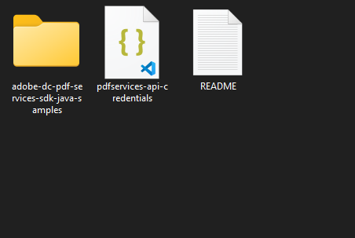

# Quickstart for Adobe PDF Electronic Seal API (Java)

To get started using Adobe PDF Electronic Seal API, let's walk through a simple scenario - Applying an electronic seal on an invoice PDF document. In this guide, we will walk you through the complete process for creating a program that will accomplish this task.

## Prerequisites

To complete this guide, you will need:

* [Java](http://www.oracle.com/technetwork/java/javase/downloads/index.html) - Java 11 or higher is required. 
* [Maven](https://maven.apache.org/install.html)
* An Adobe ID. If you do not have one, the credential setup will walk you through creating one.
* A way to edit code. No specific editor is required for this guide.

## Step One: Getting credentials

1) To begin, open your browser to <https://acrobatservices.adobe.com/dc-integration-creation-app-cdn/main.html?api=pdf-services-api>. If you are not already logged in to Adobe.com, you will need to sign in or create a new user. Using a personal email account is recommended and not a federated ID.


2) After registering or logging in, you will then be asked to name your new credentials. Use the name, "New Project". 

3) Change the "Choose language" setting to "Java". 

4) Also note the checkbox by, "Create personalized code sample." This will include a large set of samples along with your credentials. These can be helpful for learning more later. 

5) Click the checkbox saying you agree to the developer terms and then click "Create credentials."


6) After your credentials are created, they are automatically downloaded:


## Step Two: Setting up the project

1) In your Downloads folder, find the ZIP file with your credentials: PDFServicesSDK-JavaSamples.zip. If you unzip that archive, you will find a folder of samples and the `pdfservices-api-credentials.json` file.



2) Take the `pdfservices-api-credentials.json` and place it in a new directory.

3) In this directory, create a new file named `pom.xml` and copy the following content:

```xml
<?xml version="1.0" encoding="UTF-8"?>

<project xmlns="http://maven.apache.org/POM/4.0.0"
         xmlns:xsi="http://www.w3.org/2001/XMLSchema-instance"
         xsi:schemaLocation="http://maven.apache.org/POM/4.0.0 http://maven.apache.org/xsd/maven-4.0.0.xsd">
  <modelVersion>4.0.0</modelVersion>

  <groupId>com.adobe.documentservices</groupId>
  <artifactId>pdfservices-sdk-electronicseal-guide</artifactId>
  <version>1</version>

  <name>PDF Services Java SDK Samples</name>

  <properties>
    <project.build.sourceEncoding>UTF-8</project.build.sourceEncoding>
    <maven.compiler.source>11</maven.compiler.source>
    <maven.compiler.target>11</maven.compiler.target>
    <pdfservices.sdk.version>4.3.0</pdfservices.sdk.version>
  </properties>

  <dependencies>

    <dependency>
      <groupId>com.adobe.documentservices</groupId>
      <artifactId>pdfservices-sdk</artifactId>
      <version>${pdfservices.sdk.version}</version>
    </dependency>

    <!--		log4j2 dependency to showcase the use of log4j2 with slf4j API-->
    <!-- https://mvnrepository.com/artifact/org.slf4j/slf4j-log4j12 -->
    <dependency>
      <groupId>org.apache.logging.log4j</groupId>
      <artifactId>log4j-slf4j-impl</artifactId>
      <version>2.21.1</version>
    </dependency>
  </dependencies>

  <build>
    <plugins>
      <plugin>
        <groupId>org.apache.maven.plugins</groupId>
        <artifactId>maven-compiler-plugin</artifactId>
        <version>3.8.0</version>
        <configuration>
          <source>${maven.compiler.source}</source>
          <target>${maven.compiler.target}</target>
        </configuration>
      </plugin>
      <plugin>
        <groupId>org.codehaus.mojo</groupId>
        <artifactId>exec-maven-plugin</artifactId>
        <version>1.5.0</version>
        <executions>
          <execution>
            <goals>
              <goal>java</goal>
            </goals>
          </execution>
        </executions>
      </plugin>
    </plugins>
  </build>
</project>
```

This file will define what dependencies we need and how the application will be built. 

Our application will take an Invoice PDF document, `sampleInvoice.pdf` (downloadable from <a href="./sampleInvoice.pdf" target="_blank">here</a>), and will use the sealing options with default appearance options to apply electronic seal over the PDF document by invoking Acrobat Services API and generate an electronically sealed PDF.

4) In your editor, open the directory where you previously copied the credentials, and create a new directory, `src/main/java`. In that directory, create `ElectronicSeal.java`. 

Now you're ready to begin coding.

## Step Three: Creating the application

1) We will begin by including the required dependencies:

```javascript
import com.adobe.pdfservices.operation.PDFServices;
import com.adobe.pdfservices.operation.PDFServicesMediaType;
import com.adobe.pdfservices.operation.PDFServicesResponse;
import com.adobe.pdfservices.operation.auth.Credentials;
import com.adobe.pdfservices.operation.auth.ServicePrincipalCredentials;
import com.adobe.pdfservices.operation.exception.SDKException;
import com.adobe.pdfservices.operation.exception.ServiceApiException;
import com.adobe.pdfservices.operation.exception.ServiceUsageException;
import com.adobe.pdfservices.operation.io.Asset;
import com.adobe.pdfservices.operation.io.StreamAsset;
import com.adobe.pdfservices.operation.pdfjobs.jobs.PDFElectronicSealJob;
import com.adobe.pdfservices.operation.pdfjobs.params.electronicseal.AppearanceItem;
import com.adobe.pdfservices.operation.pdfjobs.params.electronicseal.AppearanceOptions;
import com.adobe.pdfservices.operation.pdfjobs.params.electronicseal.CSCAuthContext;
import com.adobe.pdfservices.operation.pdfjobs.params.electronicseal.CertificateCredentials;
import com.adobe.pdfservices.operation.pdfjobs.params.electronicseal.FieldLocation;
import com.adobe.pdfservices.operation.pdfjobs.params.electronicseal.FieldOptions;
import com.adobe.pdfservices.operation.pdfjobs.params.electronicseal.PDFElectronicSealParams;
import com.adobe.pdfservices.operation.pdfjobs.result.PDFElectronicSealResult;
import org.apache.commons.io.IOUtils;
import org.slf4j.Logger;
import org.slf4j.LoggerFactory;

import java.io.File;
import java.io.IOException;
import java.io.InputStream;
import java.io.OutputStream;
import java.nio.file.Files;
import java.nio.file.Paths;
```


2) Now let's define our main class:

```javascript
public class ElectronicSeal {

    // Initialize the logger.
    private static final Logger LOGGER = LoggerFactory.getLogger(ElectronicSeal.class);

    public static void main(String[] args) {

    }
}
```
3) Set the environment variables `PDF_SERVICES_CLIENT_ID` and `PDF_SERVICES_CLIENT_SECRET` by running the following commands and replacing placeholders `YOUR CLIENT ID` and `YOUR CLIENT SECRET` with the credentials present in `pdfservices-api-credentials.json` file:
- **Windows:**
  - `set PDF_SERVICES_CLIENT_ID=<YOUR CLIENT ID>`
  - `set PDF_SERVICES_CLIENT_SECRET=<YOUR CLIENT SECRET>`

- **MacOS/Linux:**
  - `export PDF_SERVICES_CLIENT_ID=<YOUR CLIENT ID>`
  - `export PDF_SERVICES_CLIENT_SECRET=<YOUR CLIENT SECRET>`


4) Next, we can create our credentials and PDFServices instance:
```javascript
// Initial setup, create credentials instance
Credentials credentials = new ServicePrincipalCredentials(
        System.getenv("PDF_SERVICES_CLIENT_ID"),
        System.getenv("PDF_SERVICES_CLIENT_SECRET"));

// Creates a PDF Services instance
PDFServices pdfServices = new PDFServices(credentials);
```

5) Now, let's upload the asset:
```javascript
// Create assets from source files and upload
Asset asset = pdfServices.upload(inputStream, PDFServicesMediaType.PDF.getMediaType());
Asset sealImageAsset = pdfServices.upload(inputStreamSealImage, PDFServicesMediaType.PNG.getMediaType());
```
6) Now, we will define the document level permission:

```javascript
// Set the document level permission to be applied for output document
DocumentLevelPermission documentLevelPermission = DocumentLevelPermission.FORM_FILLING;
```

7) Now, we will define seal field options:

```javascript
// Create AppearanceOptions and add the required signature display items to it
AppearanceOptions appearanceOptions = new AppearanceOptions();
appearanceOptions.addItem(AppearanceItem.NAME);
appearanceOptions.addItem(AppearanceItem.LABELS);
appearanceOptions.addItem(AppearanceItem.DATE);
appearanceOptions.addItem(AppearanceItem.SEAL_IMAGE);
appearanceOptions.addItem(AppearanceItem.DISTINGUISHED_NAME);

// Sets the Seal Field Name to be created in input PDF document.
String sealFieldName = "Signature1";

// Sets the page number in input document for applying seal.
Integer sealPageNumber = 1;

// Sets if seal should be visible or invisible.
Boolean sealVisible = true;

// Creates FieldLocation instance and set the coordinates for applying signature
FieldLocation fieldLocation = new FieldLocation(150, 250, 350, 200);

// Create FieldOptions instance with required details.
FieldOptions fieldOptions = new FieldOptions.Builder(sealFieldName)
        .setFieldLocation(fieldLocation)
        .setPageNumber(sealPageNumber)
        .setVisible(sealVisible)
        .build();
```


8) Next, we create a CSC Certificate Credentials instance:

```javascript
// Sets the name of TSP Provider being used.
String providerName = "<PROVIDER_NAME>";

// Sets the access token to be used to access TSP provider hosted APIs.
String accessToken = "<ACCESS_TOKEN>";

// Sets the credential ID.
String credentialID = "<CREDENTIAL_ID>";

// Sets the PIN generated while creating credentials.
String pin = "<PIN>";

// Creates CSCAuthContext instance using access token and token type.
CSCAuthContext cscAuthContext = new CSCAuthContext(accessToken, "Bearer");

// Create CertificateCredentials instance with required certificate details.
CertificateCredentials certificateCredentials = CertificateCredentials.cscCredentialBuilder()
        .withProviderName(providerName)
        .withCredentialID(credentialID)
        .withPin(pin)
        .withCSCAuthContext(cscAuthContext)
        .build();
```


9) Now, let's create the job with seal parameters using certificate credentials and field options and set the seal image asset:

```javascript
// Create parameters for the job
PDFElectronicSealParams pdfElectronicSealParams = PDFElectronicSealParams
        .pdfElectronicSealParamsBuilder(certificateCredentials, fieldOptions)
        .withAppearanceOptions(appearanceOptions)
        .build();

// Creates a new job instance
PDFElectronicSealJob pdfElectronicSealJob = new PDFElectronicSealJob(asset, pdfElectronicSealParams);

// Sets the optional input seal image for PDFElectronicSealOperation instance
pdfElectronicSealJob.setSealImageAsset(sealImageAsset);
```

This set of code defines what we're doing (an Electronic Seal operation),
it defines parameters for the seal job and sets input seal image asset.

10) The next code block submits the job and gets the job result:

```javascript
// Submit the job and gets the job result
String location = pdfServices.submit(pdfElectronicSealJob);
PDFServicesResponse<PDFElectronicSealResult> pdfServicesResponse = pdfServices.getJobResult(location, PDFElectronicSealResult.class);

// Get content from the resulting asset(s)
Asset resultAsset = pdfServicesResponse.getResult().getAsset();
StreamAsset streamAsset = pdfServices.getContent(resultAsset);
```


11) The next code block saves the result at the specified location:

```javascript
// Creates an output stream and copy stream asset's content to it
OutputStream outputStream = Files.newOutputStream(new File("output/sealedOutput.pdf").toPath());
IOUtils.copy(streamAsset.getInputStream(), outputStream);
```


Here's the complete application (`src/main/java/ElectronicSeal.java`):

```javascript
import com.adobe.pdfservices.operation.PDFServices;
import com.adobe.pdfservices.operation.PDFServicesMediaType;
import com.adobe.pdfservices.operation.PDFServicesResponse;
import com.adobe.pdfservices.operation.auth.Credentials;
import com.adobe.pdfservices.operation.auth.ServicePrincipalCredentials;
import com.adobe.pdfservices.operation.exception.SDKException;
import com.adobe.pdfservices.operation.exception.ServiceApiException;
import com.adobe.pdfservices.operation.exception.ServiceUsageException;
import com.adobe.pdfservices.operation.io.Asset;
import com.adobe.pdfservices.operation.io.StreamAsset;
import com.adobe.pdfservices.operation.pdfjobs.jobs.PDFElectronicSealJob;
import com.adobe.pdfservices.operation.pdfjobs.params.electronicseal.AppearanceItem;
import com.adobe.pdfservices.operation.pdfjobs.params.electronicseal.AppearanceOptions;
import com.adobe.pdfservices.operation.pdfjobs.params.electronicseal.CSCAuthContext;
import com.adobe.pdfservices.operation.pdfjobs.params.electronicseal.CertificateCredentials;
import com.adobe.pdfservices.operation.pdfjobs.params.electronicseal.DocumentLevelPermission;
import com.adobe.pdfservices.operation.pdfjobs.params.electronicseal.FieldLocation;
import com.adobe.pdfservices.operation.pdfjobs.params.electronicseal.FieldOptions;
import com.adobe.pdfservices.operation.pdfjobs.params.electronicseal.PDFElectronicSealParams;
import com.adobe.pdfservices.operation.pdfjobs.result.PDFElectronicSealResult;
import org.apache.commons.io.IOUtils;
import org.slf4j.Logger;
import org.slf4j.LoggerFactory;

import java.io.File;
import java.io.IOException;
import java.io.InputStream;
import java.io.OutputStream;
import java.nio.file.Files;
import java.nio.file.Paths;

public class ElectronicSeal {

    // Initialize the logger.
    private static final Logger LOGGER = LoggerFactory.getLogger(ElectronicSeal.class);

    public static void main(String[] args) {
        try (InputStream inputStream = Files.newInputStream(new File("src/main/resources/sampleInvoice.pdf").toPath());
             InputStream inputStreamSealImage = Files.newInputStream(new File("src/main/resources/sampleSealImage.png").toPath())) {
            // Initial setup, create credentials instance
            Credentials credentials = new ServicePrincipalCredentials(
                    System.getenv("PDF_SERVICES_CLIENT_ID"),
                    System.getenv("PDF_SERVICES_CLIENT_SECRET"));
            
            // Creates a PDF Services instance
            PDFServices pdfServices = new PDFServices(credentials);

            // Create assets from source files and upload
            Asset asset = pdfServices.upload(inputStream, PDFServicesMediaType.PDF.getMediaType());
            Asset sealImageAsset = pdfServices.upload(inputStreamSealImage, PDFServicesMediaType.PNG.getMediaType());

            // Set the document level permission to be applied for output document
            DocumentLevelPermission documentLevelPermission = DocumentLevelPermission.FORM_FILLING;
            
            // Create AppearanceOptions and add the required signature display items to it
            AppearanceOptions appearanceOptions = new AppearanceOptions();
            appearanceOptions.addItem(AppearanceItem.NAME);
            appearanceOptions.addItem(AppearanceItem.LABELS);
            appearanceOptions.addItem(AppearanceItem.DATE);
            appearanceOptions.addItem(AppearanceItem.SEAL_IMAGE);
            appearanceOptions.addItem(AppearanceItem.DISTINGUISHED_NAME);

            // Sets the Seal Field Name to be created in input PDF document.
            String sealFieldName = "Signature1";
          
            // Sets the page number in input document for applying seal.
            Integer sealPageNumber = 1;
          
            // Sets if seal should be visible or invisible.
            Boolean sealVisible = true;
          
            // Creates FieldLocation instance and set the coordinates for applying signature
            FieldLocation fieldLocation = new FieldLocation(150, 250, 350, 200);
          
            // Create FieldOptions instance with required details.
            FieldOptions fieldOptions = new FieldOptions.Builder(sealFieldName)
                    .setFieldLocation(fieldLocation)
                    .setPageNumber(sealPageNumber)
                    .setVisible(sealVisible)
                    .build();
          
            //Set the name of TSP Provider being used.
            String providerName = "<PROVIDER_NAME>";
          
            // Sets the access token to be used to access TSP provider hosted APIs.
            String accessToken = "<ACCESS_TOKEN>";
          
            // Sets the credential ID.
            String credentialID = "<CREDENTIAL_ID>";
          
            // Sets the PIN generated while creating credentials.
            String pin = "<PIN>";
          
            // Creates CSCAuthContext instance using access token and token type.
            CSCAuthContext cscAuthContext = new CSCAuthContext(accessToken, "Bearer");
          
            // Create CertificateCredentials instance with required certificate details.
            CertificateCredentials certificateCredentials = CertificateCredentials.cscCredentialBuilder()
                    .withProviderName(providerName)
                    .withCredentialID(credentialID)
                    .withPin(pin)
                    .withCSCAuthContext(cscAuthContext)
                    .build();
            
            // Create parameters for the job
            PDFElectronicSealParams pdfElectronicSealParams = PDFElectronicSealParams
                    .pdfElectronicSealParamsBuilder(certificateCredentials, fieldOptions)
                    .withDocumentLevelPermission(documentLevelPermission)
                    .withAppearanceOptions(appearanceOptions)
                    .build();
          
            // Creates a new job instance
            PDFElectronicSealJob pdfElectronicSealJob = new PDFElectronicSealJob(asset, pdfElectronicSealParams);
          
            // Sets the optional input seal image for PDFElectronicSealOperation instance
            pdfElectronicSealJob.setSealImageAsset(sealImageAsset);

            // Submit the job and gets the job result
            String location = pdfServices.submit(pdfElectronicSealJob);
            PDFServicesResponse<PDFElectronicSealResult> pdfServicesResponse = pdfServices.getJobResult(location, PDFElectronicSealResult.class);
          
            // Get content from the resulting asset(s)
            Asset resultAsset = pdfServicesResponse.getResult().getAsset();
            StreamAsset streamAsset = pdfServices.getContent(resultAsset);

            // Creates an output stream and copy stream asset's content to it
            Files.createDirectories(Paths.get("output/"));
            OutputStream outputStream = Files.newOutputStream(new File("output/sealedOutput.pdf").toPath());
            LOGGER.info("Saving asset at output/sealedOutput.pdf");
            IOUtils.copy(streamAsset.getInputStream(), outputStream);
            outputStream.close();
        } catch (ServiceApiException | IOException | SDKException | ServiceUsageException ex) {
            LOGGER.error("Exception encountered while executing operation", ex);
        }
    }
}
```

## Next Steps

Now that you've successfully performed your first operation, [review the documentation](https://developer.adobe.com/document-services/docs/overview/pdf-services-api/) for many other examples and reach out on our [forums](https://community.adobe.com/t5/document-services-apis/ct-p/ct-Document-Cloud-SDK) with any questions. Also remember the samples you downloaded while creating your credentials also have many demos.
