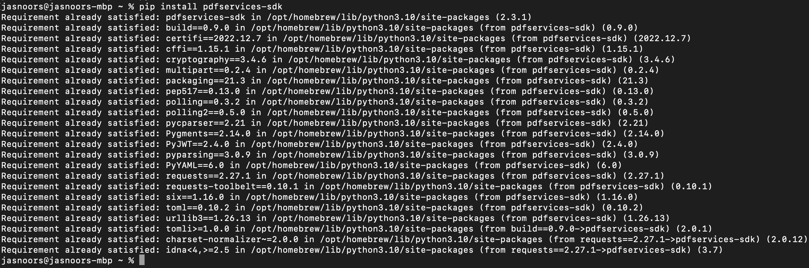

# Quickstart for Adobe PDF Electronic Seal API (Python)

To get started using Adobe PDF Electronic Seal API, let's walk through a simple scenario - Applying an electronic seal on an invoice PDF document. In this guide, we will walk you through the complete process for creating a program that will accomplish this task.

## Prerequisites

To complete this guide, you will need:

* [Python](https://www.python.org/downloads/) - Python 3.10 or higher is required.
* An Adobe ID. If you do not have one, the credential setup will walk you through creating one.
* A way to edit code. No specific editor is required for this guide.


## Step One: Getting credentials

1) To begin, open your browser to <https://acrobatservices.adobe.com/dc-integration-creation-app-cdn/main.html?api=pdf-services-api>. If you are not already logged in to Adobe.com, you will need to sign in or create a new user. Using a personal email account is recommend and not a federated ID.


2) After registering or logging in, you will then be asked to name your new credentials. Use the name, "New Project".

3) Change the "Choose language" setting to "Python".

4) Also note the checkbox by, "Create personalized code sample." This will include a large set of samples along with your credentials. These can be helpful for learning more later.

5) Click the checkbox saying you agree to the developer terms and then click "Create credentials."


6) After your credentials are created, they are automatically downloaded:


## Step Two: Setting up the project

1) In your Downloads folder, find the ZIP file with your credentials: PDFServicesSDK-PythonSamples.zip. If you unzip that archive, you will find a folder of samples and the `pdfservices-api-credentials.json` file.


2) Take the `pdfservices-api-credentials.json` file and place it in a new directory. Remember that these credential files are important and should be stored safely.

3) At the command line, change to the directory you created, and run the following command to install the Python SDK: `pip install pdfservices-sdk`.



At this point, we've installed the Python SDK for Adobe PDF Services API as a dependency for our project and have copied over our credentials files.

Our application will take an Invoice PDF document, `sampleInvoice.pdf` (downloadable from <a href="./sampleInvoice.pdf" target="_blank">here</a>), and will use the sealing options with default appearance options to apply electronic seal over the PDF document by invoking Acrobat Services API and generate an electronically sealed PDF.

4) In your editor, open the directory where you previously copied the credentials. Create a new file, `electronic-seal.py`.

Now you're ready to begin coding.

## Step Three: Creating the application

1) We'll begin by including our required dependencies:

```python
import logging
import os
from datetime import datetime

from adobe.pdfservices.operation.auth.service_principal_credentials import ServicePrincipalCredentials
from adobe.pdfservices.operation.exception.exceptions import ServiceApiException, ServiceUsageException, SdkException
from adobe.pdfservices.operation.io.cloud_asset import CloudAsset
from adobe.pdfservices.operation.io.stream_asset import StreamAsset
from adobe.pdfservices.operation.pdf_services import PDFServices
from adobe.pdfservices.operation.pdf_services_media_type import PDFServicesMediaType
from adobe.pdfservices.operation.pdfjobs.jobs.eseal_job import PDFElectronicSealJob
from adobe.pdfservices.operation.pdfjobs.params.eseal.csc_auth_context import CSCAuthContext
from adobe.pdfservices.operation.pdfjobs.params.eseal.csc_credentials import CSCCredentials
from adobe.pdfservices.operation.pdfjobs.params.eseal.document_level_permission import DocumentLevelPermission
from adobe.pdfservices.operation.pdfjobs.params.eseal.electronic_seal_params import PDFElectronicSealParams
from adobe.pdfservices.operation.pdfjobs.params.eseal.field_location import FieldLocation
from adobe.pdfservices.operation.pdfjobs.params.eseal.field_options import FieldOptions
from adobe.pdfservices.operation.pdfjobs.result.eseal_pdf_result import ESealPDFResult

```

2) Set the environment variables `PDF_SERVICES_CLIENT_ID` and `PDF_SERVICES_CLIENT_SECRET` by running the following commands and replacing placeholders `YOUR CLIENT ID` and `YOUR CLIENT SECRET` with the credentials present in `pdfservices-api-credentials.json` file:
- **Windows:**
    - `set PDF_SERVICES_CLIENT_ID=<YOUR CLIENT ID>`
    - `set PDF_SERVICES_CLIENT_SECRET=<YOUR CLIENT SECRET>`

- **MacOS/Linux:**
    - `export PDF_SERVICES_CLIENT_ID=<YOUR CLIENT ID>`
    - `export PDF_SERVICES_CLIENT_SECRET=<YOUR CLIENT SECRET>`

3) Next, we can create our credentials and use them:

```python
# Initial setup, create credentials instance
credentials = ServicePrincipalCredentials(
    client_id=os.getenv('PDF_SERVICES_CLIENT_ID'),
    client_secret=os.getenv('PDF_SERVICES_CLIENT_SECRET'))

# Creates a PDF Services instance
pdf_services = PDFServices(credentials=credentials)
```

4) Now, let's create an asset from source file and upload.

```python
pdf_file = open('./sampleInvoice.pdf', 'rb')
file_input_stream = pdf_file.read()
pdf_file.close()

seal_image_file = open('./sampleSealImage.png', 'rb')
seal_image_input_stream = seal_image_file.read()
seal_image_file.close()

# Creates an asset(s) from source file(s) and upload
asset = pdf_services.upload(input_stream=file_input_stream, mime_type=PDFServicesMediaType.PDF)
seal_image_asset = pdf_services.upload(input_stream=seal_image_input_stream, mime_type=PDFServicesMediaType.PNG)
```

5) Now, let's create the parameters and the job:

```python
# Set the document level permission to be applied for output document
document_level_permission = DocumentLevelPermission.FORM_FILLING

# Sets the Seal Field Name to be created in input PDF document.
seal_field_name = "Signature1"

# Sets the page number in input document for applying seal.
seal_page_number = 1

# Sets if seal should be visible or invisible.
seal_visible = True

# Creates FieldLocation instance and set the coordinates for applying signature
field_location = FieldLocation(150, 250, 350, 200)

# Create FieldOptions instance with required details.
field_options = FieldOptions(
    field_name=seal_field_name,
    field_location=field_location,
    page_number=seal_page_number,
    visible=seal_visible
)

# Sets the name of TSP Provider being used.
provider_name = "<PROVIDER_NAME>"

# Sets the access token to be used to access TSP provider hosted APIs.
access_token = "<ACCESS_TOKEN>"

# Sets the credential ID.
credential_id = "<CREDENTIAL_ID>"

# Sets the PIN generated while creating credentials.
pin = "<PIN>"

# Creates CSCAuthContext instance using access token and token type.
csc_auth_context = CSCAuthContext(
    access_token=access_token,
    token_type="Bearer",
)

# Create CertificateCredentials instance with required certificate details.
certificate_credentials = CSCCredentials(
    provider_name=provider_name,
    credential_id=credential_id,
    pin=pin,
    csc_auth_context=csc_auth_context,
)

# Create parameters for the job
electronic_seal_params = PDFElectronicSealParams(
    seal_certificate_credentials=certificate_credentials,
    seal_field_options=field_options,
)

# Creates a new job instance
electronic_seal_job = PDFElectronicSealJob(input_asset=asset,
                                           electronic_seal_params=electronic_seal_params,
                                           seal_image_asset=seal_image_asset)
```

6) The next code block submits the job and gets the job result:

```python
# Submit the job and gets the job result
location = pdf_services.submit(electronic_seal_job)
pdf_services_response = pdf_services.get_job_result(location, ESealPDFResult)

# Get content from the resulting asset(s)
result_asset: CloudAsset = pdf_services_response.get_result().get_asset()
stream_asset: StreamAsset = pdf_services.get_content(result_asset)
```

7) The next code block saves the result at the specified location:

```python
output_file_path = 'output/ElectronicSeal.pdf'
with open(output_file_path, "wb") as file:
    file.write(stream_asset.get_input_stream())
```

Here's the complete application (`src/electronicseal/electronic_seal.py`):

```python
import logging
import os
from datetime import datetime

from adobe.pdfservices.operation.auth.service_principal_credentials import ServicePrincipalCredentials
from adobe.pdfservices.operation.exception.exceptions import ServiceApiException, ServiceUsageException, SdkException
from adobe.pdfservices.operation.io.cloud_asset import CloudAsset
from adobe.pdfservices.operation.io.stream_asset import StreamAsset
from adobe.pdfservices.operation.pdf_services import PDFServices
from adobe.pdfservices.operation.pdf_services_media_type import PDFServicesMediaType
from adobe.pdfservices.operation.pdfjobs.jobs.eseal_job import PDFElectronicSealJob
from adobe.pdfservices.operation.pdfjobs.params.eseal.csc_auth_context import CSCAuthContext
from adobe.pdfservices.operation.pdfjobs.params.eseal.csc_credentials import CSCCredentials
from adobe.pdfservices.operation.pdfjobs.params.eseal.document_level_permission import DocumentLevelPermission
from adobe.pdfservices.operation.pdfjobs.params.eseal.electronic_seal_params import PDFElectronicSealParams
from adobe.pdfservices.operation.pdfjobs.params.eseal.field_location import FieldLocation
from adobe.pdfservices.operation.pdfjobs.params.eseal.field_options import FieldOptions
from adobe.pdfservices.operation.pdfjobs.result.eseal_pdf_result import ESealPDFResult

# Initialize the logger
logging.basicConfig(level=logging.INFO)

# This sample illustrates how to apply electronic seal over the PDF document using default appearance options.
#
# Refer to README.md for instructions on how to run the samples.

class ElectronicSeal:
    def __init__(self):
        try:
            pdf_file = open('./sampleInvoice.pdf', 'rb')
            file_input_stream = pdf_file.read()
            pdf_file.close()

            seal_image_file = open('./sampleSealImage.png', 'rb')
            seal_image_input_stream = seal_image_file.read()
            seal_image_file.close()

            # Initial setup, create credentials instance
            credentials = ServicePrincipalCredentials(
                client_id=os.getenv('PDF_SERVICES_CLIENT_ID'),
                client_secret=os.getenv('PDF_SERVICES_CLIENT_SECRET')
            )

            # Creates a PDF Services instance
            pdf_services = PDFServices(credentials=credentials)

            # Creates an asset(s) from source file(s) and upload
            asset = pdf_services.upload(input_stream=file_input_stream, mime_type=PDFServicesMediaType.PDF)
            seal_image_asset = pdf_services.upload(input_stream=seal_image_input_stream, mime_type=PDFServicesMediaType.PNG)

            # Set the document level permission to be applied for output document
            document_level_permission = DocumentLevelPermission.FORM_FILLING

            # Sets the Seal Field Name to be created in input PDF document.
            seal_field_name = "Signature1"

            # Sets the page number in input document for applying seal.
            seal_page_number = 1

            # Sets if seal should be visible or invisible.
            seal_visible = True

            # Creates FieldLocation instance and set the coordinates for applying signature
            field_location = FieldLocation(150, 250, 350, 200)

            # Create FieldOptions instance with required details.
            field_options = FieldOptions(
                field_name=seal_field_name,
                field_location=field_location,
                page_number=seal_page_number,
                visible=seal_visible
            )

            # Sets the name of TSP Provider being used.
            provider_name = "<PROVIDER_NAME>"

            # Sets the access token to be used to access TSP provider hosted APIs.
            access_token = "<ACCESS_TOKEN>"

            # Sets the credential ID.
            credential_id = "<CREDENTIAL_ID>"

            # Sets the PIN generated while creating credentials.
            pin = "<PIN>"

            # Creates CSCAuthContext instance using access token and token type.
            csc_auth_context = CSCAuthContext(
                access_token=access_token,
                token_type="Bearer",
            )

            # Create CertificateCredentials instance with required certificate details.
            certificate_credentials = CSCCredentials(
                provider_name=provider_name,
                credential_id=credential_id,
                pin=pin,
                csc_auth_context=csc_auth_context,
            )

            # Create parameters for the job
            electronic_seal_params = PDFElectronicSealParams(
                seal_certificate_credentials=certificate_credentials,
                seal_field_options=field_options,
            )

            # Creates a new job instance
            electronic_seal_job = PDFElectronicSealJob(input_asset=asset,
                                                       electronic_seal_params=electronic_seal_params,
                                                       seal_image_asset=seal_image_asset)

            # Submit the job and gets the job result
            location = pdf_services.submit(electronic_seal_job)
            pdf_services_response = pdf_services.get_job_result(location, ESealPDFResult)

            # Get content from the resulting asset(s)
            result_asset: CloudAsset = pdf_services_response.get_result().get_asset()
            stream_asset: StreamAsset = pdf_services.get_content(result_asset)

            # Creates an output stream and copy stream asset's content to it
            output_file_path = 'output/ElectronicSeal.pdf'
            with open(output_file_path, "wb") as file:
                file.write(stream_asset.get_input_stream())

        except (ServiceApiException, ServiceUsageException, SdkException) as e:
            logging.exception(f'Exception encountered while executing operation: {e}')

if __name__ == "__main__":
    ElectronicSeal()
```

## Next Steps

Now that you've successfully performed your first operation, [review the documentation](https://developer.adobe.com/document-services/docs/overview/pdf-services-api/) for many other examples and reach out on our [forums](https://community.adobe.com/t5/acrobat-services-api/ct-p/ct-Document-Cloud-SDK?page=1&sort=latest_replies&filter=all&lang=all&tabid=discussions&topics=label-accessibilityauto-tagapi) with any questions. Also remember the samples you downloaded while creating your credentials also have many demos.
