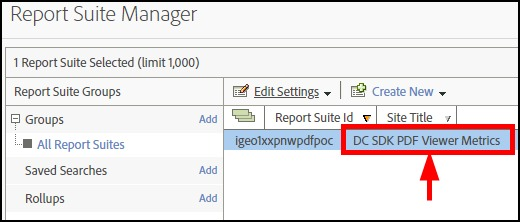
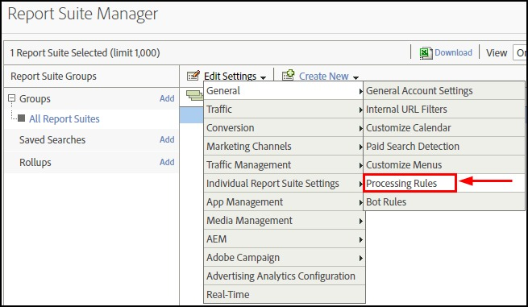
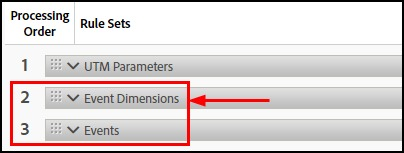
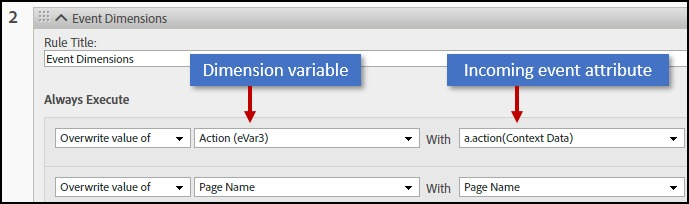
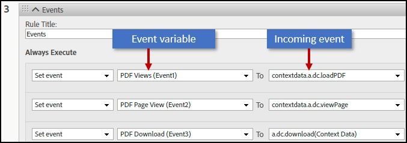
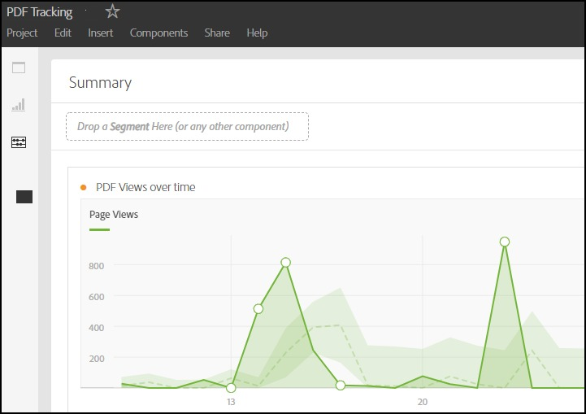
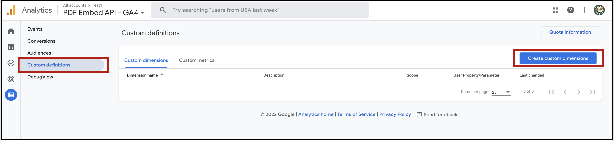
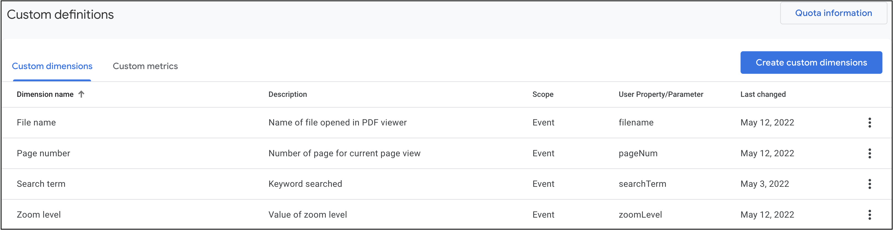
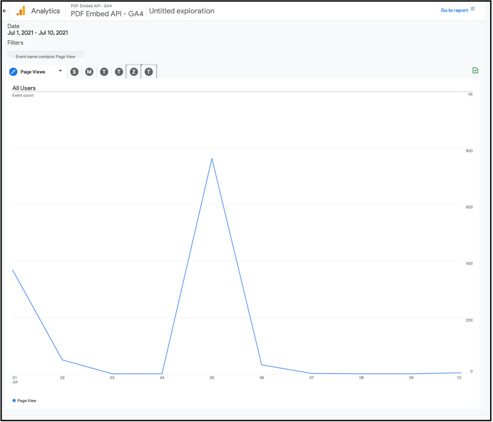

# Analytics

## Adobe Analytics

If your organization already subscribes to Adobe Analytics, rich PDF
analytics is yours by default. You should use Analytics as you normally
would; however, there are a few setup steps required to correctly map
the incoming data to Adobe Analytics variables.

### Set up the PDF Viewer

Since you want to track user interaction with the PDF viewer, you need
to make sure events appear in the correct report suites. To
automatically receive PDF analytics events, pass the Analytics report
suite ID when creating the AdobeDC.View instance. You must ensure that
Adobe Analytics is instrumented using the same `reportSuiteId` for the
website where you are embedding the PDF Viewer.

```javascript
var adobeDCView = new AdobeDC.View({
    clientId: "<YOUR_CLIENT_ID>",
    divId: "adobe-dc-view"
    reportSuiteId: "<YOUR_Adobe_Analytics_REPORT_SUITE ID>",
    ...
})
```

Find the code sample for Adobe Analytics integration 
in PDF Embed API [here](https://www.adobe.com/go/pdfembedapi_samples) under
`/More Samples/Analytics/Adobe Analytics`.

### Configure Adobe Analytics

The current release requires a few configuration steps to correctly map
PDF Embed API data collected from your PDF viewer to your report suite.
Once you've logged in to Analytics, do the following:

Once you've logged in to Analytics, do the following:

1.  In the top menu, go to **Admin > Report Suites**.
2.  Select your report suite.


<br/>

3.  Navigate to the Report Suite Manager.
4.  Highlight your report suite.
5.  Choose **Edit Settings > General > Processing Rules**.


<br/>

6.  Click the **Processing Rules** tab. You'll need to create two rules
    and configure them so that you can map collected events and event
    attributes to Analytics variables.



#### Mapping event attibutes

You'll need to create a new rule and map event attributes sent by the
PDF Embed API to an Adobe Analytics variable. For example, an event
attribute might be something like a page number or title. There could be
many events with the same attribute (one for each event happening on a
specific page). The following attributes eventually become dimensions in
your reports:

-   a.dc.searchTerm
-   a.action
-   a.dc.pageNum
-   a.dc.filename

Map event attributes as follows:

1.  Choose **Add Rule**.
2.  Add a custom rule title such as "Event Dimensions".
3.  Choose **Add Action** until you have four (one for each attribute
    above).
4.  Select an item (event attribute) from the **With** drop down list
    (one of those above).
5.  Select an Analytics dimension variable from the drop down list on
    the left.
6.  The left hand columns should remain set to "Overwrite value of".
7.  Repeat the above steps for each incoming event attribute you track.



#### Mapping events

Create another new rule and map events sent by the PDF Embed API to an
Adobe Analytics variable. Note that Analytics uses "metrics" and
"events" interchangeably. An event is any user interaction your
JavaScript event listener captures; for example, clicking on a button or
commenting on a PDF. The following events eventually become metrics
displayed in your reports:

-   a.dc.zoomLevel
-   a.dc.loadPDF
-   a.dc.viewPage
-   a.dc.download
-   a.dc.search
-   a.dc.bookmarkClicked
-   a.dc.copyText
-   a.dc.print

Map events as follows:

1.  Choose **Add Rule**.
2.  Add a custom rule title such as "Events".
3.  Choose **Add Action** until you have eight (one for each attribute
    above).
4.  Select a metric (an event) from the **To** drop down list (one of
    those above).
5.  Select an Analytics event variable from the drop down list on the
    left.
6.  The left hand column should remain set to "Set event".
7.  Repeat the above steps for each metric (incoming event).



### Viewing your data

Set up your reporting as usual, and view the dimensions and metrics in
your workspace.



### Help, support, forum

For more detail about using this Adobe Analytics UI, refer to the [help
docs](https://experienceleague.adobe.com/docs/analytics/admin/admin-tools/processing-rules/processing-rules.html).
You can also ask questions and get help here:

-   [Community forum](https://forums.adobe.com/community/experience-cloud/analytics-cloud/analytics)
-   [Analytics Support](https://helpx.adobe.com/support/analytics.html)

## Google Analytics

If your website is already integrated with Google Analytics, you can collect PDF analytics 
from PDF Embed API in Google Analytics with a few simple setup steps. 

### Set up the PDF Viewer

Since you want to track user interaction with the PDF viewer, 
you need to make sure events appear in the correct Google Analytics property. 
To automatically receive PDF analytics events, pass the **Google Analytics 4 
measurement ID** when creating the `AdobeDC.View` instance. 
You must ensure that Google Analytics is instrumented using the same 
measurement ID for the website where you are embedding the PDF Viewer.

<InlineAlert slots="text" />

PDF analytics can only be collected in Google Analytics 4 property.
Analytics collection in Universal Analytics is not supported in the
current implementation.

```javascript
var adobeDCView = new AdobeDC.View({
    clientId: "<YOUR_CLIENT_ID>",
    divId: "adobe-dc-view"
    measurementId: "<YOUR_GA4_MEASUREMENT ID>",
    ...
})
```

*Following PDF analytics will be tracked:*

| Event action            | Event description                                                                                                                                                                 | Event data                                                                                                                      |
| --------------------- | --------------------------------------------------------------------------------------------------------------------------------------------------------------------------------- | ------------------------------------------------------------------------------------------------------------------------------- |
| Load PDF        | On successful opening of PDF.                                                                                                                                                     | File name                                                                                                       |
| Page View            | Page information on change in page(s) in view                                                                                                                                     | Page number, File name                                                                               |
| Bookmark Click | On clicking on any bookmark item                                                                                                                                                  | File name                                                                              |
| Download    | When the PDF is downloaded                                                                                                                                                        | File name
| Print       | When the PDF is printed                                                                                                                                                           | File name                                                                                  |
| Hyperlink Open       | On clicking any external hyperlink in the PDF                                                                                                                                     | File name |
| Text Copy            | On copying any text from a PDF. | File name                                                                            |
| Search          | When the user searches for any text via the document search field                                                                                                                 | Searched text, file name                                                                        |
| Change Zoom           | When zoom in/out actions are performed on the PDF toolbar                                                                                                              | Zoom level, File name |

Find the code sample for Google Analytics integration 
in PDF Embed API [here](https://www.adobe.com/go/pdfembedapi_samples) under
`/More Samples/Analytics/Google Analytics`.

### Configure Google Analytics

The current release requires a few configuration steps to correctly map 
PDF Embed API data collected from your PDF viewer to Google Analytics.

### Custom Dimensions

You need to set up some custom dimensions in the Google Analytics 4 property, 
that will map to the attributes which are part of the event data sent by PDF Embed API.

Once you've logged in to Google Analytics, do the following:

1.  From the top bar, select the Google Analytics 4 property which contains your **measurement ID**.
2.  Click **Custom definitions** under **Configure** (in the left navigation pane).
3.  Click **Create custom dimensions**.


<br/>

4.  Enter Dimension name.
5.  Set the scope as **Event**.
6.  Enter a  description for this custom dimension.
7.  Enter the name of the event attribute sent from PDF Embed API. Custom dimensions need to be created for these event attributes: **filename**, **pageNum**, **searchTerm** and **zoomLevel**.
8. Click **Save**. 
(Note: You will see a value of "Not set" for a custom dimension during the first 48 hours. )
9. You need to set up four custom dimensions, as follows:

  * File Name 
  * Page Number 
  * Search Term, and, 
  * Zoom Level 

10. Map these custom dimensions with the correct event attributes sent from PDF Embed API, as shown in the table below:

| Dimension name | Scope                                                                     |  User property/parameter    |
| ------ | ------------------------------------------------------------------------------- |  ----------------------------- |
| File name | Event |                filename                |
| Page number    | Event        |                                  pageNum  |
| Search term    | Event         |                                  searchTerm  |
| Zoom level    | Event         |                                   zoomLevel |



<br/>

### Viewing your data in Google Analytics 4

Once you start receiving PDF analytics in Google Analytics 4, 
set up your reporting as usual and view the dimensions and metrics in your workspace.

**Creating a sample exploration to track page views**

You can set up reports for different dimensions and metrics and view the data. 
This example below creates a sample exploration to track page views in the PDF. 

1.  Select **Explore** from the left navigation pane and click the plus sign to create a new blank report.
2.  Select a custom timeline.
3.  Select **Line Chart** from the Visualisation.
4.  Drag and drop **Event Name** from Dimensions in Breakdowns.
5.  Remove Active Count from Values.
6.  Drag and drop **Event Count** from Metrics in Values.
7.  Go to Filters and select **Event Name**.
8.  Select match type 'contains' and enter 'Page View' in expression. 
9.  Click Apply. 



<InlineAlert slots="text" />

If your website subscribes to both Adobe Analytics and Google Analytics, 
then analytics will be collected only in Adobe Analytics and no PDF analytics 
data would be sent to Google Analytics. 

## Control analytics collection

If your website is already integrated with analytics tools, such as, Adobe Analytics or Google Analytics, 
then you can collect PDF analytics with few additional setup steps. 
To know more about the setup steps, see the sections [Adobe Analytics](./howtodata.md#adobe-analytics) and [Google Analytics](./howtodata.md#google-analytics).

The `sendAutoPDFAnalytics` configuration controls the PDF analytics collection in these tools. 
The default value of `sendAutoPDFAnalytics` is *true*. 
Set this configuration to *false* if you would like to disable PDF analytics collection. 

```javascript
var adobeDCView = new AdobeDC.View({
    clientId: "<YOUR_CLIENT_ID>",
    divId: "adobe-dc-view"
    sendAutoPDFAnalytics: false,
    ...
})
```

## Default analytics

If you are not subscribed to Adobe Analytics or Google Analytics, you can still collect PDF
analytics events as users interact with PDFs. You enable PDF analytics
events by registering a callback with the API to listen the events.
Tracking PDF events provides insight into user actions and thereby helps
you manage and evolve the PDF experience you're delivering to customers.

As always, initialize the AdobeDC View object with your client ID, and
then invoke the `previewFile` API on AdobeDC.View object as usual.
Finally, register the callback to receive the events and set
`enablePDFAnalytics` to *true*:

```javascript
const eventOptions = {
  //Pass the PDF analytics events to receive.
  //If no event is passed in listenOn, then all PDF analytics events will be received.
  listenOn: [ AdobeDC.View.Enum.PDFAnalyticsEvents.PAGE_VIEW, AdobeDC.View.Enum.PDFAnalyticsEvents.DOCUMENT_DOWNLOAD],
  enablePDFAnalytics: true
}

adobeDCView.registerCallback(
  AdobeDC.View.Enum.CallbackType.EVENT_LISTENER,
  function(event) {
    console.log("Type " + event.type);
    console.log("Data " + event.data);
  }, eventOptions
);
```

Find the working example in the [samples
repo](https://www.adobe.com/go/pdfembedapi_samples) under
`/More Samples/Capture PDF Embed API Events/`.

*Supported analytics events*

| Event type            | Event description                                                                                                                                                                 | Event data                                                                                                                      |
| --------------------- | --------------------------------------------------------------------------------------------------------------------------------------------------------------------------------- | ------------------------------------------------------------------------------------------------------------------------------- |
| DOCUMENT_OPEN        | On successful opening of PDF.                                                                                                                                                     | `{fileName: <FILE_NAME>}`                                                                                                        |
| PAGE_VIEW            | Page information on change in page(s) in view                                                                                                                                     | `{pageNumber: <PAGE_NUM>, fileName: <FILE_NAME>}`                                                                               |
| BOOKMARK_ITEM_CLICK | On clicking on any bookmark item                                                                                                                                                  | `{title: <BOOKMARK_TITLE>, fileName: <FILE_NAME>}`                                                                              |
| DOCUMENT_DOWNLOAD    | When the PDF is downloaded                                                                                                                                                        | `{fileName: <FILE_NAME>}`                                                                                                        |
| DOCUMENT_PRINT       | When the PDF is printed                                                                                                                                                           | `{printSupported: true, fileName: <FILE_NAME>}`                                                                                  |
| HYPERLINK_OPEN       | On clicking any external hyperlink in the PDF                                                                                                                                     | `{type: “external”, pageNumber: <PAGE_NUM>, x: <X-coordinate of the link>, y: <Y-coordinate of the link>, url: <EXTERNAL_URL>}` |
| TEXT_COPY            | On copying any text from a PDF. Note that the TEXT_COPY event only fires for PDF files that allow text copy; for example, secured and encrypted files do not allow copying text. | `{copiedText: <COPIED_TEXT>, fileName: <FILE_NAME>}`                                                                            |
| TEXT_SEARCH          | When the user searches for any text via the document search field                                                                                                                 | `{searchedText: <SEARCHED_TEXT>, fileName: <FILE_NAME>}`                                                                        |
| ZOOM_LEVEL           | When zoom in/out actions are performed from the page control toolbar                                                                                                              | `{zoomLevel: <ZOOM_LEVEL>, fileName: <FILE_NAME>}`                                                                              |

## Basic events

In addition to the PDF analytics events, the PDF Embed API supports
events which provide insight into user actions taken related to file
preview. These events can be received through the events callback. After
registering the events callback, the following file preview events are
generated:

| Event type             | Event description                                                                                                                                                                                                                                                                                                                                                                           | Event data |
| ---------------------- | ------------------------------------------------------------------------------------------------------------------------------------------------------------------------------------------------------------------------------------------------------------------------------------------------------------------------------------------------------------------------------------------- | ---------- |
| APP_RENDERING_START  | When the PDF starts to render in the viewer.                                                                                                                                                                                                                                                                                                                                                | None       |
| APP_RENDERING_DONE   | When the first page of the PDF is displayed in the viewer..                                                                                                                                                                                                                                                                                                                                 | None       |
| APP_RENDERING_FAILED | When the PDF fails to render because of an unexpected error.                                                                                                                                                                                                                                                                                                                                | None       |
| PDF_VIEWER_OPEN      | When the PDF viewer opens.                                                                                                                                                                                                                                                                                                                                                                  | None       |
| PDF_VIEWER_CLOSE     | When the PDF viewer closes.                                                                                                                                                                                                                                                                                                                                                                 | None       |
| PDF_VIEWER_READY     | When the PDF is rendered completely and the PDF viewer is ready to perform functionalities, such as, annotations and form-filling. This event is especially useful in case of linearized PDFs to check when the PDF gets fully downloaded. To know more about linearization, see the section [PDF Linearization](../howtos/#pdf-linearization). | None       |

In order to receive additional file preview events, set
`enableFilePreviewEvents` to *true* and pass it to the events callback.
To receive specific events, pass the list of event types in the
`listenOn` parameter. If nothing is passed to `listenOn`, then the API
returns all the file preview events.

```javascript
const eventOptions = {
     //Pass the events to receive.
     //If no event is passed in listenOn, then all file preview events will be received.
     listenOn: [ AdobeDC.View.Enum.Events.APP_RENDERING_START, AdobeDC.View.Enum.FilePreviewEvents.PREVIEW_KEY_DOWN,  AdobeDC.View.Enum.FilePreviewEvents.PREVIEW_PAGE_VIEW_SCROLLED ],
     enableFilePreviewEvents: true
}

adobeDCView.registerCallback(
     AdobeDC.View.Enum.CallbackType.EVENT_LISTENER,
     function(event) {
        console.log(event)
     }, eventOptions
);
```

*List of file preview events*

| Event type                    | Event description                                                                                                                                                                                                                                                                                                                                             | Event data                                                                                                                                                                                                                                                                                                                       |
| ----------------------------- | ------------------------------------------------------------------------------------------------------------------------------------------------------------------------------------------------------------------------------------------------------------------------------------------------------------------------------------------------------------- | -------------------------------------------------------------------------------------------------------------------------------------------------------------------------------------------------------------------------------------------------------------------------------------------------------------------------------- |
| PREVIEW_KEY_DOWN            | Any keyboard key is pressed over any PDF page.                                                                                                                                                                                                                                                                                                                | `{ altKey: <BOOLEAN>, code: <KEY_VALUE>, composed: <BOOLEAN>, ctrlKey: <BOOLEAN>, key: <KEYBOARD_CHARACTER>, keyCode: <KEY_CODE>, location: <LOCATION>, metaKey: <BOOLEAN>, shiftKey: <BOOLEAN>, type: “keydown” }`                                                                                                             |
| PREVIEW_PAGE_VIEW_SCROLLED | The PDF page is scrolled.                                                                                                                                                                                                                                                                                                                                     | `{ clientHeight: <CLIENT_HEIGHT>, clientWidth: <CLIENT_WIDTH>, scrollHeight: <SCROLL_HEIGHT>, scrollWidth: <SCROLL_WIDTH>, scrollLeft: <SCROLL_LEFT>, scrollTop: <SCROLL_TOP> }`                                                                                                                                             |
| PREVIEW_DOCUMENT_CLICK      | A user clicks on the area in the webpage which is outside the PDF preview (excluding the top bar and right-hand panel).                                                                                                                                                                                                                                        | `{ clientX: <CLIENT_WIDTH>, clientY: <CLIENT_HEIGHT>, pageX: <PAGE_WIDTH>, pageY: <PAGE_HEIGHT>, screenX: <SCREEN_WIDTH>, screenY: <SCREEN_HEIGHT> }`                                                                                                                                                                        |
| PREVIEW_PAGE_CLICK          | A user clicks on any PDF page.                                                                                                                                                                                                                                                                                                                                | `{ pageNumber: <PAGE_NUMBER> }`                                                                                                                                                                                                                                                                                                   |
| PREVIEW_PAGE_DOUBLE_CLICK  | A user double-clicks on any PDF page.                                                                                                                                                                                                                                                                                                                         | `{ pageNumber: <PAGE_NUMBER> }`                                                                                                                                                                                                                                                                                                   |
| PREVIEW_PAGE_MOUSE_ENTER   | The mouse pointer enters any PDF page.                                                                                                                                                                                                                                                                                                                        | `{ pageNumber: <PAGE_NUMBER> }`                                                                                                                                                                                                                                                                                                   |
| PREVIEW_PAGE_MOUSE_LEAVE   | The mouse pointer leaves any PDF page.                                                                                                                                                                                                                                                                                                                        | `{ pageNumber: <PAGE_NUMBER> }`                                                                                                                                                                                                                                                                                                   |
| CURRENT_ACTIVE_PAGE         | Returns the page number of the current page in view.                                                                                                                                                                                                                                                                                                          | `{ pageNumber: <PAGE_NUMBER> }`                                                                                                                                                                                                                                                                                                   |
| PREVIEW_SELECTION_END       | Any text is selected in the PDF.                                                                                                                                                                                                                                                                                                                              | `{ startPageNumber: <PAGE_NUMBER>, endPageNumber: <PAGE_NUMBER>, newSelection: <BOOLEAN>, selections: { page<PAGE_NUMBER>: { bbox0: { deviceBottom: <Ymin-coordinate>, deviceLeft: <Xmin-coordinate>, deviceRight: <Xmax-coordinate>, deviceTop: <Ymax-coordinate> }, bbox1: {…}, bbox2: {…}, …, bboxCount: <BBOX_COUNT> }} }` |
| PREVIEW_ZOOM                 | A zoom operation is applied to any PDF page.                                                                                                                                                                                                                                                                                                                  | `<ZOOM_LEVEL>`                                                                                                                                                                                                                                                                                                                    |
| PAGES_IN_VIEW_CHANGE       | The page in view changes to a different page through scrolling or page navigation.                                                                                                                                                                                                                                                                            | `{ startPage: { pageNumber: <PAGE_NUMBER>, fractionVisible <PAGE_VISIBLE_FRACTION> }, endPage: { pageNumber: <PAGE_NUMBER>, fractionVisible <PAGE_VISIBLE_FRACTION> }}`                                                                                                                                                      |
| UNSUPPORTED_FEATURE_FOUND   | When user tries to use an unsupported feature in PDF Embed API. The event data provides information about the type of unsupported feature in the featureName field and relevant metadata of PDF in the data field. For example, XFA form fields are not supported in PDF Embed API and this event is generated when a user tries to fill any such form field. | `{ featureName: <FEATURE_NAME>, data: {hasJS: <BOOLEAN>, hasUnsupportedActions: <BOOLEAN, hasUnsupportedWidget: <BOOLEAN>, hasXFA: <BOOLEAN> }}`                                                                                                                                                                                  |

## Annotation events

Web developers can receive events when a user interacts with an
annotation. These events are generated for annotation actions performed
through the UI.

To register the events callback, set `enableAnnotationEvents` to *true*
and pass it to the callback. To receive specific events, pass the list
of annotation event types in the `listenOn` parameter. If nothing is
passed to `listenOn`, then the API returns all the annotation events.

```javascript
const eventOptions = {
   //Pass the events to receive.
   //If no event is passed in listenOn, then all annotation events will be received.
   listenOn: [ AdobeDC.View.Enum.AnnotationEvents.ANNOTATION_ADDED, AdobeDC.View.Enum.AnnotationEvents.ANNOTATION_UPDATED ],
   enableAnnotationEvents: true
 }

 adobeDCView.registerCallback(
   AdobeDC.View.Enum.CallbackType.EVENT_LISTENER,
   function(event) {
     console.log(event.type, event.data)
   }, eventOptions
 );
```

*List of annotation events*

| Event type  | Event description | Event data  |
| ------ | -----------------------  | ----------------------------------------------- |
| ANNOTATION_ADDED         | A new annotation is added to PDF.                                                                               | <ANNOTATION_TYPE>        |
| ANNOTATION_CLICKED       | An existing annotation is clicked.                                                                              | <ANNOTATION_TYPE>        |
| ANNOTATION_UPDATED       | An existing annotation is updated.                                                                              | <ANNOTATION_TYPE>        |
| ANNOTATION_DELETED       | An annotation is deleted.                                                                                       | <ANNOTATION_TYPE>        |
| ANNOTATION_MOUSE_OVER   | The cursor moves over any annotation.                                                                           | <ANNOTATION_TYPE>        |
| ANNOTATION_MOUSE_OUT    | The cursor moves out of any annotation.                                                                         | <ANNOTATION_TYPE>        |
| ANNOTATION_SELECTED      | Any existing annotation is selected.                                                                            | <ANNOTATION_TYPE>        |
| ANNOTATION_UNSELECTED    | A selected annotation is unselected                                                                             | <ANNOTATION_TYPE>        |
| ANNOTATION_MODE_STARTED | The user selects a particular annotation type from the toolbar.                                                 | <ANNOTATION_TYPE>        |
| ANNOTATION_MODE_ENDED   | A user exits any previously selected annotation mode.                                                           | <ANNOTATION_TYPE>        |
| ANNOTATION_COUNT         | Denotes the total number of annotations when any new annotation is added or any existing annotation is deleted. | <NUMBER_OF_ANNOTATIONS> |

<InlineAlert slots="text"/>

-   If annotation APIs are not enabled, the event data contains the type of annotation on which the event gets triggered.
-   If annotation APIs are enabled, the event data contains the data of the annotation in JSON format on which the event gets triggered.

