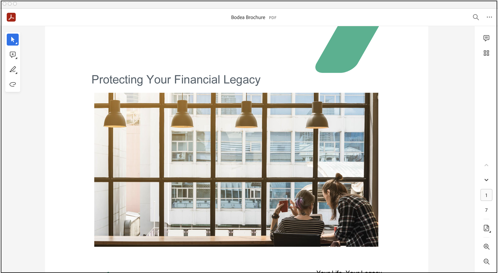
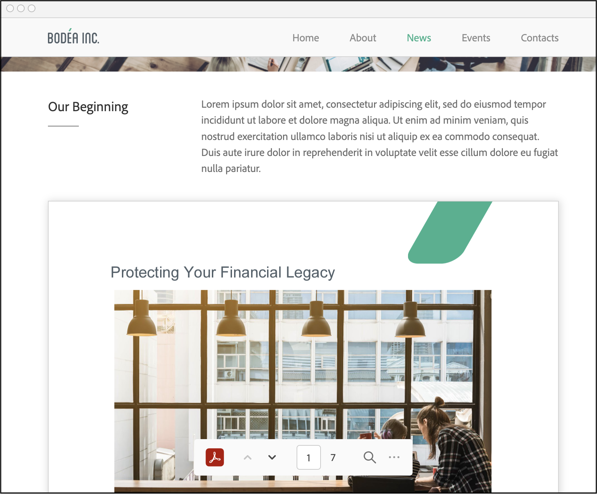
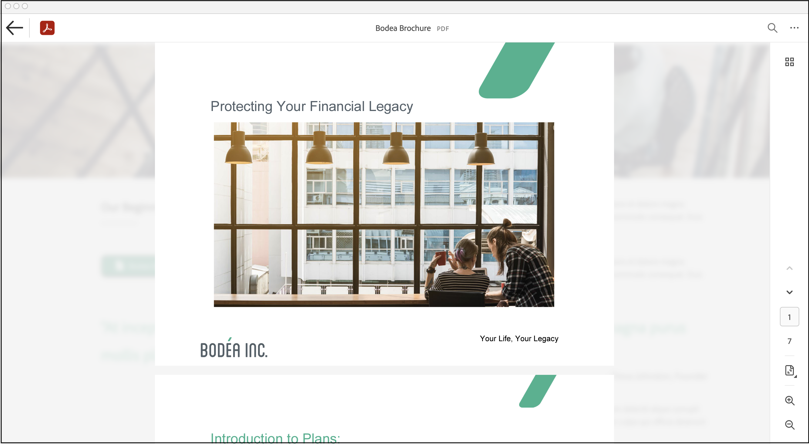

# PDF Embed API basics

The samples and documentation provide an easy way to jump-start
development. The sections below describe how to embed a customized PDF
viewer in a web page.


## Embed a PDF viewer

Once you've received your client ID, embedding the DC PDF viewer
involves:

1.  Adding a `<script>` tag to load the PDF Embed API by source url:
    <https://documentcloud.adobe.com/view-sdk/main.js> (**line 6**).
2.  Setting up the rendering area: use a div tag with an ID of
    `adobe-dc-view` (**line 9**).
3.  Initializing the PDF Embed API by passing client ID, and call
    `previewFile` with PDF file URL and file name as shown from line 13
    to line 18.

As shown below, PDF details are passed in an object which consists of
two fields:

-   **content**: The file content either provided as a file path or file
    promise which resolves to ArrayBuffer of the file content. See
    [Passing file content](#passing-file-content).
-   **metaData**: File metadata information. Note that `fileName` is
    mandatory.

That's it! View the page in a browser to see your fully functional PDF
viewer.

```html
<html>
<head>
  <title>Your title</title>
  <meta charset="utf-8"/>
  <meta http-equiv="X-UA-Compatible" content="IE=edge,chrome=1"/>
  <script src="https://documentcloud.adobe.com/view-sdk/main.js"></script>
</head>
<body>
  <div id="adobe-dc-view"></div>
  <script type="text/javascript">
   document.addEventListener("adobe_dc_view_sdk.ready", function()
   {
      var adobeDCView = new AdobeDC.View({clientId: "<YOUR_CLIENT_ID>", divId: "adobe-dc-view"});
      adobeDCView.previewFile(
     {
         content:  {location: {url: "(path to your PDF)/yourfilename.pdf"}},
         metaData: {fileName: "yourfilename.pdf"}
     });
   });
  </script>
</body>
</html>
<!--Get the samples from https://www.adobe.com/go/pdfembedapi_samples-->
```

## Passing file content

As shown above, you pass PDF data via the `content` field either as a
file URL or file promise. The `metaData` field with a mandatory filename
is required for both methods.

```javascript
adobeDCView.previewFile({
  content: {location (URL) OR promise (File blob)},
  metaData: {fileName (always required) + optional fields }
})
```

<InlineAlert slots="text"/>

If you pass both a file URL and file promise, the promise is used and
the URL value is ignored.

### File URL

Passing PDF data via a URL is self-explanatory, but note that some
scenarios require special handling.

**Token-based authentication**

When a file URL resides behind token-based authentication and use custom
headers, pass both the URL and the headers as follows:

```javascript
adobeDCView.previewFile({
   content: {
       location: {
          url: <filepath>,
          headers:[{key: ..., value: ...}, ...]
       },
   },
   metaData: {fileName: <filename> }
})
```

**Cookie-based authentication**

When a file URL uses cookie-based authentication, set
`downloadWithCredentials` to *true* when initialising the
`AdobeDC.View object`:

```javascript
var adobeDCView = new AdobeDC.View({
    ...
    downloadWithCredentials: true,
});
```

### Cross-origin resource sharing

[Cross-origin resource sharing
(CORS)](https://developer.mozilla.org/en-US/docs/Web/HTTP/CORS) issues
may occur when you pass PDF content as a URL and the PDF Embed API needs
to download the file from the provided location in order to render it.
To avoid this situation, you can choose one of two methods:

-   Locate your webpage and file location URL on the same domain.
    Example: webpage: <https://example.com/viewer/test.html>; PDF
    location: <https://example.com/resources/abc.pdf>)
-   Enable CORS headers on the PDF resource to allow access from your
    webpage domain.

### File promise

If the file content is available as an ArrayBuffer (for example, local
PDF files), then it can be passed directly as a Promise which should
resolve to the ArrayBuffer of the file content.

```javascript
adobeDCView.previewFile({
    content: { promise: <FILE_PROMISE> }
    metaData: { fileName: <FILE_NAME> }
});
```

One way to create a file promise is to allow users to choose a local
file for upload. In your HTML, you could do the following:

```html
<label for="file-picker"> Choose a PDF file:</label>
<input type="file" id="file-picker" accept="application/pdf">
```

Once the file uploads, you could use a helper function to read the file
and pass it to `adobeDCView.previewFile`:

```javascript
function listenForFileUpload() {
  var fileToRead = document.getElementById("file-picker");
  fileToRead.addEventListener("change", function(event) {
     var files = fileToRead.files;
     if (files.length > 0) {
        var reader = new FileReader();
        reader.onloadend = function(e) {
            var filePromise = Promise.resolve(e.target.result);
            // Pass the filePromise and name of the file to the previewFile API
            // adobeDCView.previewFile({
            //      content: {promise: filePromise}
            //      metaData: { fileName: files[0].name }
            // })
        };
        reader.readAsArrayBuffer(files[0]);
      }
    }, false);
}
```

## PDF Linearization

Linearization is an approach to optimize PDFs for faster viewing by
displaying the first page as quickly as possible before the entire PDF
gets downloaded. Linearized PDFs contain information so that pages can
be streamed one at a time via byte range requests from a server.
Linearization is extremely useful for displaying large-sized documents
as well as displaying documents on slow networks, thus providing an
overall faster PDF viewing experience.

PDF Embed API supports the rendering of linearized PDFs which are hosted
on servers with byte-range support.

For details, see [Enabling byte-streaming on a server](#enabling-byte-streaming-on-a-server).

### Display linearized PDFs

In order to display linearized PDFs using PDF Embed API, set the
variable `enableLinearization` to true (default value is false) and pass
it as a preview configuration to the `previewFile` API.

As described in the section [Passing file content](#passing-file-content), the linearized PDF can be passed as
a file URL or file Promise.

### File URL

Pass the URL of the linearized PDF in the `content` field and invoke the
`previewFile` API.

```html
<div id="adobe-dc-view"></div>
<script src="https://documentcloud.adobe.com/view-sdk/main.js"></script>
<script type="text/javascript">
  document.addEventListener("adobe_dc_view_sdk.ready", function() {
    var adobeDCView = new AdobeDC.View({clientId: "<YOUR_CLIENT_ID>", divId: "adobe-dc-view"});
    var previewFilePromise = adobeDCView.previewFile({
      content:   {location: {url: "<URL_OF_LINEARIZED_PDF>"}},
      metaData:  {fileName: "<FILE_NAME>"}
    },
    {
      enableLinearization: true,
    });
  });
</script>
```

### File Promise

If the file content is available as an ArrayBuffer, then it can be
passed directly as a Promise resolving to the ArrayBuffer of the file
content.

Pass this file promise in the `content` field. Along with this, it is
**mandatory** to pass an object called the `linearizationInfo` in the
`content` field.

The `linearizationInfo` object will contain the following three
functions:

**getInfo()**

Returns a Promise which,

-   Resolves with an object containing the file size. For instance, the
    size of a PDF file can be obtained by making a HEAD call to the PDF
    URL which will return the content length.
-   Reject the Promise if the content length is invalid and the PDF
    rendering automatically falls back to the non-linearized flow.

**getInitialBuffer()**

Returns a Promise which,

-   Resolves with an object containing the initial array buffer of the
    file. The initial buffer is defined as 0 - 1024 bytes which is
    required to render the first page of the linearized PDF.
-   Reject the Promise if this call fails due to an unexpected error and
    the PDF rendering automatically falls back to the non-linearized
    flow.

**getFileBufferRanges()**

Returns a Promise which,

-   Resolves with an object containing the list of desired array buffers
    of the file using the `ranges` parameter provided by PDF Embed API
    at run time. The `ranges` parameter is an array of `start` and `end`
    file ranges.

If the `ranges` array contains more than one object, then there are two
ways to fetch the file buffers:

1.  Make separate calls for each range object present in `ranges` array
    and return the combined result.
2.  Make a single call with **Range** header value set to comma
    separated start-end values for each range object (for example:
    "bytes=0-1024, 1024-2048").

-   Reject the Promise when any range call fails or the range call
    returns the entire PDF buffer. In this case, PDF rendering will fall
    back to the non-linearized flow.

<InlineAlert slots="text"/>

-   If you pass both a file URL and file promise for a linearized PDF, the promise is used and the URL value is ignored.
-   If you use file promise, then it is mandatory to pass the `linearizationInfo` object. The `linearizationInfo` object should contain all the 3 functions: `getInfo()`, `getInitialBuffer()` and `getFileBufferRanges()`.

Note that the website developer can provide their custom implementation
of these functions and pass it to the `linearizationInfo` object.

```html
<div id="adobe-dc-view"></div>
<script src="https://documentcloud.adobe.com/view-sdk/main.js"></script>
<script type="text/javascript">
  document.addEventListener("adobe_dc_view_sdk.ready", function() {
    const linearizationInfoObject = {
      getInfo: () => getInfo(),
      getInitialBuffer: () => getInitialBuffer(),
      getFileBufferRanges: ranges => getFileBufferRanges(ranges)
    };

    var adobeDCView = new AdobeDC.View({clientId: "<YOUR_CLIENT_ID>", divId: "adobe-dc-view"});
    var previewFilePromise = adobeDCView.previewFile({
      content:   {
        promise: <FILE_PROMISE>,
        linearizationInfo: linearizationInfoObject
      },
      metaData:  {fileName: "<FILE_NAME>"}
    },
    {
      enableLinearization: true,
    });

    function getInfo() {
      /* Write down your own implementation here */
      return new Promise((resolve, reject) => {
        resolve({
          fileSize: <FILE_SIZE>
        });
      });
    }

    function getInitialBuffer() {
      /* Write down your own implementation here */
      return new Promise((resolve, reject) => {
        resolve({
          buffer: <ARRAY_BUFFER>
        });
      });
    }

    function getFileBufferRanges(ranges) {
      /* Write down your own implementation here */
      /* Ranges parameter
         ranges: [{ start: NUMBER, end: NUMBER}, { start: NUMBER, end: NUMBER}, . . .]
      */
      return new Promise((resolve, reject) => {
        resolve({
          bufferList: [
            <ARRAY_BUFFER>,
            <ARRAY_BUFFER>,
             . . .
          ]
        });
      });
    }
  });
</script>
```

<InlineAlert slots="text"/> 

Find the working code sample [here](https://www.adobe.com/go/pdfembedapi_samples) under `/More Samples/Linearization`

### Supported browsers and platforms

Displaying linearized PDFs using PDF Embed API will work in browsers
which support SharedArrayBuffer, such as Chrome and Chromium-based
Microsoft Edge desktop browsers. In case of other desktop browsers and
mobile browsers, it will automatically fall back to the normal behaviour
(non-linearized flow) of downloading the entire PDF before file preview.

### Other supported functionalities

-   Support for linearized PDF is currently available only in Full
    window embed mode. In all other embed modes, it will automatically
    fall back to the normal file rendering approach.
-   As the main focus here is to enable fast rendering of PDFs, certain
    functionalities which depend on the complete PDF buffer are not
    available immediately. These functionalities (for example,
    annotation tools and APIs, print and download PDF, document search,
    etc.) will be available once the PDF is fully downloaded and website
    developers will be notified through the PDF\_VIEWER\_READY event. To
    know more about this event, see the section [Basic events](./howtodata.md#basic-events) under
    Analytics.

### Enabling byte-streaming on a server

The server where the linearized PDFs are hosted should have support of
byte-streaming to be able to send partial file content via HTTP 206
calls.

For example, you can follow these steps to enable byte-streaming in an
Apache 2.4 server.

Open httpd.conf and make below changes:
1. Uncomment this line: LoadModule headers_module modules/mod_headers.so
2. In your respective `<Directory>`, set headers

```
<Directory "${SRVROOT}/htdocs/<__location_of_PDFs_____>">
   <IfModule mod_headers.c>
     # To allow byte-streaming and range support
     Header set Access-Control-Allow-Headers "Range"
   </IfModule>
</Directory> 
```


Please see this
[article](https://developer.mozilla.org/en-US/docs/Web/HTTP/Headers/Access-Control-Allow-Headers)
to know more about Access-Control-Allow-Headers.

## Embed modes

The PDF Embed API's embed modes govern the PDF viewing area's size and
position within a web page. Available options allow you to control the
viewing experience and layout much like you would an image, video, or
any other web content. In order to use any of the available modes, pass
the mode name along with other preview configurations in the
`previewFile` API. For example, you could set IN\_LINE as the
`embedMode` value (line 5):

```javascript
adobeDCView.previewFile({
   content: { ... },
   metaData: { ... }
      },
  {embedMode: "<some value such as: IN_LINE">,
   showDownloadPDF: ...,
   showPrintPDF: ...
      }
);
```

<InlineAlert slots="text"/>

To view the code in action, see the [online demo](https://dc.acrobat.com/view-sdk-demo/index.html) or run the [embed mode samples](https://www.adobe.com/go/pdfembedapi_samples) on your machine.


**Embed mode overview**

| Embed mode                          | Description                                                                                                            | Example                                               |
| ----------------------------------- | ---------------------------------------------------------------------------------------------------------------------- | ----------------------------------------------------- |
| [Full window](#full-window) (default mode) | The viewing area renders in the full browser. Best suited for storage and productivity applications.                   |      |
| [Sized container](#sized-container)           | The sized container mode displays PDFs in a boxed container with landscape orientation. Best suited for presentations. |    |
| [In-Line](#in-line)                  | All PDF pages rendered in line within a web page. Best suited for reading applications.                                |  |
| [Lightbox](#lightbox)               | Displays PDFs in a focused view. Best suited for content websites, content portals, and email.                         |        |
 
### Full window

The full window mode is the default embed mode and renders the PDF in
the full browser. This mode is best suited for storage and productivity
applications. ([Full Window Demo](https://documentcloud.adobe.com/view-sdk-demo/index.html#/view/FULL_WINDOW))

<InlineAlert slots="text"/>

Note that the full window embed mode applies by default, and there is
no need to pass any `embedMode` value. Configuring [Menu and tool options](howtos_ui.md#menu-and-tool-options) is
optional.

-   **Commenting**: By default, all commenting tools (add text comment,
    sticky notes, highlight, drawing tool, strikethrough and underline),
    eraser tool and the undo/redo tools are available with this mode.
    Users can add and save annotations to the PDF. If desired, disable
    commenting feature by setting the `showAnnotationTools` variable to
    *false*.
-   **Print and download**: This mode supports options to download and
    print the PDF (`showDownloadPDF` and `showPrintPDF`).
-   **Left-hand pane**: The left-hand pane is available by default
    (`showLeftHandPanel`) to display the page thumbnails, view existing
    bookmarks and access the file attachments available in the PDF.
-   **View mode**: Set the default page view to either fit page or fit
    width (`defaultViewMode`).
-   **Page controls**: Show or hide the page control toolbar at the
    bottom containing various options, such as, zoom level, fit page,
    fit width, dock/undock page controls and navigation controls.
    (`showPageControls` and `dockPageControls`).

The bottom toolbar also contains the Adobe Acrobat logo in docked as
well as undocked state. When the toolbar is hidden, the logo displays
along with a floating label "Powered by Adobe Acrobat" and appears at
the bottom right-side.

```html
<div id="adobe-dc-view"></div>
<script src="https://documentcloud.adobe.com/view-sdk/main.js"></script>
<script type="text/javascript">
  document.addEventListener("adobe_dc_view_sdk.ready", function(){
    var adobeDCView = new AdobeDC.View({clientId: "<YOUR_CLIENT_ID>", divId: "adobe-dc-view"});
    adobeDCView.previewFile({
      content:{location: {url: "https://documentcloud.adobe.com/view-sdk-demo/PDFs/Bodea Brochure.pdf"}},
      metaData:{fileName: "Bodea Brochure.pdf"}
    }, {});
  });
</script>
```



### Sized container

The sized container mode displays PDFs in a boxed container with
landscape orientation. Each page appears as a slide, so this mode works
well for presentations and other workflows that require accurate
placement of the PDF content within other content. ([Sized Container Demo](https://documentcloud.adobe.com/view-sdk-demo/index.html#/view/SIZED_CONTAINER))

To use this mode:

* Specify the embedded viewer size by passing height and width values
    to the enclosing `div` tag of the PDF viewer.
* Pass `embedMode: "SIZED_CONTAINER"`
* Optional: Configure the page and tool options
  -   **Print and download**: This mode supports options to download and print the PDF (`showDownloadPDF` and `showPrintPDF`) 
      as well as document search.
  -   **Page controls**: The page control toolbar containing the Adobe Acrobat logo and navigation options is docked but 
      can be undocked by setting `dockPageControls` to false. A full screen mode button also appears in the page control toolbar(`showFullScreen`).

```html
<div id="adobe-dc-view" style="height: 360px; width: 500px;"></div>
<script src="https://documentcloud.adobe.com/view-sdk/main.js"></script>
<script type="text/javascript">
  document.addEventListener("adobe_dc_view_sdk.ready", function(){
    var adobeDCView = new AdobeDC.View({clientId: "<YOUR_CLIENT_ID>", divId: "adobe-dc-view"});
    adobeDCView.previewFile({
      content:{location: {url: "https://documentcloud.adobe.com/view-sdk-demo/PDFs/Bodea Brochure.pdf"}},
      metaData:{fileName: "Bodea Brochure.pdf"}
    }, {embedMode: "SIZED_CONTAINER"});
  });
</script>
```


#### Toggling full screen

To display the PDF in full screen view, choose the **full screen mode**
button in the page toolbar. The top bar contains a traditional exit
(**X**) button which returns full screen mode to normal mode. In mobile
browsers, you can also exit full screen mode by swiping down.


### In-Line

In-Line mode renders PDF pages inline with other web page content. In
this mode, all PDF pages are displayed at once which enables easy and
smooth navigation. In this mode you need only specify the width of the
embedded viewer in the enclosing div tag since the viewer height is
automatically sized for the number of PDF pages. This mode is ideal for
whitepapers, brochures, e-books, and other reading applications. ([In-Line Demo](https://documentcloud.adobe.com/view-sdk-demo/index.html#/view/IN_LINE))

To use this mode:

-   Specify the viewer width attribute in the enclosing `div` tag of the
    PDF viewer.
-   Pass `embedMode: "IN_LINE"`
-   Optional: By default, the page control toolbar only displays when a
    user scrolls pages. The toolbar displays the Adobe Acrobat logo,
    basic navigation controls and document search along with options to
    download and print the PDF. You can toggle both `showDownloadPDF`
    and `showPrintPDF` on and off.

```html
<div id="adobe-dc-view" style="width: 800px;"></div>
<script src="https://documentcloud.adobe.com/view-sdk/main.js"></script>
<script type="text/javascript">
   document.addEventListener("adobe_dc_view_sdk.ready", function(){
     var adobeDCView = new AdobeDC.View({clientId: "<YOUR_CLIENT_ID>", divId: "adobe-dc-view"});
   adobeDCView.previewFile({
     content:{location: {url: "https://documentcloud.adobe.com/view-sdk-demo/PDFs/Bodea Brochure.pdf"}},
     metaData:{fileName: "Bodea Brochure.pdf"}
 }, {embedMode: "IN_LINE"});
 });
</script>
```



### Lightbox

Lightbox mode renders the PDF in the foreground at top of the page. The
background remains visible, but the focus is on the previewed PDF. The
top bar displays the Adobe Acrobat logo and also provides configurable
**Close** and **Back** buttons. The **Close** button appears by default.
([Lightbox Demo](https://documentcloud.adobe.com/view-sdk-demo/index.html#/view/LIGHT_BOX))

To use this mode:

*   Pass `embedMode: "LIGHT_BOX"`.
*   Optional: Configure the page, tool, and exit PDF Viewer options
    -   **Print and download**: This mode supports options to download
        and print the PDF (`showDownloadPDF` and `showPrintPDF`).
    -   **View mode**: Set the default page view to either fit page or
        fit width (`defaultViewMode`).
    -   **Page controls**: Show or hide the page control options in the
        bottom toolbar, such as zoom level, fit page, fit width,
        dock/undock page controls, and navigation controls
        (`showPageControls`).The page control toolbar is undocked by
        default but can be docked by setting `dockPageControls` to
        *true*.
    -   **Exit PDF Viewer**: The top bar contains the Close button by
        default to close the PDF preview which can be configured to Back
        button by setting `exitPDFViewerType` to RETURN
        (`exitPDFViewerType: "RETURN"`).

```html
<script src="https://documentcloud.adobe.com/view-sdk/main.js"></script>
<script type="text/javascript">
    document.addEventListener("adobe_dc_view_sdk.ready", function(){
        var adobeDCView = new AdobeDC.View({clientId: "<YOUR_CLIENT_ID>"});
        adobeDCView.previewFile({
            content:{location: {url: "https://documentcloud.adobe.com/view-sdk-demo/PDFs/Bodea Brochure.pdf"}},
            metaData:{fileName: "Bodea Brochure.pdf"}
        }, {embedMode: "LIGHT_BOX"});
    });
</script>
```

Top bar with Close button (default)


Top bar with Back button (`exitPDFViewerType: "RETURN"`)



### Focus on PDF rendering

Using PDF Embed API, website developers have the flexibility to control if the PDF should take focus when it is rendered within a website.

This is achieved through the variable `focusOnRendering` which can be passed as a configuration to the `previewFile` API. This variable accepts a Boolean value.

```javascript
adobeDCView.previewFile({
  content:{location: {url: "<URL_OF_PDF>"}},
  metaData:{fileName: "<FILE_NAME>"}
}, {embedMode: "<EMBED_MODE>", focusOnRendering: true});
```

The default value of this configuration variable varies according to the embed mode.

| Embed mode      | Default value of focusOnRendering                   | Default behaviour                                                  |                                                             |
| --------------- | --------------------------------------------------- | ------------------------------------------------------------------ |
| [Full window](#full-window)     | true                                                | Acquires focus when PDF is rendered.                               |
| [Sized container](#sized-container) | false | Doesn’t acquire focus when PDF is rendered. | Doesn’t acquire focus when PDF is rendered.                        |
| [In-Line](#in-line) | false | Doesn’t acquire focus when PDF is rendered.         | Doesn’t acquire focus when PDF is rendered.                        |
| [Lightbox](#lightbox)        | true (Cannot be set to false)                       | Always acquires focus when PDF is rendered. This cannot be changed.|

<InlineAlert slots="text"/>

The PDF will always acquire focus in Lightbox embed mode since this embed mode is intended to provide a focused view of the PDF by opening the PDF viewer on top of the webpage. This default behaviour in Lightbox embed mode cannot be changed.

The default behaviour of taking focus can be modified for all embed modes (except lightbox).

* Set the variable to true (`focusOnRendering: true`) if the PDF should take focus after rendering.
* Set the variable to false (`focusOnRendering: false`) if the PDF should not take focus after rendering.

## Language support

The PDF Embed API supports a number of languages. The default language
is English (en-US), but you can select another language by passing the
locale code variable when creating the `AdobeDC.View object`.

```javascript
var adobeDCView = new AdobeDC.View({
    clientID: "<YOUR_CLIENT_ID>",
    divId: "adobe-dc-view",
    locale: "ja-JP",
```

Supported languages

| Language | Locale Code           |
| -------- | --------------------- |
| Danish                   | da-DK |
| Dutch                    | nl-NL |    
| English (United Kingdom) | en-GB |
| English (United States)  | en-US |
| Finnish                  | fi-FI |
| French                   | fr-FR |
| German                   | de-DE |
| Italian                  | it-IT |
| Japanese                 | ja-JP |
| Norwegian                | nb-NO |
| Portuguese               | pt-BR |
| Spanish                  | es-ES |
| Swedish                  | sv-SE | 
| Czech                    | cs-CZ |
| Korean                   | ko-KR |
| Polish                   | pl-PL |
| Russian                  | ru-RU |
| Turkish                  | tr-TR |
| Chinese                  | zh-CN |
| Chinese                  | zh-TW |

## Troubleshooting

Troubleshooting a web app and the PDF Embed API is straightforward web
development. Use the tools you're familiar with; for example, your IDE
or Chrome Developer Tools.

**Why is my URL value not used to access the PDF data?**

If you pass both a file URL and file promise, the promise is used and
the URL value is ignored.

**Why do I see the error "Invalid client Id provided"?**

Either your client ID is incorrect, or you are using it on a domain
other than the one you registered.

**Why does the file preview fail to load?**

Cookies must be enabled in the browser for the file preview to load.
