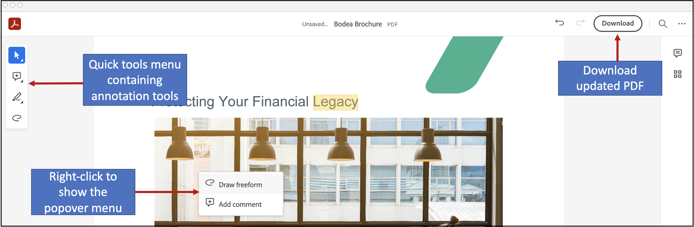
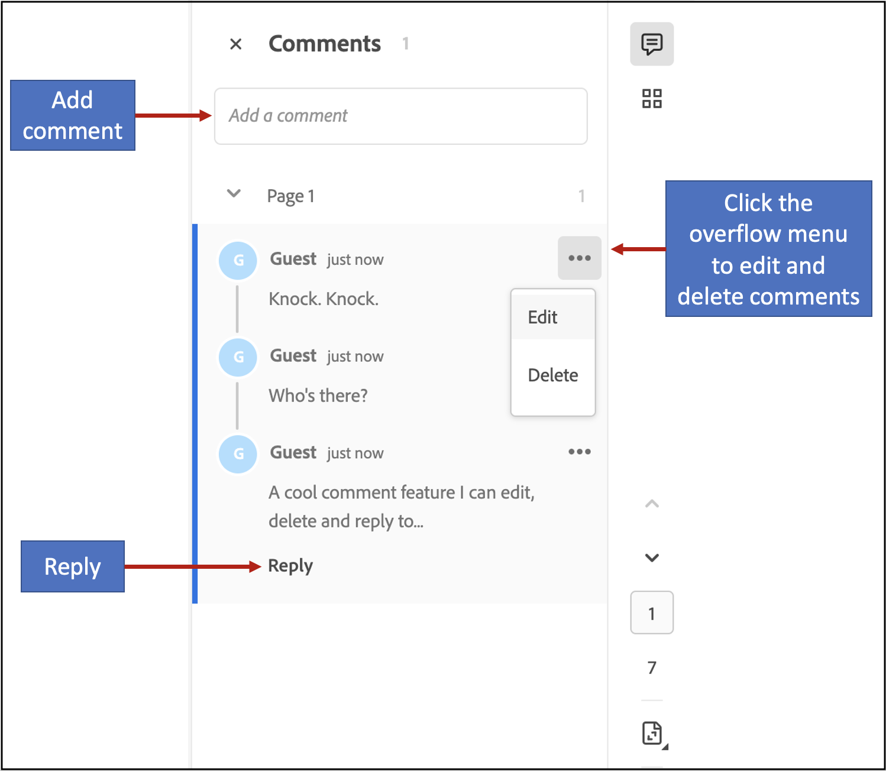
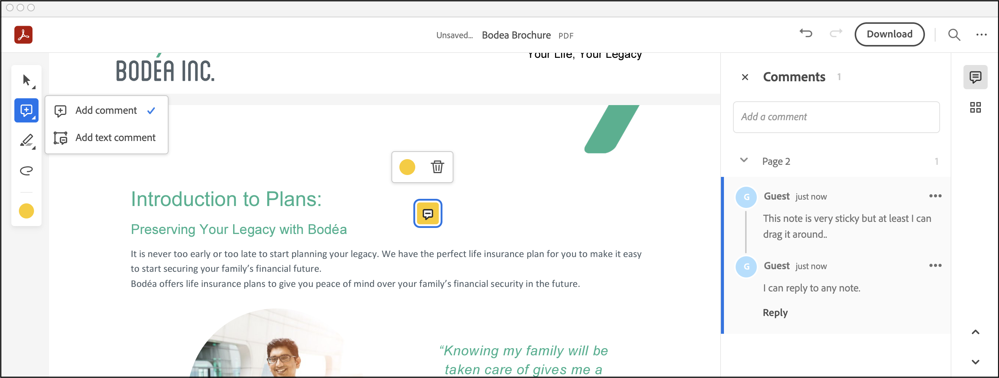
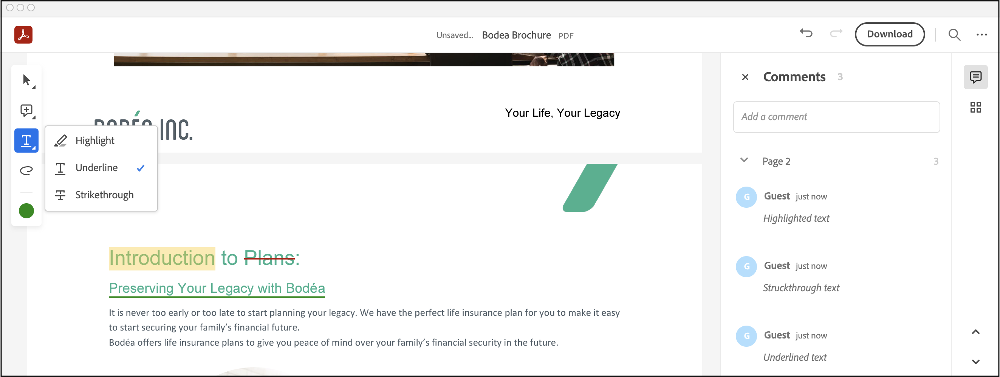

# Comments and Markup

The Embed API provides the capability to add comments to PDF documents
using the commenting and markup tools. You can add comments with add
text comment tool, sticky notes, highlights, drawing tool, strikethrough
and underline text. In addition to these tools, there is also an eraser
tool which can be used to erase parts of drawing annotations. In
addition to these, there are undo and redo tools available in the top
bar.





## Single line implementation

You can enable/disable commenting tools with a single line. Commenting
is enabled by *default* with the Embed API and the commenting tools are
displayed in the top bar. You can disable commenting by adding
`showAnnotationTools: false` (line 9) to the previewConfig object in the
embedded JavaScript.

```html
<div id="adobe-dc-view"></div>
<script src="https://documentcloud.adobe.com/view-sdk/main.js"></script>
<script type="text/javascript">
document.addEventListener("adobe_dc_view_sdk.ready", function () {
   var adobeDCView = new AdobeDC.View({clientId: "<YOUR_CLIENT_ID>", divId: "adobe-dc-view"});
   adobeDCView.previewFile({
     content:{location: {url: "https://documentcloud.adobe.com/view-sdk-demo/PDFs/Bodea Brochure.pdf"}},
     metaData:{fileName: "Bodea Brochure.pdf"}
   }, {showAnnotationTools: false});
});
</script>
<!--Get the samples from https://www.adobe.com/go/pdfembedapi_samples-->
```

## Commenting feature overview

The basic commenting features supported by Embed API include:

-   Adding text comments, sticky notes, highlights, underlines,
    strikethroughs, drawing markups, etc.
-   Updating annotations
-   Removing annotations
-   Replying to annotations

All the annotation types provided by PDF Embed API deliver the following
functionality:

-   Support for adding replies to annotations so that document
    recipients can respond to the author’s original markup. All comments
    appear in the right-hand comments panel.
-   Adding or updating any annotation enables the **Save** button.
-   Once saved, the annotation is added to the PDF and becomes part of
    the PDF buffer.


### Freehand text comments

Users can add freehand text anywhere on a PDF page as follows: select
the Add Text tool in the top bar, click on the page to place the cursor
and type in your desired text. Click outside the text box to add the
annotation. A comment with the same text also appears in the right-hand
comments panel. Features include:

-   Updating free text annotation: Click on an existing add text
    annotation to edit the text or change any of the text attributes
    from the toolbar. You can change attributes such as colour and font
    size of the free text. **Note**: The display of the text size is
    relative to the PDF zoom level. Text can also be edited by clicking
    on the Edit option in the overflow menu for the associated comment
    in the comments panel.
-   Removing free text annotation
    -   Click any existing add text annotation to open the toolbar, and
        choose **Delete**.
    -   Alternatively, click the overflow menu for the associated
        comment in the comments panel, and choose **Delete**.
-   Moving or resizing free text annotation: Place the cursor on an
    existing add text annotation and move the free text to a different
    location on the same PDF page. You can also drag one of the corner
    circles of the text box to resize.


### Sticky notes

Use the sticky note to add a text message and place it anywhere on the
PDF. There is no support for resizing. Features include:

-   Adding a sticky note
    -   Select the sticky note tool in the top bar and click where you
        want to place the note. This opens a comment box where you can
        type in some text. Click Post to add the comment.
    -   You can also add a sticky note by performing right-click and
        selecting *Add sticky note* option from the popover menu.
-   Updating sticky note
    -   Click on an existing sticky note to open a toolbar to change the
        colour of the note.
    -   Edit the comment by clicking on the Edit option in the overflow
        menu in the comments panel.
-   Removing sticky note
    -   Click on an existing sticky note to open the toolbar and click
        on delete option to remove the note.
    -   Alternatively, click on the overflow menu for the comment in the
        comments panel and click on the Delete option.
-   Moving a sticky note: Place the cursor over an existing sticky note
    and drag to move it to some other location.



### Text markup annotations

Embed API supports the following highlighting, strikethrough, and
underlining. Features include:


<br/>

-   Adding a text markup: There are two ways to add a text markup:
    -   Click the highlight tool in the top bar and select some text.
        The text gets highlighted and a comment box opens up where you
        can type in some text.
    -   Select some text. Select either the highlight, strikethrough or
        underline options from the context menu. The markup is added and
        a comment box opens up where you can type in some text.


<br/>

-   Updating a text markup: While moving or resizing text markup is
    unsupported, you can:
    -   Click on an existing text markup to open a toolbar to change the
        colour.
    -   You can edit the comment by clicking on the Edit option in the
        overflow menu in the comments panel.


<br/>

-   Removing a text markup
    -   Click on an existing text markup to open the toolbar, and choose
        **Delete**.
    -   Click on the overflow menu for the comment in the comments
        panel, and choose **Delete**.

### Drawing tool

Use this tool to create any freehand drawing or shape. Features include:

-   Adding a drawing
    -   Select the drawing tool in the top bar, click where you want to
        begin drawing and drag to create a shape. You can release the
        mouse button, move the pointer to a new location, and continue
        drawing. The drawing gets added along with a default comment in
        the comments panel.
    -   You can also add a drawing by performing right-click and
        selecting *Use drawing tool* option from the popover menu.
-   Updating a drawing
    -   Click on an existing drawing to display the toolbar. You can
        change attributes such as colour and stroke width.
    -   You can edit the comment by clicking on the Edit option in the
        overflow menu in the comments panel.
-   Removing a drawing
    -   Click on an existing drawing to display the toolbar and click on
        the delete option.
    -   Alternatively, click on the overflow menu for the comment in the
        comments panel and click on the Delete option.
-   Moving or resizing a drawing
    -   Place the cursor over a drawing and drag to move it to a
        different location.
    -   Place the cursor over a drawing and drag one of the corner
        circles to resize the annotation.


### Eraser tool

This tool can be used to erase parts of freehand drawing annotations you
added via the drawing tool.

Select the eraser tool in the top bar and drag it across the areas of
the drawing annotation that you wish to remove. The updated drawing
annotation is saved to the PDF.

-   Parts of a single drawing or multiple drawing annotations can be
    erased at the same time. The corresponding drawing annotations are
    updated in the PDF.
-   If the entire drawing is erased, then that particular drawing
    annotation gets removed from the PDF.


### Undo or Redo changes

You can reverse the previous action by using the Undo tool in the top
bar. Each undo command reverses one action. Continue clicking Undo to
remove as many of the previous actions as necessary.

Use the Redo tool to reverse the action of the undo command.


## Annotations API overview

The annotations API supports programmatic importing, creating, deleting,
updating, and exporting both comments (sticky notes) and other types of
markup such as underlines and highlight. The PDF Embed API provides two
configuration variables to enable and control annotations:

-   `enableAnnotationAPIs`: Default is *false*. *true* enables the APIs.
    The client's application passes the annotations and PDF buffer to
    the PDF Embed API which renders it in the browser.
-   `includePDFAnnotations`: Default is *false*. When *true*, the API
    displays existing annotations. Supported annotations can be modified
    and unsupported annotations are read only. Annotation modifications
    enable the **Save** button so that add, update, and delete actions
    may be saved to the PDF.

<InlineAlert slots="text" />

When only `enableAnnotationAPIs` is *true*, adding or updating
annotations does not alter the original PDF content. When both these
variables are *true*, the APIs alter the original PDF.

Both variables may be passed as a preview configuration to the
`previewFile` API.

```
Preview configuration
{
  enableAnnotationAPIs: <Boolean, default=false>,
  includePDFAnnotations: <Boolean, default=false>
}
```
    
Since these variables interact with each other, there are several
scenarios:

1.  If the annotation APIs are not enabled
    (`enableAnnotationAPIs: false`), then `includePDFAnnotations` is
    ignored.
2.  If annotations APIs are enabled (`enableAnnotationAPIs: true`) and
    `includePDFAnnotations: false`, then:

> -   The PDF Embed API does not display existing annotations, but will
>     display new ones.
> -   Any annotation added or updated either from the UI or API is not
>     saved to the PDF buffer; therefore, no **Save** button appears in
>     the top bar.

3.  If both `enableAnnotationAPIs` and `includePDFAnnotations` are
    *true*, then:

> -   Any existing annotation the PDF Embed API supports is displayed
>     and accessible through these APIs. Note that unsupported
>     annotations appear in read-only mode and are not accessible to the
>     APIs.
> -   Any annotation added or updated from UI or API is saved to the PDF
>     buffer, and the Save button is enabled when the PDF has unsaved
>     changes.

## Annotation schema

Annotation data passed to or sent from any API should exist in a well
known and widely accepted standard format. In support of standards and
global adoption then, the PDF Embed API supports a strict subset of the
[Web Annotations Data Model](https://www.w3.org/TR/annotation-model/) (a
W3C recommendation). The Web Annotations Data Model specification
provides comprehensive information about a resource or associations
between resources.

The PDF Embed API's annotation model therefore requires the following
key fields:

```javascript
{
  "@context": [
     "https://www.w3.org/ns/anno.jsonld",
     "https://comments.acrobat.com/ns/anno.jsonld"
   ],
  "type": "Annotation",
  "id": <ANNOTATION_ID>,
  "bodyValue": String,
  "motivation": String,
  "stylesheet": {
     "type": "CssStylesheet",
     "value": <CSS_DEFINITION>,
  },
  "target": <target-node> OR <target-reply>,
  "creator": {
     "type": "Person",
     "name": String,
   },
  "created": DateTime,
  "modified": DateTime,
}
```

*Annotations data parameters*

| Parameter        | Description                                                                                                                                                                                                                                                                                                                                                                                                                                                                                                           | Required? |
| ---------------- | --------------------------------------------------------------------------------------------------------------------------------------------------------------------------------------------------------------------------------------------------------------------------------------------------------------------------------------------------------------------------------------------------------------------------------------------------------------------------------------------------------------------- | --------- |
| context          | The context that determines the meaning of the JSON as an annotation. The annotation MUST have these two values in the context parameter:<br/>[https://www.w3.org/ns/anno.jsonld](https://www.w3.org/ns/anno.jsonld),<br/>[https://comments.acrobat.com/ns/anno.jsonld](https://comments.acrobat.com/ns/anno.jsonld)                                                                                                                                                                                                  | Yes       |
| type             | The annotation type which must be _Annotation_.                                                                                                                                                                                                                                                                                                                                                                                                                                                                       | Yes       |
| id               | The annotation’s unique identifier.                                                                                                                                                                                                                                                                                                                                                                                                                                                                                   | Yes       |
| bodyValue        | The string value of the plain text comment associated with the annotation.                                                                                                                                                                                                                                                                                                                                                                                                                                            | Yes       |
| motivation       | The motivation for an annotation is a reason for its creation and might include things like replying to another annotation or commenting on a resource. The value can be either _commenting_ or _replying_.                                                                                                                                                                                                                                                                                                           | Yes       |
| target           | The value can be either in the form of `target-node` for a comment or `target-reply` for reply to an annotation.                                                                                                                                                                                                                                                                                                                                                                                                      | Yes       |
| creator.type     | Creator refers to the agent responsible for creating the annotation. The PDF Embed API’s required value is _Person_ which denotes a human agent.                                                                                                                                                                                                                                                                                                                                                                      | Yes       |
| creator.name     | The name of the annotation creator.                                                                                                                                                                                                                                                                                                                                                                                                                                                                                   | Yes       |
| created          | The date-time in UTC timezone format to denote the annotation modification time after it was created. Use xsd:dateTime with the UTC timezone expressed as “Z”.                                                                                                                                                                                                                                                                                                                                                        | Yes       |
| modified         | The date-time in UTC timezone format to denote the annotation modification time after it was created. Use xsd:dateTime with the UTC timezone expressed as “Z”.                                                                                                                                                                                                                                                                                                                                                        | Yes       |
| source           | The PDF’s unique identifier. This is same as the value of `id` in the metadata field in the `previewFile` API.                                                                                                                                                                                                                                                                                                                                                                                                        | Yes       |
| stylesheet.type  | The type of style applied to freehand text annotations. The only permissible value is CssStylesheet.                                                                                                                                                                                                                                                                                                                                                                                                                  | No        |
| stylesheet.value | This specifies the font size and colour as a valid CSS JSON. This parameter is applicable only in case of freehand text annotations.<br/>**Note:** In the current implementation, there is no support to set the font family of the text annotation. Depending on the language of the text, the following font families will be applied:<br/><ul><li>English: Helvetica</li><li>Chinese Simplified: Adobe Song Std L</li><li>Chinese Traditional: Kozuka Mincho Pr6N R</li><li>Japanese: Kozuka Mincho Pr6N R</li><li>Korean: Adobe Myungjo Std M</li><li>Other languages: Helvetica</li></ul> | No        |

If the annotation is a comment on the PDF, then the value of the
`target` parameter is *target-node* as follows:

```javascript
{
 "source": <FILE_ID>,
 "selector": {
   "type": "AdobeAnnoSelector",
   "subtype" : "note" | "strikeout" | "highlight" | "underline" | "shape",
   "node": {
      "index": <PAGE_INDEX>
   },
   "boundingBox" : [Xmin, Ymin, Xmax, Ymax],
   "quadPoints" : [ .... ],
   "inkList" : [ [...], [...], ... ],
   "strokeColor": <COLOR_HEX_CODE>,
   "strokeWidth": Float,
   "opacity": Float (from 0.0 to 1.0),
   "styleClass": String
 }
}
```

If the annotation is a reply to an existing annotation, then the value
of the `target` parameter is *target-reply* which contains a single
parameter denoting the annotation ID of the parent annotation (the
annotation associated with the current reply):

```javascript
{
 "source": <ANNOTATION_ID>,
}
```

*target-node parameters*

| Parameter name       | Description                                                                                                                                                                                                                                                                                                                                                                               | Required?                                                                       |
| -------------------- | ----------------------------------------------------------------------------------------------------------------------------------------------------------------------------------------------------------------------------------------------------------------------------------------------------------------------------------------------------------------------------------------- | ------------------------------------------------------------------------------- |
| source               | The PDF’s unique identifier                                                                                                                                                                                                                                                                                                                                                               | Yes                                                                             |
| selector.type        | The PDF Embed API supports one value: _AdobeAnnoSelector_                                                                                                                                                                                                                                                                                                                                 | Yes                                                                             |
| selector.subtype     | The type of annotation. Permissible values include:<br/><ul><li>_note_</li><li>_highlight_</li><li>_shape_</li><li>_underline_</li><li>_strikeout_</li><li>_freetext_</li></ul>                                                                                                                                                                                                                                         | Yes                                               |
| selector.node        | The element within a document upon which the user is commenting. For PDF documents, the `node` object contains a single property named `index`.                                                                                                                                                                                                                                           | Yes                                                                             |
| selector.node.index  | The PDF page index starting from 0.                                                                                                                                                                                                                                                                                                                                                       | Yes                                                                             |
| selector.boundingBox | The PDF page coordinates of the rectangular bounding box containing the annotation. The value will be an array of four coordinates \[Xmin, Ymin, Xmax, Ymax\] which represent the box bounded from Xmin to Xmax on X-axis and Ymin to Ymax on Y-axis. All the values Xmin, Ymin, Xmax, and Ymax are of float type.                                                                        | Yes                                                                             |
| selector.quadPoints  | This is used only for the highlight, underline or strikeout annotation types. The PDF page coordinates of the upper-left, upper-right, lower-left and lower-right corners of each rectangular bounding box containing the annotation. The value will be an array of multiple coordinates \[X1, Y1, X2, Y2, …\] of all the rectangular boxes. All the coordinate values are of float type. | Required only if annotation subtype is _highlight_, _underline_ or _strikeout_. |
| selector.inkList     | Float. The PDF page coordinates of the shape annotation. The value will be an array of N arrays \[\[X1, Y1, X2, Y2, …\], \[X1, Y1, X2, Y2, …\], …\], where each array is a series of alternating X-axis and Y-axis coordinates specifying points along which the shape is drawn.                                                                                                          | Required only if annotation subtype is _shape_.                                 |
| selector.strokeColor | The HEX color of the annotation as displayed in the UI.                                                                                                                                                                                                                                                                                                                                   | No                                                                              |
| selector.strokeWidth | Float value specifying the line thickness of the drawing annotation.                                                                                                                                                                                                                                                                                                                      | No                                                                              |
| selector.opacity     | Float value between 0.0 and 1.0 specifying the opacity of the annotation.                                                                                                                                                                                                                                                                                                                 | No                                                                              |
| styleClass           | Contains the CSS class specified in stylesheet.value. The style will be applied to the add text annotation.                                                                                                                                                                                                                                                                               | No                                                                              |

*target-reply parameters*

| Parameter name | Description                                                                         | Required? |
| -------------- | ----------------------------------------------------------------------------------- | --------- |
| source         | The unique identifier of the parent annotation with which this reply is associated. | Yes       |

### Annotation data examples

You can find addtional samples and examples code in the [samples
repo](https://www.adobe.com/go/pdfembedapi_samples).

#### Note annotation data

```javascript
{
      "@context": [
          "https://www.w3.org/ns/anno.jsonld",
          "https://comments.acrobat.com/ns/anno.jsonld"
      ],
      "type": "Annotation",
      "id": "079d66a4-5ec2-4703-ae9d-30ccbb1aa84c",
      "bodyValue": "I added a note!",
      "motivation": "commenting",
      "target": {
          "source": "77c6fa5d-6d74-4104-8349-657c8411a834",
          "selector": {
              "node": {
                  "index": 1
              },
              "opacity": 0.4,
              "subtype": "note",
              "boundingBox": [
                  69.3311157226562,
                  76.4769897460938,
                  86.9484252929688,
                  94.63037109375
              ],
              "strokeColor": "#ff0808",
              "type": "AdobeAnnoSelector"
          }
      },
      "creator": {
          "type": "Person",
          "name": "John Smith"
      },
      "created": "2018-08-02T14:45:37Z",
      "modified": "2020-01-20T07:54:10Z"
}
```

#### Reply annotation data

```javascript
{
   "@context": [
       "https://www.w3.org/ns/anno.jsonld",
       "https://comments.acrobat.com/ns/anno.jsonld"
   ],
   "type": "Annotation",
   "id": "eb46d1a9-e9c3-4e81-a6f4-ce5ba7a905e9",
   "bodyValue": "Reply to this",
   "motivation": "replying",
   "target": {
       "source": "079d66a4-5ec2-4703-ae9d-30ccbb1aa84c"
   },
   "creator": {
       "type": "Person",
       "name": "Samuel Lee"
   },
   "created": "2020-02-02T14:45:37Z",
   "modified": "2020-02-02T07:57:03Z"
}
```


#### Add text annotation data

```javascript
{
      "@context": [
          "https://www.w3.org/ns/anno.jsonld",
          "https://comments.acrobat.com/ns/anno.jsonld"
      ],
      "type": "Annotation",
      "id": "02dcf931-d1cb-49c1-a8bc-d047892a06bc",
      "bodyValue": "I added a text annotation",
      "motivation": "commenting",
      "stylesheet": {
          "type": "CssStylesheet",
          "value": "body-value-css { font: 13px Helvetica; color: #0000FF; }"
      },
      "target": {
          "source": "77c6fa5d-6d74-4104-8349-657c8411a834",
          "selector": {
              "node": {
                  "index": 1
              },
              "subtype": "freetext",
              "boundingBox": [
                  306.41829735235586,
                  339.01199687491595,
                  475.729044456285,
                  357.0653042030006
              ],
              "styleClass": "body-value-css",
              "type": "AdobeAnnoSelector"
          }
      },
      "creator": {
          "type": "Person",
          "name": "John Smith"
      },
      "created": "2021-01-15T14:45:37Z",
      "modified": "2021-01-15T14:45:37Z"
}
```

## Annotations interface


In order to invoke any annotations API, the PDF Embed API provides the
`AnnotationManager` interface. You can invoke all the APIs from this
interface. Before using this interface, you must set
`enableAnnotationAPIs` to *true* and pass it as a preview configuration
to the `previewFile` API.

Invoke the APIs with the `annotationManager` as follows:

```html
<html>
<head>
 <title>Adobe Document Cloud PDF Embed API Sample</title>
 <meta charset="utf-8"/>
 <meta http-equiv="X-UA-Compatible" content="IE=edge,chrome=1"/>
 <meta id="viewport" name="viewport" content="width=device-width, initial-scale=1"/>
</head>

<body style="margin: 0px">
 <div id="adobe-dc-view"></div>
 <script src="https://documentcloud.adobe.com/view-sdk/main.js"></script>
 <script type="text/javascript">
 document.addEventListener("adobe_dc_view_sdk.ready", function()
 {
  var adobeDCView = new AdobeDC.View({clientId: "<YOUR_CLIENT_ID>", divId: "adobe-dc-view"});
  var previewFilePromise = adobeDCView.previewFile({
   content:   {location: {url: "https://documentcloud.adobe.com/view-sdk-demo/PDFs/Bodea Brochure.pdf"}},
   metaData:  {fileName: "Bodea Brochure.pdf", id: "77c6fa5d-6d74-4104-8349-657c8411a834"}
  },
  {
   enableAnnotationAPIs: true,
  });

  previewFilePromise.then(adobeViewer => {
   adobeViewer.getAnnotationManager().then(annotationManager => {
    // All annotation APIs can be invoked here
   });
  });
 });
 </script>
</body>
</html>
```

<InlineAlert slots="text"/>

When you enabled the annotation APIs, you must pass a PDF ID in the
metadata field when invoking the `previewFile` API. This ID uniquely
identifies the PDF so that annotations can be added.

```javascript
adobeDCView.previewFile({
   content:   {location: {url: "https://documentcloud.adobe.com/view-sdk-demo/PDFs/Bodea Brochure.pdf"}},
   metaData:  {fileName: "Bodea Brochure.pdf", id: "77c6fa5d-6d74-4104-8349-657c8411a834"}
}
```

## Basic APIs for commenting

The PDF Embed API offers several APIs which allow you to programatically
add, import, export, delete, and update annotations.

### addAnnotations API

This API adds or imports (only) supported annotations. It takes a JSON
array as input which contains the annotation data. The annotation data
must be in the specified in the [Annotation schema](#annotation-schema). Either a single annotation or
multiple annotations can be added.

#### Input parameters

A JSON array containing the list of annotations: `[Annotation_1, Annotation_2, ...]`

#### API output

Returns a Promise which:

* Resolves on a successful API operation
* Rejects with error object including code and message on API failure.

#### API signature

```javascript
const list_of_annotations = [Annotation_1, Annotation_2, ...];

previewFilePromise.then(adobeViewer => {
        adobeViewer.getAnnotationManager().then(annotationManager => {
                        annotationManager.addAnnotations(list_of_annotations)
                                        .then(() => console.log("Success"))
                                        .catch(error => console.log(error));
         });
});
```

<hr />

### getAnnotations API

This API exports and receives PDF annotation data based on the filter
provided by the client. The annotations are returned in the form of a
JSON array, and the annotation data will be in the format as described
in the [Annotation schema](#annotation-schema).

#### Input parameters

* If no filter is provided, then data for all of the annotations is returned.
* If a list of annotation IDs is passed in the filter, then only the annotations matching those IDs is returned.
* If page range is passed in the filter, then only the annotations in those pages is returned.

```javascript
filter = {
        annotationIds:
                [Annotation_ID_1, Annotation_ID_2, ...],
        pageRange:{
                startPage: <Page_Number>,
                endPage: <Page_Number>
        },
}
```

#### API output

Returns a Promise which:

* Resolves with a list of annotations on success,
* Rejects with an error object which includes a code and message on operation failure.

#### API signature

```javascript
const filter = {
        // annotationIds: [Annotation_ID_1, Annotation_ID_2, ...];
        // OR,
        // pageRange: {startPage: <Page_Number>, endPage: <Page_Number>};
}


previewFilePromise.then(adobeViewer => {
        adobeViewer.getAnnotationManager().then(annotationManager => {
                        annotationManager.getAnnotations(filter)
                                        .then (result => console.log(result))
                                        .catch(error => console.log(error));
 });
});
```

<InlineAlert slots="text"/>

If `includePDFAnnotations` is set to *true*, then any existing
annotation in PDF which the PDF Embed API supports is accessible
through the annotation APIs. The data for these annotations can be
received through the GET API. Note that the ID of such annotations
received in the GET API output will be different for every browser
session.

<hr />

### deleteAnnotations API

This API deletes PDF annotations based on the filter provided by the
client.

#### Input parameters

* If no filter is provided, then all the PDF annotations are deleted.
* If a list of annotation IDs is passed in the filter, then only the annotations matching those IDs are deleted. The other annotations will remain.
* If a page range is passed in the filter, then only the annotations in those pages are deleted. The other annotations remain.

```javascript
filter = {
  annotationIds:
     [Annotation_ID_1, Annotation_ID_2, ...],
  pageRange:{
     startPage: <Page_Number>,
     endPage: <Page_Number>
  }
}
```

#### API output

Returns a Promise which:

* Resolves on successful delete operation
* Rejects with error object including code and message on delete operation failure.

#### API signature

```javascript
const filter = {
        // annotationIds: [Annotation_ID_1, Annotation_ID_2, ...];
        // OR,
        // pageRange: {startPage: <Page_Number>, endPage: <Page_Number>};
}

previewFilePromise.then(adobeViewer => {
        adobeViewer.getAnnotationManager().then(annotationManager => {
                        annotationManager.deleteAnnotations(filter)
                                        .then (() => console.log("Success"))
                                        .catch(error => console.log(error));
 });
});
```

<hr />

### updateAnnotation API

This API updates a single existing annotation in the PDF, including the
parameter `bodyValue`, parameters `font` and `color` under `stylesheet`,
as well as other parameters under `selector` such as, `strokeColor`,
`strokeWidth`, `boundingBox` and `inkList`.

This API takes the annotation data containing the updated parameters,
finds the annotation with the ID present in the input data, and applies
the update to that annotation. The annotation data must be in the same
format as described in the Annotation schema.

<InlineAlert slots="text"/>

You can update the `boundingBox` parameter only for note, add text and
drawing annotations using this API.

#### Input parameters

JSON object containing the annotation data.

#### API output

Returns a Promise which:

* Resolves on successful update operation,
* Rejects with error object including code and message on update operation failure.

#### API signature

```javascript
const annotation_data = <Annotation_Data>;

previewFilePromise.then(adobeViewer => {
        adobeViewer.getAnnotationManager().then(annotationManager => {
                        annotationManager.updateAnnotation(annotation_data)
                                        .then (()=> console.log("Success"))
                                        .catch(error => console.log(error));
 });
});
```

<hr />

## Annotation events

Website developers can receive events when a user action interacts with
an annotation. These events are generated for annotation actions
performed through the UI as well as through the annotation APIs.

There are two ways to capture these events: use either the Events
callback or the `annotationManager` interface.

### Events callback usage

Register the events callback and enable the flag
`enableAnnotationEvents` to receive these events.

For details, see [Annotation events](./howtodata.md#annotation-events)

### annotationManager interface

The `annotationManager` interface listens for events via the
`registerEventListener` API. To receive specific event types, pass the
list of event types in the `listenOn` parameter. If nothing is passed to
`listenOn`, then all the annotation events return.

Note that the events are generated through this interface only when
annotation APIs are enabled.

```javascript
const eventOptions = {
  // Pass the events to receive.
  // If no event is passed in listenOn, then all the annotation events will be received.
  listenOn: [
      "ANNOTATION_ADDED", "ANNOTATION_CLICKED"
  ]
}

previewFilePromise.then(adobeViewer => {
  adobeViewer.getAnnotationManager().then(annotationManager => {
      annotationManager.registerEventListener(
          function(event) { console.log(event.type, event.data) },
          eventOptions
      );
   });
});
```


Possible annotations events appear in the following table. The event
data contains the data of the annotation in JSON format on which the
event gets triggered.

*Event types*

| Event type                | Description                                                                                                                                                     | Event data                |
| ------------------------- | --------------------------------------------------------------------------------------------------------------------------------------------------------------- | ------------------------- |
| ANNOTATION_ADDED         | A new annotation is added to PDF from the UI or API.                                                                                                            | <ANNOTATION_DATA>        |
| ANNOTATION_CLICKED       | Any annotation in the PDF is clicked.                                                                                                                           | <ANNOTATION_DATA>        |
| ANNOTATION_UPDATED       | The annotation is updated from the UI or API.                                                                                                                   | <ANNOTATION_DATA>        |
| ANNOTATION_DELETED       | The annotation is deleted from the UI or API.                                                                                                                   | <ANNOTATION_DATA>        |
| ANNOTATION_MOUSE_OVER   | The mouse pointer moves over any annotation.                                                                                                                    | <ANNOTATION_DATA>        |
| ANNOTATION_MOUSE_OUT    | The mouse pointer moves out of any annotation.                                                                                                                  | <ANNOTATION_DATA>        |
| ANNOTATION_SELECTED      | Any annotation is selected from the UI or API.                                                                                                                  | <ANNOTATION_DATA>        |
| ANNOTATION_UNSELECTED    | Any annotation is unselected from the UI or API.                                                                                                                | <ANNOTATION_DATA>        |
| ANNOTATION_MODE_STARTED | The event is generated when a user selects a particular annotation type from the toolbar or when `startAnnotationMode` is invoked to start any annotation mode. | <ANNOTATION_TYPE>        |
| ANNOTATION_MODE_ENDED   | When a user exits any previously selected annotation mode.                                                                                                      | <ANNOTATION_TYPE>        |
| ANNOTATION_COUNT         | Denotes the total number of annotations when any new annotation is added or any existing annotation is deleted.                                                 | <NUMBER_OF_ANNOTATIONS> |

## Handling existing annotations

The PDF Embed API provides two additional APIs that remove existing
annotations or save new annotations. These APIs only function when
`includePDFAnnotations` is *true*.

### removeAnnotationsFromPDF API

This API deletes all annotations and returns both a list of the removed
annotations as well as the PDF buffer as output. Note that the API can
only remove supported annotations.

#### Input parameters

N/A


#### API output

Returns a Promise which:

* Resolves with both a list of removed annotations as well as an updated PDF buffer if the operation succeeds
* Rejects with an error object that includes both an error code and message on operation failure.

#### API signature

```javascript
previewFilePromise.then(adobeViewer => {
        adobeViewer.getAnnotationManager().then(annotationManager => {
                        annotationManager.removeAnnotationsFromPDF()
                                        .then(result => console.log(result))
                                        .catch(error => console.log(error));
         });
});
```

<hr />

### addAnnotationsInPDF API

This API takes a list of supported annotations as input and saves those
annotations to the PDF buffer. The updated PDF buffer is returned as API
output.

#### Input parameters

A JSON array of annotation data: `[Annotation_1, Annotation_2, ...]`

#### API output

Returns a Promise which:

* Resolves with the updated PDF buffer if the operation succeeds.
* Rejects with an error object that includes both an error code and message on operation failure.

#### API signature

```javascript
const list_of_annotations = [Annotation_1, Annotation_2, ...];

previewFilePromise.then(adobeViewer => {
        adobeViewer.getAnnotationManager().then(annotationManager => {
                        annotationManager.addAnnotationsInPDF(list_of_annotations)
                                        .then(result => console.log(result))
                                        .catch(error => console.log(error));
         });
});
```

<hr />

## APIs to control UI configurations

UI control is available through the following APIs:

-   `setConfig`: enable and disable UI elements
-   `selectAnnotation`: Select and shift focus to an annotation
-   `unselectAnnotation`: Unselect an annotation
-   `startAnnotationMode`: Enter annotation mode
-   `endAnnotationMode`: Exit from annotation mode

### setConfig API

`setConfig` allows you to set special UI configurations, including
hiding the commenting tools from the top bar, hiding the right-hand
comments pane, hiding the toolbar on text selection, and enabling the
downloaded and printed PDF to contain annotations even when unsaved to
the PDF buffer.

The API supports the following flags. You can pass 1-N flags to the API
as needed:

-   `showToolbar`: This flag shows or hides the add text, sticky note,
    highlight, drawing and eraser tools in the top bar. The default
    value is *true*, and these annotation tools are visible. Set this
    flag to false if these tools need to be hidden from the top bar.
-   `showCommentsPanel`: This flag shows or hides the right-hand
    comments pane. The default value is *true*, and the comments pane is
    visible. Set to *false* to hide the right-hand comments pane.
-   `showToolsOnTextSelection`: This flag shows or hides the toolbar
    available on text selection. The default value is *true*, and the
    toolbar is visible. Set to *false* to hide the toolbar.


<br/>

-   `downloadWithAnnotations`: Annotations are not saved to the PDF
    buffer if annotation APIs are enabled. By default, the downloaded
    PDF will not contain any annotation. Set to *true* to download the
    PDF with all the annotations.
-   `printWithAnnotations`: Annotations will no longer be saved to the
    PDF buffer if annotations APIs are enabled. By default, the print
    does not contain any annotation. Set to *true* to print the PDF with
    all the annotations.

<InlineAlert slots="text"/>

You can set and pass these flags to either `setConfig` or
`previewFile` as shown below.

**Method 1: Pass the flags to setConfig**

#### Input parameters

The list of flags and the corresponding Boolean values.

```javascript
{
       showToolbar: <Boolean, Default=true>,
       showCommentsPanel: <Boolean, Default=true>,
       downloadWithAnnotations: <Boolean, Default=false>,
       showToolsOnTextSelection: <Boolean, default=true>,
       printWithAnnotations: <Boolean, Default=false>
}
```

#### API output

Returns a Promise which:

* Resolves on success of operation
* Rejects with error object including code and message on failure.

#### API signature

```javascript
const customFlags = {
   showToolbar: <Boolean, Default=true>,
   showCommentsPanel: <Boolean, Default=true>,
   downloadWithAnnotations: <Boolean, Default=false>,
   showToolsOnTextSelection: <Boolean, default=true>,
   printWithAnnotations: <Boolean, Default=false>,
}

previewFilePromise.then(adobeViewer => {
   adobeViewer.getAnnotationManager().then(annotationManager => {
       annotationManager.setConfig(customFlags)
           .then(() => console.log("Success"))
           .catch(error => console.log(error));
   });
});
```

**Method 2: Pass the flags to previewFile**

As an alternative to passing to `setConfig`, add the flags to the
`annotationUIConfig` object that's passed as a preview configuration to
the previewFile API.

```javascript
annotationUIConfig: {
  showToolbar: <Boolean, default=true>,
  showCommentsPanel: <Boolean, default=true>,
  showToolsOnTextSelection: <Boolean, default=true>,
  downloadWithAnnotations: <Boolean, default=false>,
  printWithAnnotations: <Boolean, default=false>
}
```

<hr />

### selectAnnotation API

This API selects any existing annotation and shifts the focus to the
selected annotation. It applies the select operation to the annotation
specified by the annotation ID.

#### Input parameters

<Annotation_ID>

#### API output

Returns a Promise which:

* Resolves on successful select annotation operation
* Rejects with error object including an error code and message

#### API signature

```javascript
const annotation_ID = <Annotation_ID>;

previewFilePromise.then(adobeViewer => {
   adobeViewer.getAnnotationManager().then(annotationManager => {
    annotationManager.selectAnnotation(annotation_ID)
        .then(() => console.log("Success"))
        .catch(error => console.log(error));
  });
});
```
<hr />

### unselectAnnotation API

This API unselects the last selected annotation.

#### Input parameters

N/A

#### API output

N/A

#### API signature

```javascript
	
previewFilePromise.then(adobeViewer => {
  adobeViewer.getAnnotationManager().then(annotationManager => {
    annotationManager.unselectAnnotation();
 });
});
```

<hr />

### startAnnotationMode API

This API starts a particular annotation mode so that you can annotations
of that type or use the eraser tool. The API takes a single annotation
mode as input. The annotation mode can be any one of the supported
annotation types in PDF Embed API, and it supports the following
optional parameters:

-   `defaultColor`: A hex code specifying the annotation color. This
    parameter is applicable for all annotation types.
-   `cursor`: A [CSS standards-based](https://developer.mozilla.org/en-US/docs/Web/CSS/cursor)
    string value to denote the cursor style on annotation start. This
    parameter is applicable for all annotation types.
-   `fontSize`: Font size within the range of 6-24px. This parameter is
    applicable only in case of freehand text annotations.
-   `strokeWidth`: Stroke width within the range of 1-12, to set the
    line thickness of the drawing annotation.
    
#### Input parameters

There are two parameters which accept the following values:

* `mode`: Permissible values include: note, highlight, shape, underline, strikeout, freetext or eraser
* `options`: defaultColor: <COLOR_HEX_CODE>, cursor: <CURSOR_TYPE>, fontSize: <FONT_SIZE>, strokeWidth: <STROKE_WIDTH>

#### API output

Returns a Promise which:

* Resolves on successful start annotation mode operation
* Rejects with an error object including a code and message

#### API signature

```javascript
// Add text annotation
const mode = "freetext";
const options = {
  defaultColor: "#b80000",
  cursor: "crosshair",
  fontSize: "15px"
};

// Drawing annotation
/* const mode = "shape";
const options = {
  defaultColor: "#b80000",
  cursor: "crosshair",
  strokeWidth: 5
}; */

previewFilePromise.then(adobeViewer => {
  adobeViewer.getAnnotationManager().then(annotationManager => {
    annotationManager.startAnnotationMode(mode, options)
        .then(result => console.log(result))
        .catch(error => console.log(error));
   });
});
```  

<hr />

### endAnnotationMode API

This API ends the last started annotation mode.

#### Input parameters

N/A

#### API output

N/A

#### API signature

```javascript
previewFilePromise.then(adobeViewer => {
  adobeViewer.getAnnotationManager().then(annotationManager => {
    annotationManager.endAnnotationMode();
  });
});
```

<hr />

## Code Samples

<InlineAlert slots="text"/>

[Working code samples reside in Github.](https://www.adobe.com/go/pdfembedapi_samples)
