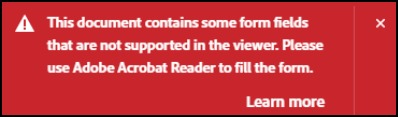

UI Customization
================

<p>

The Embed API provides a number of options for customizing the user
interface and user interactions with the PDF. Features which are enabled
by default can be explicitly disabled.
Optional configurations include
controls for:
-   Managing the page controls (applicable in Full Window, Sized
    Container and Lightbox embed modes).
-   Hiding and showing the left-hand pane (applicable only in Full
    Window embed mode).
-   Enabling and disabling commenting, form filling, and other user
    interactions (applicable only in Full Window embed mode).
-   Enabling and disabling PDF download and print options.
-   Modifying the PDF display to Fit Page or Fit Width (applicable in
    Full Window and Lightbox embed modes).


</p>

## Menu and tool options

You can control UI elements such as the left hand panel, comments pane,
toolbars, etc. UI option variables. The `previewFile` function reads the
variable values and toggles features on and off accordingly. As usual
with Javascript, there's more than one way to accomplish the task. In
example 1, you can create an object that stores the variables.
Alternatively, `previewFile` could read the variables directly from a
list within the function.

In both examples below, the download PDF option is disabled from the
overflow menu in the top bar with `showDownloadPDF` set to *false*. The
page control bar is disabled with `showPageControls` set to *false*.

**Example 1: UI options stored in a constant**

```html
<div id="adobe-dc-view"></div>
<script src="https://documentcloud.adobe.com/view-sdk/main.js"></script>
<script type="text/javascript">
// Store the UI options in a constant
const previewConfig = {
   showDownloadPDF: false,
   showPageControls: false
}

document.addEventListener("adobe_dc_view_sdk.ready", function () {
   var adobeDCView = new AdobeDC.View({clientId: "<YOUR_CLIENT_ID>", divId: "adobe-dc-view"});
   // Consume previewConfig here. . .
   adobeDCView.previewFile({
      content:{location: {url: "https://documentcloud.adobe.com/view-sdk-demo/PDFs/Bodea Brochure.pdf"}},
      metaData:{fileName: "Bodea Brochure.pdf"}
   }, previewConfig);
});
</script>
```

**Example 2: UI options passed to previewFile**

```html
<div id="adobe-dc-view"></div>
<script src="https://documentcloud.adobe.com/view-sdk/main.js"></script>
<script type="text/javascript">
  document.addEventListener("adobe_dc_view_sdk.ready", function () {
     var adobeDCView = new AdobeDC.View({clientId: "<YOUR_CLIENT_ID>", divId: "adobe-dc-view"});
        adobeDCView.previewFile({
           content:{location: {url: "https://documentcloud.adobe.com/view-sdk-demo/PDFs/Bodea Brochure.pdf"}},
           metaData:{fileName: "Bodea Brochure.pdf"}
        }, {showDownloadPDF: false, showPageControls: false});
  });
</script\>
```

**Menu and tool options**

| Variable            | Default | Description                                                                                                                                                                                                                                                                                                                                                                                                                                                                                                                                                                                                                                                                                                                                                                         |
| ------------------- | ------- | ----------------------------------------------------------------------------------------------------------------------------------------------------------------------------------------------------------------------------------------------------------------------------------------------------------------------------------------------------------------------------------------------------------------------------------------------------------------------------------------------------------------------------------------------------------------------------------------------------------------------------------------------------------------------------------------------------------------------------------------------------------------------------------- |
| showPageControls    | true    | If true, the page control toolbar displays.                                                                                                                                                                                                                                                                                                                                                                                                                                                                                                                                                                                                                                                                                                                                         |
| dockPageControls    | true    | If true, the page control toolbar is locked to the bottom bar and expands to the page width. End users can still dock/undock via the dock button on the page control toolbar.                                                                                                                                                                                                                                                                                                                                                                                                                                                                                                                                                                                                       |
| showAnnotationTools | true    | If true, tools such as add text, sticky note, highlight, and so on appear in the upper toolbar. For more detail, see [Comments and Markup](./howtos_comments.md).                                                                                                                                                                                                                                                                                                                                                                                                                                                                                                                                                          |
| showLeftHandPanel   | true    | By default, the left-hand pane is always displayed in the file preview. Set this variable to false if you wish to hide the left-hand pane. The pane allows users to view the PDF thumbnails. If the PDF contains bookmarks and file attachments, then those are also displayed in this pane.                                                                                                                                                                                                                                                                                                                                                                                                                                                                                        |
| defaultViewMode     | null    | This variable takes a string value of FIT\_WIDTH or FIT\_PAGE. FIT\_WIDTH expands the page horizontally to the full width of the document pane. FIT\_PAGE displays the entire page in the current view pane. Note that end users can toggle the mode via the Fit Width/Fit Page button on the page controls bar.<br/> In addition to these, there are two other view modes which are supported only in mobile browsers.<br/> <ul><li>CONTINUOUS: This mode displays all the document pages one after the other and users can easily navigate through the pages by scrolling up or down.</li> <li>SINGLE\_PAGE: This mode displays only a single document page at a time and doesn’t show any adjoining page. Users can use the swipe gesture to navigate to other pages which will be displayed one at a time.</li></ul> |
| enableFormFilling   | true    | If true, form filling is enabled and users can edit fields.                                                                                                                                                                                                                                                                                                                                                                                                                                                                                                                                                                                                                                                                                                                         |
| showDownloadPDF     | true    | If true, a download button appears in the overflow menu on the top bar.                                                                                                                                                                                                                                                                                                                                                                                                                                                                                                                                                                                                                                                                                                             |
| showPrintPDF        | true    | If true, then a print PDF option appears in the overflow menu on the top bar.                                                                                                                                                                                                                                                                                                                                                                                                                                                                                                                                                                                                                                                                                                       |


## Annotations

For details, see [Comments and Markup](./howtos_comments.md).

## Callbacks & workflows

The PDF Embed API supports workflow customization via callbacks. By
registering callbacks with specified parameters, website developers can
control workflows related to saving files, user profiles, user settings,
and so on.

Every callback requires the following three parameters:

-   Callback type: One of SAVE\_API, STATUS\_API, GET\_USER\_PROFILE,
    GET\_USER\_SETTING\_API, or SET\_USER\_SETTING\_API
-   Function: A JavaScript function which returns a promise.
-   Options: Additional options passed to the callback to control its
    behaviour in certain scenarios.

You can only register one callback per type; for example, you can
register one callback for save and one for status.

`AdobeDC.View` exposes `registerCallback`, so the code looks something
like:

```javascript
adobeDCView.registerCallback(
  <Callback Type>,
  <Function>,
  options
);
```
    

The second parameter is a function which returns a promise which either
resolves or fails with a response object consisting of *code* and
*data*. This promise should resolve in the case of successful execution,
and it should be rejected in the case of an error. Pass the relevant
code along with the promises:

```javascript
return new Promise((resolve, reject) => {
 /* Success
  resolve({
      code: AdobeDC.View.Enum.ApiResponseCode.SUCCESS,
      data: {...}
  }); */

 /* Failure
  reject({
      code: AdobeDC.View.Enum.ApiResponseCode.FAIL,
      data: {...}
  }); */
}
```


## User Profiles

The user profile callback allows the user to specify user profile
details such as first name, last name, and email address. By default, if
you do not register a user profile callback, the user name is displayed
as "Guest" in the comments pane.


When the callback is registered, user annotations are associated with
the corresponding username.


**User profile callback signature**

```javascript
const profile = {
  userProfile: {
      name: <name of user>,
      firstName: <first name>,
      lastName: <last name>,
      email: <user email>
  }
};

adobeDCView.registerCallback(
   AdobeDC.View.Enum.CallbackType.GET_USER_PROFILE_API,
   function() {
      return new Promise((resolve, reject) => {
         resolve({
            code: AdobeDC.View.Enum.ApiResponseCode.SUCCESS,
            data: profile
         });
      });
   },
{});
```

## User settings

Users can update the colour of an annotation by clicking on the PDF
annotation and changing the colour from the toolbar. The updated colour
is applied to all new annotations of that type added to the PDF. Also,
when any annotation tool is selected from the top bar for the first
time, there is a coach mark displayed to educate users about the
annotation tool which goes away after a few seconds.

<InlineAlert slots="text" />

Previously, the default implementation of these user preferences was
that the browser used to remember the updated annotation colour and
also whether the coach mark for a selected annotation tool has been
displayed or not. This was achieved by storing this data in the local
storage of the PDF Embed API domain. This is now deprecated and PDF
Embed API does not store this data.

By default, these preferences are lost when the PDF reloads. As a
result, the updated annotation colour is not remembered (default
annotation colour will be applied in this case) and users will see
annotation tool coach marks again when the PDF reloads.

Website developers can improve this experience by registering the user
setting callbacks. There are two callbacks involved:

-   SET\_USER\_SETTING\_API: This callback saves user-specific settings.
-   GET\_USER\_SETTING\_API: This callback fetches the current user
    setting.

Developers can provide their own implementation using these callbacks
and save the user preferences wherever they like.

**User settings callback signature**

```javascript
adobeDCView.registerCallback(
   AdobeDC.View.Enum.CallbackType.SET_USER_SETTING_API,
   function(setting) {
      /* Add your custom implementation here to save the user setting */
      ...
      ...
      return new Promise((resolve, reject) => {
         resolve({
            code: AdobeDC.View.Enum.ApiResponseCode.SUCCESS
         });
      });
   },
{});


adobeDCView.registerCallback(
   AdobeDC.View.Enum.CallbackType.GET_USER_SETTING_API,
   function() {
      /* Fetch the user setting */
      return new Promise((resolve, reject) => {
         resolve({
            code: AdobeDC.View.Enum.ApiResponseCode.SUCCESS,
            data: {
               setting: <USER_STORED_SETTING>
            }
         });
      });
   },
{});
```

Find the working code sample
[here](https://www.adobe.com/go/pdfembedapi_samples) under
`/More Samples/Save User Preferences/`. In this code sample, the user
setting callbacks are used to save the user preferences in the local
storage of the website domain. Using this implementation, the browser
remembers the updated annotation colour and also shows the coach mark
only once for every annotation tool in the current browser.

This is only an example and it is up to the website developer how they
do the actual implementation of saving the user preferences.

## Save a PDF

The Save button on the top bar is not visible unless the PDF is
modified: it only becomes active after PDF modification (there are
changes to actually save). For example, when `showAnnotationTools` is
true, users can add an annotation or comment, and you can provide them
with the option to save the modified PDF to a local or networked
location.

<InlineAlert slots="text"/>

A user cannot add comments or edit PDF files that are secure,
protected, or read-only. The annotation tools as well as the save
button are hidden for such files.

Note that while the Save button is hidden by default, you can show the
button even when there are no changes to save by setting
`showDisabledSaveButton` to *true* and passing it as a preview
configuration to the previewFile API. In this case, the save button
appears in disabled state until the PDF is modified.

```javascript
{
  showDisabledSaveButton: <Boolean, default=false>,
}
```
    
### Save callback

This callback allows users to save the updated PDF buffer which can then
be stored in an external file storage system.

-   If you do not register a callback, when a user triggers the save
    functionality, the app downloads the updated PDF to the user’s local
    machine. The default location is often the Downloads folder.
-   If you do register a callback, then your code can enable saving the
    modified document to an external file storage system like OneDrive
    or Google Drive. In this case, the code varies with the website
    developer’s implementation.

Users can trigger the save functionality by either clicking on the
**Save** button manually or by pressing **Ctrl+S** on the keyboard. You
should register the callback to receive the modified file content when
the user initiates the save.

To control the save callback behavior, you can pass the following
options:

-   `autoSaveFrequency`: Optional. Default value is 0. The save callback
    supports auto-saving so that manual saving is not required. The
    value is the time in seconds after which the PDF is auto-saved if
    there are any unsaved changes and no other annotation changes are
    made in the meantime. Using this configuration, the document is
    saved even if the user does not manually save. You must set this
    parameter to a numeric value greater than 0.
-   `enableFocusPolling`: Optional. Default value is false. When true, a
    PDF with unsaved changes is auto-saved whenever the user focus
    shifts from the current PDF preview (for example, by opening a new
    tab in the same browser). When false, auto-save does not happen. Set
    this parameter to true if you want this to work.
-   `showSaveButton`: Optional. Default value is true. Set this to false
    if you don't want the save button to be displayed at all, not even
    when the PDF is modified. When set to false, the save button is
    never displayed and save operation will be done through auto-save or
    through the keyboard by pressing Ctrl+S.

The second callback parameter is a Javascript function returning a
Promise which either resolves or fails with a response object containing
code and data. The function parameters include:

-   `metaData`: Information about the file
-   `content`: The ArrayBuffer of file content
-   `options`: (optional) Additional user options passed to the function
    to control its behavior in certain cases. For instance, the `saveAs`
    option is passed here when the current user saves a copy of a
    changed PDF when multiple users are modifying the same file (See the
    FILE\_MODIFIED case below).

**Save callback signature**

```javascript
const saveOptions = {
   autoSaveFrequency: <Number, default=0>,
   enableFocusPolling: <Boolean, default=false>,
   showSaveButton: <Boolean, default=true>
}

adobeDCView.registerCallback(
   AdobeDC.View.Enum.CallbackType.SAVE_API,
   function(metaData, content, options) {
      /* Add your custom save implementation here...and based on that resolve or reject response in given format */
      return new Promise((resolve, reject) => {
         resolve({
            code: AdobeDC.View.Enum.ApiResponseCode.SUCCESS,
            data: {
               /* Updated file metadata after successful save operation */
               metaData: <File MetaData>
            }
         });
      });
   },
   saveOptions
);
```

The website developer can write their own save implementation in this
function and should send the response object with the appropriate code
and data in the following format:

-   SUCCESS: Use this response code to denote a successful save
    operation where the response data contains the updated file
    metadata.
-   FAIL: Use the FAIL response code when the save API fails. Response
    data is optional in this case. The user will see an error popup and
    should retry saving.


<br/>

-   FILE\_MODIFIED: Use the response code FILE\_MODIFIED to capture the case when two users
simultaneously modify a single PDF. This case only occurs for shared
files. The save functionality will fail for the current user if the file
content has been previously modified by another user. The response data
will contain the name and email of the other user modifying the same
file.

In this scenario, the current user sees a popup with two options:

-   **Save a copy**: Choosing the **Save a copy** button initiates the
    save callback again and saves a copy of the PDF with the current
    user’s changes. The `{saveAs: true}` option is passed to the
    `options` parameter of the function to denote that a new PDF is
    saved.
-   **Discard my changes**: Discards the current user’s changes and
    reloads the PDF.


**Save callback**

```javascript
/* Options to control save behavior */
const saveOptions = {
   autoSaveFrequency: <Number, default=0>,
   enableFocusPolling: <Boolean, default=false>,
   showSaveButton: <Boolean, default=true>
}

/* Register save callback */
adobeDCView.registerCallback(
   AdobeDC.View.Enum.CallbackType.SAVE_API,
   function(metaData, content, options) {
      /* Write down your own save implementation here... and based on that resolve or reject response in given format */
      /* Save callback success case */
      return new Promise((resolve, reject) => {
         resolve({
            code: AdobeDC.View.Enum.ApiResponseCode.SUCCESS,
            data: {
              metaData: Object.assign(metaData, {fileName: <UPDATED_FILE_NAME>})
            }
         });
      });

     /* Save callback failure case */
     /* return new Promise((resolve, reject) => {
           reject({
              code: AdobeDC.View.Enum.ApiResponseCode.FAIL,
              data: {
                 <Optional>
              }
           });
        }); */

     /* Save callback file modified case */
     /* return new Promise((resolve, reject) => {
           resolve({
              code: AdobeDC.View.Enum.ApiResponseCode.FILE_MODIFIED,
              data: {
                 modifiedBy: {
                   name: <Username of the user who modified the file>,
                   mail: <Email of the user who modified the file>,
                 }
              }
           });
        }); */
   },
   saveOptions);
```

## Status callback

The status callback allows you to poll the status of the file to check
whether the currently open file is changed by another user or not. This
file status polling occurs after a fixed interval of time defined in the
`filePollFrequency` option. Use both the save and status callbacks
together to achieve the complete save experience including auto-save and
file status polling.

<InlineAlert slots="text"/>

While you can specify additional options to control the status
callback, both `autoSaveFrequency` and `enableFocusPolling` are
deprecated for the status callback. Developers are advised to use
these options with the save callback.

-   `filePollFrequency`: Optional. Default value is 10 seconds. The time
    in seconds after which the file is polled for changes. To disable
    file status polling, set `filePollFrequency` to 0. By default, file
    status polling starts when there are unsaved changes made in the PDF
    by the current user.
-   `keepPolling`: Optional. Default value is false (boolean). Set
    `keepPolling` to true if you want file status polling to work
    continuously even if there are no unsaved changes made to the file
    by the current user. The frequency of the file status polling is
    governed by the time specified in `filePollFrequency`.

**Status callback signature**

```javascript
const statusOptions = {
   filePollFrequency: <Number, default=10>,
   keepPolling: <Boolean, default=false>
};

adobeDCView.registerCallback(
   AdobeDC.View.Enum.CallbackType.STATUS_API,
   function(metaData) {
      /* Resolve or reject response in given format */
      return new Promise((resolve, reject) => {
         resolve({
            code: AdobeDC.View.Enum.ApiResponseCode.SUCCESS,
            data: {
               <Optional>
            }
          });
       });
    },
    statusOptions
);
```

The second parameter of the callback is a Javascript function returning
a Promise which either resolves or fails with a response object
containing a code and data. `metaData` is the only function parameter,
and it refers to the file information. The response code in the Promise
can take either SUCCESS or FILE\_MODIFIED:

SUCCESS: Use the response code SUCCESS to denote successful file polling
and that the file has no changes made by another user. Response data is
optional here.

FILE\_MODIFIED: Use the response code FILE\_MODIFIED to capture the case
of conflicting updates made by another user in a file sharing scenario.
Response data will contain the name and email of the other user
modifying the same file. Note the following:

-   If the Promise returns FILE\_MODIFIED when the current user has not
    changed the file, that denotes that the file was already modified by
    another user and the current user is viewing an old version of the
    file. The user sees a popup with the "Get Latest Version" option
    which will reload the latest version of the file.


<br/>

-   If the Promise returns FILE\_MODIFIED after the current user has
    changed the file, that denotes that two users are modifying the same
    file simultaneously. In this scenario, the current user sees a popup
    with two options: **Save a copy** saves a copy of the PDF with the
    current user’s changes while **Discard my changes** discards the
    current user’s changes and reloads the PDF.


**Status callback**

```javascript
const statusOptions = {
       filePollFrequency: <Number, default=10>,
       keepPolling: <Boolean, default=false>
    };

    adobeDCView.registerCallback(
       AdobeDC.View.Enum.CallbackType.STATUS_API,
       function(metaData) {
          /* Resolve or reject response in given format */
          /* Status callback success case */
          return new Promise((resolve, reject) => {
             resolve({
                code: AdobeDC.View.Enum.ApiResponseCode.SUCCESS,
             });
          });

          /* Status callback file modified case */
          /* return new Promise((resolve, reject) => {
                resolve({
                   code: AdobeDC.View.Enum.ApiResponseCode.FILE_MODIFIED,
                   data: {
                      modifiedBy: {
                         name: <Username of the user who modified the file>,
                         mail: <Email of the user who modified the file>,
                      }
                   }
                });
             }); */
       },
       statusOptions
    );
```
    
## Forms handling


The PDF Embed API supports live form editing by default. End users can
add and edit text in text fields and interact with other form objects,
including radio buttons, check boxes, lists, and drop downs (select
lists). When users fill any form field, the Save button in the top menu
is automatically enabled so that they can save their information to the
PDF. The PDF Embed API renders forms so that they appear similar to
forms viewed in the full Acrobat app:


<InlineAlert slots="text" />

Form editing capability is supported only in Full Window embed mode.

Control form editing capability by simply toggling `enableFormFilling`
on and off as needed. While the Embed API enables form editing by
default, you can disable the feature by setting it to *false*.

```html
<div id="adobe-dc-view"></div>
<script src="https://documentcloud.adobe.com/view-sdk/main.js"></script>
<script type="text/javascript">
   document.addEventListener("adobe_dc_view_sdk.ready", function () {
      var adobeDCView = new AdobeDC.View({clientId: "<YOUR_CLIENT_ID>", divId: "adobe-dc-view"});
      adobeDCView.previewFile({
         content:{location: {url: "https://documentcloud.adobe.com/view-sdk-demo/PDFs/Bodea Brochure.pdf"}},
         metaData:{fileName: "Bodea Brochure.pdf"}
      }, {enableFormFilling: false, dockPageControls: false});
   });
</script>
```

Disabling form editing un-highlights form fields:


### Unsupported form fields

In the current version, following form fields are unsupported:

-   XFA forms
-   Digital Signature fields.
-   Barcode fields.
-   File picker text field
-   RTF (rich text) text field
-   Fields containing JavaScript or any kind of calculation and
    validation
-   Text field and drop downs with some special and custom formats
-   PDF Actions that includes button Submit scenarios (only button
    viewing is supported)

When the API detects unsuppported form fields, a dialog appears on the
rendered PDF:



## Viewer API

The PDF Embed API provides a number of viewer APIs for customizing the
user interface and user interactions with the PDF. These APIs can be
used to perform UI customizations programmatically at run-time.

### GetAPIs Interface

The getAPIs interface allows you to invoke any of the viewer APIs as
follows:

```html
<html>
<head>
 <title>Adobe Document Services PDF Embed API Sample</title>
 <meta charset="utf-8"/>
 <meta http-equiv="X-UA-Compatible" content="IE=edge,chrome=1"/>
 <meta id="viewport" name="viewport" content="width=device-width, initial-scale=1"/>
</head>
<body style="margin: 0px">
 <div id="adobe-dc-view"></div>
 <script src="https://documentcloud.adobe.com/view-sdk/main.js"></script>
 <script type="text/javascript">
    document.addEventListener("adobe_dc_view_sdk.ready", function()
    {
        var adobeDCView = new AdobeDC.View({clientId: "<YOUR_CLIENT_ID>", divId: "adobe-dc-view"});
        var previewFilePromise = adobeDCView.previewFile({
         content:   {location: {url: "https://documentcloud.adobe.com/view-sdk-demo/PDFs/Bodea Brochure.pdf"}},
           metaData:  {fileName: "Bodea Brochure.pdf"}
     });

     previewFilePromise.then(adobeViewer => {
     adobeViewer.getAPIs().then(apis => {
          // All viewer APIs can be invoked here
      });
    });
  });
 </script>
</body>
</html>
```

<hr />

### Zoom APIs

These APIs can be used to perform zoom operations on the PDF
programmatically. These APIs are supported in all embed modes except
in-line embed mode.

#### getZoomLimits

This API returns the minimum and maximum allowed zoom levels of the PDF.

##### Input parameters

N/A

##### API output

Returns a Promise which, 

* Resolves with a JSON object including the minimum and maximum zoom level of the PDF. `{ minZoom: <MIN_ZOOM_LEVEL>, maxZoom: <MAX_ZOOM_LEVEL> }`
* Rejects with an error object that includes a code and message.

##### API signature 

```
	
previewFilePromise.then(adobeViewer => {
        adobeViewer.getAPIs().then(apis => {
                apis.getZoomAPIs().getZoomLimits()
                        .then(result => console.log(result))
                        .catch(error => console.log(error));
        });
});
```

<hr />

#### zoomIn

This API zooms in on the PDF and magnifies the PDF view to the next zoom
level. The magnified zoom level will never exceed the maximum zoom level
of the PDF.

##### Input parameters

N/A

##### API output

Returns a Promise which, 

* Resolves with the updated zoom level.
* Rejects with an error object that includes a code and message.

##### API signature 

```
previewFilePromise.then(adobeViewer => {
        adobeViewer.getAPIs().then(apis => {
                apis.getZoomAPIs().zoomOut()
                        .then(result => console.log(result))
                        .catch(error => console.log(error));
        });
});
```

<hr />

#### zoomOut

This API zooms out of the PDF and reduces the PDF view to the previous
zoom level. The reduced zoom level will never be less than the minimum
zoom level of the PDF.

##### Input parameters

N/A

##### API output

Returns a Promise which, 

* Resolves with the updated zoom level.
* Rejects with an error object that includes a code and message.

##### API signature 

```
previewFilePromise.then(adobeViewer => {
        adobeViewer.getAPIs().then(apis => {
                apis.getZoomAPIs().zoomOut()
                        .then(result => console.log(result))
                        .catch(error => console.log(error));
        });
});
```

<hr />

#### setZoomLevel

This API accepts a float value as input and sets the zoom level of the
PDF to that value. The input must lie between the minimum and maximum
allowed zoom levels of the PDF.

If the input passed is less than the minimum zoom level, then the
minimum zoom level is applied to the PDF. Similarly, if the input passed
is greater than the maximum zoom level, then the maximum zoom level is
applied.

##### Input parameters

<ZOOM_LEVEL: Float>

##### API output

Returns a Promise which, 

* Resolves with the updated zoom level.
* Rejects with an error object that includes a code and message.

##### API signature 

```
previewFilePromise.then(adobeViewer => {
        adobeViewer.getAPIs().then(apis => {
                apis.getZoomAPIs().setZoomLevel(<ZOOM_LEVEL>)
                        .then(result => console.log(result))
                        .catch(error => console.log(error));
        });
});
```

<hr />

### Search APIs

This API can be used to search for a term in the PDF programmatically.
This API is supported in all embed modes.

In order to enable search APIs, the configuration variable
`enableSearchAPIs` should be set to true and passed as a preview
configuration to the `previewFile` API.

```html
<html>
<head>
 <title>Adobe Document Services PDF Embed API Sample</title>
 <meta charset="utf-8"/>
 <meta http-equiv="X-UA-Compatible" content="IE=edge,chrome=1"/>
 <meta id="viewport" name="viewport" content="width=device-width, initial-scale=1"/>
</head>
<body style="margin: 0px">
 <div id="adobe-dc-view"></div>
 <script src="https://documentcloud.adobe.com/view-sdk/main.js"></script>
 <script type="text/javascript">
    document.addEventListener("adobe_dc_view_sdk.ready", function()
    {
        var adobeDCView = new AdobeDC.View({clientId: "<YOUR_CLIENT_ID>", divId: "adobe-dc-view"});
        var previewFilePromise = adobeDCView.previewFile({
           content:   {location: {url: "https://documentcloud.adobe.com/view-sdk-demo/PDFs/Bodea Brochure.pdf"}},
           metaData:  {fileName: "Bodea Brochure.pdf"}
       }, { enableSearchAPIs: true });

       previewFilePromise.then(adobeViewer => {
          adobeViewer.getAPIs().then(apis => {
              // All viewer APIs can be invoked here
          });
       });
  });
 </script>
</body>
</html>
```

<InlineAlert slots="text"/>

The document search option is not available in UI when search APIs are enabled.

The search API takes a search term of String value as input and searches
for that term in the entire document. The first occurrence of the search
term is highlighted in the PDF, starting from the current page in view.

##### Input parameters

<SEARCH_STRING: String>

##### API output

Returns a Promise which, 

* Resolves with a JSON object containing the following interfaces:
  - `onResultsUpdate()`
  - `next()`
  - `previous()`
  - `clear()`
* Rejects with an error object that includes a code and message.

##### API signature 

```
previewFilePromise.then(adobeViewer => {
        adobeViewer.getAPIs().then(apis => {
                apis.search(<SEARCH_STRING>)
                        .then(searchObject => console.log(searchObject))
                        .catch(error => console.log(error));
        });
});
```

<hr />

#### onResultsUpdate

Users can register a callback function and pass as an input to the
`onResultsUpdate()` function. This callback function will be triggered
every time a search operation takes place through the search API and the
search result is highlighted in the PDF. The callback function will
receive important information about the current search result in the
form of a JSON. The JSON will include information such as, current page
number, current search result index, total number of search results and
status.

```javascript
{
    currentResult: {
        pageNumber: Integer,  // Current page number in view
        index: Integer,       // Index of the current highlighted search result
    },
    totalResults: Integer,   // Total number of search results found till the time callback function is executed
    status: String           // Status of search result till the time callback function is executed. Values can be "IN_PROGRESS" or "COMPLETED".
}
```
 
##### Input parameters

N/A

##### API output

Returns a Promise which, 

* Resolves to true on successful operation. When operation is successful, the callback function is executed and receives information about the search results in the form of a JSON. Resolves to false when `onResultsUpdate()` operation fails.
* Rejects with an error object that includes a code and message.

##### API signature 

```
function callbackFunction(searchResult) {
        console.log("Current search result: ", searchResult);
}

previewFilePromise.then(adobeViewer => {
        adobeViewer.getAPIs().then(apis => {
                apis.search(<SEARCH_STRING>).then(searchObject => {
                        searchObject.onResultsUpdate(callbackFunction)
                                .then(result => console.log(result))
                                .catch(error => console.log(error));
                })
                .catch(error => console.log(error));
        });
});
```    

<hr />

#### next

This function will highlight and navigate to the next search result in
the PDF.

##### Input parameters

N/A

##### API output

Returns a Promise which, 

* Resolves to true on successful operation and the next search result is highlighted in the PDF. Resolves to false when `next()` operation fails.
* Rejects with an error object that includes a code and message.

##### API signature 

```
previewFilePromise.then(adobeViewer => {
        adobeViewer.getAPIs().then(apis => {
                apis.search(<SEARCH_STRING>).then(searchObject => {
                        searchObject.next()
                                .then(result => console.log(result))
                                .catch(error => console.log(error));
                })
                .catch(error => console.log(error));
        });
});
```   

<hr />

#### previous

This function will highlight and navigate to the previous search result
in the PDF.

##### Input parameters

N/A

##### API output

Returns a Promise which, 

* Resolves to true on successful operation and the previous search result is highlighted in the PDF. Resolves to false when `previous()` operation fails.
* Rejects with an error object that includes a code and message.

##### API signature 

```
previewFilePromise.then(adobeViewer => {
        adobeViewer.getAPIs().then(apis => {
                apis.search(<SEARCH_STRING>).then(searchObject => {
                        searchObject.previous()
                                .then(result => console.log(result))
                                .catch(error => console.log(error));
                })
                .catch(error => console.log(error));
        });
});
```   

<hr />

#### clear

This function will cancel the ongoing search operation and clear the
search results.

##### Input parameters

N/A

##### API output

Returns a Promise which, 

* Resolves to true on successful operation. Stops ongoing search operation and clears the search results. Resolves to false when `clear()` operation fails.
* Rejects with an error object that includes a code and message.

##### API signature 

```
previewFilePromise.then(adobeViewer => {
        adobeViewer.getAPIs().then(apis => {
                apis.search(<SEARCH_STRING>).then(searchObject => {
                        searchObject.clear()
                                .then(result => console.log(result))
                                .catch(error => console.log(error));
                })
                .catch(error => console.log(error));
        });
});
```   

<InlineAlert slots="text"/>

Find the working code sample for search and zoom APIs
[here](https://www.adobe.com/go/pdfembedapi_samples) under
`/More Samples/Viewer APIs/Search and Zoom APIs`

<hr />

### Bookmark APIs

These APIs programmatically access existing PDF bookmarks. Note that
only the Full Window embed mode supports these APIs.

#### getBookmarks

This API returns the list of existing PDF bookmarks Each bookmark item
in this list is represented as a JSON containing important information
such as, ID, title and the list of nested bookmarks residing under this
bookmark.

```javascript
{
    id: Number      // Unique identifier of the bookmark
    title: String,  // Title of the bookmark
    children: [ CHILD_BOOKMARK_1, CHILD_BOOKMARK_2, ... ]     // List of nested bookmarks which exists under this bookmark
}
```

##### Input parameters

N/A

##### API output

Returns a Promise which, 

* Resolves with the list of bookmarks available in the PDF. `[ Bookmark_1, Bookmark_2, ...]`
* Rejects with an error object that includes a code and message.

##### API signature 

```
previewFilePromise.then(adobeViewer => {
        adobeViewer.getAPIs().then(apis => {
                apis.getBookmarkAPIs().getBookmarks()
                        .then(result => console.log(result))
                        .catch(error => console.log(error));
        });
});
```       

<hr />

#### openBookmark

This API accepts a bookmark ID as input and navigates to that particular
PDF bookmark.

##### Input parameters

<BOOKMARK_ID>

##### API output

Returns a Promise which, 

* Resolves to true on successful API execution and the user navigates to that particular bookmark. Resolves to false when the bookmark does not exist in the PDF.
* Rejects with an error object that includes a code and message.

##### API signature 

```
const bookmark_ID = <BOOKMARK_ID>;

previewFilePromise.then(adobeViewer => {
        adobeViewer.getAPIs().then(apis => {
                apis.getBookmarkAPIs().openBookmark(bookmark_ID)
                        .then(result => console.log(result))
                        .catch(error => console.log(error));
        });
});
```   

<InlineAlert slots="text"/>

Find the working code sample
[here](https://www.adobe.com/go/pdfembedapi_samples) under
`/More Samples/Viewer APIs/Bookmark APIs`

<hr />

### Attachment APIs

These APIs access the existing attachments in the PDF programmatically.

#### getAttachments

This API returns the list of existing attachments in the PDF. Each
attachment item in this list is represented as a JSON containing
important information such as, name, mime type, description, creation
date and modified date.

```javascript
{
    name: String         // Name of the attachment file
    description: String, // Description of the attachment
    mimeType: String     // Mime type of the attachment file
    created: Date        // Date when the attachment was created
    modified: Date       // Date when the attachment was modified
}
```
   
##### Input parameters

N/A

##### API output

Returns a Promise which, 

* Resolves with the list of attachments available in the PDF: `[ Attachment_1, Attachment_2,...]`
* Every attachment item in this list will contain information, such as, `name`, `description`, `mimeType`, `created` and `modified`.
* Rejects with an error object that includes a code and message.

##### API signature 

```
	
previewFilePromise.then(adobeViewer => {
        adobeViewer.getAPIs().then(apis => {
                apis.getAttachmentAPIs().getAttachments()
                        .then(result => console.log(result))
                        .catch(error => console.log(error));
        });
});
```      

<hr />

#### getAttachmentBuffer

This API accepts the name of an attachment as input and returns the
ArrayBuffer of the attachment content.

##### Input parameters

<ATTACHMENT_NAME: String>

##### API output

Returns a Promise which, 

* Resolves with the ArrayBuffer of the attachment file: `{ buffer: Int8Array }`
* Rejects with an error object that includes a code and message.

##### API signature 

```
previewFilePromise.then(adobeViewer => {
        adobeViewer.getAPIs().then(apis => {
                apis.getAttachmentAPIs().getAttachmentBuffer(<ATTACHMENT_NAME>)
                        .then(result => console.log(result))
                        .catch(error => console.log(error));
        });
});
```   

<InlineAlert slots="text"/>

Find the working code sample
[here](https://www.adobe.com/go/pdfembedapi_samples) under
`/More Samples/Viewer APIs/Attachment APIs`

<hr />

### getPDFMetadata

This API returns basic information about the PDF fetched from the PDF
dictionary; for example, the PDF's number of pages and title.

##### Input parameters

N/A

##### API output

Returns a Promise which, 

* Resolves with a JSON object which includes the number of pages and title of PDF if successful: `{ numPages: <NUMBER_OF_PAGES>, pdfTitle: <PDF_TITLE> }`
* Rejects with an error object that includes a code and message.

##### API signature 

```
previewFilePromise.then(adobeViewer => {
        adobeViewer.getAPIs().then(apis => {
                apis.getPDFMetadata()
                        .then(result => console.log(result))
                        .catch(error => console.log(error));
        });
});
```   

<hr />

### getXMPMetadata

XMP (Extensible Metadata Platform) is a technology developed by Adobe
which provides a common XML framework to store metadata in digital
documents. XMP Metadata includes information about the document and its
contents, such as the author's name, keywords, and copyright
information.

`getXMPMetadata` checks the PDF for XMP metadata and returns it if
present. The API accepts two optional input parameters.

-   The first optional input parameter takes a list of XMP metadata
    fields. The API returns the values of only these fields. If no field
    is passed, then it returns the default field values.
-   The second optional input parameter takes a boolean value. If
    *true*, the API will also return the complete XMP metadata stream.
    The default value is *false*.
    
##### Input parameters

`(fields = [<field1>, <field2>, ...], includeRawStream = <Boolean>)`

##### API output

Returns a Promise which, 

* Resolves with the JSON object containing the XMP metadata and XML stream (if `includeRawStream` is set to true) if successful: `{ xmpMetadata: <XMP_METADATA>, xmpStream: <XML> }`
* Rejects with an error object that includes a code and message.

##### API signature 

```
	
const fields = ["dc:title", "dc:creator", "xmp:CreateDate"];
const includeRawStream = true;
previewFilePromise.then(adobeViewer => {
        adobeViewer.getAPIs().then(apis => {
                apis.getXMPMetadata(fields, includeRawStream)
                        .then(result => console.log(result))
                        .catch(error => console.log(error));
        });
});
```

<hr />

### getSelectedContent

If a user selects any content in the viewer, then the selected content
can be fetched using this API. This API currently only works with text
selection.

##### Input parameters

N/A

##### API output

Returns a Promise which, 

* Resolves with a JSON object including the type of content and actual selected content if successful: `{ type: "<CONTENT_TYPE>", data: "<SELECTED_CONTENT>" }`
* Rejects with an error object that includes a code and message.

##### API signature 

```
	
previewFilePromise.then(adobeViewer => {
        adobeViewer.getAPIs().then(apis => {
                apis.getSelectedContent()
                        .then(result => console.log(result))
                        .catch(error => console.log(error));
        });
});
```   

<hr />

### setCursor

This API sets the page cursor to any cursor style, such as help, wait,
crosshair, etc.

##### Input parameters

[A string denoting the cursor style](https://developer.mozilla.org/en-US/docs/Web/CSS/cursor): <Cursor_Type>

##### API output

N/A

##### API signature 

```
	
const cursor_type = <Cursor_Type>;
previewFilePromise.then(adobeViewer => {
        adobeViewer.getAPIs().then(apis => {
                apis.setCursor(cursor_type)
  .then(()  =>  console.log("Success"))
  .catch(error  =>  console.log(error));
         });
});
```   

<hr />

### resetCursor

This API revokes an applied cursor style and reverts it to the default
cursor style.

##### Input parameters

N/A

##### API output

N/A

##### API signature 

```
previewFilePromise.then(adobeViewer => {

        adobeViewer.getAPIs().then(apis => {
                apis.resetCursor();
         });
});
```   

<hr />

### getCurrentPage

This API returns the current page number of the in focus page.

##### Input parameters

N/A

##### API output

Returns a Promise which, 

* Resolves with the current page number if successful
* Rejects with an error object that includes a code and message.

##### API signature 

```
previewFilePromise.then(adobeViewer => {
        adobeViewer.getAPIs().then(apis => {
                apis.getCurrentPage()
                        .then(result => console.log(result))
                        .catch(error => console.log(error));
         });
});
```   

<hr />

### getPageZoom

This API takes the PDF page number as input and returns the zoom level
of that page.

##### Input parameters

<Page_Number>

##### API output

Returns a Promise which, 

* Resolves with the zoom level if successful
* Rejects with an error object that includes a code and message.

##### API signature 

```
	
previewFilePromise.then(adobeViewer => {
        adobeViewer.getAPIs().then(apis => {
                apis.getPageZoom(<Page_Number>)
                        .then(result => console.log(result))
                        .catch(error => console.log(error));
         });
});
```

<hr />

### gotoLocation

This API enables navigation to any PDF page. It accepts a page number as
input. You can also pass the x and y coordinates on the page as optional
input parameters to enable navigation to a particular location on the
page. When no coordinates are passed, the default coordinates are (0,
0).

<InlineAlert slots="text"/>

Navigation will not work if the specified page number exceeds the PDF
page limit. Moreover, the x and y input coordinates must be within the
PDF page width and height limit. If either the x or y coordinate is
not within the page limit, then they default to 0.

##### Input parameters

(<Page_Number>, <X_Coordinate>, <Y_Coordinate>)

##### API output

Returns a Promise which, 

* Resolves if successful
* Rejects with an error object that includes a code and message.

##### API signature 

```
previewFilePromise.then(adobeViewer => {

        adobeViewer.getAPIs().then(apis => {
                apis.gotoLocation(<Page_Number>, <X_Coordinate>, <Y_Coordinate>)
                        .then(() => console.log("Success"))
                        .catch(error => console.log(error));
         });
});
```   

<hr />

### clearPageSelection

This API accepts a page number as input and clears any text selection
applied to the page.

##### Input parameters

<Page_Number>

##### API output

Returns a Promise which, 

* Resolves if successful
* Rejects with an error object that includes a code and message.

##### API signature 

```
previewFilePromise.then(adobeViewer => {

adobeViewer.getAPIs().then(apis => {
                apis.clearPageSelection(pageNumber)
                        .then(() => console.log("Success"))
                        .catch(error => console.log(error));
         });
});
```

<hr />

### enableTextSelection

This API controls text selection in PDF. The default is enabled
(*true*). Note that disabling text selection also disables the highlight
option in the top toolbar.

##### Input parameters

Boolean

##### API output

Returns a Promise which, 

* Resolves if successful
* Rejects with an error object that includes a code and message.

##### API signature 

```
const allowTextSelection = false;

previewFilePromise.then(adobeViewer => {
        adobeViewer.getAPIs().then(apis => {
                apis.enableTextSelection(allowTextSelection)
                        .then(() => console.log("Success"))
                        .catch(error => console.log(error));
         });
});
```   
