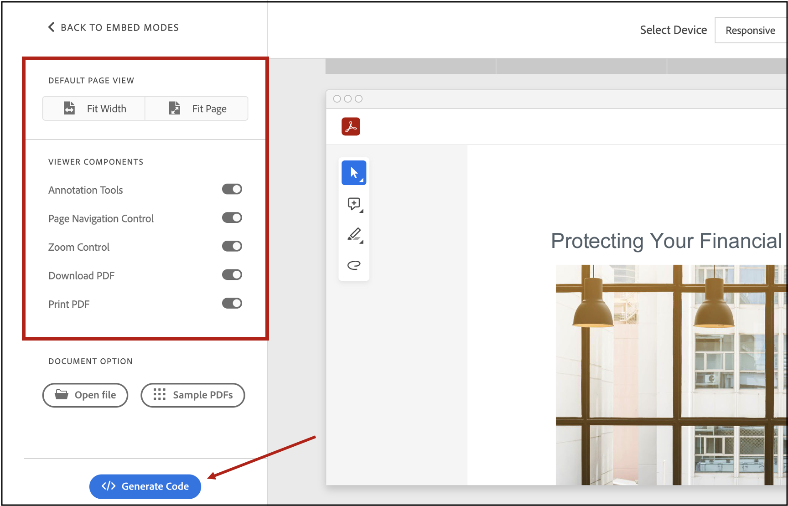
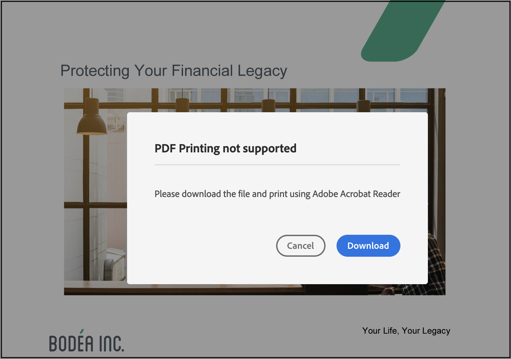
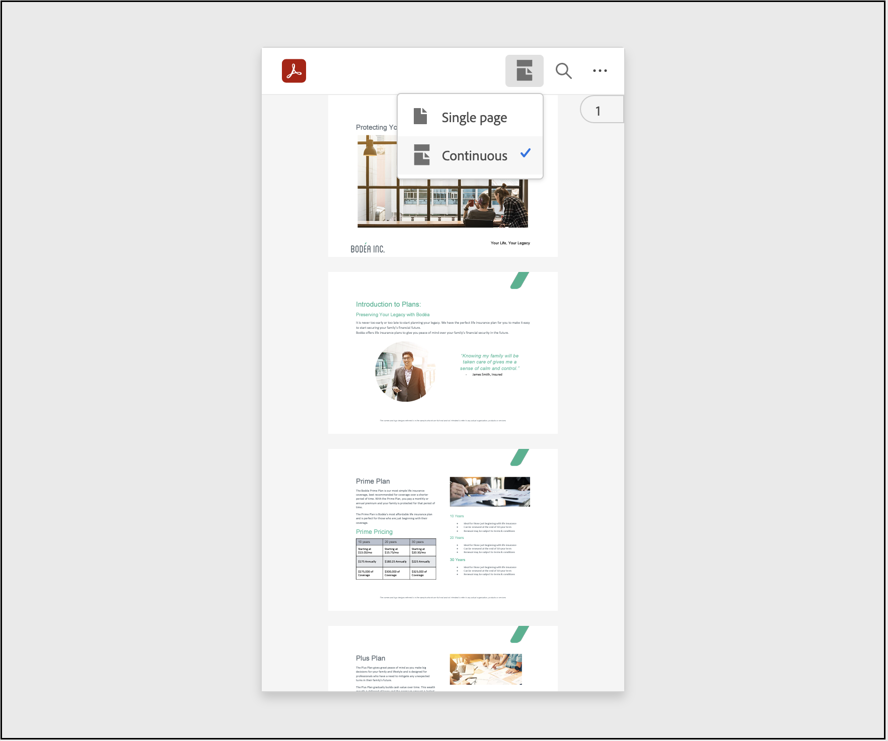
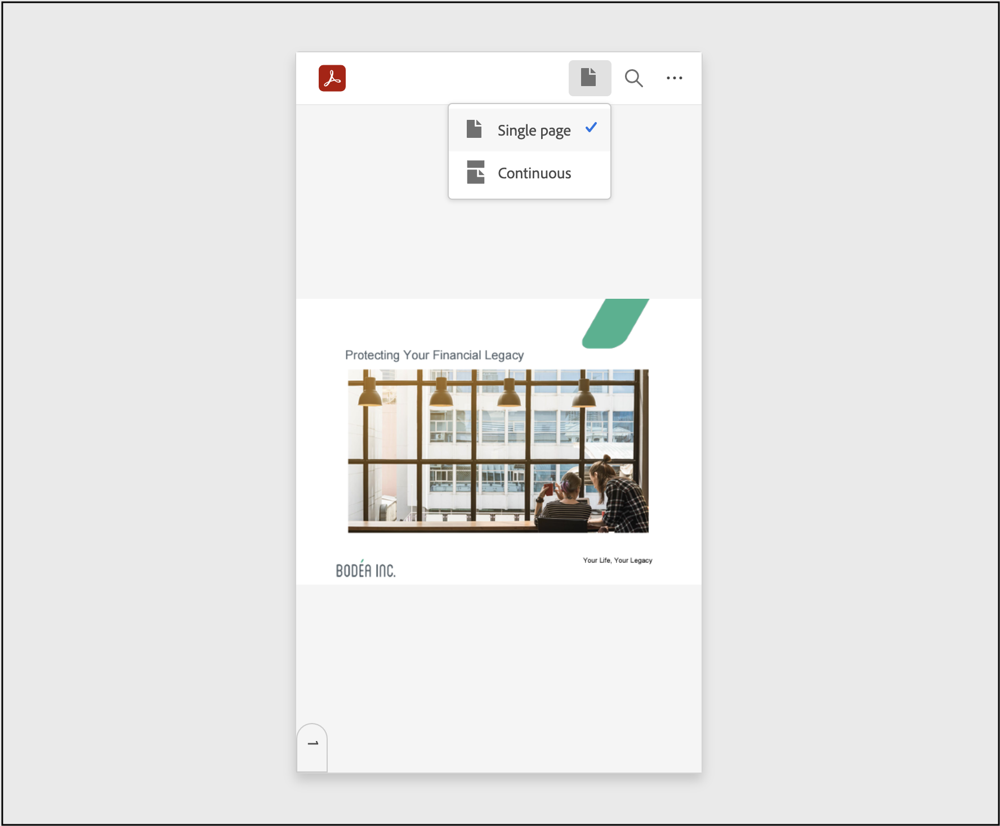
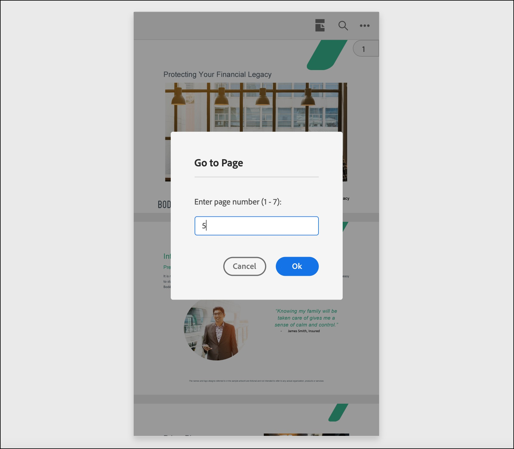

# Quickstarts
<p>
Adobe PDF Embed API allows you to embed a PDF viewer in your web applications with only a few lines of code. With options for controlling how a PDF appears and functions, your applications can deliver the rich and compelling digital document experiences to your customers expect and need.


Easy-to-use, JavaScript-based interfaces are the PDF Embed API's
foundation. Simplicity is designed in so that developers can harness the
power of integrated PDF in their web content. With the ability to
natively display PDF in an environment you control, you no longer need
to rely on Reader download buttons, 3rd party apps, and PDF viewers that
care little for PDF standards. With web-based JavaScript and in-page JS
options, displaying a PDF on the web couldn't be easier. And it's
simple: a few of lines of code are all you need to get started.
</p>
<InlineAlert slots="text" />

Check out the [online demo](https://www.adobe.com/go/dcviewsdk_demo),
and view the code to see how easy it is!

## Getting credentials

You'll need a client ID to use the Adobe PDF Embed API. To
get one, [click HERE]( https://documentcloud.adobe.com/dc-integration-creation-app-cdn/main.html?api=pdf-embed-api), and
complete the workflow.

## Copy it. Run it.

The quickest way to get up and running is to simply copy the code below
to an index.html file and open it in a browser. The example already
points to an online PDF, and you do not need a client ID to run the
viewer on your machine.

If you wish to run it in a local web server (for example, localhost),
then you need a valid client ID. You can generate a client ID from
[here](https://documentcloud.adobe.com/dc-integration-creation-app-cdn/main.html?api=pdf-embed-api). Insert the client
ID within the double quotes in line 16 in the code below and run the
webpage from your server.

<InlineAlert slots="text"/>

After the first page of the PDF is rendered, PDF Embed API calls into a service to validate if the client ID is used with the correct website domain. If the client ID is incorrect or you are using it on a domain other than the one you registered, then the PDF preview is blocked with an error message.

There really are no environment setup steps or system requirements.
Develop your web app using your preferred methods and tools.

```html
<!--Get the samples from https://www.adobe.com/go/pdfembedapi_samples-->
<!DOCTYPE html>
<html>
<head>
 <title>Adobe Document Services PDF Embed API Sample</title>
 <meta charset="utf-8"/>
 <meta http-equiv="X-UA-Compatible" content="IE=edge,chrome=1"/>
 <meta id="viewport" name="viewport" content="width=device-width, initial-scale=1"/>
</head>
<body style="margin: 0px">
 <div id="adobe-dc-view"></div>
 <script src="https://documentcloud.adobe.com/view-sdk/main.js"></script>
 <script type="text/javascript">
    document.addEventListener("adobe_dc_view_sdk.ready", function()
    {
        var adobeDCView = new AdobeDC.View({clientId: "<YOUR_CLIENT_ID>", divId: "adobe-dc-view"});
        adobeDCView.previewFile(
       {
          content:   {location: {url: "https://documentcloud.adobe.com/view-sdk-demo/PDFs/Bodea Brochure.pdf"}},
          metaData: {fileName: "Bodea Brochure.pdf"}
       });
    });
 </script>
</body>
</html>
```

## Run ready samples

The PDF Embed API provides ready-to-run sample files for every feature.

1.  Download the [samples repo](https://www.adobe.com/go/pdfembedapi_samples).
2.  Place the files in any location that has internet access.
3.  Navigate to the index.html file for any sample, and open it in a
    browser.

If a PDF renders in the web viewer, the sample has correctly executed.

## Live demo

The [Adobe PDF Embed API
demo](https://www.adobe.com/go/dcviewsdk_demo) demonstrates how easy it
is to configure the viewer and also provides a "generate code" button so
that you can immediately see your UI changes reflected in a live code
sample.



## Supported browsers

PDF Embed API is supported on the latest versions of the following 
browsers:

-   Windows - Microsoft Edge, Google Chrome, Mozilla Firefox.
-   macOS - Safari, Google Chrome, Microsoft Edge, Mozilla Firefox.
-   Android - Google Chrome.
-   iOS - Safari, Google Chrome.

<InlineAlert slots="text"/>

PDF Embed API will end support for Internet Explorer 11 and Microsoft Edge Legacy after September, 2021. Please use the latest version of Microsoft Edge or any other supported browser.

### Support for print PDF

PDF printing is currently not supported in Firefox browser. Clicking on the print PDF button will show a popup asking users to download the file and print using Adobe Acrobat Reader.



## Mobile support

Much of what the PDF Embed API delivers is supported in the mobile
devices. However, there are some limitations:

-   Annotation tools are not supported on phones in Full Window embed
    mode. These tools are supported on tablets (both Android and iOS).
-   Print functionality is unsupported.
-   PDF download is unsupported on iOS devices, but it is supported on
    Android.

PDF Embed API provides some optimizations in order to enhance the mobile
view experience. These optimizations are available only in mobile phone
browsers.

### View modes in mobile browsers

PDF Embed API provides a couple of view modes on mobile phone browsers
to enhance the viewing experience of the PDFs. Note that these modes are
available only with Full Window embed mode.

-   Continuous view mode: This mode displays all the document pages one
    after the other and users can easily navigate through the pages by
    scrolling up or down. This is the default view mode to render PDFs
    in mobile phone browsers.
-   Single Page view mode: This mode displays only a single document
    page at a time and doesn't show any adjoining page. Users can use
    the swipe gesture to navigate to other pages which will be displayed
    one at a time.

The view mode toggle is available in the top bar. Click on the toggle
and select the desired view mode from the dropdown.

**Continuous view mode**



**Single page view mode**



These view modes can also be set using the configuration variable
`defaultViewMode`. Set the appropriate value of the variable and pass it
as a preview configuration to the `previewFile` API. For details, see
[Menu and tool options](./howtos_ui.md#menu-and-tool-options).

### Go to a Page

PDF Embed API provides a page handle for quick navigation to a specific
page in the PDF. The page handle displays the current page number in
view. The page handle appears on the right side for continuous view mode
whereas it appears at the bottom for single page mode.

Click on the page handle and a dialog appears asking to enter a page
number. Enter the desired page number and user will be navigated to that
particular page.

Note that this functionality is available only with Full Window embed
mode.



### Zoom in

PDF Embed API also supports pinch zoom gesture and users can zoom-in to
magnify the PDF content for better reading experience. This
functionality is supported with all embed modes.

## Analytics

**What information is collected to analyze PDF Embed API usage?**

PDF Embed API ONLY collects essential information which helps Adobe understand how to scale the product and gain insights on product usage. The following information is collected:

-   Browser and operating system type and version.
-   Type of device used to open the PDF - desktop, mobile or tablet.
-   Embed mode used to render the PDF.
-   File size and number of pages.
-   Performance metrics, such as, whether PDF was rendered in linearized manner or not, time taken to download the PDF and render the first page.
-   URL of the webpage.

Please note that PDF Embed API doesn’t store any user-generated content and never shares user-generated content with Adobe servers.

**How will Adobe use the information?**

The anonymous information will be used to develop new features, collect performance metrics and understand product usage in order to make improvements.

**How is my privacy protected?**

Adobe takes many precautions in protecting the information that is collected and transmitted. Since no personally identifiable information is collected, the data will not be meaningful to anyone outside Adobe.

## Feedback and forum

Customer feedback is particularly valuable as it helps the team validate
use cases, guide development, and troubleshoot issues. Comments and
questions are always welcome on the [Community
Forum](https://community.adobe.com/t5/Document-Cloud-SDK/bd-p/Document-Cloud-SDK).
