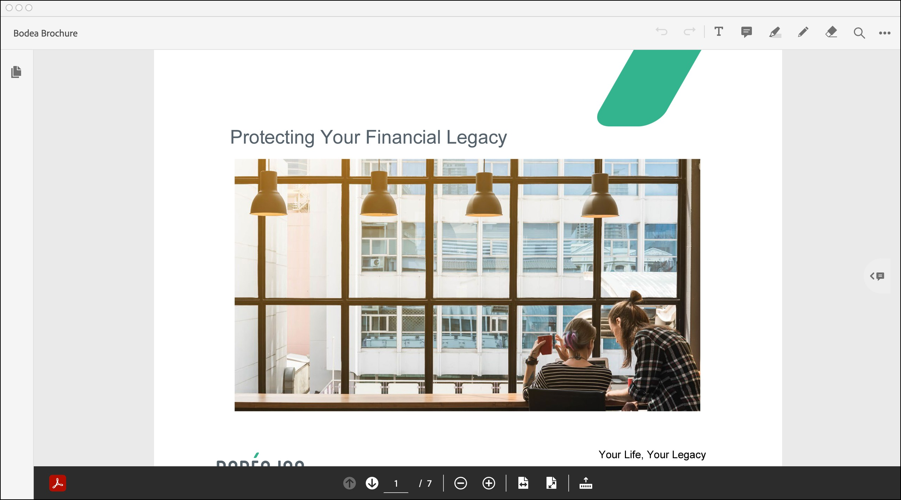
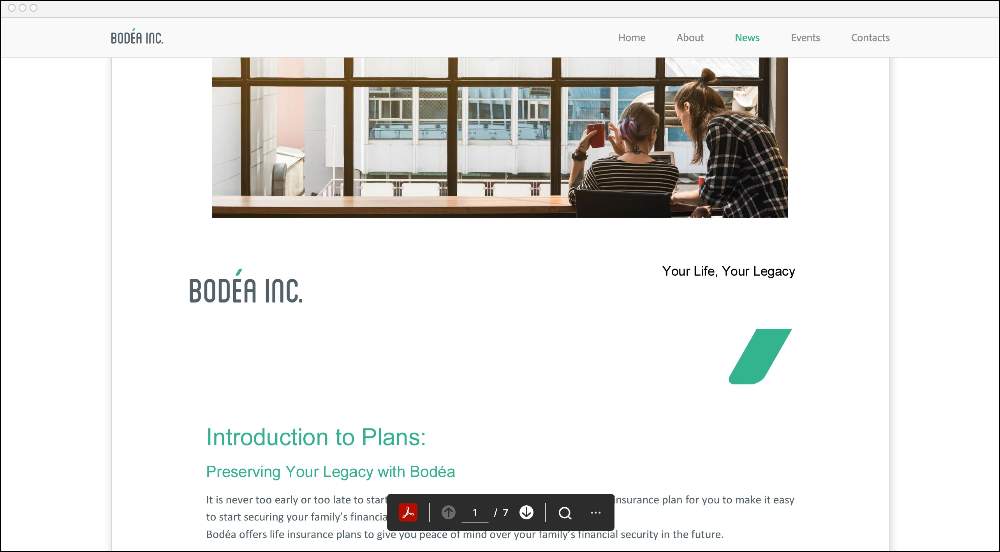

# Legacy to Modern Viewer

Adobe’s new modern PDF viewer is a reimagining of the look and feel of PDF viewing 
on web, desktop, mobile, and PDF integrations.  It introduces a new framework and 
workflows that better map to user mental models and enables a consistent user 
experience whether you are viewing a PDF in Adobe Acrobat or embedded on your website.
  
## Full window embed mode

### Full window embed mode in legacy viewer



### Full window embed mode in modern viewer

**New Features**

* Simplified UI and iconography that will be consistent across all Acrobat PDF viewing 
  surfaces for desktop, web, mobile and integrations.
* Updated quick tools for document annotation, commenting that have moved from the top 
  right to the left hand of the viewer.
* NEW: Selection tool for selecting specific document areas and panning around the
  document while zoomed in.
* UPDATE: Commenting will now include textbox commenting as well as comment color 
  selections.
* UPDATE: Highlight will now include underline, strike-through and multiple colors.
* UPDATE: Drawing tool will now allow for different colors and line thickness adjustment.
* Improved Commenting and navigation UX and UI.
* Improved UX for document saving.
* The left hand panel is deprecated and page thumbnails, bookmarks, page navigation, 
  view mode and zoom options have moved to the right-hand panel.

<br/>


## Sized container embed mode

### Sized container embed mode in legacy viewer


### Sized container embed mode in modern viewer

**New Features**

* Improved UX for sized container embed mode on mobile. Users will be prompted to enter 
  full screen view for optimized viewing.
* There is no top bar and the file name appears as a toast and disappears after a 
  few seconds. The print PDF, download PDF and document search options have 
  moved from top bar to the page control toolbar at the bottom.
* The full screen view contains additional options to display page thumbnails, 
  bookmarks and page navigation options.

<br/>

*Sized container embed mode*


<br/>

*Sized container in full screen mode*


## In-line embed mode

### In-line embed mode in legacy viewer



### In-line embed mode in modern viewer


## Lightbox embed mode

### Lightbox embed mode in legacy viewer


### Lightbox embed mode in modern viewer

**New Features**

* Improved page navigation UX and UI.
* The page control toolbar at the bottom is deprecated and the page navigation, 
  view mode and zoom options have moved to the right-hand panel.
* The right-hand panel also contains page thumbnails and bookmarks.

<br/>


## Deprecated Features

The following features and configuration variables are deprecated in modern viewer: 

* Left hand panel (`showLeftHandPanel`) is deprecated in full window embed mode. 
  Page thumbnails and bookmarks have moved to the right panel in modern viewer.
* The bottom page control toolbar (`showPageControls`) is deprecated in full window 
  and lightbox embed modes. Page navigation has moved to the right panel in modern viewer.
* Docking and undocking the bottom page control toolbar (`dockPageControls`) is deprecated 
  in full window and lightbox embed modes.

## Customer impact

In order to use PDF Embed API, website developers are required to add the PDF Embed API 
script URL in their websites. 
Website developers should use the [viewer.js](https://documentcloud.adobe.com/view-sdk/viewer.js) 
script (line 11) to access Adobe's modern PDF viewer. 
All APIs and callbacks will work as expected with significant improvement in user experience.

```html
<!DOCTYPE html>
<html>
<head>
 <title>Adobe Document Services PDF Embed API Sample</title>
 <meta charset="utf-8"/>
 <meta http-equiv="X-UA-Compatible" content="IE=edge,chrome=1"/>
 <meta id="viewport" name="viewport" content="width=device-width, initial-scale=1"/>
</head>
<body style="margin: 0px">
 <div id="adobe-dc-view"></div>
 <script src="https://documentcloud.adobe.com/view-sdk/viewer.js"></script>
 <script type="text/javascript">
    document.addEventListener("adobe_dc_view_sdk.ready", function()
    {
        var adobeDCView = new AdobeDC.View({clientId: "<YOUR_CLIENT_ID>", divId: "adobe-dc-view"});
        adobeDCView.previewFile(
       {
          content:   {location: {url: "https://documentcloud.adobe.com/view-sdk-demo/PDFs/Bodea Brochure.pdf"}},
          metaData: {fileName: "Bodea Brochure.pdf"}
       });
    });
 </script>
</body>
</html>
```

Developers using the [main.js](https://documentcloud.adobe.com/view-sdk/main.js) script in their websites 
will continue to see the legacy PDF viewer and all PDF Embed API functionality 
would be available to them in the legacy viewer.

For more details about the configurations supported in modern PDF viewer, 
see the section [Menu and tool options](../howtos_ui.md/#menu-and-tool-options).