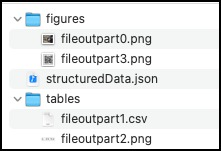

# Extract PDF

## Structured Information Output Format

The output of an SDK extract operation is a zip package containing the
following:

-   The structuredData.json file with the extracted content & PDF
    element structure. See the [JSON
    schema](/extractJSONOutputSchema2.json) for a
    description of the default output. (Please refer the [Styling JSON
    schema](/extractJSONOutputSchemaStylingInfo.json)
    for a description of the output when the styling option is enabled.)
-   A renditions folder(s) containing renditions for each element type
    selected as input. The folder name is either "tables" or "figures"
    depending on your specified element type. Each folder contains
    renditions with filenames that correspond to the element information
    in the JSON file.



The following is a summary of key elements in the extracted JSON(See
additional descriptions in the [JSON
schema](/extractJSONOutputSchema2.json)):

-   Elements : Ordered list of semantic elements (like headings,
    paragraphs, tables, figures) found in the document, on the basis of
    position in the structure tree of the document.The output does not
    include headers or footers.In addition, headings that repeat across
    pages are reported for the first occurrence only.
-   Bounds : Bounding box enclosing the content items forming this
    element. Not reported for elements which don't have any content
    items (like empty table cells). The bounds are as per PDF specification coordinates.
    PDF pages are generally specified in inches (like A4 page is 8.3 inches x 11.7 inches). If values are required in coordinates, we need a DPI value i.e. dots per inches. As per PDF specification, 72 DPI is used when creating a PDF. So, width of an A4 page is specified to be ~= 598 units (8.3 inches x 72) when creating the PDF.
    All values reported in Extract use this 72 dpi based coordinates. Again as per PDF spec, absolute values of bounds are in a coordinate system where origin is (0,0), up and right directions are positive. Going by this coordinate system, for all rects reported in Extract, bottom < top and left < right.
    In Extract JSON schema, all rects are of type #/definitions/rect  and rect is defined as:
    
    **description: Rectangle/Box in PDF coordinate system (bottom-left is origin). Values are in PDF user space units. Order of values - left, bottom, right, top.**

-   Font : Font description for the font associated with the first
    character. Only reported for text elements.
-   TextSize : Text size (in points) of the last character. Only
    reported for text elements.
-   Attributes: Includes additional properties like line height and text
    alignment.
-   Path : The Path describes the location of elements in the structure
    tree including the element type and the instance number. Path along with bounds defines the reading order of the document. Element
    types are based on the [ISO
    standard](https://www.iso.org/standard/75839.html) , a summary is
    included below for convenience :
    -   Aside : Content which is not part of regular content flow of the
        document
    -   Figure : Non-reflowable constructs like graphs, images,
        flowcharts
    -   Footnote : FootNote
    -   H, H1, H2, etc : Heading Level
    -   L : List
    -   Li : List Item
    -   Lbl : List Item label
    -   Lbody : List item body
    -   P : Paragraph
    -   ParagraphSpan : Denotes part of a paragraph. Reported when
        paragraph is broken (generally due to page break or column
        break)
    -   Reference : Link
    -   Sect : Logical section of the document
    -   StyleSpan : Denotes difference in styling of text relative to
        the parent container
    -   Sub : Single line of a multiline paragraph (e.g. addresses).
        Such paras are created in html using \<br\> inside \<p\> tags
    -   Table : Table
    -   TD : Table cell
    -   TH : Table header cell
    -   TR : Table row
    -   Title : Title of the document. This is the most prominent
        heading which can define the whole document.
    -   TOC : Table of contents
    -   TOCI : Table of contents item
    -   Watermark : Watermark
-   Text : Text for the element in UTF-8 format, only reported for text
    elements. When inline elements are reported separately from parent
    block element, then this value has references to those inline
    elements.
-   Figures : Identified as a Figure in the Path attribute, saved as a
    PNG in the figures folder with the filename identified in the
    filePaths attribute.
-   Tables : Identified as a Table in the Path attribute, saved as a
    .CSV, .XLSX, and .PNG in the tables folder with the filename
    identified in the filePaths attribute.
-   FilePaths : List of file paths to additional output files (images
    and spreadsheets)
-   Pages : A list of properties for each page of the PDF including page
    number, width, height, and rotation.
-   Reading Order : The reading order of content within columns, across
    page breaks, and inclusive of asides is represented by the order of
    the elements in the Elements array. In the normal mode, exceptions
    can occur for elements extracted from their container (eg. A
    reference link in the middle of a paragraph). However, the order is
    preserved in Styling mode where all Elements and their Kids are
    represented in the natural reading order. Reading order is determined by Bounds and path element provided in the .json file.

## API limitations
<br />
<ul>
<li><b>File size:</b> Files up to a maximum of 100MB are supported.</li>
<li><b>Number of Pages:</b> Non-scanned PDFs have a limit of 400 pages. Scanned PDFs have a limit of 150 pages or less. Limits may be lower for files with multiple tables. For larger files or those with complex layouts, it is recommended to split the file into smaller sections before processing.</li>
<li><b>Rate limits:</b> Keep request rate below 25 requests per minutes.</li>
<li><b>Page Size:</b> The API supports standard page sizes not to exceed 17.5” or less than 6” in either dimension.</li>
<li><b>Hidden Objects:</b> PDF files that contain content that is not visible on the page like javascript, OCG (optional content groups), etc are not supported. Files that contain such hidden information may fail to process. For such cases, [removing hidden content](https://helpx.adobe.com/acrobat/using/removing-sensitive-content-pdfs.html) prior to processing files again may return a successful result.</li>
<li><b>Language:</b> The API is currently optimized for English language content. Files containing content in other Latin languages should return good results, but may have issues with non-English punctuation.</li>
<li><b>OCR and Scan quality:</b> The quality of text extracted from scanned files is dependent on the clarity of content in the input file. Conditions like skewed pages, shadowing, obscured or overlapping fonts, and page resolution less than 200 DPI can all result in lower quality text output.</li>
<li><b>Form fields:</b> Files containing XFA and other fillable form elements are not supported.</li>
<li><b>Unprotected files:</b> The API supports files that are unprotected or where security restrictions allow copying of content. Files that are secured and do not allow copying of content will not be processed.</li>
<li><b>Annotations:</b> Content in PDF files containing annotations such as highlights and sticky notes will be processed, but annotations that obscure text could impact output quality. Text within annotations will not be included in the output.</li>
<li><b>PDF Producers:</b> The Extract API is designed to extract content from files that contain text, table data, and figures. Files created from applications that produce other types of content like illustrations, CAD drawings or other types of vector art may not return quality results.</li>
</ul>

## Error codes
| Scenario           | Error code                                                                                                                                                                                                                     | Error message                               |
| ------------------- | ------------------------------------------------------------------------------------------------------------------------------------------------------------------------------------------------------------------------------ | ------------------------------------ |
| Invalid API parameters | \-                                                                                                                                    | Invalid parameters                 |
| File size violation         | DISQUALIFIED_FILE_SIZE                                                                                                                                          | File exceeds size limit. |
| Page limit violation              | DISQUALIFIED_PAGE_LIMIT | File exceeds page limit.                 |
| Scan page limit violation              | DISQUALIFIED_SCAN_PAGE_LIMIT                                                                                                                     | Scanned file exceeds page limit.                 |
| Unsupported XFA file             | DISQUALIFIED_XFA                                                                                                                                                                         | File contains XFA form(s). Not supported for content extraction.                 |
| Encryption permission                 | DISQUALIFIED_PERMISSIONS                                                                                                                                                                             | File permissions do not allow for content extraction.                 |
| Complex file            | DISQUALIFIED_COMPLEX_FILE                                                                                                                                                                                                       | File contents are too complex for content extraction.                 |
| Unsupported language    | DISQUALIFIED_LANGUAGE                                                      | File content language is unsupported.                 |
| Bad PDF             | BAD_PDF                                                                                                                                             | Unable to extract content. File is corrupted, malformed or an empty PDF.                 |
| Invalid file type               | BAD_PDF_FILE_TYPE                                                                                                                                                                                | The input file is not a PDF file.                 |
| Damaged file               | BAD_PDF_DAMAGED                                                                                                                                                                                | The input file is damaged.                 |
| File contains complex table               | BAD_PDF_COMPLEX_TABLE                                                                                                                                                                                | The input file contains a table that is too complex to process.                 |
| File contains complex content               | BAD_PDF_COMPLEX_INPUT                                                                                                                                                                                | The input file contains content that is too complex to process.                 |
| File contains unsupported font                         | BAD_PDF_UNSUPPORTED_FONT                                                                                                                                                                                | The input file contains font data that is corrupted or not supported.                |
| Large PDF               | BAD_PDF_LARGE_FILE                                                                                                                                                                                | The input file size exceeds the maximum allowed.                 |
| Protected PDF     | PROTECTED_PDF                                                                   | Unable to extract content. File is password protected.                 |
| Empty or corrupted input   | BAD_INPUT                                                              |	Input is corrupted or empty.                      |
| Invalid input parameters    | BAD_INPUT_PARAMS                                                       | Invalid input parameters.                         |
| Timeout           | TIMEOUT                                                                                             | Processing timeout. Please try splitting the file into multiple files with fewer pages.                 |
| Unknown error / failure               | ERROR                                                                                                                                                                                | Unable to extract content - Internal error.                 |


## REST API 

See our public API Reference for [Extract PDF](../../../apis/#tag/Extract-PDF).

## Extract Text from a PDF

The sample below extracts text element information from a PDF document and returns a JSON file.

Please refer the [API usage guide](./api-usage.md) to understand how to use our APIs.

<CodeBlock slots="heading, code" repeat="5" languages="Java, .NET, Node JS, Python, REST API" /> 

#### Java

```javascript
// Get the samples from https://www.adobe.com/go/pdftoolsapi_java_samples
// Run the sample:
// mvn -f pom.xml exec:java -Dexec.mainClass=com.adobe.pdfservices.operation.samples.extractpdf.ExtractTextInfoFromPDF
 
public class ExtractTextInfoFromPDF {

    private static final Logger LOGGER = LoggerFactory.getLogger(ExtractTextInfoFromPDF.class);

    public static void main(String[] args) {

        try (InputStream inputStream = Files.newInputStream(new File("src/main/resources/extractPdfInput.pdf").toPath())) {
            // Initial setup, create credentials instance
            Credentials credentials = new ServicePrincipalCredentials(
                System.getenv("PDF_SERVICES_CLIENT_ID"),
                System.getenv("PDF_SERVICES_CLIENT_SECRET"));
        
            // Creates a PDF Services instance
            PDFServices pdfServices = new PDFServices(credentials);
        
            // Creates an asset(s) from source file(s) and upload
            Asset asset = pdfServices.upload(inputStream, PDFServicesMediaType.PDF.getMediaType());
        
            // Create parameters for the job
            ExtractPDFParams extractPDFParams = ExtractPDFParams.extractPDFParamsBuilder()
                .addElementsToExtract(Arrays.asList(ExtractElementType.TEXT)).build();
        
            // Creates a new job instance
            ExtractPDFJob extractPDFJob = new ExtractPDFJob(asset)
                .setParams(extractPDFParams);
        
            // Submit the job and gets the job result
            String location = pdfServices.submit(extractPDFJob);
            PDFServicesResponse<ExtractPDFResult> pdfServicesResponse = pdfServices.getJobResult(location, ExtractPDFResult.class);
        
            // Get content from the resulting asset(s)
            Asset resultAsset = pdfServicesResponse.getResult().getResource();
            StreamAsset streamAsset = pdfServices.getContent(resultAsset);
        
            // Creates an output stream and copy stream asset's content to it
            Files.createDirectories(Paths.get("output/"));
            OutputStream outputStream = Files.newOutputStream(new File("output/ExtractTextInfoFromPDF.zip").toPath());
            LOGGER.info("Saving asset at output/ExtractTextInfoFromPDF.zip");
            IOUtils.copy(streamAsset.getInputStream(), outputStream);
            outputStream.close();
        } catch (ServiceApiException | IOException | SDKException | ServiceUsageException e) {
            LOGGER.error("Exception encountered while executing operation", e);
        }
    }
}
      
```

#### .NET

```javascript
// Get the samples from https://www.adobe.com/go/pdftoolsapi_net_samples
// Run the sample:
// cd ExtractTextInfoFromPDF/
// dotnet run ExtractTextInfoFromPDF.csproj

namespace ExtractTextInfoFromPDF
{
    class Program
    {
        private static readonly ILog log = LogManager.GetLogger(typeof(Program));
                static void Main()
        {
            // Configure the logging.
            ConfigureLogging();
            try
            {
                // Initial setup, create credentials instance
                ICredentials credentials = new ServicePrincipalCredentials(
                    Environment.GetEnvironmentVariable("PDF_SERVICES_CLIENT_ID"),
                    Environment.GetEnvironmentVariable("PDF_SERVICES_CLIENT_SECRET"));

                // Creates a PDF Services instance
                PDFServices pdfServices = new PDFServices(credentials);

                // Creates an asset from source file and upload
                using Stream inputStream = File.OpenRead(@"extractPDFInput.pdf");
                IAsset asset = pdfServices.Upload(inputStream, PDFServicesMediaType.PDF.GetMIMETypeValue());

                // Create parameters for the job
                ExtractPDFParams extractPDFParams = ExtractPDFParams.ExtractPDFParamsBuilder()
                    .AddElementToExtract(ExtractElementType.TEXT)
                    .Build();

                // Creates a new job instance
                ExtractPDFJob extractPDFJob = new ExtractPDFJob(asset)
                    .SetParams(extractPDFParams);

                // Submits the job and gets the job result
                String location = pdfServices.Submit(extractPDFJob);
                PDFServicesResponse<ExtractPDFResult> pdfServicesResponse =
                    pdfServices.GetJobResult<ExtractPDFResult>(location, typeof(ExtractPDFResult));

                // Get content from the resulting asset(s)
                IAsset resultAsset = pdfServicesResponse.Result.Resource;
                StreamAsset streamAsset = pdfServices.GetContent(resultAsset);

                // Creating output streams and copying stream asset's content to it
                String outputFilePath = "/output/ExtractTextInfoFromPDF.zip";
                new FileInfo(Directory.GetCurrentDirectory() + outputFilePath).Directory.Create();
                Stream outputStream = File.OpenWrite(Directory.GetCurrentDirectory() + outputFilePath);
                streamAsset.Stream.CopyTo(outputStream);
                outputStream.Close();
            }
            catch (ServiceUsageException ex)
            {
                log.Error("Exception encountered while executing operation", ex);
            }
            catch (ServiceApiException ex)
            {
                log.Error("Exception encountered while executing operation", ex);
            }
            catch (SDKException ex)
            {
                log.Error("Exception encountered while executing operation", ex);
            }
            catch (IOException ex)
            {
                log.Error("Exception encountered while executing operation", ex);
            }
            catch (Exception ex)
            {
                log.Error("Exception encountered while executing operation", ex);
            }
        }

        static void ConfigureLogging()
        {
            ILoggerRepository logRepository = LogManager.GetRepository(Assembly.GetEntryAssembly());
            XmlConfigurator.Configure(logRepository, new FileInfo("log4net.config"));
        }
    }
}
```

#### Node JS

```javascript
// Get the samples from http://www.adobe.com/go/pdftoolsapi_node_sample
// Run the sample:
// node src/extractpdf/extract-text-info-from-pdf.js

const {
    ServicePrincipalCredentials,
    PDFServices,
    MimeType,
    ExtractPDFParams,
    ExtractElementType,
    ExtractPDFJob,
    ExtractPDFResult,
    SDKError,
    ServiceUsageError,
    ServiceApiError
} = require("@adobe/pdfservices-node-sdk");
const fs = require("fs");

(async () => {
    let readStream;
    try {
        // Initial setup, create credentials instance
        const credentials = new ServicePrincipalCredentials({
            clientId: process.env.PDF_SERVICES_CLIENT_ID,
            clientSecret: process.env.PDF_SERVICES_CLIENT_SECRET
        });

        // Creates a PDF Services instance
        const pdfServices = new PDFServices({credentials});

        // Creates an asset(s) from source file(s) and upload
        readStream = fs.createReadStream("./extractPDFInput.pdf");
        const inputAsset = await pdfServices.upload({
            readStream,
            mimeType: MimeType.PDF
        });

        // Create parameters for the job
        const params = new ExtractPDFParams({
            elementsToExtract: [ExtractElementType.TEXT]
        });

        // Creates a new job instance
        const job = new ExtractPDFJob({inputAsset, params});

        // Submit the job and get the job result
        const pollingURL = await pdfServices.submit({job});
        const pdfServicesResponse = await pdfServices.getJobResult({
            pollingURL,
            resultType: ExtractPDFResult
        });

        // Get content from the resulting asset(s)
        const resultAsset = pdfServicesResponse.result.resource;
        const streamAsset = await pdfServices.getContent({asset: resultAsset});

        // Creates a write stream and copy stream asset's content to it
        const outputFilePath = "./ExtractTextInfoFromPDF.zip";
        console.log(`Saving asset at ${outputFilePath}`);

        const writeStream = fs.createWriteStream(outputFilePath);
        streamAsset.readStream.pipe(writeStream);
    } catch (err) {
        if (err instanceof SDKError || err instanceof ServiceUsageError || err instanceof ServiceApiError) {
            console.log("Exception encountered while executing operation", err);
        } else {
            console.log("Exception encountered while executing operation", err);
        }
    } finally {
        readStream?.destroy();
    }
})();
```

#### Python

```python
# Get the samples from https://github.com/adobe/pdfservices-python-sdk-samples
# Run the sample:
# python src/extractpdf/extract_text_info_from_pdf.py

# Initialize the logger
logging.basicConfig(level=logging.INFO)

class ExtractTextInfoFromPDF:
    def __init__(self):
        try:
            file = open('extractPdfInput.pdf', 'rb')
            input_stream = file.read()
            file.close()

            # Initial setup, create credentials instance
            credentials = ServicePrincipalCredentials(
                client_id=os.getenv('PDF_SERVICES_CLIENT_ID'),
                client_secret=os.getenv('PDF_SERVICES_CLIENT_SECRET')
            )

            # Creates a PDF Services instance
            pdf_services = PDFServices(credentials=credentials)

            # Creates an asset(s) from source file(s) and upload
            input_asset = pdf_services.upload(input_stream=input_stream, mime_type=PDFServicesMediaType.PDF)

            # Create parameters for the job
            extract_pdf_params = ExtractPDFParams(
                elements_to_extract=[ExtractElementType.TEXT],
            )

            # Creates a new job instance
            extract_pdf_job = ExtractPDFJob(input_asset=input_asset, extract_pdf_params=extract_pdf_params)

            # Submit the job and gets the job result
            location = pdf_services.submit(extract_pdf_job)
            pdf_services_response = pdf_services.get_job_result(location, ExtractPDFResult)

            # Get content from the resulting asset(s)
            result_asset: CloudAsset = pdf_services_response.get_result().get_resource()
            stream_asset: StreamAsset = pdf_services.get_content(result_asset)

            # Creates an output stream and copy stream asset's content to it
            output_file_path = 'extractTextInfoFromPDF.zip'
            with open(output_file_path, "wb") as file:
                file.write(stream_asset.get_input_stream())

        except (ServiceApiException, ServiceUsageException, SdkException) as e:
            logging.exception(f'Exception encountered while executing operation: {e}')


if __name__ == "__main__":
    ExtractTextInfoFromPDF()
```

#### REST API 

```javascript
// Please refer our REST API docs for more information 
// https://developer.adobe.com/document-services/docs/apis/#tag/Extract-PDF

curl --location --request POST 'https://pdf-services.adobe.io/operation/extractpdf' \
--header 'x-api-key: {{Placeholder for client_id}}' \
--header 'Content-Type: application/json' \
--header 'Authorization: Bearer {{Placeholder for token}}' \
--data-raw '{  
    "assetID": "urn:aaid:AS:UE1:23c30ee0-2e4d-46d6-87f2-087832fca718",
    "elementsToExtract": [
        "text"
    ]
}'
```

## Extract Text and Tables

The sample below extracts text and table element information from a PDF document and returns a JSON file along with table data in XLSX format.

Please refer the [API usage guide](./api-usage.md) to understand how to use our APIs.

<CodeBlock slots="heading, code" repeat="5" languages="Java,.NET, Node JS, Python, REST API" /> 

#### Java

```javascript
// Get the samples from https://www.adobe.com/go/pdftoolsapi_java_samples
// Run the sample:
// mvn -f pom.xml exec:java -Dexec.mainClass=com.adobe.pdfservices.operation.samples.extractpdf.ExtractTextTableInfoFromPDF
 
public class ExtractTextTableInfoFromPDF {

    private static final Logger LOGGER = LoggerFactory.getLogger(ExtractTextTableInfoFromPDF.class);

    public static void main(String[] args) {

        try (InputStream inputStream = Files.newInputStream(new File("src/main/resources/extractPdfInput.pdf").toPath())) {
            // Initial setup, create credentials instance
            Credentials credentials = new ServicePrincipalCredentials(
                System.getenv("PDF_SERVICES_CLIENT_ID"),
                System.getenv("PDF_SERVICES_CLIENT_SECRET"));
        
            // Creates a PDF Services instance
            PDFServices pdfServices = new PDFServices(credentials);
        
            // Creates an asset(s) from source file(s) and upload
            Asset asset = pdfServices.upload(inputStream, PDFServicesMediaType.PDF.getMediaType());
        
            // Create parameters for the job
            ExtractPDFParams extractPDFParams = ExtractPDFParams.extractPDFParamsBuilder()
                .addElementsToExtract(Arrays.asList(ExtractElementType.TEXT, ExtractElementType.TABLES))
                .build();
        
            // Creates a new job instance
            ExtractPDFJob extractPDFJob = new ExtractPDFJob(asset)
                .setParams(extractPDFParams);
        
            // Submit the job and gets the job result
            String location = pdfServices.submit(extractPDFJob);
            PDFServicesResponse<ExtractPDFResult> pdfServicesResponse = pdfServices.getJobResult(location, ExtractPDFResult.class);
        
            // Get content from the resulting asset(s)
            Asset resultAsset = pdfServicesResponse.getResult().getResource();
            StreamAsset streamAsset = pdfServices.getContent(resultAsset);
        
            // Creates an output stream and copy stream asset's content to it
            Files.createDirectories(Paths.get("output/"));
            OutputStream outputStream = Files.newOutputStream(new File("output/ExtractTextTableInfoFromPDF.zip").toPath());
            LOGGER.info("Saving asset at output/ExtractTextTableInfoFromPDF.zip");
            IOUtils.copy(streamAsset.getInputStream(), outputStream);
            outputStream.close();
        } catch (ServiceApiException | IOException | SDKException | ServiceUsageException e) {
            LOGGER.error("Exception encountered while executing operation", e);
        }
    }
}
      
```

#### .NET

```javascript
// Get the samples from https://www.adobe.com/go/pdftoolsapi_net_samples
// Run the sample:
// cd ExtractTextTableInfoFromPDF/
// dotnet run ExtractTextTableInfoFromPDF.csproj

namespace ExtractTextTableInfoFromPDF
{
    class Program
    {
        private static readonly ILog log = LogManager.GetLogger(typeof(Program));
        static void Main()
        {
            // Configure the logging.
            ConfigureLogging();
            try
            {
                // Initial setup, create credentials instance
                ICredentials credentials = new ServicePrincipalCredentials(
                    Environment.GetEnvironmentVariable("PDF_SERVICES_CLIENT_ID"),
                    Environment.GetEnvironmentVariable("PDF_SERVICES_CLIENT_SECRET"));

                // Creates a PDF Services instance
                PDFServices pdfServices = new PDFServices(credentials);

                // Creates an asset from source file and upload
                using Stream inputStream = File.OpenRead(@"extractPDFInput.pdf");
                IAsset asset = pdfServices.Upload(inputStream, PDFServicesMediaType.PDF.GetMIMETypeValue());

                // Create parameters for the job
                ExtractPDFParams extractPDFParams = ExtractPDFParams.ExtractPDFParamsBuilder()
                    .AddElementsToExtract(new List<ExtractElementType>(new[]
                        { ExtractElementType.TEXT, ExtractElementType.TABLES }))
                    .Build();

                // Creates a new job instance
                ExtractPDFJob extractPDFJob = new ExtractPDFJob(asset).SetParams(extractPDFParams);

                // Submits the job and gets the job result
                String location = pdfServices.Submit(extractPDFJob);
                PDFServicesResponse<ExtractPDFResult> pdfServicesResponse =
                    pdfServices.GetJobResult<ExtractPDFResult>(location, typeof(ExtractPDFResult));

                // Get content from the resulting asset(s)
                IAsset resultAsset = pdfServicesResponse.Result.Resource;
                StreamAsset streamAsset = pdfServices.GetContent(resultAsset);

                // Creating output streams and copying stream asset's content to it
                String outputFilePath = "/output/ExtractTextTableInfoFromPDF.zip";
                new FileInfo(Directory.GetCurrentDirectory() + outputFilePath).Directory.Create();
                Stream outputStream = File.OpenWrite(Directory.GetCurrentDirectory() + outputFilePath);
                streamAsset.Stream.CopyTo(outputStream);
                outputStream.Close();
            }
            catch (ServiceUsageException ex)
            {
                log.Error("Exception encountered while executing operation", ex);
            }
            catch (ServiceApiException ex)
            {
                log.Error("Exception encountered while executing operation", ex);
            }
            catch (SDKException ex)
            {
                log.Error("Exception encountered while executing operation", ex);
            }
            catch (IOException ex)
            {
                log.Error("Exception encountered while executing operation", ex);
            }
            catch (Exception ex)
            {
                log.Error("Exception encountered while executing operation", ex);
            }
        }

        static void ConfigureLogging()
        {
            ILoggerRepository logRepository = LogManager.GetRepository(Assembly.GetEntryAssembly());
            XmlConfigurator.Configure(logRepository, new FileInfo("log4net.config"));
        }
    }
}
```

#### Node JS

```javascript
// Get the samples from http://www.adobe.com/go/pdftoolsapi_node_sample
// Run the sample:
// node src/extractpdf/extract-text-table-info-from-pdf.js

const {
    ServicePrincipalCredentials,
    PDFServices,
    MimeType,
    ExtractPDFParams,
    ExtractElementType,
    ExtractPDFJob,
    ExtractPDFResult,
    SDKError,
    ServiceUsageError,
    ServiceApiError
} = require("@adobe/pdfservices-node-sdk");
const fs = require("fs");

(async () => {
    let readStream;
    try {
        // Initial setup, create credentials instance
        const credentials = new ServicePrincipalCredentials({
            clientId: process.env.PDF_SERVICES_CLIENT_ID,
            clientSecret: process.env.PDF_SERVICES_CLIENT_SECRET
        });

        // Creates a PDF Services instance
        const pdfServices = new PDFServices({credentials});

        // Creates an asset(s) from source file(s) and upload
        readStream = fs.createReadStream("./extractPDFInput.pdf");
        const inputAsset = await pdfServices.upload({
            readStream,
            mimeType: MimeType.PDF
        });

        // Create parameters for the job
        const params = new ExtractPDFParams({
            elementsToExtract: [ExtractElementType.TEXT, ExtractElementType.TABLES]
        });

        // Creates a new job instance
        const job = new ExtractPDFJob({inputAsset, params});

        // Submit the job and get the job result
        const pollingURL = await pdfServices.submit({job});
        const pdfServicesResponse = await pdfServices.getJobResult({
            pollingURL,
            resultType: ExtractPDFResult
        });

        // Get content from the resulting asset(s)
        const resultAsset = pdfServicesResponse.result.resource;
        const streamAsset = await pdfServices.getContent({asset: resultAsset});

        // Creates a write stream and copy stream asset's content to it
        const outputFilePath = "./ExtractTextTableInfoFromPDF.zip";
        console.log(`Saving asset at ${outputFilePath}`);

        const writeStream = fs.createWriteStream(outputFilePath);
        streamAsset.readStream.pipe(writeStream);
    } catch (err) {
        if (err instanceof SDKError || err instanceof ServiceUsageError || err instanceof ServiceApiError) {
            console.log("Exception encountered while executing operation", err);
        } else {
            console.log("Exception encountered while executing operation", err);
        }
    } finally {
        readStream?.destroy();
    }
})();
```

#### Python

```python
# Get the samples from https://github.com/adobe/pdfservices-python-sdk-samples
# Run the sample:
# python src/extractpdf/extract_text_table_info_from_pdf.py

# Initialize the logger
logging.basicConfig(level=logging.INFO)

class ExtractTextTableInfoFromPDF:
    def __init__(self):
        try:
            file = open('extractPdfInput.pdf', 'rb')
            input_stream = file.read()
            file.close()

            # Initial setup, create credentials instance
            credentials = ServicePrincipalCredentials(
                client_id=os.getenv('PDF_SERVICES_CLIENT_ID'),
                client_secret=os.getenv('PDF_SERVICES_CLIENT_SECRET')
            )

            # Creates a PDF Services instance
            pdf_services = PDFServices(credentials=credentials)

            # Creates an asset(s) from source file(s) and upload
            input_asset = pdf_services.upload(input_stream=input_stream, mime_type=PDFServicesMediaType.PDF)

            # Create parameters for the job
            extract_pdf_params = ExtractPDFParams(
                elements_to_extract=[ExtractElementType.TEXT, ExtractElementType.TABLES],
            )

            # Creates a new job instance
            extract_pdf_job = ExtractPDFJob(input_asset=input_asset, extract_pdf_params=extract_pdf_params)

            # Submit the job and gets the job result
            location = pdf_services.submit(extract_pdf_job)
            pdf_services_response = pdf_services.get_job_result(location, ExtractPDFResult)

            # Get content from the resulting asset(s)
            result_asset: CloudAsset = pdf_services_response.get_result().get_resource()
            stream_asset: StreamAsset = pdf_services.get_content(result_asset)

            # Creates an output stream and copy stream asset's content to it
            output_file_path = 'ExtractTextTableInfoFromPDF.zip'
            with open(output_file_path, "wb") as file:
                file.write(stream_asset.get_input_stream())

        except (ServiceApiException, ServiceUsageException, SdkException) as e:
            logging.exception(f'Exception encountered while executing operation: {e}')


if __name__ == "__main__":
    ExtractTextTableInfoFromPDF()
```

#### REST API

```curl
// Please refer our REST API docs for more information 
// https://developer.adobe.com/document-services/docs/apis/#tag/Extract-PDF

curl --location --request POST 'https://pdf-services.adobe.io/operation/extractpdf' \
--header 'x-api-key: {{Placeholder for client_id}}' \
--header 'Content-Type: application/json' \
--header 'Authorization: Bearer {{Placeholder for token}}' \
--data-raw '{
    "assetID": "urn:aaid:AS:UE1:23c30ee0-2e4d-46d6-87f2-087832fca718",
    "elementsToExtract": [
        "text",
        "tables"
    ]
}'
```

## Extract Text and Tables (w/ Tables Renditions)

The sample below extracts text and table element information as well as table renditions from a PDF Document. Note that the output is a zip containing the structured information in a JSON file along with table renditions in PNG and XLSX format.

Please refer the [API usage guide](./api-usage.md) to understand how to use our APIs.

<CodeBlock slots="heading, code" repeat="5" languages="Java, .NET, Node JS, Python, REST API" /> 

#### Java

```javascript
// Get the samples from https://www.adobe.com/go/pdftoolsapi_java_samples
// Run the sample:
// mvn -f pom.xml exec:java -Dexec.mainClass=com.adobe.pdfservices.operation.samples.extractpdf.ExtractTextTableInfoWithRenditionsFromPDF
 
public class ExtractTextTableInfoWithRenditionsFromPDF {

    private static final Logger LOGGER = LoggerFactory.getLogger(ExtractTextTableInfoWithRenditionsFromPDF.class);

    public static void main(String[] args) {

        try (InputStream inputStream = Files.newInputStream(new File("src/main/resources/extractPdfInput.pdf").toPath())) {
            // Initial setup, create credentials instance
            Credentials credentials = new ServicePrincipalCredentials(
                System.getenv("PDF_SERVICES_CLIENT_ID"),
                System.getenv("PDF_SERVICES_CLIENT_SECRET"));
        
            // Creates a PDF Services instance
            PDFServices pdfServices = new PDFServices(credentials);
        
            // Creates an asset(s) from source file(s) and upload
            Asset asset = pdfServices.upload(inputStream, PDFServicesMediaType.PDF.getMediaType());
        
            // Create parameters for the job
            ExtractPDFParams extractPDFParams = ExtractPDFParams.extractPDFParamsBuilder()
                .addElementsToExtract(Arrays.asList(ExtractElementType.TEXT, ExtractElementType.TABLES))
                .addElementToExtractRenditions(ExtractRenditionsElementType.TABLES)
                .build();
        
            // Creates a new job instance
            ExtractPDFJob extractPDFJob = new ExtractPDFJob(asset)
                .setParams(extractPDFParams);
        
            // Submit the job and gets the job result
            String location = pdfServices.submit(extractPDFJob);
            PDFServicesResponse<ExtractPDFResult> pdfServicesResponse = pdfServices.getJobResult(location, ExtractPDFResult.class);
        
            // Get content from the resulting asset(s)
            Asset resultAsset = pdfServicesResponse.getResult().getResource();
            StreamAsset streamAsset = pdfServices.getContent(resultAsset);
        
            // Creates an output stream and copy stream asset's content to it
            Files.createDirectories(Paths.get("output/"));
            OutputStream outputStream = Files.newOutputStream(new File("output/ExtractTextTableInfoWithRenditionsFromPDF.zip").toPath());
            LOGGER.info("Saving asset at output/ExtractTextTableInfoWithRenditionsFromPDF.zip");
            IOUtils.copy(streamAsset.getInputStream(), outputStream);
            outputStream.close();
        } catch (ServiceApiException | IOException | SDKException | ServiceUsageException e) {
            LOGGER.error("Exception encountered while executing operation", e);
        }
    }
}
```

#### .NET 

```javascript
// Get the samples from https://www.adobe.com/go/pdftoolsapi_net_samples
// Run the sample:
// cd ExtractTextTableInfoWithRenditionsFromPDF/
// dotnet run ExtractTextTableInfoWithRenditionsFromPDF.csproj

namespace ExtractTextTableInfoWithRenditionsFromPDF
{
    class Program
    {
        private static readonly ILog log = LogManager.GetLogger(typeof(Program));
        static void Main()
        {
            // Configure the logging.
            ConfigureLogging();
            try
            {
                // Initial setup, create credentials instance
                ICredentials credentials = new ServicePrincipalCredentials(
                    Environment.GetEnvironmentVariable("PDF_SERVICES_CLIENT_ID"),
                    Environment.GetEnvironmentVariable("PDF_SERVICES_CLIENT_SECRET"));

                // Creates a PDF Services instance
                PDFServices pdfServices = new PDFServices(credentials);

                // Creates an asset from source file and upload
                using Stream inputStream = File.OpenRead(@"extractPDFInput.pdf");
                IAsset asset = pdfServices.Upload(inputStream, PDFServicesMediaType.PDF.GetMIMETypeValue());

                // Create parameters for the job
                ExtractPDFParams extractPDFParams = ExtractPDFParams.ExtractPDFParamsBuilder()
                    .AddElementsToExtract(new List<ExtractElementType>(new[]
                        { ExtractElementType.TEXT, ExtractElementType.TABLES }))
                    .AddElementsToExtractRenditions(
                        new List<ExtractRenditionsElementType>(new[] { ExtractRenditionsElementType.TABLES }))
                    .Build();

                // Creates a new job instance
                ExtractPDFJob extractPDFJob = new ExtractPDFJob(asset).SetParams(extractPDFParams);

                // Submits the job and gets the job result
                String location = pdfServices.Submit(extractPDFJob);
                PDFServicesResponse<ExtractPDFResult> pdfServicesResponse =
                    pdfServices.GetJobResult<ExtractPDFResult>(location, typeof(ExtractPDFResult));

                // Get content from the resulting asset(s)
                IAsset resultAsset = pdfServicesResponse.Result.Content;
                StreamAsset streamAsset = pdfServices.GetContent(resultAsset);

                // Creating output streams and copying stream asset's content to it
                String outputFilePath = "/output/ExtractTextTableInfoWithRenditionsFromPDF.zip";
                new FileInfo(Directory.GetCurrentDirectory() + outputFilePath).Directory.Create();
                Stream outputStream = File.OpenWrite(Directory.GetCurrentDirectory() + outputFilePath);
                streamAsset.Stream.CopyTo(outputStream);
                outputStream.Close();
            }
            catch (ServiceUsageException ex)
            {
                log.Error("Exception encountered while executing operation", ex);
            }
            catch (ServiceApiException ex)
            {
                log.Error("Exception encountered while executing operation", ex);
            }
            catch (SDKException ex)
            {
                log.Error("Exception encountered while executing operation", ex);
            }
            catch (IOException ex)
            {
                log.Error("Exception encountered while executing operation", ex);
            }
            catch (Exception ex)
            {
                log.Error("Exception encountered while executing operation", ex);
            }
        }

        static void ConfigureLogging()
        {
            ILoggerRepository logRepository = LogManager.GetRepository(Assembly.GetEntryAssembly());
            XmlConfigurator.Configure(logRepository, new FileInfo("log4net.config"));
        }
    }
}
```

#### Node JS

```javascript
// Get the samples from http://www.adobe.com/go/pdftoolsapi_node_sample
// Run the sample:
// node src/extractpdf/extract-text-table-info-with-tables-renditions-from-pdf.js

const {
    ServicePrincipalCredentials,
    PDFServices,
    MimeType,
    ExtractPDFParams,
    ExtractElementType,
    ExtractPDFJob,
    ExtractPDFResult,
    ExtractRenditionsElementType,
    SDKError,
    ServiceUsageError,
    ServiceApiError
} = require("@adobe/pdfservices-node-sdk");
const fs = require("fs");

(async () => {
    let readStream;
    try {
        // Initial setup, create credentials instance
        const credentials = new ServicePrincipalCredentials({
            clientId: process.env.PDF_SERVICES_CLIENT_ID,
            clientSecret: process.env.PDF_SERVICES_CLIENT_SECRET
        });

        // Creates a PDF Services instance
        const pdfServices = new PDFServices({credentials});

        // Creates an asset(s) from source file(s) and upload
        readStream = fs.createReadStream("./extractPDFInput.pdf");
        const inputAsset = await pdfServices.upload({
            readStream,
            mimeType: MimeType.PDF
        });

        // Create parameters for the job
        const params = new ExtractPDFParams({
            elementsToExtract: [ExtractElementType.TEXT, ExtractElementType.TABLES],
            elementsToExtractRenditions: [ExtractRenditionsElementType.TABLES]
        });

        // Creates a new job instance
        const job = new ExtractPDFJob({inputAsset, params});

        // Submit the job and get the job result
        const pollingURL = await pdfServices.submit({job});
        const pdfServicesResponse = await pdfServices.getJobResult({
            pollingURL,
            resultType: ExtractPDFResult
        });

        // Get content from the resulting asset(s)
        const resultAsset = pdfServicesResponse.result.resource;
        const streamAsset = await pdfServices.getContent({asset: resultAsset});

        // Creates a write stream and copy stream asset's content to it
        const outputFilePath = "./ExtractTextTableInfoWithRenditionsFromPDF.zip";
        console.log(`Saving asset at ${outputFilePath}`);

        const writeStream = fs.createWriteStream(outputFilePath);
        streamAsset.readStream.pipe(writeStream);
    } catch (err) {
        if (err instanceof SDKError || err instanceof ServiceUsageError || err instanceof ServiceApiError) {
            console.log("Exception encountered while executing operation", err);
        } else {
            console.log("Exception encountered while executing operation", err);
        }
    } finally {
        readStream?.destroy();
    }
})();
```

#### Python

```python
# Get the samples from https://github.com/adobe/pdfservices-python-sdk-samples
# Run the sample:
# python src/extractpdf/extract_text_table_info_with_renditions_from_pdf.py

# Initialize the logger
logging.basicConfig(level=logging.INFO)

class ExtractTextTableInfoWithRenditionsFromPDF:
    def __init__(self):
        try:
            file = open('extractPdfInput.pdf', 'rb')
            input_stream = file.read()
            file.close()

            # Initial setup, create credentials instance
            credentials = ServicePrincipalCredentials(
                client_id=os.getenv('PDF_SERVICES_CLIENT_ID'),
                client_secret=os.getenv('PDF_SERVICES_CLIENT_SECRET')
            )

            # Creates a PDF Services instance
            pdf_services = PDFServices(credentials=credentials)

            # Creates an asset(s) from source file(s) and upload
            input_asset = pdf_services.upload(input_stream=input_stream, mime_type=PDFServicesMediaType.PDF)

            # Create parameters for the job
            extract_pdf_params = ExtractPDFParams(
                elements_to_extract=[ExtractElementType.TEXT, ExtractElementType.TABLES],
                elements_to_extract_renditions=[ExtractRenditionsElementType.TABLES],
                add_char_info=True,
            )

            # Creates a new job instance
            extract_pdf_job = ExtractPDFJob(input_asset=input_asset, extract_pdf_params=extract_pdf_params)

            # Submit the job and gets the job result
            location = pdf_services.submit(extract_pdf_job)
            pdf_services_response = pdf_services.get_job_result(location, ExtractPDFResult)

            # Get content from the resulting asset(s)
            result_asset: CloudAsset = pdf_services_response.get_result().get_resource()
            stream_asset: StreamAsset = pdf_services.get_content(result_asset)

            # Creates an output stream and copy stream asset's content to it
            output_file_path = 'extractTextTableInfoWithRenditionsFromPDF.zip'
            with open(output_file_path, "wb") as file:
                file.write(stream_asset.get_input_stream())

        except (ServiceApiException, ServiceUsageException, SdkException) as e:
            logging.exception(f'Exception encountered while executing operation: {e}')


if __name__ == "__main__":
    ExtractTextTableInfoWithRenditionsFromPDF()

```

#### REST API 

```javascript
// Please refer our REST API docs for more information 
// https://developer.adobe.com/document-services/docs/apis/#tag/Extract-PDF

curl --location --request POST 'https://pdf-services.adobe.io/operation/extractpdf' \
--header 'x-api-key: {{Placeholder for client_id}}' \
--header 'Content-Type: application/json' \
--header 'Authorization: Bearer {{Placeholder for token}}' \
--data-raw '{
    "assetID": "urn:aaid:AS:UE1:23c30ee0-2e4d-46d6-87f2-087832fca718",
    "renditionsToExtract": [
        "tables"
    ],
    "elementsToExtract": [
        "text",
        "tables"
    ],
}'
```

## Extract Text and Tables (w/ Tables and Figures Renditions)

The sample below extracts text and table elements information as well as table and figure renditions from a PDF Document. Note that the output is a zip containing the structured information in a JSON file along with figure renditions as PNGs and table renditions in PNG and XLSX format.

Please refer the [API usage guide](./api-usage.md) to understand how to use our APIs.

<CodeBlock slots="heading, code" repeat="5" languages="Java, .NET, Node JS, Python, REST API" /> 

#### Java

```javascript
// Get the samples from https://www.adobe.com/go/pdftoolsapi_java_samples
// Run the sample:
// mvn -f pom.xml exec:java -Dexec.mainClass=com.adobe.pdfservices.operation.samples.extractpdf.ExtractTextTableInfoWithRenditionsFromPDF
 
public class ExtractTextTableInfoWithFiguresTablesRenditionsFromPDF {

    private static final Logger LOGGER = LoggerFactory.getLogger(ExtractTextTableInfoWithFiguresTablesRenditionsFromPDF.class);
    
    public static void main(String[] args) {
    
        try (InputStream inputStream = Files.newInputStream(new File("src/main/resources/extractPdfInput.pdf").toPath())) {
            // Initial setup, create credentials instance
            Credentials credentials = new ServicePrincipalCredentials(
                System.getenv("PDF_SERVICES_CLIENT_ID"),
                System.getenv("PDF_SERVICES_CLIENT_SECRET"));
        
            // Creates a PDF Services instance
            PDFServices pdfServices = new PDFServices(credentials);
        
            // Creates an asset(s) from source file(s) and upload
            Asset asset = pdfServices.upload(inputStream, PDFServicesMediaType.PDF.getMediaType());
        
            // Create parameters for the job
            ExtractPDFParams extractPDFParams = ExtractPDFParams.extractPDFParamsBuilder()
                .addElementsToExtract(Arrays.asList(ExtractElementType.TEXT, ExtractElementType.TABLES))
                .addElementsToExtractRenditions(Arrays.asList(ExtractRenditionsElementType.TABLES, ExtractRenditionsElementType.FIGURES))
                .build();
        
            // Creates a new job instance
            ExtractPDFJob extractPDFJob = new ExtractPDFJob(asset)
                .setParams(extractPDFParams);
        
            // Submit the job and gets the job result
            String location = pdfServices.submit(extractPDFJob);
            PDFServicesResponse<ExtractPDFResult> pdfServicesResponse = pdfServices.getJobResult(location, ExtractPDFResult.class);
        
            // Get content from the resulting asset(s)
            Asset resultAsset = pdfServicesResponse.getResult().getResource();
            StreamAsset streamAsset = pdfServices.getContent(resultAsset);
        
            // Creates an output stream and copy stream asset's content to it
            Files.createDirectories(Paths.get("output/"));
            OutputStream outputStream = Files.newOutputStream(new File("output/ExtractTextTableInfoWithFiguresTablesRenditionsFromPDF.zip").toPath());
            LOGGER.info("Saving asset at output/ExtractTextTableInfoWithFiguresTablesRenditionsFromPDF.zip");
            IOUtils.copy(streamAsset.getInputStream(), outputStream);
            outputStream.close();
        } catch (ServiceApiException | IOException | SDKException | ServiceUsageException e) {
            LOGGER.error("Exception encountered while executing operation", e);
        }
    }
  }
```

#### .NET

```javascript
// Get the samples from https://www.adobe.com/go/pdftoolsapi_net_samples
// Run the sample:
// cd ExtractTextTableInfoWithFiguresTablesRenditionsFromPDF/
// dotnet run ExtractTextTableInfoWithFiguresTablesRenditionsFromPDF.csproj

namespace ExtractTextTableInfoWithFiguresTablesRenditionsFromPDF
{
    class Program
    {
        private static readonly ILog log = LogManager.GetLogger(typeof(Program));
        
        static void Main()
        {
            // Configure the logging.
            ConfigureLogging();
            try
            {
                // Initial setup, create credentials instance
                ICredentials credentials = new ServicePrincipalCredentials(
                    Environment.GetEnvironmentVariable("PDF_SERVICES_CLIENT_ID"),
                    Environment.GetEnvironmentVariable("PDF_SERVICES_CLIENT_SECRET"));

                // Creates a PDF Services instance
                PDFServices pdfServices = new PDFServices(credentials);

                // Creates an asset from source file and upload
                using Stream inputStream = File.OpenRead(@"extractPDFInput.pdf");
                IAsset asset = pdfServices.Upload(inputStream, PDFServicesMediaType.PDF.GetMIMETypeValue());

                // Create parameters for the job
                ExtractPDFParams extractPDFParams = ExtractPDFParams.ExtractPDFParamsBuilder()
                    .AddElementsToExtract(new List<ExtractElementType>(new[]
                        { ExtractElementType.TEXT, ExtractElementType.TABLES }))
                    .AddElementsToExtractRenditions(new List<ExtractRenditionsElementType>(new[]
                        { ExtractRenditionsElementType.FIGURES, ExtractRenditionsElementType.TABLES }))
                    .Build();

                // Creates a new job instance
                ExtractPDFJob extractPDFJob = new ExtractPDFJob(asset).SetParams(extractPDFParams);

                // Submits the job and gets the job result
                String location = pdfServices.Submit(extractPDFJob);
                PDFServicesResponse<ExtractPDFResult> pdfServicesResponse =
                    pdfServices.GetJobResult<ExtractPDFResult>(location, typeof(ExtractPDFResult));

                // Get content from the resulting asset(s)
                IAsset resultAsset = pdfServicesResponse.Result.Content;
                StreamAsset streamAsset = pdfServices.GetContent(resultAsset);

                // Creating output streams and copying stream asset's content to it
                String outputFilePath = "/output/ExtractTextTableInfoWithFiguresTablesRenditionsFromPDF.zip";
                new FileInfo(Directory.GetCurrentDirectory() + outputFilePath).Directory.Create();
                Stream outputStream = File.OpenWrite(Directory.GetCurrentDirectory() + outputFilePath);
                streamAsset.Stream.CopyTo(outputStream);
                outputStream.Close();
            }
            catch (ServiceUsageException ex)
            {
                log.Error("Exception encountered while executing operation", ex);
            }
            catch (ServiceApiException ex)
            {
                log.Error("Exception encountered while executing operation", ex);
            }
            catch (SDKException ex)
            {
                log.Error("Exception encountered while executing operation", ex);
            }
            catch (IOException ex)
            {
                log.Error("Exception encountered while executing operation", ex);
            }
            catch (Exception ex)
            {
                log.Error("Exception encountered while executing operation", ex);
            }
        }

        static void ConfigureLogging()
        {
            ILoggerRepository logRepository = LogManager.GetRepository(Assembly.GetEntryAssembly());
            XmlConfigurator.Configure(logRepository, new FileInfo("log4net.config"));
        }
    }
}
```

#### Node JS

```javascript
// Get the samples from http://www.adobe.com/go/pdftoolsapi_node_sample
// Run the sample:
// node src/extractpdf/extract-text-table-info-with-figures-tables-renditions-from-pdf.js

const {
    ServicePrincipalCredentials,
    PDFServices,
    MimeType,
    ExtractPDFParams,
    ExtractElementType,
    ExtractPDFJob,
    ExtractPDFResult,
    ExtractRenditionsElementType,
    SDKError,
    ServiceUsageError,
    ServiceApiError
} = require("@adobe/pdfservices-node-sdk");
const fs = require("fs");

(async () => {
    let readStream;
    try {
        // Initial setup, create credentials instance
        const credentials = new ServicePrincipalCredentials({
            clientId: process.env.PDF_SERVICES_CLIENT_ID,
            clientSecret: process.env.PDF_SERVICES_CLIENT_SECRET
        });

        // Creates a PDF Services instance
        const pdfServices = new PDFServices({credentials});

        // Creates an asset(s) from source file(s) and upload
        readStream = fs.createReadStream("./extractPDFInput.pdf");
        const inputAsset = await pdfServices.upload({
            readStream,
            mimeType: MimeType.PDF
        });

        // Create parameters for the job
        const params = new ExtractPDFParams({
            elementsToExtract: [ExtractElementType.TEXT, ExtractElementType.TABLES],
            elementsToExtractRenditions: [ExtractRenditionsElementType.FIGURES, ExtractRenditionsElementType.TABLES]
        });

        // Creates a new job instance
        const job = new ExtractPDFJob({inputAsset, params});

        // Submit the job and get the job result
        const pollingURL = await pdfServices.submit({job});
        const pdfServicesResponse = await pdfServices.getJobResult({
            pollingURL,
            resultType: ExtractPDFResult
        });

        // Get content from the resulting asset(s)
        const resultAsset = pdfServicesResponse.result.resource;
        const streamAsset = await pdfServices.getContent({asset: resultAsset});

        // Creates a write stream and copy stream asset's content to it
        const outputFilePath = "./ExtractTextTableWithFigureTableRendition.zip";
        console.log(`Saving asset at ${outputFilePath}`);

        const writeStream = fs.createWriteStream(outputFilePath);
        streamAsset.readStream.pipe(writeStream);
    } catch (err) {
        if (err instanceof SDKError || err instanceof ServiceUsageError || err instanceof ServiceApiError) {
            console.log("Exception encountered while executing operation", err);
        } else {
            console.log("Exception encountered while executing operation", err);
        }
    } finally {
        readStream?.destroy();
    }
})(); 
```

#### Python

```python
# Get the samples from https://github.com/adobe/pdfservices-python-sdk-samples
# Run the sample:
# python src/extractpdf/extract_text_table_info_with_figures_tables_renditions_from_pdf.py

# Initialize the logger
logging.basicConfig(level=logging.INFO)

class ExtractTextTableInfoWithFiguresTablesRenditionsFromPDF:
    def __init__(self):
        try:
            file = open('src/resources/extractPdfInput.pdf', 'rb')
            input_stream = file.read()
            file.close()

            # Initial setup, create credentials instance
            credentials = ServicePrincipalCredentials(
                client_id=os.getenv('PDF_SERVICES_CLIENT_ID'),
                client_secret=os.getenv('PDF_SERVICES_CLIENT_SECRET')
            )

            # Creates a PDF Services instance
            pdf_services = PDFServices(credentials=credentials)

            # Creates an asset(s) from source file(s) and upload
            input_asset = pdf_services.upload(input_stream=input_stream, mime_type=PDFServicesMediaType.PDF)

            # Create parameters for the job
            extract_pdf_params = ExtractPDFParams(
                elements_to_extract=[ExtractElementType.TEXT, ExtractElementType.TABLES],
                elements_to_extract_renditions=[ExtractRenditionsElementType.TABLES, ExtractRenditionsElementType.FIGURES],
            )

            # Creates a new job instance
            extract_pdf_job = ExtractPDFJob(input_asset=input_asset, extract_pdf_params=extract_pdf_params)

            # Submit the job and gets the job result
            location = pdf_services.submit(extract_pdf_job)
            pdf_services_response = pdf_services.get_job_result(location, ExtractPDFResult)

            # Get content from the resulting asset(s)
            result_asset: CloudAsset = pdf_services_response.get_result().get_resource()
            stream_asset: StreamAsset = pdf_services.get_content(result_asset)

            # Creates an output stream and copy stream asset's content to it
            output_file_path = 'extractTextTableInfoWithFiguresTablesRenditionsFromPDF.zip'
            with open(output_file_path, "wb") as file:
                file.write(stream_asset.get_input_stream())

        except (ServiceApiException, ServiceUsageException, SdkException) as e:
            logging.exception(f'Exception encountered while executing operation: {e}')


if __name__ == "__main__":
    ExtractTextTableInfoWithFiguresTablesRenditionsFromPDF()

```

#### REST API 

```javascript
// Please refer our REST API docs for more information 
// https://developer.adobe.com/document-services/docs/apis/#tag/Extract-PDF

curl --location --request POST 'https://pdf-services.adobe.io/operation/extractpdf' \
--header 'x-api-key: {{Placeholder for client_id}}' \
--header 'Content-Type: application/json' \
--header 'Authorization: Bearer {{Placeholder for token}}' \
--data-raw '{
    "assetID": "urn:aaid:AS:UE1:23c30ee0-2e4d-46d6-87f2-087832fca718",
    "renditionsToExtract": [
        "tables",
        "figures"
    ], 
    "elementsToExtract": [
        "text", 
        "tables"
    ]
}'
```

## Extract Text and Tables and Character Bounding Boxes (w/ Renditions)

The sample below extracts table renditions and bounding boxes for characters present in text blocks (paragraphs, list, headings), in addition to text and table element information from a PDF Document. Note that the output is a zip containing the structured information along with table renditions in PNG and XLSX format.

Please refer the [API usage guide](./api-usage.md) to understand how to use our APIs.

<CodeBlock slots="heading, code" repeat="5" languages="Java, .NET, Node JS, Python, REST API" /> 

#### Java

```javascript
// Get the samples from https://www.adobe.com/go/pdftoolsapi_java_samples
// Run the sample:
// mvn -f pom.xml exec:java -Dexec.mainClass=com.adobe.pdfservices.operation.samples.extractpdf.ExtractTextTableInfoWithCharBoundsFromPDF
 
public class ExtractTextTableInfoWithCharBoundsFromPDF {

    private static final Logger LOGGER = LoggerFactory.getLogger(ExtractTextTableInfoWithCharBoundsFromPDF.class);

    public static void main(String[] args) {

        try (InputStream inputStream = Files.newInputStream(new File("src/main/resources/extractPdfInput.pdf").toPath())) {
            // Initial setup, create credentials instance
            Credentials credentials = new ServicePrincipalCredentials(
                System.getenv("PDF_SERVICES_CLIENT_ID"),
                System.getenv("PDF_SERVICES_CLIENT_SECRET"));
        
            // Creates a PDF Services instance
            PDFServices pdfServices = new PDFServices(credentials);
        
            // Creates an asset(s) from source file(s) and upload
            Asset asset = pdfServices.upload(inputStream, PDFServicesMediaType.PDF.getMediaType());
        
            // Create parameters for the job
            ExtractPDFParams extractPDFParams = ExtractPDFParams.extractPDFParamsBuilder()
                .addElementToExtract(ExtractElementType.TEXT)
                .addCharInfo(true)
                .build();
        
            // Creates a new job instance
            ExtractPDFJob extractPDFJob = new ExtractPDFJob(asset)
                .setParams(extractPDFParams);
        
            // Submit the job and gets the job result
            String location = pdfServices.submit(extractPDFJob);
            PDFServicesResponse<ExtractPDFResult> pdfServicesResponse = pdfServices.getJobResult(location, ExtractPDFResult.class);
        
            // Get content from the resulting asset(s)
            Asset resultAsset = pdfServicesResponse.getResult().getResource();
            StreamAsset streamAsset = pdfServices.getContent(resultAsset);
        
            // Creates an output stream and copy stream asset's content to it
            Files.createDirectories(Paths.get("output/"));
            OutputStream outputStream = Files.newOutputStream(new File("output/ExtractTextTableInfoWithCharBoundsFromPDF.zip").toPath());
            LOGGER.info("Saving asset at output/ExtractTextTableInfoWithCharBoundsFromPDF.zip");
            IOUtils.copy(streamAsset.getInputStream(), outputStream);
            outputStream.close();
        } catch (ServiceApiException | IOException | SDKException | ServiceUsageException e) {
            LOGGER.error("Exception encountered while executing operation", e);
        }
    }
}
```

#### .NET 

```javascript
// Get the samples from https://www.adobe.com/go/pdftoolsapi_net_samples
// Run the sample:
// cd ExtractTextTableInfoWithCharBoundsFromPDF/
// dotnet run ExtractTextTableInfoWithCharBoundsFromPDF.csproj

namespace ExtractTextTableInfoWithCharBoundsFromPDF
{
    class Program
    {
        private static readonly ILog log = LogManager.GetLogger(typeof(Program));
        static void Main()
        {
            // Configure the logging.
            ConfigureLogging();
            try
            {
                // Initial setup, create credentials instance
                ICredentials credentials = new ServicePrincipalCredentials(
                    Environment.GetEnvironmentVariable("PDF_SERVICES_CLIENT_ID"),
                    Environment.GetEnvironmentVariable("PDF_SERVICES_CLIENT_SECRET"));

                // Creates a PDF Services instance
                PDFServices pdfServices = new PDFServices(credentials);

                // Creates an asset from source file and upload
                using Stream inputStream = File.OpenRead(@"extractPDFInput.pdf");
                IAsset asset = pdfServices.Upload(inputStream, PDFServicesMediaType.PDF.GetMIMETypeValue());

                // Create parameters for the job
                ExtractPDFParams extractPDFParams = ExtractPDFParams.ExtractPDFParamsBuilder()
                    .AddElementsToExtract(new List<ExtractElementType>(new[]
                        { ExtractElementType.TEXT, ExtractElementType.TABLES }))
                    .AddCharInfo(true)
                    .Build();

                // Creates a new job instance
                ExtractPDFJob extractPDFJob = new ExtractPDFJob(asset).SetParams(extractPDFParams);

                // Submits the job and gets the job result
                String location = pdfServices.Submit(extractPDFJob);
                PDFServicesResponse<ExtractPDFResult> pdfServicesResponse =
                    pdfServices.GetJobResult<ExtractPDFResult>(location, typeof(ExtractPDFResult));

                // Get content from the resulting asset(s)
                IAsset resultAsset = pdfServicesResponse.Result.Content;
                StreamAsset streamAsset = pdfServices.GetContent(resultAsset);

                // Creating output streams and copying stream asset's content to it
                String outputFilePath = "/output/ExtractTextTableInfoWithCharBoundsFromPDF.zip";
                new FileInfo(Directory.GetCurrentDirectory() + outputFilePath).Directory.Create();
                Stream outputStream = File.OpenWrite(Directory.GetCurrentDirectory() + outputFilePath);
                streamAsset.Stream.CopyTo(outputStream);
                outputStream.Close();
            }
            catch (ServiceUsageException ex)
            {
                log.Error("Exception encountered while executing operation", ex);
            }
            catch (ServiceApiException ex)
            {
                log.Error("Exception encountered while executing operation", ex);
            }
            catch (SDKException ex)
            {
                log.Error("Exception encountered while executing operation", ex);
            }
            catch (IOException ex)
            {
                log.Error("Exception encountered while executing operation", ex);
            }
            catch (Exception ex)
            {
                log.Error("Exception encountered while executing operation", ex);
            }
        }

        static void ConfigureLogging()
        {
            ILoggerRepository logRepository = LogManager.GetRepository(Assembly.GetEntryAssembly());
            XmlConfigurator.Configure(logRepository, new FileInfo("log4net.config"));
        }
    }
}
```

#### Node JS

```javascript
// Get the samples from http://www.adobe.com/go/pdftoolsapi_node_sample
// Run the sample:
// node src/extractpdf/extract-text-table-info-with-char-bounds-from-pdf.js

const {
    ServicePrincipalCredentials,
    PDFServices,
    MimeType,
    ExtractPDFParams,
    ExtractElementType,
    ExtractPDFJob,
    ExtractPDFResult,
    SDKError,
    ServiceUsageError,
    ServiceApiError
} = require("@adobe/pdfservices-node-sdk");
const fs = require("fs");

(async () => {
    let readStream;
    try {
        // Initial setup, create credentials instance
        const credentials = new ServicePrincipalCredentials({
            clientId: process.env.PDF_SERVICES_CLIENT_ID,
            clientSecret: process.env.PDF_SERVICES_CLIENT_SECRET
        });

        // Creates a PDF Services instance
        const pdfServices = new PDFServices({credentials});

        // Creates an asset(s) from source file(s) and upload
        readStream = fs.createReadStream("./extractPDFInput.pdf");
        const inputAsset = await pdfServices.upload({
            readStream,
            mimeType: MimeType.PDF
        });

        // Create parameters for the job
        const params = new ExtractPDFParams({
            elementsToExtract: [ExtractElementType.TEXT, ExtractElementType.TABLES],
            addCharInfo: true
        });

        // Creates a new job instance
        const job = new ExtractPDFJob({inputAsset, params});

        // Submit the job and get the job result
        const pollingURL = await pdfServices.submit({job});
        const pdfServicesResponse = await pdfServices.getJobResult({
            pollingURL,
            resultType: ExtractPDFResult
        });

        // Get content from the resulting asset(s)
        const resultAsset = pdfServicesResponse.result.resource;
        const streamAsset = await pdfServices.getContent({asset: resultAsset});

        // Creates a write stream and copy stream asset's content to it
        const outputFilePath = "./ExtractTextTableInfoWithCharBoundsFromPDF.zip";
        console.log(`Saving asset at ${outputFilePath}`);

        const writeStream = fs.createWriteStream(outputFilePath);
        streamAsset.readStream.pipe(writeStream);
    } catch (err) {
        if (err instanceof SDKError || err instanceof ServiceUsageError || err instanceof ServiceApiError) {
            console.log("Exception encountered while executing operation", err);
        } else {
            console.log("Exception encountered while executing operation", err);
        }
    } finally {
        readStream?.destroy();
    }
})();
```

#### Python

```python
# Get the samples from https://github.com/adobe/pdfservices-python-sdk-samples
# Run the sample:
# python src/extractpdf/extract_text_info_with_char_bounds_from_pdf.py

# Initialize the logger
logging.basicConfig(level=logging.INFO)

class ExtractTextTableInfoWithCharBoundsFromPDF:
    def __init__(self):
        try:
            file = open('extractPdfInput.pdf', 'rb')
            input_stream = file.read()
            file.close()

            # Initial setup, create credentials instance
            credentials = ServicePrincipalCredentials(
                client_id=os.getenv('PDF_SERVICES_CLIENT_ID'),
                client_secret=os.getenv('PDF_SERVICES_CLIENT_SECRET')
            )

            # Creates a PDF Services instance
            pdf_services = PDFServices(credentials=credentials)

            # Creates an asset(s) from source file(s) and upload
            input_asset = pdf_services.upload(input_stream=input_stream, mime_type=PDFServicesMediaType.PDF)

            # Create parameters for the job
            extract_pdf_params = ExtractPDFParams(
                elements_to_extract=[ExtractElementType.TEXT, ExtractElementType.TABLES],
                add_char_info=True,
            )

            # Creates a new job instance
            extract_pdf_job = ExtractPDFJob(input_asset=input_asset, extract_pdf_params=extract_pdf_params)

            # Submit the job and gets the job result
            location = pdf_services.submit(extract_pdf_job)
            pdf_services_response = pdf_services.get_job_result(location, ExtractPDFResult)

            # Get content from the resulting asset(s)
            result_asset: CloudAsset = pdf_services_response.get_result().get_resource()
            stream_asset: StreamAsset = pdf_services.get_content(result_asset)

            # Creates an output stream and copy stream asset's content to it
            output_file_path = 'extractTextTableInfoWithCharBoundsFromPDF.zip'
            with open(output_file_path, "wb") as file:
                file.write(stream_asset.get_input_stream())

        except (ServiceApiException, ServiceUsageException, SdkException) as e:
            logging.exception(f'Exception encountered while executing operation: {e}')


if __name__ == "__main__":
    ExtractTextTableInfoWithCharBoundsFromPDF()

```

#### REST API 

```javascript
// Please refer our REST API docs for more information 
// https://developer.adobe.com/document-services/docs/apis/#tag/Extract-PDF

curl --location --request POST 'https://pdf-services.adobe.io/operation/extractpdf' \
--header 'x-api-key: {{Placeholder for client_id}}' \
--header 'Content-Type: application/json' \
--header 'Authorization: Bearer {{Placeholder for token}}' \
--data-raw '{
    "assetID": "urn:aaid:AS:UE1:23c30ee0-2e4d-46d6-87f2-087832fca718",
    "renditionsToExtract": [
        "tables",
        "figures"
    ],
    "elementsToExtract": [
        "text",
        "tables"
    ],
    "getCharBounds": true
}'
```

## Extract Text and Tables and Table Structure as CSV (w/ Renditions)

The sample below adds option to get CSV output for tables in addition to extracting text and table element information as well as table renditions from a PDF Document. Note that the output is a zip containing the structured information along with table renditions in PNG and CSV format.

Please refer the [API usage guide](./api-usage.md) to understand how to use our APIs.

<CodeBlock slots="heading, code" repeat="5" languages="Java, .NET, Node JS, Python, REST API" /> 

#### Java

```javascript
// Get the samples from https://www.adobe.com/go/pdftoolsapi_java_samples
// Run the sample:
// mvn -f pom.xml exec:java -Dexec.mainClass=com.adobe.pdfservices.operation.samples.extractpdf.ExtractTextTableInfoWithTableStructureFromPdf
 
public class ExtractTextTableInfoWithTableStructureFromPdf {

    private static final Logger LOGGER = LoggerFactory.getLogger(ExtractTextTableInfoWithTableStructureFromPdf.class);

    public static void main(String[] args) {

        try (InputStream inputStream = Files.newInputStream(new File("src/main/resources/extractPdfInput.pdf").toPath())) {
            // Initial setup, create credentials instance
            Credentials credentials = new ServicePrincipalCredentials(
                System.getenv("PDF_SERVICES_CLIENT_ID"),
                System.getenv("PDF_SERVICES_CLIENT_SECRET"));
        
            // Creates a PDF Services instance
            PDFServices pdfServices = new PDFServices(credentials);
        
            // Creates an asset(s) from source file(s) and upload
            Asset asset = pdfServices.upload(inputStream, PDFServicesMediaType.PDF.getMediaType());
        
            // Create parameters for the job
            ExtractPDFParams extractPDFParams = ExtractPDFParams.extractPDFParamsBuilder()
                .addElementsToExtract(Arrays.asList(ExtractElementType.TEXT, ExtractElementType.TABLES))
                .addElementToExtractRenditions(ExtractRenditionsElementType.TABLES)
                .addTableStructureFormat(TableStructureType.CSV)
                .build();
        
            // Creates a new job instance
            ExtractPDFJob extractPDFJob = new ExtractPDFJob(asset)
                .setParams(extractPDFParams);
        
            // Submit the job and gets the job result
            String location = pdfServices.submit(extractPDFJob);
            PDFServicesResponse<ExtractPDFResult> pdfServicesResponse = pdfServices.getJobResult(location, ExtractPDFResult.class);
        
            // Get content from the resulting asset(s)
            Asset resultAsset = pdfServicesResponse.getResult().getResource();
            StreamAsset streamAsset = pdfServices.getContent(resultAsset);
        
            // Creates an output stream and copy stream asset's content to it
            Files.createDirectories(Paths.get("output/"));
            OutputStream outputStream = Files.newOutputStream(new File("output/ExtractTextTableInfoWithTableStructureFromPdf.zip").toPath());
            LOGGER.info("Saving asset at output/ExtractTextTableInfoWithTableStructureFromPdf.zip");
            IOUtils.copy(streamAsset.getInputStream(), outputStream);
            outputStream.close();
        } catch (ServiceApiException | IOException | SDKException | ServiceUsageException e) {
            LOGGER.error("Exception encountered while executing operation", e);
        }
    }
}
```

#### .NET

```javascript
// Get the samples from https://www.adobe.com/go/pdftoolsapi_net_samples
// Run the sample:
// cd ExtractTextTableInfoWithTableStructureFromPDF/
// dotnet run ExtractTextTableInfoWithTableStructureFromPDF.csproj

namespace ExtractTextTableInfoWithTableStructureFromPDF
{
    class Program
    {
        private static readonly ILog log = LogManager.GetLogger(typeof(Program));
        static void Main()
        {
            // Configure the logging.
            ConfigureLogging();
            try
            {
                // Initial setup, create credentials instance
                ICredentials credentials = new ServicePrincipalCredentials(
                    Environment.GetEnvironmentVariable("PDF_SERVICES_CLIENT_ID"),
                    Environment.GetEnvironmentVariable("PDF_SERVICES_CLIENT_SECRET"));

                // Creates a PDF Services instance
                PDFServices pdfServices = new PDFServices(credentials);

                // Creates an asset from source file and upload
                using Stream inputStream = File.OpenRead(@"extractPDFInput.pdf");
                IAsset asset = pdfServices.Upload(inputStream, PDFServicesMediaType.PDF.GetMIMETypeValue());

                // Create parameters for the job
                ExtractPDFParams extractPDFParams = ExtractPDFParams.ExtractPDFParamsBuilder()
                    .AddElementsToExtract(new List<ExtractElementType>(new[]
                        { ExtractElementType.TEXT, ExtractElementType.TABLES }))
                    .AddElementsToExtractRenditions(
                        new List<ExtractRenditionsElementType>(new[] { ExtractRenditionsElementType.TABLES }))
                    .AddTableStructureFormat(TableStructureType.CSV)
                    .Build();

                // Creates a new job instance
                ExtractPDFJob extractPDFJob = new ExtractPDFJob(asset).SetParams(extractPDFParams);

                // Submits the job and gets the job result
                String location = pdfServices.Submit(extractPDFJob);
                PDFServicesResponse<ExtractPDFResult> pdfServicesResponse =
                    pdfServices.GetJobResult<ExtractPDFResult>(location, typeof(ExtractPDFResult));

                // Get content from the resulting asset(s)
                IAsset resultAsset = pdfServicesResponse.Result.Content;
                StreamAsset streamAsset = pdfServices.GetContent(resultAsset);

                // Creating output streams and copying stream asset's content to it
                String outputFilePath = "/output/ExtractTextTableInfoWithTableStructureFromPDF.zip";
                new FileInfo(Directory.GetCurrentDirectory() + outputFilePath).Directory.Create();
                Stream outputStream = File.OpenWrite(Directory.GetCurrentDirectory() + outputFilePath);
                streamAsset.Stream.CopyTo(outputStream);
                outputStream.Close();
            }
            catch (ServiceUsageException ex)
            {
                log.Error("Exception encountered while executing operation", ex);
            }
            catch (ServiceApiException ex)
            {
                log.Error("Exception encountered while executing operation", ex);
            }
            catch (SDKException ex)
            {
                log.Error("Exception encountered while executing operation", ex);
            }
            catch (IOException ex)
            {
                log.Error("Exception encountered while executing operation", ex);
            }
            catch (Exception ex)
            {
                log.Error("Exception encountered while executing operation", ex);
            }
        }

        static void ConfigureLogging()
        {
            ILoggerRepository logRepository = LogManager.GetRepository(Assembly.GetEntryAssembly());
            XmlConfigurator.Configure(logRepository, new FileInfo("log4net.config"));
        }
    }
}
```

#### Node JS

```javascript
// Get the samples from http://www.adobe.com/go/pdftoolsapi_node_sample
// Run the sample:
// node src/extractpdf/extract-text-table-info-with-tables-structure-from-pdf.js

const {
    ServicePrincipalCredentials,
    PDFServices,
    MimeType,
    ExtractPDFParams,
    ExtractElementType,
    ExtractPDFJob,
    ExtractPDFResult,
    ExtractRenditionsElementType,
    TableStructureType,
    SDKError,
    ServiceUsageError,
    ServiceApiError
} = require("@adobe/pdfservices-node-sdk");
const fs = require("fs");

(async () => {
    let readStream;
    try {
        // Initial setup, create credentials instance
        const credentials = new ServicePrincipalCredentials({
            clientId: process.env.PDF_SERVICES_CLIENT_ID,
            clientSecret: process.env.PDF_SERVICES_CLIENT_SECRET
        });

        // Creates a PDF Services instance
        const pdfServices = new PDFServices({credentials});

        // Creates an asset(s) from source file(s) and upload
        readStream = fs.createReadStream("./extractPDFInput.pdf");
        const inputAsset = await pdfServices.upload({
            readStream,
            mimeType: MimeType.PDF
        });

        // Create parameters for the job
        const params = new ExtractPDFParams({
            elementsToExtract: [ExtractElementType.TEXT, ExtractElementType.TABLES],
            elementsToExtractRenditions: [ExtractRenditionsElementType.TABLES],
            tableStructureType: TableStructureType.CSV
        });

        // Creates a new job instance
        const job = new ExtractPDFJob({inputAsset, params});

        // Submit the job and get the job result
        const pollingURL = await pdfServices.submit({job});
        const pdfServicesResponse = await pdfServices.getJobResult({
            pollingURL,
            resultType: ExtractPDFResult
        });

        // Get content from the resulting asset(s)
        const resultAsset = pdfServicesResponse.result.resource;
        const streamAsset = await pdfServices.getContent({asset: resultAsset});

        // Creates a write stream and copy stream asset's content to it
        const outputFilePath = "./ExtractTextTableWithTableStructure.zip";
        console.log(`Saving asset at ${outputFilePath}`);

        const writeStream = fs.createWriteStream(outputFilePath);
        streamAsset.readStream.pipe(writeStream);
    } catch (err) {
        if (err instanceof SDKError || err instanceof ServiceUsageError || err instanceof ServiceApiError) {
            console.log("Exception encountered while executing operation", err);
        } else {
            console.log("Exception encountered while executing operation", err);
        }
    } finally {
        readStream?.destroy();
    }
})();
```

#### Python 

```python
# Get the samples from https://github.com/adobe/pdfservices-python-sdk-samples
# Run the sample:
# python src/extractpdf/extract_text_table_info_with_table_structure_from_pdf.py

# Initialize the logger
logging.basicConfig(level=logging.INFO)

class ExtractTextTableInfoWithTableStructureFromPDF:
    def __init__(self):
        try:
            file = open('extractPdfInput.pdf', 'rb')
            input_stream = file.read()
            file.close()

            # Initial setup, create credentials instance
            credentials = ServicePrincipalCredentials(
                client_id=os.getenv('PDF_SERVICES_CLIENT_ID'),
                client_secret=os.getenv('PDF_SERVICES_CLIENT_SECRET')
            )

            # Creates a PDF Services instance
            pdf_services = PDFServices(credentials=credentials)

            # Creates an asset(s) from source file(s) and upload
            input_asset = pdf_services.upload(input_stream=input_stream, mime_type=PDFServicesMediaType.PDF)

            # Create parameters for the job
            extract_pdf_params = ExtractPDFParams(
                elements_to_extract=[ExtractElementType.TEXT, ExtractElementType.TABLES],
                elements_to_extract_renditions=[ExtractRenditionsElementType.TABLES],
                table_structure_type=TableStructureType.CSV,
            )

            # Creates a new job instance
            extract_pdf_job = ExtractPDFJob(input_asset=input_asset, extract_pdf_params=extract_pdf_params)

            # Submit the job and gets the job result
            location = pdf_services.submit(extract_pdf_job)
            pdf_services_response = pdf_services.get_job_result(location, ExtractPDFResult)

            # Get content from the resulting asset(s)
            result_asset: CloudAsset = pdf_services_response.get_result().get_resource()
            stream_asset: StreamAsset = pdf_services.get_content(result_asset)

            # Creates an output stream and copy stream asset's content to it
            output_file_path = 'extractTextTableInfoWithTableStructureFromPDF.zip'
            with open(output_file_path, "wb") as file:
                file.write(stream_asset.get_input_stream())

        except (ServiceApiException, ServiceUsageException, SdkException) as e:
            logging.exception(f'Exception encountered while executing operation: {e}')


if __name__ == "__main__":
    ExtractTextTableInfoWithTableStructureFromPDF()

```

#### REST API 

```javascript
// Please refer our REST API docs for more information 
// https://developer.adobe.com/document-services/docs/apis/#tag/Extract-PDF

curl --location --request POST 'https://pdf-services.adobe.io/operation/extractpdf' \
--header 'x-api-key: {{Placeholder for client_id}}' \
--header 'Content-Type: application/json' \
--header 'Authorization: Bearer {{Placeholder for token}}' \
--data-raw '{
    "assetID": "urn:aaid:AS:UE1:23c30ee0-2e4d-46d6-87f2-087832fca718",
    "renditionsToExtract": [
        "tables"
    ],
    "elementsToExtract": [
        "text",
        "tables"
    ],
    "tableOutputFormat": "csv"
}'
```

## Extract Text and Tables and Styling Info

The sample below adds an option to get styling information for each text element( Bold / Italics / Superscript etc) in addition to extracting text and table element information. Note that the output is a zip containing the structured information along with table renditions in PNG and XLSX format. Please see the [Styling JSON
schema](/extractJSONOutputSchemaStylingInfo.json) for reference.

Please refer the [API usage guide](./api-usage.md) to understand how to use our APIs.

<CodeBlock slots="heading, code" repeat="5" languages="Java,.NET, Node JS, Python, REST API" /> 

#### Java

```javascript
// Get the samples from https://www.adobe.com/go/pdftoolsapi_java_samples
// Run the sample:
// mvn -f pom.xml exec:java -Dexec.mainClass=com.adobe.pdfservices.operation.samples.extractpdf.ExtractTextTableWithStylingInfoFromPdf
 
public class ExtractTextTableInfoWithStylingFromPDF {

    private static final Logger LOGGER = LoggerFactory.getLogger(ExtractTextTableInfoWithStylingFromPDF.class);

    public static void main(String[] args) {

        try (InputStream inputStream = Files.newInputStream(new File("src/main/resources/extractPdfInput.pdf").toPath())) {
            // Initial setup, create credentials instance
            Credentials credentials = new ServicePrincipalCredentials(
                System.getenv("PDF_SERVICES_CLIENT_ID"),
                System.getenv("PDF_SERVICES_CLIENT_SECRET"));
        
            // Creates a PDF Services instance
            PDFServices pdfServices = new PDFServices(credentials);
        
            // Creates an asset(s) from source file(s) and upload
            Asset asset = pdfServices.upload(inputStream, PDFServicesMediaType.PDF.getMediaType());
        
            // Create parameters for the job
            ExtractPDFParams extractPDFParams = ExtractPDFParams.extractPDFParamsBuilder()
                .addElementsToExtract(Arrays.asList(ExtractElementType.TEXT, ExtractElementType.TABLES))
                .addGetStylingInfo(true)
                .build();
        
            // Creates a new job instance
            ExtractPDFJob extractPDFJob = new ExtractPDFJob(asset)
                .setParams(extractPDFParams);
        
            // Submit the job and gets the job result
            String location = pdfServices.submit(extractPDFJob);
            PDFServicesResponse<ExtractPDFResult> pdfServicesResponse = pdfServices.getJobResult(location, ExtractPDFResult.class);
        
            // Get content from the resulting asset(s)
            Asset resultAsset = pdfServicesResponse.getResult().getResource();
            StreamAsset streamAsset = pdfServices.getContent(resultAsset);
        
            // Creates an output stream and copy stream asset's content to it
            Files.createDirectories(Paths.get("output/"));
            OutputStream outputStream = Files.newOutputStream(new File("output/ExtractTextTableInfoWithStylingFromPDF.zip").toPath());
            LOGGER.info("Saving asset at output/ExtractTextTableInfoWithStylingFromPDF.zip");
            IOUtils.copy(streamAsset.getInputStream(), outputStream);
            outputStream.close();
        } catch (ServiceApiException | IOException | SDKException | ServiceUsageException e) {
            LOGGER.error("Exception encountered while executing operation", e);
        }
    }
}
```

#### .NET 

```javascript
// Get the samples from https://www.adobe.com/go/pdftoolsapi_net_samples
// Run the sample:
// cd ExtractTextTableInfoWithStylingFromPDF/
// dotnet run ExtractTextTableInfoWithStylingFromPDF.csproj

namespace ExtractTextTableInfoWithStylingFromPDF
{
    class Program
    {
        private static readonly ILog log = LogManager.GetLogger(typeof(Program));
        
                static void Main()
        {
            // Configure the logging.
            ConfigureLogging();
            try
            {
                // Initial setup, create credentials instance
                ICredentials credentials = new ServicePrincipalCredentials(
                    Environment.GetEnvironmentVariable("PDF_SERVICES_CLIENT_ID"),
                    Environment.GetEnvironmentVariable("PDF_SERVICES_CLIENT_SECRET"));

                // Creates a PDF Services instance
                PDFServices pdfServices = new PDFServices(credentials);

                // Creates an asset from source file and upload
                using Stream inputStream = File.OpenRead(@"extractPDFInput.pdf");
                IAsset asset = pdfServices.Upload(inputStream, PDFServicesMediaType.PDF.GetMIMETypeValue());

                // Create parameters for the job
                ExtractPDFParams extractPDFParams = ExtractPDFParams.ExtractPDFParamsBuilder()
                    .AddElementsToExtract(new List<ExtractElementType>(new[]
                        { ExtractElementType.TEXT, ExtractElementType.TABLES }))
                    .AddGetStylingInfo(true)
                    .Build();

                // Creates a new job instance
                ExtractPDFJob extractPDFJob = new ExtractPDFJob(asset).SetParams(extractPDFParams);

                // Submits the job and gets the job result
                String location = pdfServices.Submit(extractPDFJob);
                PDFServicesResponse<ExtractPDFResult> pdfServicesResponse =
                    pdfServices.GetJobResult<ExtractPDFResult>(location, typeof(ExtractPDFResult));

                // Get content from the resulting asset(s)
                IAsset resultAsset = pdfServicesResponse.Result.Content;
                StreamAsset streamAsset = pdfServices.GetContent(resultAsset);

                // Creating output streams and copying stream asset's content to it
                String outputFilePath = "/output/ExtractTextTableInfoWithStylingFromPDF.zip";
                new FileInfo(Directory.GetCurrentDirectory() + outputFilePath).Directory.Create();
                Stream outputStream = File.OpenWrite(Directory.GetCurrentDirectory() + outputFilePath);
                streamAsset.Stream.CopyTo(outputStream);
                outputStream.Close();
            }
            catch (ServiceUsageException ex)
            {
                log.Error("Exception encountered while executing operation", ex);
            }
            catch (ServiceApiException ex)
            {
                log.Error("Exception encountered while executing operation", ex);
            }
            catch (SDKException ex)
            {
                log.Error("Exception encountered while executing operation", ex);
            }
            catch (IOException ex)
            {
                log.Error("Exception encountered while executing operation", ex);
            }
            catch (Exception ex)
            {
                log.Error("Exception encountered while executing operation", ex);
            }
        }

        static void ConfigureLogging()
        {
            ILoggerRepository logRepository = LogManager.GetRepository(Assembly.GetEntryAssembly());
            XmlConfigurator.Configure(logRepository, new FileInfo("log4net.config"));
        }
    }
}
```

#### Node JS

```javascript
// Get the samples from 
// Run the sample:
// node src/extractpdf/extract-text-table-with-styling-info-from-pdf.js

const {
    ServicePrincipalCredentials,
    PDFServices,
    MimeType,
    ExtractPDFParams,
    ExtractElementType,
    ExtractPDFJob,
    ExtractPDFResult,
    SDKError,
    ServiceUsageError,
    ServiceApiError
} = require("@adobe/pdfservices-node-sdk");
const fs = require("fs");

(async () => {
    let readStream;
    try {
        // Initial setup, create credentials instance
        const credentials = new ServicePrincipalCredentials({
            clientId: process.env.PDF_SERVICES_CLIENT_ID,
            clientSecret: process.env.PDF_SERVICES_CLIENT_SECRET
        });

        // Creates a PDF Services instance
        const pdfServices = new PDFServices({credentials});

        // Creates an asset(s) from source file(s) and upload
        readStream = fs.createReadStream("./extractPDFInput.pdf");
        const inputAsset = await pdfServices.upload({
            readStream,
            mimeType: MimeType.PDF
        });

        // Create parameters for the job
        const params = new ExtractPDFParams({
            elementsToExtract: [ExtractElementType.TEXT, ExtractElementType.TABLES],
            getStylingInfo: true,
        });

        // Creates a new job instance
        const job = new ExtractPDFJob({inputAsset, params});

        // Submit the job and get the job result
        const pollingURL = await pdfServices.submit({job});
        const pdfServicesResponse = await pdfServices.getJobResult({
            pollingURL,
            resultType: ExtractPDFResult
        });

        // Get content from the resulting asset(s)
        const resultAsset = pdfServicesResponse.result.resource;
        const streamAsset = await pdfServices.getContent({asset: resultAsset});

        // Creates a write stream and copy stream asset's content to it
        const outputFilePath = "./ExtractTextTableInfoWithStylingInfoFromPDF.zip";
        console.log(`Saving asset at ${outputFilePath}`);

        const writeStream = fs.createWriteStream(outputFilePath);
        streamAsset.readStream.pipe(writeStream);
    } catch (err) {
        if (err instanceof SDKError || err instanceof ServiceUsageError || err instanceof ServiceApiError) {
            console.log("Exception encountered while executing operation", err);
        } else {
            console.log("Exception encountered while executing operation", err);
        }
    } finally {
        readStream?.destroy();
    }
})();
```

#### Python

```python
# Get the samples from https://github.com/adobe/pdfservices-python-sdk-samples
# Run the sample:
# python src/extractpdf/extract_txt_table_with_styling_info_from_pdf.py

# Initialize the logger
logging.basicConfig(level=logging.INFO)

class ExtractTextTableInfoWithStylingFromPDF:
    def __init__(self):
        try:
            file = open('extractPdfInput.pdf', 'rb')
            input_stream = file.read()
            file.close()

            # Initial setup, create credentials instance
            credentials = ServicePrincipalCredentials(
                client_id=os.getenv('PDF_SERVICES_CLIENT_ID'),
                client_secret=os.getenv('PDF_SERVICES_CLIENT_SECRET')
            )

            # Creates a PDF Services instance
            pdf_services = PDFServices(credentials=credentials)

            # Creates an asset(s) from source file(s) and upload
            input_asset = pdf_services.upload(input_stream=input_stream, mime_type=PDFServicesMediaType.PDF)

            # Create parameters for the job
            extract_pdf_params = ExtractPDFParams(
                elements_to_extract=[ExtractElementType.TEXT, ExtractElementType.TABLES],
                styling_info=True,
            )

            # Creates a new job instance
            extract_pdf_job = ExtractPDFJob(input_asset=input_asset, extract_pdf_params=extract_pdf_params)

            # Submit the job and gets the job result
            location = pdf_services.submit(extract_pdf_job)
            pdf_services_response = pdf_services.get_job_result(location, ExtractPDFResult)

            # Get content from the resulting asset(s)
            result_asset: CloudAsset = pdf_services_response.get_result().get_resource()
            stream_asset: StreamAsset = pdf_services.get_content(result_asset)

            # Creates an output stream and copy stream asset's content to it
            output_file_path = 'extractTextTableInfoWithStylingFromPDF.zip'
            with open(output_file_path, "wb") as file:
                file.write(stream_asset.get_input_stream())

        except (ServiceApiException, ServiceUsageException, SdkException) as e:
            logging.exception(f'Exception encountered while executing operation: {e}')


if __name__ == "__main__":
    ExtractTextTableInfoWithStylingFromPDF()
```

#### REST API 

```javascript
// Please refer our REST API docs for more information 
// https://developer.adobe.com/document-services/docs/apis/#tag/Extract-PDF

curl --location --request POST 'https://pdf-services.adobe.io/operation/extractpdf' \
--header 'x-api-key: {{Placeholder for client_id}}' \
--header 'Content-Type: application/json' \
--header 'Authorization: Bearer {{Placeholder for token}}' \
--data-raw '{
    "assetID": "urn:aaid:AS:UE1:23c30ee0-2e4d-46d6-87f2-087832fca718"
  "elementsToExtract": [
        "text",
        "tables"
    ],
    "includeStyling": true
}'
```
