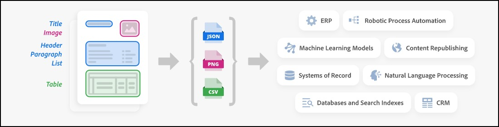

# Overview

**What is Extract?**

The PDF Extract API suite (included with the PDF Services API) is a cloud-based web service that uses Adobe's Sensei AI technology to automatically extract content and structural information from PDF documents – native or scanned. Two output formats are available:

- **Structured JSON output** ([Extract PDF](./howtos/extract-api.md)): Extracts content and structural information in JSON format
- **Markdown output** ([PDF to Markdown](./howtos/pdf-to-markdown-api.md)): Converts PDF content to well-formatted, LLM-friendly Markdown text

Both formats extract text, complex tables, and figures from PDF documents:

- Text is extracted in contextual blocks – paragraphs, headings, lists, footnotes, etc. – and includes font, styling, and other text formatting information.
- Tables are extracted and parsed with the contents and table formatting information delivered for each cell. The service automatically identifies table cells that span multiple rows or columns.
- For Extract JSON, Table data is delivered within the resulting JSON and can also optionally be output in CSV and XLSX files. Tables are also output as PNG images allowing the table data to be visually validated.

- Objects that are identified as figures or images are extracted as PNG files (Extract PDF), base64 files (PDF to Markdown).

## Choose Your Output Format

The PDF Extract API provides two distinct endpoints under the same product umbrella:

### JSON (Extract PDF)

Best for:
- Structured downstream processing
- Layout and structure analysis
- Detailed element type information
- Custom data extraction workflows
- Integration with data analysis systems

The JSON output captures document structure information, such as the natural reading order of the various extracted elements and the layout of the elements on each given page. Table data can optionally be delivered in CSV and XLSX files, and images are extracted as PNG files.

[Learn more about Extract PDF →](./howtos/extract-api.md)

### Markdown (PDF to Markdown)

Best for:
- LLM ingestion and prompt creation
- Training/Fine-tuning LLMs with PDF content
- Documentation workflows
- Content republishing and migration
- Modern documentation systems
- Searchable knowledge repositories

The Markdown output preserves document structure and reading order while converting content to a widely-used text format. Tables are converted to Markdown table syntax, and figures can be embedded as base64 images.

[Learn more about PDF to Markdown →](./howtos/pdf-to-markdown-api.md)

The PDF Extract API can be embedded into any application using the [PDFServices SDK](../pdf-extract-api/gettingstarted#sdk) for Node.js, Python, .NET and Java. [Start with a Free Tier which includes 500 free Document Transactions per month.](https://acrobatservices.adobe.com/dc-integration-creation-app-cdn/main.html?api=pdf-extract-api)

## Extract Process

