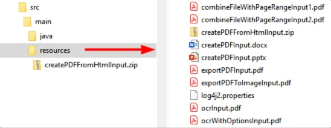
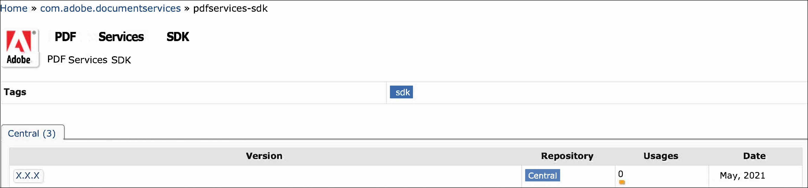
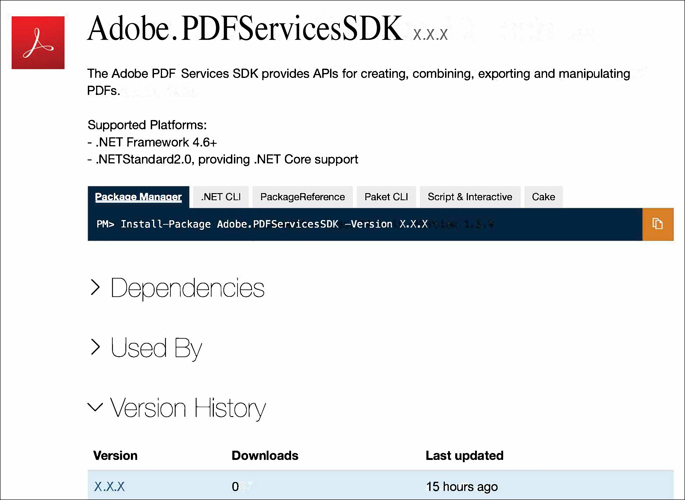
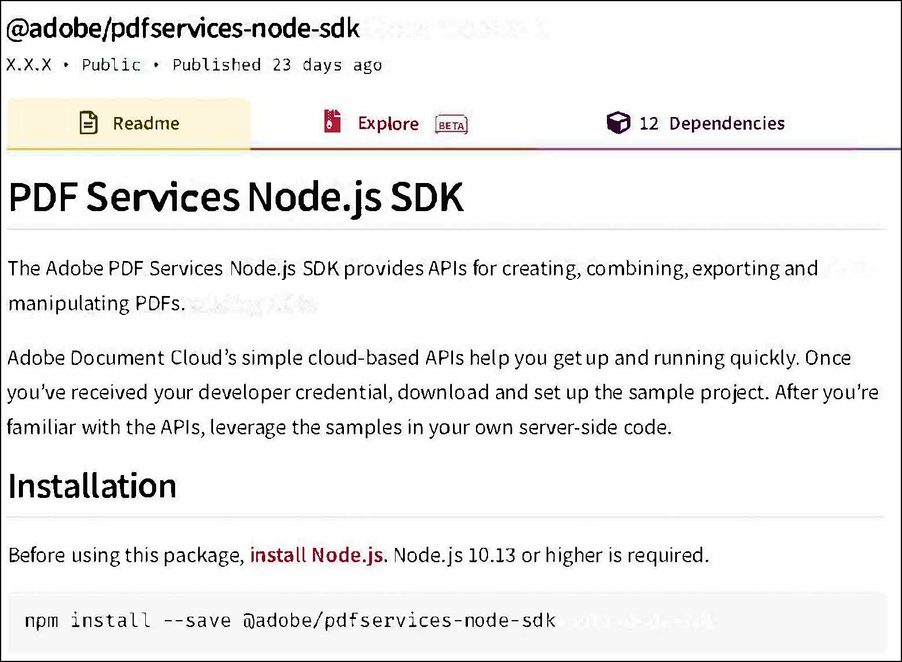
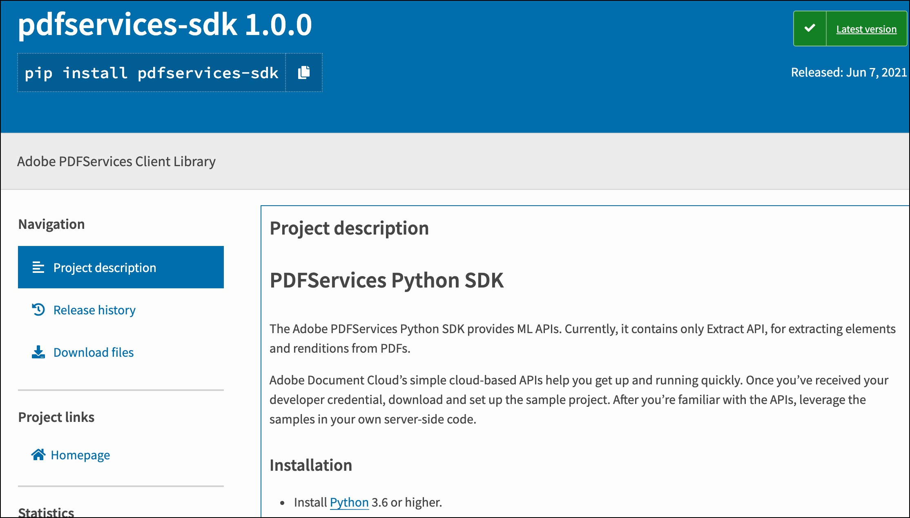

# Quickstarts
<p>
The PDF Extract API provides modern cloud-based capabilities for automatically extracting contents from PDF. The API is accessible through SDKs which help you get up and running quickly. Once you've received your developer credential, download and set up one of the sample projects. After you're familiar with the APIs, leverage the samples in your own server-side code.
</p>

<InlineAlert slots="text"/>

The SDK only supports server-based use cases where credentials are saved securely in a safe environment. SDK credentials should not be sent to untrusted environments or end user devices.


## Getting credentials

Developing with the PDF Services SDK requires an Adobe-provided credential. To get one, [click HERE](https://documentcloud.adobe.com/dc-integration-creation-app-cdn/main.html?api=pdf-extract-api), and complete the workflow. Be sure to copy and save the credential values to a secure location.

**Validity term**: The certificate associated with your credential is valid for one year. However, you can simply regenerate a new credential or apply a new certificate to the current credentials from the Document Cloud [developer console](https://console.adobe.io/).

<InlineAlert slots="text"/>

During the credential creation process you'll be asked to whether you'd like a **Personalized Code Sample Download**. Choosing *Personalized* preconfigures the samples with your credential and removes a few steps from your development setup process.

## SDK

PDF Services API is also accessible via SDKs in popular languages such as Node.js, Java , .NET and Python.

### Java

Jump start your development by bookmarking or downloading the following key resources:

-   This document
-   [API reference (Javadoc)](https://www.adobe.com/go/pdftoolsapi_java_docs)
-   [Java Sample code](https://www.adobe.com/go/pdftoolsapi_java_samples)
-   [Java library](https://www.adobe.com/go/pdftoolsapi_java_maven). The Maven project contains the .jar file.

#### Authentication

Once you complete the [Getting Credentials](quickstarts/#getting-credentials), a zip file automatically downloads that contains content whose structure varies based on whether you opted to download personalized code samples. The zip file structures are as follows:

-   **Personalized Download**: The samples download zip contains a private.key file and an adobe-dc-pdf-services-sdk-java-samples with a preconfigured pdfservices-api-credentials.json file.
-   **Non Personalized Download**: The samples download zip contains the private.key file and a pdfservices-api-credentials.json file.

After downloading the zip, you can either run the samples in the zip directly, or you can replace the pdfservices-api-credentials.json and private.key files in the [Java sample code](https://www.adobe.com/go/pdftoolsapi_java_samples) with those in the zip.

**Example pdfservices-api-credentials.json file**

```json 
{
 "client_credentials": {
   "client_id": "<YOUR_CLIENT_ID>",
   "client_secret": "<YOUR_CLIENT_SECRET>"
 },
 "service_account_credentials": {
   "organization_id": "<YOUR_ORGANIZATION_ID>",
   "account_id": "<YOUR_TECHNICAL_ACCOUNT_ID>",
   "private_key_file": "<PRIVATE_KEY_FILE_PATH>"
 }
}
```
    

#### Setup a Java environment

1.  Install [Java 8 or above](http://www.oracle.com/technetwork/java/javase/downloads/index.html).
2.  Run `javac -version` to verify your install.
3.  Verify the JDK bin folder is included in the PATH variable (method varies by OS).
4.  Install [Maven](https://maven.apache.org/install.html). You may use your preferred tool; for example:

-   **Windows**: Example: [Chocolatey](https://chocolatey.org/packages/maven).
-   **Macintosh**: Example: `brew install maven`.

<InlineAlert slots="text" />

Maven uses pom.xml to fetch pdfservices-sdk from the public Maven repository when running the project. The .jar automatically downloads when you build the sample project. Alternatively, you can download the pdfservices-sdk.jar file, and configure your own environment.

##### Option 1: Personalized samples setup

The quickest way to get up and running is to download the personalized code samples during the Getting Credentials workflow. These samples provide everything from ready-to-run sample code, an embedded credential json file, and pre-configured connections to dependencies.

1.  Download [the Java sample project](https://www.adobe.com/go/pdftoolsapi_java_samples).
2.  Build the sample project with Maven: `mvn clean install`.
3.  Test the sample code on the command line.
4.  Refer to this document for details about running samples as well as the API Reference for API details.

##### Option 2: Generic samples setup

If you did not choose **Personalized Code Sample Download** during the credential setup process:

1.  Download [the Java sample project](https://www.adobe.com/go/pdftoolsapi_java_samples).
2.  Find and replace pdfservices-api-credentials.json with the one present in the downloaded zip file.
3.  Find and replace private.key with the one present in the downloaded zip file.
4.  Build the sample project with Maven: `mvn clean install`.
5.  Test the sample code on the command line.
6.  Refer to this document for details about running samples as well as the API Reference for API details.

<InlineAlert slots="text" />

Command line execution is not mandatory. You can import the samples Maven project into your preferred IDE (e.g. IntelliJ/Eclipse) and run the samples from there.

#### Verifying download authenticity

For security reasons you may wish to confirm the installer's authenticity. To do so,

1.  After installing the package, navigate to the `.jar.sha1` file.
2.  Calculate the hash with any 3rd party utility.
3.  Find and open PDF Services sha1 file. Note: if you're using Maven, look in the .m2 directory.
4.  Verify the hash you generated matches the value in the .sha1 file.

```
25f4c2e3a119d51cf2f3e3df0db42052d77e0bea
```

#### Logging

Refer to the API docs for error and exception details.

-   For logging, use the [slf4j API](https://www.slf4j.org/) with a log4js-slf4j binding.
-   Logging configurations are provided in src/main/resources/log4js.properties.
-   Specify alternate bindings, if required, in pom.xml.

**log4js.properties file**

```properties
name=PropertiesConfig
appenders = console

# A sample console appender configuration, Clients can change as per their logging implementation
rootLogger.level = WARN
rootLogger.appenderRefs = stdout
rootLogger.appenderRef.stdout.ref = STDOUT

appender.console.type = Console
appender.console.name = STDOUT
appender.console.layout.type = PatternLayout
appender.console.layout.pattern = [%-5level] %d{yyyy-MM-dd HH:mm:ss.SSS} [%t] %c{1} - %msg%n

loggers = pdfservicessdk,validator,apache

# Change the logging levels as per need. INFO is recommended for pdfservices-sdk
logger.pdfservicessdk.name = com.adobe.pdfservices.operation
logger.pdfservicessdk.level = INFO
logger.pdfservicessdk.additivity = false
logger.pdfservicessdk.appenderRef.console.ref = STDOUT

logger.validator.name=org.hibernate
logger.validator.level=WARN

logger.apache.name=org.apache
logger.apache.level=WARN
```
   
#### Test files

The sample files reference input and output files located in the sample project's /resources/ directory. You can of course modify the files and paths or use your own files.



#### Custom projects

While the samples use Maven, you can use your own tools and process.

To build a custom project:

1.  Access the .jar in the [central Maven repository](https://www.adobe.com/go/pdftoolsapi_java_maven).
2.  Use your preferred dependency management tool (Ivy, Gradle, Maven), to include the SDK .jar dependency.
3.  Open the pdfservices-api-credentials.json downloaded when you created your credential.
4.  Add the [Authentication](./index.md#authentication) details as described above.



### .NET

Jumpstart your development by bookmarking or downloading the following key resources:

-   This document
-   [Nuget package](https://www.adobe.com/go/pdftoolsapi_net_nuget)
-   [.NET API reference](https://www.adobe.com/go/pdftoolsapi_net_docs)
-   [.NET Sample code](https://www.adobe.com/go/pdftoolsapi_net_samples)
-   Input/output test files reside in the their respective sample directories

#### Prerequisites

The samples project requires the following:

-   .NET Core: version 2.1 or above
-   A build Tool: Either Visual Studio or .NET Core CLI.

#### Authentication

Once you complete the [Getting Credentials](quickstarts/#getting-credentials), you will receive a zip file with content whose structure varies based on whether you opted to download personalized code samples. The zip file structures are as follows:

-   **Personalized Download**: The samples download zip contains a private.key file and an adobe-DC.PDFServices.SDK.NET.Samples directory. Each sample directory contains the sample code as well as a preconfigured pdfservices-api-credentials.json file.
-   **Non Personalized Download**: The samples download zip contains the private.key file and unconfigured pdfservices-api-credentials.json file.

After downloading the zip, you can either run the samples in the zip directly, or you can replace the pdfservices-api-credentials.json and private.key files in the [.NET sample code](https://www.adobe.com/go/pdftoolsapi_net_samples) with those in the zip.

**Example pdfservices-api-credentials.json file**

```json 
{
 "client_credentials": {
   "client_id": "<YOUR_CLIENT_ID>",
   "client_secret": "<YOUR_CLIENT_SECRET>"
 },
 "service_account_credentials": {
   "organization_id": "<YOUR_ORGANIZATION_ID>",
   "account_id": "<YOUR_TECHNICAL_ACCOUNT_ID>",
   "private_key_file": "<PRIVATE_KEY_FILE_PATH>"
 }
}
```
    

#### Set up a NET environment

Running any sample or custom code requires the following:

1.  Download and install the [.NET SDK](https://dotnet.microsoft.com/learn/dotnet/hello-world-tutorial/install).

<InlineAlert slots="text"/>

The Nuget package automatically downloads when you build the sample project.

##### Option 1: Personalized samples setup

The quickest way to get up and running is to download the personalized code samples during the Getting Credentials workflow. These samples provide everything from ready-to-run sample code, an embedded credential json file, and pre-configured connections to dependencies.

1.  Extract the downloaded samples .zip.
2.  From the samples directory, build the sample project: `dotnet build`.
3.  Test the sample code on the command line.
4.  Refer to this document for details about running samples as well as the API Reference for API details.

##### Option 2: Generic samples setup

If you did not choose **Personalized Code Sample Download** during the credential setup process:

1.  Clone or download the [samples project](https://www.adobe.com/go/pdftoolsapi_net_samples).
2.  Find and replace all occurrences of `pdfservices-api-credentials.json` and `private.key` files with the ones present in your PDFServicesSDK-Credentials.zip file.
3.  From the samples directory, build the sample project: `dotnet build`.
4.  Test the sample code on the command line.
5.  Refer to this document for details about running samples as well as the API Reference for API details.

#### Verifying download authenticity

For security reasons you may wish to confirm the installer's authenticity. To do so,

1.  After installing the Nuget package, navigate to the .nuget directory.
2.  Find and open the .sha512 file.
3.  Verify the hash in the downloaded file matches the value published here.

```
Gvvoj/xR59AuMAiy/vxxZpcyBWlfbEQuWdOEg6w/YeEPnkOcyNVpY9lJgbxLeg3QuoDmL9sMnHSuHuuBMtp6pw==
```

#### Logging

Refer to the API docs for error and exception details.

The .NET SDK uses [LibLog](https://github.com/damianh/LibLog) as a bridge between different logging frameworks. Log4net is used as a logging provider in the sample projects and the logging configurations are provided in log4net.config. Add the configuration for your preferred provider and set up the necessary appender as required to enable logging.

**log4net.config file**

```html
<log4net>
 <root>
   <level value="INFO" />
   <appender-ref ref="console" />
 </root>
 <appender name="console" type="log4net.Appender.ConsoleAppender">
   <layout type="log4net.Layout.PatternLayout">
     <conversionPattern value="%date %level %logger - %message%newline" />
   </layout>
 </appender>
</log4net>
```

#### Test files

Refer to each sample directory for the requisite input/output files.

#### Custom projects

While building the sample project automatically downloads the Nuget package, you can do it manually if you wish to use your own tools and process.

1.  Go to <https://www.adobe.com/go/pdftoolsapi_net_nuget>.
2.  Download the latest package.



### Node.js

Jumpstart your development by bookmarking or downloading the following key resources:

-   This document
-   [Node.js API reference](https://www.adobe.com/go/pdftoolsapi_node_docs)
-   [Node.js Sample code](http://www.adobe.com/go/pdftoolsapi_node_sample)
-   [Node.js SDK](http://www.adobe.com/go/pdftoolsapi_node_npm)

#### Authentication

Once you complete the [Getting Credentials](quickstarts/#getting-credentials), you will receive a zip file with content whose structure varies based on whether you opted to download personalized code samples. The zip file structures are as follows:

-   **Personalized Download**: The samples download.zip contains a private.key file and an adobe-dc-pdf-services-sdk-node-samples directory. Each sample directory contains the sample code as well as a preconfigured pdfservices-api-credentials.json file.
-   **Non Personalized Download**: The samples download zip contains the private.key file and unconfigured pdfservices-api-credentials.json file.

After downloading the zip, you can either run the samples in the zip directly, or you can replace the pdfservices-api-credentials.json and private.key files in the [Node.js sample code](http://www.adobe.com/go/pdftoolsapi_node_sample) with those in the zip.

**Example pdfservices-api-credentials.json file**

```json 
{
 "client_credentials": {
   "client_id": "<YOUR_CLIENT_ID>",
   "client_secret": "<YOUR_CLIENT_SECRET>"
 },
 "service_account_credentials": {
   "organization_id": "<YOUR_ORGANIZATION_ID>",
   "account_id": "<YOUR_TECHNICAL_ACCOUNT_ID>",
   "private_key_file": "<PRIVATE_KEY_FILE_PATH>"
 }
}
```
    

#### Set up a Node.js environment

Running any sample or custom code requires the following steps:

1.  Install [Node.js 10.13.0](https://nodejs.org/en/download/) or higher.

<InlineAlert slots="text"/>

The @adobe/pdfservices-node-sdk npm package automatically downloads when you build the sample project.

``` 
npm install --save @adobe/pdfservices-node-sdk
```

##### Option 1: Personalized samples setup

1.  Extract the downloaded samples .zip.
2.  From the samples root directory, run `npm install`.
3.  Test the sample code on the command line.
4.  Refer to this document for details about running samples as well as the API Reference for API details.

##### Option 2: Generic samples setup

If you did not choose **Personalized Code Sample Download** during the credential setup process:

1.  Download [the Node.js sample project](http://www.adobe.com/go/pdftoolsapi_node_sample).
2.  Find and replace all occurrences of `pdfservices-api-credentials.json` and `private.key` files with the ones present in your PDFServicesCredentials.zip file.
3.  From the samples root directory, run `npm install`.
4.  Test the sample code on the command line.
5.  Refer to this document for details about running samples as well as the API Reference for API details.

#### Verifying download authenticity

For security reasons you may wish to confirm the installer's authenticity. To do so,

1.  After installing the package, find and open package.json.
2.  Find the "\_integrity" key.
3.  Verify the hash in the downloaded file matches the value published here.

```
  sha512-8vKY2fJHMNAHYL4j9JDSYozCbcy7U4nDseVU9cO3HeDYi6DJb+vAumWwTK00jOYtBYl9icNH9sBdJ39BTdfdOA==
```

#### Logging

Refer to the API docs for error and exception details.

The SDK uses the [log4js API](https://www.npmjs.com/package/log4js) for logging. During execution, the SDK searches for config/pdfservices-sdk-log4js-config.json in the working directory and reads the logging properties from there. If you do not provide a configuration file, the default logging logs INFO to the console. Customize the logging settings as needed.

**log4js.properties file**

```json
{
  "appenders": {
    "consoleAppender": {
      "_comment": "A sample console appender configuration, Clients can change as per their logging implementation",
      "type": "console",
      "layout": {
        "type": "pattern",
        "pattern": "%d:[%p]: %m"
      }
    }
  },
  "categories": {
    "default": {
      "appenders": ["consoleAppender"],
      "_comment": "Change the logging levels as per need. info is recommended for pdfservices-node-sdk",
      "level": "info"
    }
  }
} 
```

#### Test files

The sample files reference input and output files located in the sample project’s [resource directory](https://github.com/adobe/pdfservices-node-sdk-samples/tree/master/resources). You can of course modify the files and paths or use your own files.

#### Custom projects

While building the sample project automatically downloads the Node package, you can do it manually if you wish to use your own tools and process.

1.  Go to <https://www.npmjs.com/package/@adobe/pdfservices-node-sdk>
2.  Download the latest package.



### Python

Jumpstart your development by bookmarking or downloading the following key resources:

-   [Python API reference](https://www.adobe.com/go/pdfservices_python_docs)
-   [Python Sample code](https://www.adobe.com/go/pdfservices_python_samples)
-   [Python SDK](https://www.adobe.com/go/pdfservices_python_pypi)

#### Authentication

Once you complete the [Getting Credentials](quickstarts/#getting-credentials), you will receive a zip file with content whose structure varies based on whether you opted to download personalized code samples. The zip file structures are as follows:

-   **Personalized Download**: The samples download.zip contains a private.key file and an adobe-dc-pdfservices-sdk-python-samples directory. Each sample directory contains the sample code as well as a preconfigured pdfservices-api-credentials.json file.
-   **Non Personalized Download**: The samples download zip contains the private.key file and unconfigured pdfservices-api-credentials.json file.

After downloading the zip, you can either run the samples in the zip directly, or you can replace the pdfservices-api-credentials.json and private.key files in the [Python sample code](http://www.adobe.com/go/pdfservices_python_samples) with those in the zip.

**Example pdfservices-api-credentials.json file**

```json 
{
  "client_credentials": {
     "client_id": " <YOUR_CLIENT_ID> ",
     "client_secret": " <YOUR_CLIENT_SECRET> "
  },
  "service_account_credentials": {
     "organization_id": " <YOUR_ORGANIZATION_ID> ",
     "account_id": " <YOUR_TECHINCAL_ACCOUNT_ID> ",
     "private_key_file": "private.key"
  }
}
```

#### Set up a Python environment

Running any sample or custom code requires the following steps:

1.  Install [Python 3.6](https://www.python.org/downloads/) or higher.

<InlineAlert slots="text" />

The pdfservices-sdk package automatically downloads when you build the sample project.

``` 
pip install pdfservices-sdk
```

##### Option 1: Personalized samples setup

1.  Extract the downloaded samples .zip.
2.  From the samples root directory, run `pip install -r requirements.txt`.
3.  Test the sample code on the command line.
4.  Refer to the [How Tos](../pdf-extract-api/howtos) for details about running samples. Additional details also reside in the [API documentation](https://www.adobe.com/go/pdfservices_python_docs).

##### Option 2: Generic samples setup

1.  Download [the Python sample project](https://github.com/adobe/pdfservices-python-sdk-samples).
2.  Replace `pdfservices-api-credentials.json` & `private.key` with the zipped files within ZIP sent by Adobe.
3.  From the samples root directory, run `pip install -r requirements.txt`.
4.  Test the sample code on the command line.
5.  Refer to the [How Tos](../pdf-extract-api/howtos) for details about running samples. Additional details also reside in the [API documentation](https://www.adobe.com/go/pdfservices_python_docs).

#### Verifying download authenticity

For security reasons you may wish to confirm the installer's authenticity. To do so,

1.  After downloading the package zip, run following command

```
pip hash <download_dir>/pdfservices-sdk-1.0.0.tar.gz
```

1.  Above command will return the hash of downloaded package.
2.  Verify the hash matches the value published here.

```
sha256-0b6a43399d2d40ee4f6eb0d30561874c5186d72672828d89791704a9027f2b92
```

#### Logging

Refer to the API docs for error and exception details.

The SDK uses the Python standard logging module. Customize the logging settings as needed.

**Default Logging Config**

``` 
logging.getLogger(__name__).addHandler(logging.NullHandler())
```

#### Test files

Refer to each sample project's [resource directory](https://github.com/adobe/pdfservices-python-sdk-samples/tree/master/resources) for the requisite input/output files.

#### Custom projects

While building the sample project automatically downloads the Python package, you can do it manually if you wish to use your own tools and process.

1.  Go to <https://pypi.org/project/pdfservices-sdk/>
2.  Download the latest package.



## Public API

PDF Services API is accessible directly via REST APIs which requires Adobe-provided credential for authentication. Once you've completed the [Getting Credentials](quickstarts/#getting-credentials) workflow, a zip file automatically downloads that contains content whose structure varies based on whether you opted to download personalized code samples. The zip file structures are as follows:

-   **Personalized Download**: The samples download zip contains a private.key file and a samples folder with a preconfigured pdfservices-api-credentials.json file.
-   **Non Personalized Download**: The samples download zip contains the private.key file and a pdfservices-api-credentials.json file.

After downloading the zip, private.key and credentials info in pdfservices-api-credentials.json can be used to call REST APIs directly per the instructions mentioned in [Public API Docs](https://documentcloud.adobe.com/document-services/index.html#how-to-get-started-) under Sub-Section (Introduction -\> How to get started?)

**Example pdfservices-api-credentials.json file**

```json 
{
 "client_credentials": {
   "client_id": "<YOUR_CLIENT_ID>",
   "client_secret": "<YOUR_CLIENT_SECRET>"
 },
 "service_account_credentials": {
   "organization_id": "<YOUR_ORGANIZATION_ID>",
   "account_id": "<YOUR_TECHNICAL_ACCOUNT_ID>",
   "private_key_file": "<PRIVATE_KEY_FILE_PATH>"
 }
}
```

