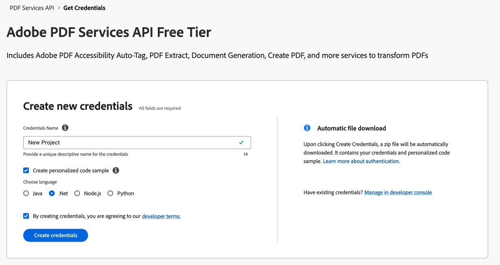
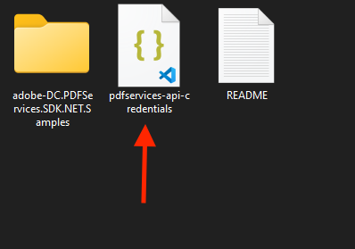
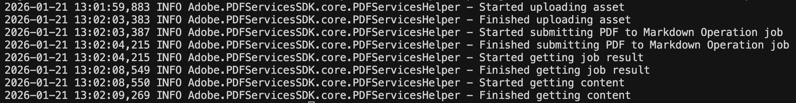

# Quickstart for PDF to Markdown API (.NET)

To get started using Adobe PDF to Markdown API, let's walk through a simple scenario - taking an input PDF document and extracting its elements into Markdown format. Once the PDF has been converted, we'll save the Markdown output. In this guide, we will walk you through the complete process for creating a program that will accomplish this task. 

## Prerequisites

To complete this guide, you will need:

* [.NET: version 8.0 or above](https://dotnet.microsoft.com/en-us/download)
* [.Net SDK](https://dotnet.microsoft.com/en-us/download/dotnet/8.0)
* A build tool: Either Visual Studio or .NET Core CLI.
* An Adobe ID. If you do not have one, the credential setup will walk you through creating one.
* A way to edit code. No specific editor is required for this guide.
  
## Step One: Getting credentials

1) To begin, open your browser to <https://acrobatservices.adobe.com/dc-integration-creation-app-cdn/main.html?api=pdf-extract-api>. If you are not already logged in to Adobe.com, you will need to sign in or create a new user. Using a personal email account is recommend and not a federated ID.


2) After registering or logging in, you will then be asked to name your new credentials. Use the name, "New Project". 

3) Change the "Choose language" setting to ".Net". 

4) Also note the checkbox by, "Create personalized code sample." This will include a large set of samples along with your credentials. These can be helpful for learning more later. 

5) Click the checkbox saying you agree to the developer terms and then click "Create credentials."



6) After your credentials are created, they are automatically  downloaded:


## Step Two: Setting up the project

1) In your Downloads folder, find the ZIP file with your credentials: PDFServicesSDK-.NetSamples.zip. If you unzip that archive, you will find a folder of samples and the `pdfservices-api-credentials.json` file.



2) Take the `pdfservices-api-credentials.json` file and place it in a new directory.

3) In your new directory, create a new file, `PDFToMarkdown.csproj`. This file will declare our requirements as well as help define the application we're creating.

```xml
<Project Sdk="Microsoft.NET.Sdk">

    <PropertyGroup>
        <OutputType>Exe</OutputType>
        <TargetFramework>net8.0</TargetFramework>
    </PropertyGroup>

    <ItemGroup>
        <PackageReference Include="Adobe.PDFServicesSDK" Version="4.4.0" />
        <PackageReference Include="log4net" Version="3.2.0" />
    </ItemGroup>

    <ItemGroup>
        <None Update="Adobe Extract API Sample.pdf">
            <CopyToOutputDirectory>Always</CopyToOutputDirectory>
        </None>
        <None Update="log4net.config">
            <CopyToOutputDirectory>Always</CopyToOutputDirectory>
        </None>
    </ItemGroup>

</Project>
```

This file will define what dependencies we need and how the application will be built.

Our application will take a PDF, `Adobe Extract API Sample.pdf` (downloadable from [here](/
Adobe%20Extract%20API%20Sample.pdf)) and extract it's contents. The results will be saved as a `.md` file with a timestamp in the filename.

4) In your editor, open the directory where you previously copied the credentials and created the `csproj` file. Create a new file, `Program.cs`. 

Now you're ready to begin coding.

## Step Three: Creating the application

1) We'll begin by including our required dependencies:

```javascript
using System;
using System.IO;
using System.Reflection;
using Adobe.PDFServicesSDK;
using Adobe.PDFServicesSDK.auth;
using Adobe.PDFServicesSDK.exception;
using Adobe.PDFServicesSDK.io;
using Adobe.PDFServicesSDK.pdfjobs.jobs;
using Adobe.PDFServicesSDK.pdfjobs.parameters.pdftomarkdown;
using Adobe.PDFServicesSDK.pdfjobs.results;
using log4net;
using log4net.Config;
using log4net.Repository;
```

2) Now let's define our main class and `Main` method:

```javascript
namespace PDFToMarkdown
{
    class Program
    {
        private static readonly ILog log = LogManager.GetLogger(typeof(Program));
        static void Main()
        {
            
        }
    }
}
```

3) Set the environment variables `PDF_SERVICES_CLIENT_ID` and `PDF_SERVICES_CLIENT_SECRET` by running the following commands and replacing placeholders `YOUR CLIENT ID` and `YOUR CLIENT SECRET` with the credentials present in `pdfservices-api-credentials.json` file:
- **Windows:**
  - `set PDF_SERVICES_CLIENT_ID=<YOUR CLIENT ID>`
  - `set PDF_SERVICES_CLIENT_SECRET=<YOUR CLIENT SECRET>`

- **MacOS/Linux:**
  - `export PDF_SERVICES_CLIENT_ID=<YOUR CLIENT ID>`
  - `export PDF_SERVICES_CLIENT_SECRET=<YOUR CLIENT SECRET>`

4) Next, we can create our credentials and use them to create a PDF Services instance

```javascript
// Initial setup, create credentials instance
ICredentials credentials = new ServicePrincipalCredentials(
        Environment.GetEnvironmentVariable("PDF_SERVICES_CLIENT_ID"),
        Environment.GetEnvironmentVariable("PDF_SERVICES_CLIENT_SECRET"));

// Creates a PDF Services instance
PDFServices pdfServices = new PDFServices(credentials);
```

5) Now, let's upload the asset:

```javascript
// Creates an asset from source file and upload
using Stream inputStream = File.OpenRead(@"Adobe Extract API Sample.pdf");
IAsset asset = pdfServices.Upload(inputStream, PDFServicesMediaType.PDF.GetMIMETypeValue());
```

We define what PDF will be converted. In a real application, these values would typically be dynamic.

6) Now, let's create the job:

```javascript
// Create parameters for the job
PDFToMarkdownParams pdfToMarkdownParams = new PDFToMarkdownParams.Builder()
        .WithGetFigures(true)
        .Build();

// Creates a new job instance
PDFToMarkdownJob pdfToMarkdownJob = new PDFToMarkdownJob(asset)
        .SetParams(pdfToMarkdownParams);
```

This set of code defines what we're doing (a PDF to Markdown conversion operation). The `WithGetFigures(true)` option will extract figures and images as base64-embedded images in the Markdown output.

7) The next code block submits the job and gets the job result:

```javascript
// Submits the job and gets the job result
String location = pdfServices.Submit(pdfToMarkdownJob);
PDFServicesResponse<PDFToMarkdownResult> pdfServicesResponse =
        pdfServices.GetJobResult<PDFToMarkdownResult>(location, typeof(PDFToMarkdownResult));

// Get content from the resulting asset(s)
IAsset resultAsset = pdfServicesResponse.Result.Asset;
StreamAsset streamAsset = pdfServices.GetContent(resultAsset);
```

This code runs the PDF to Markdown conversion process and gets the content of the result asset.

8) The next code block saves the result at the specified location:

```javascript
// Creating output file path with timestamp
String outputFilePath = CreateOutputFilePath();
new FileInfo(Directory.GetCurrentDirectory() + outputFilePath).Directory.Create();
Stream outputStream = File.OpenWrite(Directory.GetCurrentDirectory() + outputFilePath);
streamAsset.Stream.CopyTo(outputStream);
outputStream.Close();
```

9) Add a helper method to create the output file path with a timestamp:

```javascript
private static String CreateOutputFilePath()
{
    String timeStamp = DateTime.Now.ToString("yyyy'-'MM'-'dd'T'HH'-'mm'-'ss");
    return ("/output/pdfToMarkdown" + timeStamp + ".md");
}
```



Here's the complete application (`Program.cs`):

```javascript
using System;
using System.IO;
using System.Reflection;
using Adobe.PDFServicesSDK;
using Adobe.PDFServicesSDK.auth;
using Adobe.PDFServicesSDK.exception;
using Adobe.PDFServicesSDK.io;
using Adobe.PDFServicesSDK.pdfjobs.jobs;
using Adobe.PDFServicesSDK.pdfjobs.parameters.pdftomarkdown;
using Adobe.PDFServicesSDK.pdfjobs.results;
using log4net;
using log4net.Config;
using log4net.Repository;

namespace PDFToMarkdown
{
    class Program
    {
        private static readonly ILog log = LogManager.GetLogger(typeof(Program));
        
        static void Main()
        {
            ConfigureLogging();
            try
            {
                ICredentials credentials = new ServicePrincipalCredentials(
                    Environment.GetEnvironmentVariable("PDF_SERVICES_CLIENT_ID"),
                    Environment.GetEnvironmentVariable("PDF_SERVICES_CLIENT_SECRET"));

                PDFServices pdfServices = new PDFServices(credentials);

                using Stream inputStream = File.OpenRead(@"pdfToMarkdownInput.pdf");
                IAsset asset = pdfServices.Upload(inputStream, PDFServicesMediaType.PDF.GetMIMETypeValue());

                PDFToMarkdownParams pdfToMarkdownParams = new PDFToMarkdownParams.Builder()
                    .WithGetFigures(true)
                    .Build();

                PDFToMarkdownJob pdfToMarkdownJob = new PDFToMarkdownJob(asset)
                    .SetParams(pdfToMarkdownParams);

                String location = pdfServices.Submit(pdfToMarkdownJob);
                PDFServicesResponse<PDFToMarkdownResult> pdfServicesResponse =
                    pdfServices.GetJobResult<PDFToMarkdownResult>(location, typeof(PDFToMarkdownResult));

                IAsset resultAsset = pdfServicesResponse.Result.Asset;
                StreamAsset streamAsset = pdfServices.GetContent(resultAsset);

                String outputFilePath = CreateOutputFilePath();
                new FileInfo(Directory.GetCurrentDirectory() + outputFilePath).Directory.Create();
                Stream outputStream = File.OpenWrite(Directory.GetCurrentDirectory() + outputFilePath);
                streamAsset.Stream.CopyTo(outputStream);
                outputStream.Close();
            }
            catch (ServiceUsageException ex)
            {
                log.Error("Exception encountered while executing operation", ex);
            }
            catch (ServiceApiException ex)
            {
                log.Error("Exception encountered while executing operation", ex);
            }
            catch (SDKException ex)
            {
                log.Error("Exception encountered while executing operation", ex);
            }
            catch (IOException ex)
            {
                log.Error("Exception encountered while executing operation", ex);
            }
            catch (Exception ex)
            {
                log.Error("Exception encountered while executing operation", ex);
            }
        }

        static void ConfigureLogging()
        {
            ILoggerRepository logRepository = LogManager.GetRepository(Assembly.GetEntryAssembly());
            XmlConfigurator.Configure(logRepository, new FileInfo("log4net.config"));
        }

        private static String CreateOutputFilePath()
        {
            String timeStamp = DateTime.Now.ToString("yyyy'-'MM'-'dd'T'HH'-'mm'-'ss");
            return ("/output/pdfToMarkdown" + timeStamp + ".md");
        }
    }
}
```

## Next Steps

Now that you've successfully performed your first operation, [review the documentation](https://developer.adobe.com/document-services/docs/overview/pdf-services-api/) for many other examples and reach out on our [forums](https://community.adobe.com/t5/document-services-apis/ct-p/ct-Document-Cloud-SDK) with any questions. Also remember the samples you downloaded while creating your credentials also have many demos.
