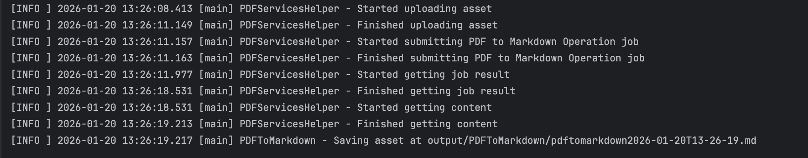

# Quickstart for PDF to Markdown API (Java)

To get started using Adobe PDF to Markdown API, let's walk through a simple scenario - taking an input PDF document and extracting its elements into Markdown format. Once the PDF has been converted, we'll save the Markdown output. In this guide, we will walk you through the complete process for creating a program that will accomplish this task. 

## Prerequisites

To complete this guide, you will need:

* [Java](http://www.oracle.com/technetwork/java/javase/downloads/index.html) - Java 11 or higher is required. 
* [Maven](https://maven.apache.org/install.html)
* An Adobe ID. If you do not have one, the credential setup will walk you through creating one.
* A way to edit code. No specific editor is required for this guide.

## Step One: Getting credentials

1) To begin, open your browser to <https://acrobatservices.adobe.com/dc-integration-creation-app-cdn/main.html?api=pdf-extract-api>. If you are not already logged in to Adobe.com, you will need to sign in or create a new user. Using a personal email account is recommend and not a federated ID.


2) After registering or logging in, you will then be asked to name your new credentials. Use the name, "New Project". 

3) Change the "Choose language" setting to "Java". 

4) Also note the checkbox by, "Create personalized code sample." This will include a large set of samples along with your credentials. These can be helpful for learning more later. 

5) Click the checkbox saying you agree to the developer terms and then click "Create credentials."


6) After your credentials are created, they are automatically  downloaded:


## Step Two: Setting up the project

1) In your Downloads folder, find the ZIP file with your credentials: PDFServicesSDK-JavaSamples.zip. If you unzip that archive, you will find a folder of samples and the `pdfservices-api-credentials.json` file.


2) Take the `pdfservices-api-credentials.json` file and place it in a new directory.

3) In this directory, create a new file named `pom.xml` and copy the following content:

```xml
<?xml version="1.0" encoding="UTF-8"?>

<project xmlns="http://maven.apache.org/POM/4.0.0"
         xmlns:xsi="http://www.w3.org/2001/XMLSchema-instance"
         xsi:schemaLocation="http://maven.apache.org/POM/4.0.0 http://maven.apache.org/xsd/maven-4.0.0.xsd">
  <modelVersion>4.0.0</modelVersion>

  <groupId>com.adobe.documentservices</groupId>
  <artifactId>pdfservices-sdk-extract-guide</artifactId>
  <version>1</version>

  <name>PDF Services Java SDK Samples</name>

  <properties>
    <project.build.sourceEncoding>UTF-8</project.build.sourceEncoding>
    <maven.compiler.source>11</maven.compiler.source>
    <maven.compiler.target>11</maven.compiler.target>
    <pdfservices.sdk.version>4.3.0</pdfservices.sdk.version>
  </properties>

  <dependencies>

    <dependency>
      <groupId>com.adobe.documentservices</groupId>
      <artifactId>pdfservices-sdk</artifactId>
      <version>${pdfservices.sdk.version}</version>
    </dependency>

    <!--		log4j2 dependency to showcase the use of log4j2 with slf4j API-->
    <!-- https://mvnrepository.com/artifact/org.slf4j/slf4j-log4j12 -->
    <dependency>
      <groupId>org.apache.logging.log4j</groupId>
      <artifactId>log4j-slf4j-impl</artifactId>
      <version>2.21.1</version>
    </dependency>
  </dependencies>

  <build>
    <plugins>
      <plugin>
        <groupId>org.apache.maven.plugins</groupId>
        <artifactId>maven-compiler-plugin</artifactId>
        <version>3.8.0</version>
        <configuration>
          <source>${maven.compiler.source}</source>
          <target>${maven.compiler.target}</target>
        </configuration>
      </plugin>
      <plugin>
        <groupId>org.codehaus.mojo</groupId>
        <artifactId>exec-maven-plugin</artifactId>
        <version>1.5.0</version>
        <executions>
          <execution>
            <goals>
              <goal>java</goal>
            </goals>
          </execution>
        </executions>
      </plugin>
    </plugins>
  </build>
</project>
```

This file will define what dependencies we need and how the application will be built. 

Our application will take a PDF, `Adobe Extract API Sample.pdf` (downloadable from [here](/
Adobe%20Extract%20API%20Sample.pdf)) and extract it's contents. The results will be saved as a `.md` file with a timestamp in the filename.

4) In your editor, open the directory where you previously copied the credentials, and create a new directory, `src/main/java`. In that directory, create `PDFToMarkdown.java`. 

Now you're ready to begin coding.

## Step Three: Creating the application

1) We'll begin by including our required dependencies:

```javascript
import com.adobe.pdfservices.operation.PDFServices;
import com.adobe.pdfservices.operation.PDFServicesMediaType;
import com.adobe.pdfservices.operation.PDFServicesResponse;
import com.adobe.pdfservices.operation.auth.Credentials;
import com.adobe.pdfservices.operation.auth.ServicePrincipalCredentials;
import com.adobe.pdfservices.operation.exception.SDKException;
import com.adobe.pdfservices.operation.exception.ServiceApiException;
import com.adobe.pdfservices.operation.exception.ServiceUsageException;
import com.adobe.pdfservices.operation.io.Asset;
import com.adobe.pdfservices.operation.io.StreamAsset;
import com.adobe.pdfservices.operation.pdfjobs.jobs.PDFToMarkdownJob;
import com.adobe.pdfservices.operation.pdfjobs.result.PDFToMarkdownResult;
import org.apache.commons.io.IOUtils;
import org.slf4j.Logger;
import org.slf4j.LoggerFactory;

import java.io.File;
import java.io.IOException;
import java.io.InputStream;
import java.io.OutputStream;
import java.nio.file.Files;
import java.nio.file.Paths;
import java.time.LocalDateTime;
import java.time.format.DateTimeFormatter;
```

2) Now let's define our main class:

```javascript
public class PDFToMarkdown {

    private static final Logger LOGGER = LoggerFactory.getLogger(PDFToMarkdown.class);

    public static void main(String[] args) {

	}
}
```

3) Set the environment variables `PDF_SERVICES_CLIENT_ID` and `PDF_SERVICES_CLIENT_SECRET` by running the following commands and replacing placeholders `YOUR CLIENT ID` and `YOUR CLIENT SECRET` with the credentials present in `pdfservices-api-credentials.json` file:
- **Windows:**
    - `set PDF_SERVICES_CLIENT_ID=<YOUR CLIENT ID>`
    - `set PDF_SERVICES_CLIENT_SECRET=<YOUR CLIENT SECRET>`

- **MacOS/Linux:**
    - `export PDF_SERVICES_CLIENT_ID=<YOUR CLIENT ID>`
    - `export PDF_SERVICES_CLIENT_SECRET=<YOUR CLIENT SECRET>`

4) Next, we can create our credentials and use them to create a PDF Services instance

```javascript
// Initial setup, create credentials instance
Credentials credentials = new ServicePrincipalCredentials(
        System.getenv("PDF_SERVICES_CLIENT_ID"),
        System.getenv("PDF_SERVICES_CLIENT_SECRET"));

// Create PDF Services instance
PDFServices pdfServices = new PDFServices(credentials);
```

5) Now, let's upload the asset:

```javascript
// Creates an asset from source file and upload
Asset asset = pdfServices.upload(inputStream, PDFServicesMediaType.PDF.getMediaType());
```

We define what PDF will be converted. In a real application, these values would typically be dynamic.

6) Now, let's create the job:

```javascript
// Creates a new job instance
PDFToMarkdownJob pdfToMarkdownJob = new PDFToMarkdownJob(asset);
```

This code creates a PDF to Markdown conversion job. The job will convert the PDF content to Markdown format, preserving document structure and formatting. 

7) The next code block submits the job and gets the job result:

```javascript
// Submit the job and gets the job result
String location = pdfServices.submit(pdfToMarkdownJob);
PDFServicesResponse<PDFToMarkdownResult> pdfServicesResponse = pdfServices.getJobResult(location, PDFToMarkdownResult.class);

// Get content from the resulting asset
Asset resultAsset = pdfServicesResponse.getResult().getAsset();
StreamAsset streamAsset = pdfServices.getContent(resultAsset);
```

This code runs the PDF to Markdown conversion process and gets the content of the result asset.

8) The next code block saves the result at the specified location:

```javascript
// Creates an output stream and copy stream asset's content to it
String outputFilePath = createOutputFilePath();
LOGGER.info(String.format("Saving asset at %s", outputFilePath));

OutputStream outputStream = Files.newOutputStream(new File(outputFilePath).toPath());
IOUtils.copy(streamAsset.getInputStream(), outputStream);
outputStream.close();
```

9) Add a helper method to create the output file path with a timestamp:

```javascript
// Generates a string containing a directory structure and file name for the output file
public static String createOutputFilePath() throws IOException {
    DateTimeFormatter dateTimeFormatter = DateTimeFormatter.ofPattern("yyyy-MM-dd'T'HH-mm-ss");
    LocalDateTime now = LocalDateTime.now();
    String timeStamp = dateTimeFormatter.format(now);
    Files.createDirectories(Paths.get("output/PDFToMarkdown"));
    return ("output/PDFToMarkdown/pdftomarkdown" + timeStamp + ".md");
}
```



Here's the complete application (`src/main/java/PDFToMarkdown.java`):

```javascript
import com.adobe.pdfservices.operation.PDFServices;
import com.adobe.pdfservices.operation.PDFServicesMediaType;
import com.adobe.pdfservices.operation.PDFServicesResponse;
import com.adobe.pdfservices.operation.auth.Credentials;
import com.adobe.pdfservices.operation.auth.ServicePrincipalCredentials;
import com.adobe.pdfservices.operation.exception.SDKException;
import com.adobe.pdfservices.operation.exception.ServiceApiException;
import com.adobe.pdfservices.operation.exception.ServiceUsageException;
import com.adobe.pdfservices.operation.io.Asset;
import com.adobe.pdfservices.operation.io.StreamAsset;
import com.adobe.pdfservices.operation.pdfjobs.jobs.PDFToMarkdownJob;
import com.adobe.pdfservices.operation.pdfjobs.result.PDFToMarkdownResult;
import org.apache.commons.io.IOUtils;
import org.slf4j.Logger;
import org.slf4j.LoggerFactory;

import java.io.File;
import java.io.IOException;
import java.io.InputStream;
import java.io.OutputStream;
import java.nio.file.Files;
import java.nio.file.Paths;
import java.time.LocalDateTime;
import java.time.format.DateTimeFormatter;

public class PDFToMarkdown {

    // Initialize the logger
    private static final Logger LOGGER = LoggerFactory.getLogger(PDFToMarkdown.class);

    public static void main(String[] args) {

        try (InputStream inputStream = Files.newInputStream(new File("src/main/resources/pdfToMarkdownInput.pdf").toPath())) {
            // Initial setup, create credentials instance
            Credentials credentials = new ServicePrincipalCredentials(System.getenv("PDF_SERVICES_CLIENT_ID"), System.getenv("PDF_SERVICES_CLIENT_SECRET"));

            // Creates a PDF Services instance
            PDFServices pdfServices = new PDFServices(credentials);

            // Creates an asset from source file and upload
            Asset asset = pdfServices.upload(inputStream, PDFServicesMediaType.PDF.getMediaType());

            // Creates a new job instance
            PDFToMarkdownJob pdfToMarkdownJob = new PDFToMarkdownJob(asset);

            // Submit the job and gets the job result
            String location = pdfServices.submit(pdfToMarkdownJob);
            PDFServicesResponse<PDFToMarkdownResult> pdfServicesResponse = pdfServices.getJobResult(location, PDFToMarkdownResult.class);

            // Get content from the resulting asset
            Asset resultAsset = pdfServicesResponse.getResult().getAsset();
            StreamAsset streamAsset = pdfServices.getContent(resultAsset);

            // Creates an output stream and copy stream asset's content to it
            String outputFilePath = createOutputFilePath();
            LOGGER.info(String.format("Saving asset at %s", outputFilePath));

            OutputStream outputStream = Files.newOutputStream(new File(outputFilePath).toPath());
            IOUtils.copy(streamAsset.getInputStream(), outputStream);
            outputStream.close();
        } catch (ServiceApiException | IOException | SDKException | ServiceUsageException ex) {
            LOGGER.error("Exception encountered while executing operation", ex);
        }
    }

    // Generates a string containing a directory structure and file name for the output file
    public static String createOutputFilePath() throws IOException {
        DateTimeFormatter dateTimeFormatter = DateTimeFormatter.ofPattern("yyyy-MM-dd'T'HH-mm-ss");
        LocalDateTime now = LocalDateTime.now();
        String timeStamp = dateTimeFormatter.format(now);
        Files.createDirectories(Paths.get("output/PDFToMarkdown"));
        return ("output/PDFToMarkdown/pdftomarkdown" + timeStamp + ".md");
    }
}
```

## Next Steps

Now that you've successfully performed your first operation, [review the documentation](https://developer.adobe.com/document-services/docs/overview/pdf-services-api/) for many other examples and reach out on our [forums](https://community.adobe.com/t5/document-services-apis/ct-p/ct-Document-Cloud-SDK) with any questions. Also remember the samples you downloaded while creating your credentials also have many demos.
