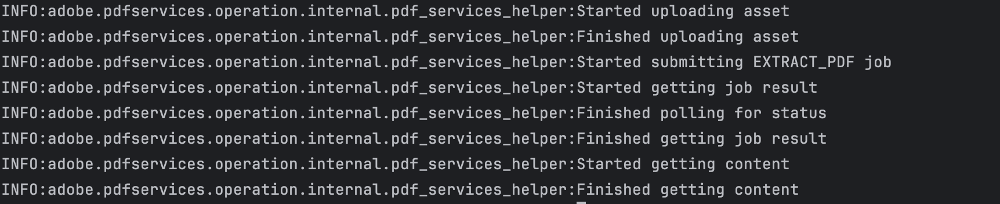

# Getting Started with PDF Extract API (Python)

To get started using Adobe PDF Extract API, let's walk through a simple scenario - taking an input PDF document and running PDF Extract API against it. Once the PDF has been extracted, we'll parse the results and report on any major headers in the document. In this guide, we will walk you through the complete process for creating a program that will accomplish this task. 

## Prerequisites

To complete this guide, you will need:

* [Python](https://www.python.org/downloads/) - Python 3.10 or higher is required.
* An Adobe ID. If you do not have one, the credential setup will walk you through creating one.
* A way to edit code. No specific editor is required for this guide.


## Step One: Getting credentials

1) To begin, open your browser to <https://acrobatservices.adobe.com/dc-integration-creation-app-cdn/main.html?api=pdf-extract-api>. If you are not already logged in to Adobe.com, you will need to sign in or create a new user. Using a personal email account is recommend and not a federated ID.


2) After registering or logging in, you will then be asked to name your new credentials. Use the name, "New Project". 

3) Change the "Choose language" setting to "Python". 

4) Also note the checkbox by, "Create personalized code sample." This will include a large set of samples along with your credentials. These can be helpful for learning more later. 

5) Click the checkbox saying you agree to the developer terms and then click "Create credentials."


6) After your credentials are created, they are automatically  downloaded:


## Step Two: Setting up the project

1) In your Downloads folder, find the ZIP file with your credentials: PDFServicesSDK-Python Samples.zip. If you unzip that archive, you will find a README file, a folder of samples and the `pdfservices-api-credentials.json` file.


2) Take the `pdfservices-api-credentials.json` file and place it in a new directory. Remember that these credential files are important and should be stored safely.

3) At the command line, change to the directory you created, and run the following command to install the Python SDK: `pip install pdfservices-sdk`.


At this point, we've installed the Python SDK for Adobe PDF Services API as a dependency for our project and have copied over our credentials files.

Our application will take a PDF, `Adobe Extract API Sample.pdf` (downloadable from [here](/Adobe%20Extract%20API%20Sample.pdf) and extract it's contents. The results will be saved as a ZIP file, `ExtractTextInfoFromPDF.zip`. We will then parse the results from the ZIP and print out the text of any `H1` headers found in the PDF.

4) In your editor, open the directory where you previously copied the credentials. Create a new file, `extract.py`.

Now you're ready to begin coding.

## Step Three: Creating the application

1) We'll begin by including our required dependencies:

```python
import os
from datetime import datetime

from adobe.pdfservices.operation.auth.service_principal_credentials import ServicePrincipalCredentials
from adobe.pdfservices.operation.exception.exceptions import ServiceApiException, ServiceUsageException, SdkException
from adobe.pdfservices.operation.io.cloud_asset import CloudAsset
from adobe.pdfservices.operation.io.stream_asset import StreamAsset
from adobe.pdfservices.operation.pdf_services import PDFServices
from adobe.pdfservices.operation.pdf_services_media_type import PDFServicesMediaType
from adobe.pdfservices.operation.pdfjobs.jobs.extract_pdf_job import ExtractPDFJob
from adobe.pdfservices.operation.pdfjobs.params.extract_pdf.extract_element_type import ExtractElementType
from adobe.pdfservices.operation.pdfjobs.params.extract_pdf.extract_pdf_params import ExtractPDFParams
from adobe.pdfservices.operation.pdfjobs.result.extract_pdf_result import ExtractPDFResult
```

The first set of imports bring in the Adobe PDF Extract SDK while the second set will be used by our code later on.

2) Now let's define our input and output:

```python
zip_file = "./ExtractTextInfoFromPDF.zip"

if os.path.isfile(zip_file):
	os.remove(zip_file)

input_pdf = "./extractPdfInput.pdf"
```

This defines what our output ZIP will be and optionally deletes it if it already exists. Then we define what PDF will be extracted. (You can download the source we used [here](/Adobe%20Extract%20API%20Sample.pdf).) In a real application, these values would be typically be dynamic. 

3) Next, we setup the SDK to use our credentials.

```python
# Initial setup, create credentials instance
credentials = ServicePrincipalCredentials(
    client_id=os.getenv('PDF_SERVICES_CLIENT_ID'),
    client_secret=os.getenv('PDF_SERVICES_CLIENT_SECRET')
)
```

This code both points to the credentials downloaded previously as well as sets up an execution context object that will be used later.

4) Now, let's create the operation:

```python
# Creates a PDF Services instance
pdf_services = PDFServices(credentials=credentials)

# Creates an asset(s) from source file(s) and upload
input_asset = pdf_services.upload(input_stream=input_stream, mime_type=PDFServicesMediaType.PDF)

# Create parameters for the job
extract_pdf_params = ExtractPDFParams(
    elements_to_extract=[ExtractElementType.TEXT],
)

# Creates a new job instance
extract_pdf_job = ExtractPDFJob(input_asset=input_asset, extract_pdf_params=extract_pdf_params)
```

This set of code defines what we're doing (an Extract operation), points to our local file and specifies the input is a PDF, and then defines options for the Extract call. PDF Extract API has a few different options, but in this example, we're simply asking for the most basic of extractions, the textual content of the document. 

5) The next code block executes the operation:

```python
# Submit the job and gets the job result
location = pdf_services.submit(extract_pdf_job)
pdf_services_response = pdf_services.get_job_result(location, ExtractPDFResult)

# Get content from the resulting asset(s)
result_asset: CloudAsset = pdf_services_response.get_result().get_resource()
stream_asset: StreamAsset = pdf_services.get_content(result_asset)

# Creates an output stream and copy stream asset's content to it
output_file_path = self.create_output_file_path()
with open(output_file_path, "wb") as file:
    file.write(stream_asset.get_input_stream())
```

This code runs the Extraction process and then stores the result zip to the file system. 

6) In this block, we read in the ZIP file, extract the JSON result file, and parse it:

```python
archive = zipfile.ZipFile(zip_file, 'r')
jsonentry = archive.open('structuredData.json')
jsondata = jsonentry.read()
data = json.loads(jsondata)
```

7) Finally we can loop over the result and print out any found element that is an `H1`:

```python
for element in data["elements"]:
    if element["Path"].endswith("/H1"):
        print(element["Text"])
```



Here's the complete application (`extract.py`):

```python
import logging
import os
from datetime import datetime

from adobe.pdfservices.operation.auth.service_principal_credentials import ServicePrincipalCredentials
from adobe.pdfservices.operation.exception.exceptions import ServiceApiException, ServiceUsageException, SdkException
from adobe.pdfservices.operation.pdf_services_media_type import PDFServicesMediaType
from adobe.pdfservices.operation.io.cloud_asset import CloudAsset
from adobe.pdfservices.operation.io.stream_asset import StreamAsset
from adobe.pdfservices.operation.pdf_services import PDFServices
from adobe.pdfservices.operation.pdfjobs.jobs.extract_pdf_job import ExtractPDFJob
from adobe.pdfservices.operation.pdfjobs.params.extract_pdf.extract_element_type import ExtractElementType
from adobe.pdfservices.operation.pdfjobs.params.extract_pdf.extract_pdf_params import ExtractPDFParams
from adobe.pdfservices.operation.pdfjobs.result.extract_pdf_result import ExtractPDFResult

# Initialize the logger
logging.basicConfig(level=logging.INFO)

# This sample illustrates how to extract Text Information from PDF.
#
# Refer to README.md for instructions on how to run the samples & understand output zip file.

class ExtractTextInfoFromPDF:
    def __init__(self):
        try:
            file = open('./extractPdfInput.pdf', 'rb')
            input_stream = file.read()
            file.close()

            # Initial setup, create credentials instance
            credentials = ServicePrincipalCredentials(
                client_id=os.getenv('PDF_SERVICES_CLIENT_ID'),
                client_secret=os.getenv('PDF_SERVICES_CLIENT_SECRET')
            )

            # Creates a PDF Services instance
            pdf_services = PDFServices(credentials=credentials)

            # Creates an asset(s) from source file(s) and upload
            input_asset = pdf_services.upload(input_stream=input_stream, mime_type=PDFServicesMediaType.PDF)

            # Create parameters for the job
            extract_pdf_params = ExtractPDFParams(
                elements_to_extract=[ExtractElementType.TEXT],
            )

            # Creates a new job instance
            extract_pdf_job = ExtractPDFJob(input_asset=input_asset, extract_pdf_params=extract_pdf_params)

            # Submit the job and gets the job result
            location = pdf_services.submit(extract_pdf_job)
            pdf_services_response = pdf_services.get_job_result(location, ExtractPDFResult)

            # Get content from the resulting asset(s)
            result_asset: CloudAsset = pdf_services_response.get_result().get_resource()
            stream_asset: StreamAsset = pdf_services.get_content(result_asset)

            # Creates an output stream and copy stream asset's content to it
            output_file_path = self.create_output_file_path()
            with open(output_file_path, "wb") as file:
                file.write(stream_asset.get_input_stream())

            archive = zipfile.ZipFile(zip_file, 'r')
            jsonentry = archive.open('structuredData.json')
            jsondata = jsonentry.read()
            data = json.loads(jsondata)

            for element in data["elements"]:
            if element["Path"].endswith("/H1"):
                print(element["Text"])

        except (ServiceApiException, ServiceUsageException, SdkException) as e:
            logging.exception(f'Exception encountered while executing operation: {e}')

    # Generates a string containing a directory structure and file name for the output file
    @staticmethod
    def create_output_file_path() -> str:
        now = datetime.now()
        time_stamp = now.strftime("%Y-%m-%dT%H-%M-%S")
        os.makedirs("output/ExtractTextInfoFromPDF", exist_ok=True)
        return f"output/ExtractTextInfoFromPDF/extract{time_stamp}.zip"


if __name__ == "__main__":
    ExtractTextInfoFromPDF()
```

## Next Steps

Now that you've successfully performed your first operation, [review the documentation](https://developer.adobe.com/document-services/docs/overview/pdf-services-api/) for many other examples and reach out on our [forums](https://community.adobe.com/t5/document-services-apis/ct-p/ct-Document-Cloud-SDK?page=1&sort=latest_replies&filter=all&lang=all&tabid=discussions&topics=label-documentgenerationapi) with any questions. Also remember the samples you downloaded while creating your credentials also have many demos.
