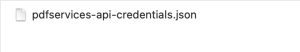

# Getting credentials

Developing with the PDF Services SDK requires an Adobe-provided credential. To get one, [click HERE](https://documentservices.adobe.com/dc-integration-creation-app-cdn/main.html?api=pdf-services-api), and complete the workflow. Be sure to copy and save the credential values to a secure location.

**Validity term**: The certificate associated with your credential is valid for one year. However, you can simply regenerate a new credential or apply a new certificate to the current credentials from the Document Cloud [developer console](https://console.adobe.io/).

<InlineAlert slots="text"/>

During the credential creation process you'll be asked whether you'd like a **Personalized Code Sample Download**. Choosing *Personalized* preconfigures the samples with your credential and removes a few steps from your development setup process.

## Step 1 : Getting the access token

PDF Services API endpoints are authenticated endpoints. You can get an access token by following the [link](../../authentication.md) to start using our APIs.

## Step 2 : Uploading an asset 

After getting the access token, we need to upload the asset. Uploading an asset is a two-step process : 

1. First you need to get an upload pre-signed URI by using the following API.

You can read more about the API in detail [here](../../../apis/#operation/asset.uploadpresignedurl).

<CodeBlock slots="heading, code" repeat="1" languages="Rest API" /> 

### Rest API 

```javascript
curl --location --request POST 'https://pdf-services.adobe.io/assets' \
--header 'X-API-Key: {{Placeholder for client_id}}' \
--header 'Authorization: Bearer {{Placeholder for token}}' \
--header 'Content-Type: application/json' \
--data-raw '{
    "mediaType": "{{Placeholder for mediaType}}"
}'
```

2. On getting a `200` response status from the above API, use the `uploadUri` field in the response body of the above API to upload the asset directly to the cloud provider using a PUT API call. You will also get an `assetID` field which will be used in creating the job.

<CodeBlock slots="heading, code" repeat="1" languages="Rest API" /> 

### Rest API

```javascript
curl --location -g --request PUT 'https://dcplatformstorageservice-us-east-1.s3-accelerate.amazonaws.com/b37fd583-1ab6-4f49-99ef-d716180b5de4?X-Amz-Security-Token={{Placeholder for X-Amz-Security-Token}}&X-Amz-Algorithm={{Placeholder for X-Amz-Algorithm}}&X-Amz-Date={{Placeholder for X-Amz-Date}}&X-Amz-SignedHeaders={{Placeholder for X-Amz-SignedHeaders}}&X-Amz-Expires={{Placeholder for X-Amz-Expires}}&X-Amz-Credential={{Placeholder for X-Amz-Credential}}&X-Amz-Signature={{Placeholder for X-Amz-Signature}}' \
--header 'Content-Type: application/pdf' \
--data-binary '@{{Placeholder for file path}}'
```

## Step 3 : Creating the job 

To create a job for the operation, please use the  `assetID` obtained in Step 2 in the API request body. On successful job submission you will get a status code of `201` and a response header `location` which will be used for polling. 

For creating the job, please refer to the corresponding API spec for the particular [PDF Operation](../../../apis).

## Step 4 : Fetching the status

Once the job is successfully created, you need to poll the at the `location` returned in response header of Step 3 by using the following API 

You can read more about the API in detail [here](../../../apis/#operation/pdfoperations.compresspdf.jobstatus).

<CodeBlock slots="heading, code" repeat="1" languages="Rest API" /> 

### Rest API

```javascript
curl --location -g --request GET 'https://pdf-services.adobe.io/operation/compresspdf/{{Placeholder for job id}}/status' \
--header 'Authorization: Bearer {{Placeholder for token}}' \
--header 'x-api-key: {{Placeholder for client id}}'
```

## Step 5 : Downloading the asset 

On getting `200` response code from the poll API, you will receive a `status` field in the response body which can either be `in progress`, `done` or `failed`.

If the `status` field is `in progress` you need to keep polling the location until it changes to `done` or `failed`.

If the `status` field is `done` the response body will also have a download pre-signed URI in the `dowloadUri` field, which will be used to download the asset directly from cloud provider by making the following API call

You can read more about the API in detail [here](../../../apis/#operation/asset.get).

<CodeBlock slots="heading, code" repeat="1" languages="Rest API" /> 

### Rest API 

```javascript
curl --location -g --request GET 'https://dcplatformstorageservice-us-east-1.s3-accelerate.amazonaws.com/b37fd583-1ab6-4f49-99ef-d716180b5de4?X-Amz-Security-Token={{Placeholder for X-Amz-Security-Token}}&X-Amz-Algorithm={{Placeholder for X-Amz-Algorithm}}&X-Amz-Date={{Placeholder for X-Amz-Date}}&X-Amz-SignedHeaders={{Placeholder for X-Amz-SignedHeaders}}&X-Amz-Expires={{Placeholder for X-Amz-Expires}}&X-Amz-Credential={{Placeholder for X-Amz-Credential}}&X-Amz-Signature={{Placeholder for X-Amz-Signature}}'
```

## There you go! Your job is completed in 5 simple steps. 

## SDK

PDF Services API is also accessible via SDKs in popular languages such as Node.js, Java and .NET.

<InlineAlert slots="text"/>

Please allow-list the following hostnames before using Adobe PDF Services SDK:<ul><li>ims-na1.adobelogin.com</li><li>pdf-services.adobe.io (for versions 3.x.x)</li><li>cpf-ue1.adobe.io (for versions upto 2.x.x)</li><li>senseicore-ue1.adobe.io (for versions below 1.x.x)</li></ul>

### Java

Jump start your development by bookmarking or downloading the following key resources:

-   This document
-   [API reference (Javadoc)](https://www.adobe.com/go/pdftoolsapi_java_docs)
-   [Java Sample code](https://www.adobe.com/go/pdftoolsapi_java_samples)
-   [Java library](https://www.adobe.com/go/pdftoolsapi_java_maven). The Maven project contains the .jar file.

#### Authentication

Once you complete the [Getting Credentials](/document-services/apis/interstitial), a zip or json file automatically downloads depending on whether you opted to download personalized code samples. The file structures are as follows:

-   **Personalized Download**: A zip gets downloaded. The samples download zip contains an adobe-dc-pdf-services-sdk-java-samples with a preconfigured pdfservices-api-credentials.json file. After downloading the zip, you can either run the samples in the zip directly.
    
-   **Non Personalized Download**: A json file `pdfservices-api-credentials.json` file get downloaded containing your credentials. You can replace the pdfservices-api-credentials.json in the [Java sample code](https://www.adobe.com/go/pdftoolsapi_java_samples) with the downloaded json.
    

**Example pdfservices-api-credentials.json file**

```json 
{
 "client_credentials": {
   "client_id": "<YOUR_CLIENT_ID>",
   "client_secret": "<YOUR_CLIENT_SECRET>"
 },
 "service_principal_credentials": {
 "organization_id": "<YOUR_ORGANIZATION_ID>",
 "scopes": "<YOUR_SCOPES>"
 }
}
```

#### Setup a Java environment

1.  Install [Java 8 or above](http://www.oracle.com/technetwork/java/javase/downloads/index.html).
2.  Run `javac -version` to verify your install.
3.  Verify the JDK bin folder is included in the PATH variable (method varies by OS).
4.  Install [Maven](https://maven.apache.org/install.html). You may use your preferred tool; for example:
    - **Windows:** Example: [Chocolatey](https://chocolatey.org/packages/maven).
    - **Macintosh:** Example: `brew install maven`.

<InlineAlert slots="text" />

Maven uses pom.xml to fetch pdfservices-sdk from the public Maven repository when running the project. The .jar automatically downloads when you build the sample project. Alternatively, you can download the pdfservices-sdk.jar file, and configure your own environment.

##### Option 1: Personalized samples setup

The quickest way to get up and running is to download the personalized code samples during the Getting Credentials workflow. These samples provide everything from ready-to-run sample code, an embedded credential json file, and pre-configured connections to dependencies.

1.  Download [the Java sample project](https://www.adobe.com/go/pdftoolsapi_java_samples).
2.  Build the sample project with Maven: `mvn clean install`.
3.  Test the sample code on the command line.
4.  Refer to this document for details about running samples as well as the API Reference for API details.

##### Option 2: Generic samples setup

If you did not choose **Personalized Code Sample Download** during the credential setup process:

1.  Download [the Java sample project](https://www.adobe.com/go/pdftoolsapi_java_samples).
2.  Find and replace pdfservices-api-credentials.json with the one present in the downloaded zip or json file.
3.  Build the sample project with Maven: `mvn clean install`.
4.  Test the sample code on the command line.
5.  Refer to this document for details about running samples as well as the API Reference for API details.

<InlineAlert slots="text" />

Command line execution is not mandatory. You can import the samples Maven project into your preferred IDE (e.g. IntelliJ/Eclipse) and run the samples from there.

#### Verifying download authenticity

For security reasons you may wish to confirm the installer's authenticity. To do so,

1.  After installing the package, navigate to the `.jar.sha1` file.
2.  Calculate the hash with any 3rd party utility.
3.  Find and open PDF Services sha1 file. Note: if you're using Maven, look in the .m2 directory.
4.  Verify the hash you generated matches the value in the .sha1 file.

```
c3b8c208a913ffca17f4d92d9ab7f6bbbdd032ae
```

#### Logging

Refer to the API docs for error and exception details.

-   For logging, use the [slf4j API](https://www.slf4j.org/) with a log4js-slf4j binding.
-   Logging configurations are provided in src/main/resources/log4js.properties.
-   Specify alternate bindings, if required, in pom.xml.

**log4js.properties file**

```properties
name=PropertiesConfig
appenders = console

# A sample console appender configuration, Clients can change as per their logging implementation
rootLogger.level = WARN
rootLogger.appenderRefs = stdout
rootLogger.appenderRef.stdout.ref = STDOUT

appender.console.type = Console
appender.console.name = STDOUT
appender.console.layout.type = PatternLayout
appender.console.layout.pattern = [%-5level] %d{yyyy-MM-dd HH:mm:ss.SSS} [%t] %c{1} - %msg%n

loggers = pdfservicessdk,validator,apache

# Change the logging levels as per need. INFO is recommended for pdfservices-sdk
logger.pdfservicessdk.name = com.adobe.pdfservices.operation
logger.pdfservicessdk.level = INFO
logger.pdfservicessdk.additivity = false
logger.pdfservicessdk.appenderRef.console.ref = STDOUT

logger.validator.name=org.hibernate
logger.validator.level=WARN

logger.apache.name=org.apache
logger.apache.level=WARN
```
   


#### Custom projects

While the samples use Maven, you can use your own tools and process.

To build a custom project:

1.  Access the .jar in the [central Maven repository](https://www.adobe.com/go/pdftoolsapi_java_maven).
2.  Use your preferred dependency management tool (Ivy, Gradle, Maven), to include the SDK .jar dependency.
3.  Open the pdfservices-api-credentials.json downloaded when you created your credential.
4.  Add the [Authentication](./index.md#authentication) details as described above.


### .NET

Jumpstart your development by bookmarking or downloading the following key resources:

-   This document
-   [Nuget package](https://www.adobe.com/go/pdftoolsapi_net_nuget)
-   [.NET API reference](https://www.adobe.com/go/pdftoolsapi_net_docs)
-   [.NET Sample code](https://www.adobe.com/go/pdftoolsapi_net_samples)
-   Input/output test files reside in their respective sample directories

#### Prerequisites

The samples project requires the following:

-   .NET Core: version 3.1 or above
-   A build Tool: Either Visual Studio or .NET Core CLI.

#### Authentication

Once you complete the [Getting Credentials](/document-services/apis/interstitial), a zip or json file automatically downloads depending on whether you opted to download personalized code samples. The file structures are as follows:

-   **Personalized Download**: A zip gets downloaded. The samples download zip contains an adobe-dc-pdf-services-sdk-java-samples with a preconfigured pdfservices-api-credentials.json file. After downloading the zip, you can either run the samples in the zip directly.
    
-   **Non Personalized Download**: A json file `pdfservices-api-credentials.json` file get downloaded containing your credentials. You can replace the pdfservices-api-credentials.json in the [Java sample code](https://www.adobe.com/go/pdftoolsapi_java_samples) with the downloaded json.
    
    
**Example pdfservices-api-credentials.json file**

```json 
{
 "client_credentials": {
   "client_id": "<YOUR_CLIENT_ID>",
   "client_secret": "<YOUR_CLIENT_SECRET>"
 },
 "service_principal_credentials": {
 "organization_id": "<YOUR_ORGANIZATION_ID>",
 "scopes": "<YOUR_SCOPES>"
 }
}
```
    

#### Set up a NET environment

Running any sample or custom code requires the following:

1.  Download and install the [.NET SDK](https://dotnet.microsoft.com/learn/dotnet/hello-world-tutorial/install).

<InlineAlert slots="text"/>

The Nuget package automatically downloads when you build the sample project.

##### Option 1: Personalized samples setup

The quickest way to get up and running is to download the personalized code samples during the Getting Credentials workflow. These samples provide everything from ready-to-run sample code, an embedded credential json file, and pre-configured connections to dependencies.

1.  Extract the downloaded samples .zip.
2.  From the samples directory, build the sample project: `dotnet build`.
3.  Test the sample code on the command line.
4.  Refer to this document for details about running samples as well as the API Reference for API details.

##### Option 2: Generic samples setup

If you did not choose **Personalized Code Sample Download** during the credential setup process:

1.  Clone or download the [samples project](https://www.adobe.com/go/pdftoolsapi_net_samples).
2.  Find and replace all occurrences of `pdfservices-api-credentials.json` file with the ones present in your PDFServicesSDK-Credentials.json file.
3.  From the samples directory, build the sample project: `dotnet build`.
4.  Test the sample code on the command line.
5.  Refer to this document for details about running samples as well as the API Reference for API details.

#### Verifying download authenticity

For security reasons you may wish to confirm the installer's authenticity. To do so,

1.  After installing the Nuget package, navigate to the .nuget directory.
2.  Find and open the .sha512 file.
3.  Verify the hash in the downloaded file matches the value published here.

```
8bocSjsiXI+1STV1yNhwPExvJb+EcxcDjiIL76ivjGNGJn9jgIpDI2Ewm+Q+yn6X+AHSPT2zl6WZu+zg+v3NfQ==
```

#### Logging

Refer to the API docs for error and exception details.

The .NET SDK uses [LibLog](https://github.com/damianh/LibLog) as a bridge between different logging frameworks. Log4net is used as a logging provider in the sample projects and the logging configurations are provided in log4net.config. Add the configuration for your preferred provider and set up the necessary appender as required to enable logging.

**log4net.config file**

```html
<log4net>
 <root>
   <level value="INFO" />
   <appender-ref ref="console" />
 </root>
 <appender name="console" type="log4net.Appender.ConsoleAppender">
   <layout type="log4net.Layout.PatternLayout">
     <conversionPattern value="%date %level %logger - %message%newline" />
   </layout>
 </appender>
</log4net>
```

#### Custom projects

While building the sample project automatically downloads the Nuget package, you can do it manually if you wish to use your own tools and process.

1.  Go to <https://www.adobe.com/go/pdftoolsapi_net_nuget>.
2.  Download the latest package.


### Node.js

Jumpstart your development by bookmarking or downloading the following key resources:

-   This document
-   [Node.js API reference](https://www.adobe.com/go/pdftoolsapi_node_docs)
-   [Node.js Sample code](http://www.adobe.com/go/pdftoolsapi_node_sample)
-   [Node.js SDK](http://www.adobe.com/go/pdftoolsapi_node_npm)

#### Authentication

Once you complete the [Getting Credentials](/document-services/apis/interstitial), a zip or json file automatically downloads depending on whether you opted to download personalized code samples. The file structures are as follows:

-   **Personalized Download**: A zip gets downloaded. The samples download zip contains an adobe-dc-pdf-services-sdk-java-samples with a preconfigured pdfservices-api-credentials.json file. After downloading the zip, you can either run the samples in the zip directly.
    
-   **Non Personalized Download**: A json file `pdfservices-api-credentials.json` file get downloaded containing your credentials. You can replace the pdfservices-api-credentials.json in the [Java sample code](https://www.adobe.com/go/pdftoolsapi_java_samples) with the downloaded json.
    


**Example pdfservices-api-credentials.json file**

```json 
{
 "client_credentials": {
   "client_id": "<YOUR_CLIENT_ID>",
   "client_secret": "<YOUR_CLIENT_SECRET>"
 },
 "service_principal_credentials": {
 "organization_id": "<YOUR_ORGANIZATION_ID>",
 "scopes": "<YOUR_SCOPES>"
 }
}
```
    

#### Set up a Node.js environment

Running any sample or custom code requires the following steps:

1.  Install [Node.js 10.13.0](https://nodejs.org/en/download/) or higher.

<InlineAlert slots="text"/>

The @adobe/pdfservices-node-sdk npm package automatically downloads when you build the sample project.

``` 
npm install --save @adobe/pdfservices-node-sdk
```

##### Option 1: Personalized samples setup

1.  Extract the downloaded samples .zip.
2.  From the samples root directory, run `npm install`.
3.  Test the sample code on the command line.
4.  Refer to this document for details about running samples as well as the API Reference for API details.

##### Option 2: Generic samples setup

If you did not choose **Personalized Code Sample Download** during the credential setup process:

1.  Download [the Node.js sample project ](http://www.adobe.com/go/pdftoolsapi_node_sample).
2.  Find and replace all occurrences of `pdfservices-api-credentials.json` file with the ones present in your PDFServicesCredentials.json file.
3.  From the samples root directory, run `npm install`.
4.  Test the sample code on the command line.
5.  Refer to this document for details about running samples as well as the API Reference for API details.

#### Verifying download authenticity

For security reasons you may wish to confirm the installer's authenticity. To do so,

1.  After installing the package, find and open package.json.
2.  Find the "\_integrity" key.
3.  Verify the hash in the downloaded file matches the value published here.

```
sha512-xPvqpEM1Bd/XHLy3ywUhSH/tMNYWpv5rkQU+69pBv4IXdD2Qz+VyOXkvF5ysdVE1wbow7LIipi6JQgTlLlFqhQ==
```

#### Logging

Refer to the API docs for error and exception details.

The SDK uses the [log4js API](https://www.npmjs.com/package/log4js) for logging. During execution, the SDK searches for config/pdfservices-sdk-log4js-config.json in the working directory and reads the logging properties from there. If you do not provide a configuration file, the default logging logs INFO to the console. Customize the logging settings as needed.

**log4js.properties file**

```json
{
  "appenders": {
    "consoleAppender": {
      "_comment": "A sample console appender configuration, Clients can change as per their logging implementation",
      "type": "console",
      "layout": {
        "type": "pattern",
        "pattern": "%d:[%p]: %m"
      }
    }
  },
  "categories": {
    "default": {
      "appenders": ["consoleAppender"],
      "_comment": "Change the logging levels as per need. info is recommended for pdfservices-node-sdk",
      "level": "info"
    }
  }
} 
```


#### Custom projects

While building the sample project automatically downloads the Node package, you can do it manually if you wish to use your own tools and process.

1.  Go to <https://www.npmjs.com/package/@adobe/pdfservices-node-sdk>
2.  Download the latest package.


## Public API

PDF Services API is accessible directly via REST APIs which requires Adobe-provided credential for authentication. Once you've completed the [Getting Credentials](/document-services/apis/interstitial) workflow, a zip file automatically downloads that contains content whose structure varies based on whether you opted to download personalized code samples. The zip file structures are as follows:

-   **Personalized Download**: A zip gets downloaded. The samples download zip contains an adobe-dc-pdf-services-sdk-java-samples with a preconfigured pdfservices-api-credentials.json file. After downloading the zip, you can either run the samples in the zip directly.
    
-   **Non Personalized Download**: A json file `pdfservices-api-credentials.json` file get downloaded containing your credentials. You can replace the pdfservices-api-credentials.json in the [Java sample code](https://www.adobe.com/go/pdftoolsapi_java_samples) with the downloaded json.
    

After downloading the credentials info in pdfservices-api-credentials.json, it can be used to call REST APIs directly per the instructions mentioned in [API Usage Guide](./howtos/api-usage.md).

**Example pdfservices-api-credentials.json file**

```json 
{
 "client_credentials": {
   "client_id": "<YOUR_CLIENT_ID>",
   "client_secret": "<YOUR_CLIENT_SECRET>"
 },
 "service_principal_credentials": {
 "organization_id": "<YOUR_ORGANIZATION_ID>",
 "scopes": "<YOUR_SCOPES>"
 }
}
```

